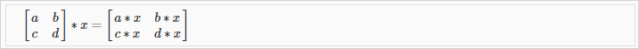
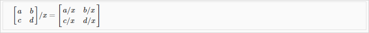
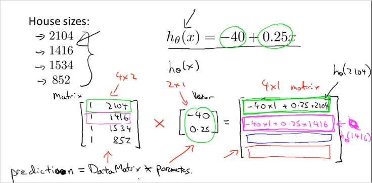
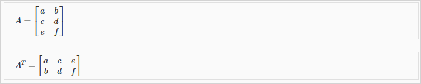

  
  
## 1.3. Linear Algebra Review    
---  
  
### 1.3.1 Vector    
  
A vector is a matrix with one column and many rows:    
  
$$  
\begin{bmatrix}    
w \\    
x \\    
y \\    
z    
\end{bmatrix}    
$$  
  
So vectors are a subset of matrices. The above vector is a 4 x 1 matrix.    
  
#### notations    
  
4 demensional Vector 이다.    
  
- $$A_{ij}$$    
refers to the element in the ith row and jth column of matrix A.    
- A vector with 'n' rows is referred to as an 'n'-dimensional vector.    
- $$v_i$$     
refers to the element in the ith row of the vector.    
- In general, all our vectors and matrices will be 1-indexed. Note that for some programming languages, the arrays are 0-indexed.    
- Matrices are usually denoted by uppercase names while vectors are lowercase.    
- "Scalar" means that an object is a single value, not a vector or matrix.    
- $$\mathbb{R}$$    
refers to the set of scalar real numbers.    
- $$\mathbb{R^n}$$    
refers to the set of n-dimensional vectors of real numbers.    
  
#### Octave/Matlab commands    
  
```matlab    
% The ; denotes we are going back to a new row.    
A = [1, 2, 3; 4, 5, 6; 7, 8, 9; 10, 11, 12]    
% Initialize a vector     
v = [1;2;3]     
    
% Get the dimension of the matrix A where m = rows and n = columns    
[m,n] = size(A)    
% You could also store it this way    
dim_A = size(A)    
% Get the dimension of the vector v     
dim_v = size(v)    
% Now lets index into the 2nd row 3rd column of matrix A    
A_23 = A(2,3)    
```  
  
### 1.3.2 Matrix addition and substriction and 스칼라곱    
  
In scalar multiplication, we simply multiply every element by the scalar value:    
    
  
In scalar division, we simply divide every element by the scalar value:    
    
  
#### Octave/Matlab commands    
  
```matlab    
% Initialize matrix A and B     
A = [1, 2, 4; 5, 3, 2]    
B = [1, 3, 4; 1, 1, 1]    
% Initialize constant s     
s = 2    
    
% See how element-wise addition works    
add_AB = A + B     
% See how element-wise subtraction works    
sub_AB = A - B    
% See how scalar multiplication works    
mult_As = A * s    
% Divide A by s    
div_As = A / s    
% What happens if we have a Matrix + scalar?    
add_As = A + s    
    
```  
  
  
### 1.3.3. Matrix * Vector Multiplication    
  
    
  
`m x n matrix` X `n x 1 vector` =>  `m x 1` vector    
  
- 사례     
행렬곱을 사용하면 모든 집값을 편하게 예측할수 있다.  각 x변수에 해당하는 y값을 한번에 계산할 수 있다.     
    
    
  
Hypothesis function $$h_\theta(x) = -40 + 0.25x$$ 가 있다고 가정하고 내가 가진 집크기가 왼쪽의 4개의 값을 가지고 있을때 가격을 예측해보자. 행렬곱을 이용해서 한번에 계산할 수 있다.     
  
우리는 이런 연산을 다른 모델에서 regression 을 개발하기 위한 연산자로 잘 활용할 수 있다.     
  
  
#### Octave/Matlab commands    
  
```matlab    
% Initialize matrix A     
A = [1, 2, 3; 4, 5, 6;7, 8, 9]     
% Initialize vector v     
v = [1; 1; 1]     
    
% Multiply A * v    
Av = A * v    
```  
  
  
### 1.3.4. Matrix * Matrix Multiplication    
  
    
An `m x n matrix` multiplied by an `n x o matrix` results in an `m x o matrix`    
  
행렬곱은 여러개의 계산식을 하나의 행렬곱셈으로 표현하게 해준다.     
  
- 사례    
    
이번엔 여러개의 집크기에 대한 가격 예측을 할때, 여러개의 가설함수를 있다고 하자. matrix곱을 사용하면 한번에 계산 할 수 있다.     
    
> 결과 matrix의 열이 각 집크기에 상응하는 예측 가격이다.     
  
  
#### Octave/Matlab commands    
  
```matlab    
% Initialize a 3 by 2 matrix     
A = [1, 2; 3, 4;5, 6]    
% Initialize a 2 by 1 matrix     
B = [1; 2]     
    
% We expect a resulting matrix of (3 by 2)*(2 by 1) = (3 by 1)     
mult_AB = A*B    
```  
  
### 1.3.5. Matrix Multiplication Properties    
  
- 교환법칙 X    
Matrices are not commutative: A∗B≠B∗A    
- 결합법칙 O    
Matrices are associative: (A∗B)∗C=A∗(B∗C)    
    
- Identity Matrix (항등원)    
    
    
  
교환법칙, 결합법칙 모두 성립    
  
#### Octave/Matlab commands    
  
```matlab    
% Initialize random matrices A and B     
A = [1,2;4,5]    
B = [1,1;0,2]    
    
% Initialize a 2 by 2 identity matrix    
I = eye(2)    
% The above notation is the same as I = [1,0;0,1]    
% What happens when we multiply I*A ?    
IA = I*A     
% How about A*I ?    
AI = A*I     
% Compute A*B     
AB = A*B     
% Is it equal to B*A?     
BA = B*A     
% Note that IA = AI but AB != BA    
```  
  
### 1.3.6. Inverse and Transpose    
  
- Inverse matrix 역행렬    
    
The inverse of a matrix A is denoted $$A^{-1}$$. Multiplying by the inverse results in the identity matrix.    
    
- Transpose matrix 전치행렬    
90도 회전된 행렬 The transposition of a matrix is like rotating the matrix 90° in clockwise direction and then reversing it.     
    
    
#### Octave/Matlab commands    
  
```matlab    
% Initialize matrix A     
A = [1,2,0;0,5,6;7,0,9]    
    
% Transpose A     
A_trans = A'   //'    
% Take the inverse of A     
A_inv = inv(A)    
% What is A^(-1)*A?     
A_invA = inv(A)*A    
    
```  
  
다음 시간부터 linear algebra 를 다룰수 있는 툴에 대해 살펴본다.     
  
