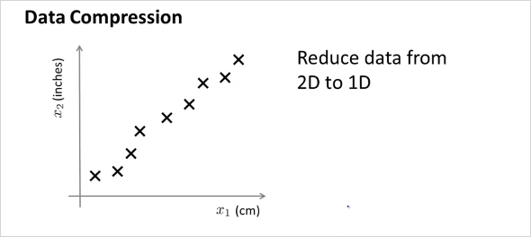
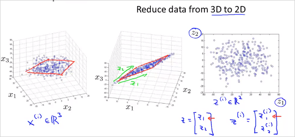
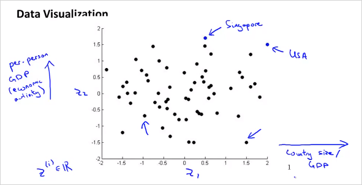
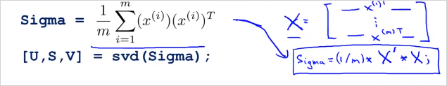
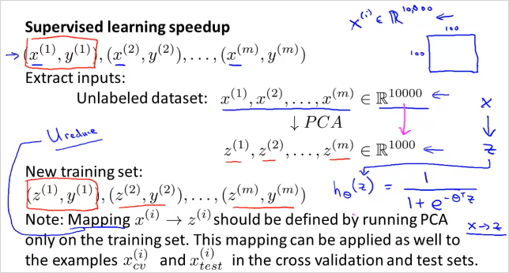

  

# 10. Dimensionality Reduction  
---
  
<!-- toc -->  

Dimensionality Reduction은 Unsupervised Learning의 두번째 type 이다. 말그대로 차원을 줄이는방법.   이것으로 Data를 절약할 수 있고, 쉽게 visualizing하여 데이터를 좀 더 직관적으로 이해할 수 있게 해준다. (4 차원이상의 feature는 visulizing 하기 어렵다.)  
  
  
  
  
엄청 많은feature가 있다고 했을때, 연관성이 무척 높은 feature 두개를 하나로 reduce 할 수 있다. 위 예에서는 하나는 cm단위의 길이이고 하나는 inch 단위의 길이이다. 둘다 길이에 대한 feature이기 때문에 연관성이 무척 높다.   이것을 feature 2개인 2demension 에서 1차원으로 차원을 줄여서 합칠 수 있는것이다.    
  
  
  
$$x_1, x_2$$ 가 아니라 new feature $$z_1$$ 을 만든다.   2차원에서 1차원으로 줄이는것 뿐만아니라 더 고차원에서도 가능하다. 3차원에서 2차원으로 줄이는 것은 다음과 같다.   
  
  
  
feature 3개의 공간 상에 있는 점들을 new feature $$z_1, z_2$$ 평면 상으로 projection시킨다.   다음과 같이 많은 feature가 있다고 하자. 어떻게 visualizing 할 수 있나?   
  
  
  
위처럼 50 차원의 feature 벡터 $$x^i$$ 를 사용하는것이 아니라, 다음과 같이 2차원의 $$z^i$$ 벡터를 새로 만든다. 50D -> 2D  50가지의 feature를 두가지로 줄이면 다음과 같은 feature를 생각해볼수 있다.   $$z_1$$ 은 나라의 지표에대한 전체적인 크기를 나타낸다.   $$z_2$$ 는 인구 하나당 크기를 나타낸다.   
  
이를 그려보면,  
  
  
  
  
  
## 10.1. PCA (Principal Component Analysis)  
---  
  
PCA는 Dimensionality Reduction 을 하는 가장 알려진 알고리즘 중의 하나이다.   
  
  
  
위의 예는 2차원 x를 1차원으로 줄이는 것인데, 이때 각 점과 선의 차이인 파란색 선(projection error)의 길이가 최소화 하게 직선을 그리면 된다. (빨간색 라인)  반면 분홍색 라인을 그리면 파란색선의 길이가 커지기 때문에 적절하지 않은것이다.   
  
  
  
  
위의 그림처럼 2차원에서 1차원으로 줄일때, 최적의 벡터 $$u^1$$ 을 찾으면 된다. 마찬가지로 만약 3차원 데이터에서 2차원으로 줄인다고 하면 최적의 벡터 $$u^1$$ $$u^2$$ 2개를 찾으면 된다. 이 두 벡터가 평면을 나타낸다.   가만보면 PCA는 Linear regression과 매우 유사해 보인다. 하지만 다르다. 그 이유는 다음과 같다.   
  
  
> 왼쪽이 Linear regression, 우측이 PCA인데, PCA는 수직의 projection error 라인을 사용한다. 이것으로 인해 데이터 셋에따라서 전혀 다른 결과를 갖는다. 또한 PCA는 각 feature x 에 해당하는 label y가 없다.   
  
## 10.2. PCA, Data pre-processing  
---  
  
PCA를 하기 전에 data preprocessing 을 반드시 해야한다. 다음은 그 방법이다.   첫번째는 mean normalization, 두번째는 feature scaling  
  
  
  
## 10.3. PCA algorithm  
---  
  
  
  
벡터 $$u^{(i)}$$ 와 새로운 feature $$z^{(i)}$$ 을 어떻게 구할수 있을까?  먼저 n차원에서 k차원으로 줄인다고 해보자. 다음을 계산하면 벡터 U matrix를 구할 수 있다.  처음에는 covariance matrix를 계산해야 한다. nxn matrix가 나온다. ($$\sum$$(Sigma) 는 summation이 아니라 matrix임에 주의)  그뒤 Octave 에서 `[U,S,V] = svf(Sigma);` 를 계산하면 벡터 U matrix 를 구할 수 있다. (svd말고 eig 라이브러리도 있음)  
  
  
  
  
그래서 우리가 구할수 있는것은 U matrix이다. U의 k 열까지가 우리가 필요한 matrix이다.$$(n \times k)$$  
  
  
  
그 뒤, feature x n차원 벡터를 z를  k차원 벡터로 로 변환시켜야한다. 다음과 같이 계산할 수 있다. 그러면 z는 $$\in \mathbb{R}^{k}$$ 를 만족하는 $$k \times 1$$ 크기의 벡터가 나온다. 즉 feature의 크기를 n차원에서 k차원으로 줄인것이다.    $$  z = {U_{reduce}}^T x  $$  
  
  
$$  
z = \begin{bmatrix}\vert & \vert & & \vert \\ u^{(1)} & u^{(2)} & \dots & u^{(k)}\\ \vert & \vert & & \vert \end{bmatrix}^T x=\begin{bmatrix} \text{---} & (u^{(1)})^T & \mbox{---}\\\text{---} & (u^{(2)})^T & \mbox{---}\\ & \vdots & \\ \text{---} & (u^{(k)})^T & \mbox{---}\end{bmatrix}x  
$$  
  
이것을 Vectorized implementation하면 다음과 같이 계산하면 된다.   `Sigma = (1/m) * X' * X;`'  여기서 __X__는 ($$m \times n$$) matrix이고, __x__ 는 ($$n \times 1$$) 벡터이다.    
  
  
  
그리고 $$U_{reduce}$$ 와 z는 다음과 같이 계산할 수 있다.    
  
  
  
Mini 문제: $$z$$ 벡터의 $$j$$번째 $$z_j$$는 어떻게 계산할까?   답 ->  $$ z_j = (u^{(j)})^Tx $$  
  
## 10.4. Reconstruction from Compressed Representation  
---  
  
N 차원 feature x에서 k차원 feature z로 줄이는것을 배웠다. 그렇다면 다시 z에서 N차원 feature x로는 어떻게 돌아갈까? 간단히 다음을 계산하면 된다!. 완벽하게 original로는 돌아갈수 없고, 원래 데이터의 근사값임에 주의해야한다.  우측 처럼 직선에 투영된 x좌표는 얻을 수 있다.   
  
$$  
X_{approx} = U_{reduce} z  
$$  
  
  
만약 $${X_{approx}}^{(1)}$$ 를 구하고 싶으면 $${X_{approx}}^{(1)} = U_{reduce} z^{(1)}$$을 계산하면 되고 해당 좌표는 위와같이 투영된 직선 위에 있다.      
  
  
## 10.5. Choosing the Number of Principal Components  
---  
  
그러면 Number of Principal Components 즉, 우리가 reducing 목표로 하는 차원 k 는 어떻게 정할 수 있을까?  다음의 부등식을 만족하는 k를 구하면 된다.   
  
  
  
이것은 다음과 같이 implement 할수 있다.  k를 늘려가면서 반복하면서 0.01 이하가 되는 k를 선택하면된다.   `[U,S,V] = svf(Sigma);` 의 S matrix를 통해서도 구할 수 있다.   S는 아래와 같은형태의 matrix이다.   좌측의 계산 공식은 우측의 S matrix를 이용해서 계산할 수 있다.   우측도 마찬가지로 k를 늘려가면서 해당 부등식을 만족하는 k를 찾으면 된다.   
  
  
  
  
정리하면 다음과 같다.   n차원 feature에서 k를 늘려가며 아래를 확인했을때 부등식을 만족하는 k를 찾았다면 feature를 n차원에서 k차원으로 줄여도 무방하다는 의미다.   
  
  
  
  
  
  
## 10.6. Supervised Learning Speedup  
---  
  
지금까지는 Unsupervised Learning에대한 이야기였다. 이번에는 Supervised Learning 에서도 featuer demention 을 줄여서 연산속도를 빠르게 하는방법을 알아보자.    마찬가지로 x에대해서 z로 reduce 한다. 이때 동일하게 U를 이용한다. 주의할점은 training set 내에서만 해야한다는 것이다. CV, TEST set아님.  
  
  
  
  
PCA는 overfitting을 방지하기 위한 방법이 아니다! -> Regularization 을 사용해라  
  
  
  
많은 사람들이 다음과 같은 절차를 따라 ML system 을 design한다.   
  
  
  
그런데 먼저 PCA 없이 original feature로 먼저 동작시켜볼 필요가 있다. 그래서 원하는 결과가 나오지 않을때만 PCA를 사용할것을 고려하는것이 더 좋은 방법이다.   
  
  
  
