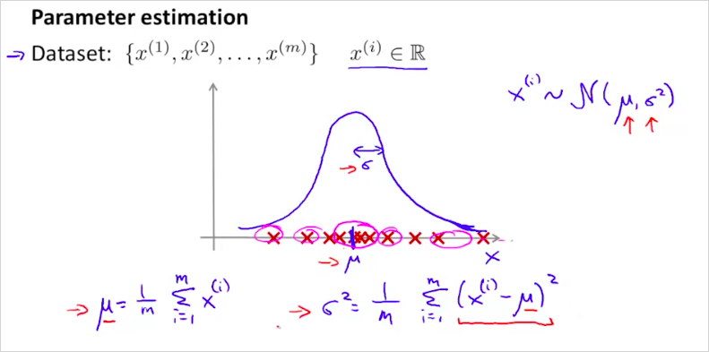
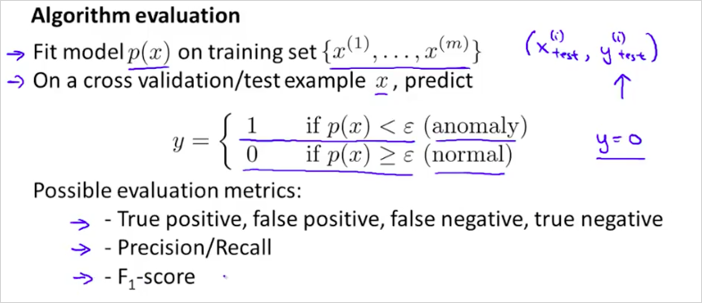
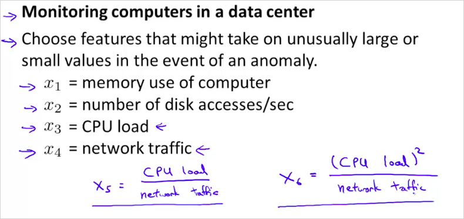

  

  
  
# 11. Anormaly Detection  
---  
  
Anormaly Detection 은 Unsupervised learning  의 한 방법이다.  그러나 supervised learning 의 측면도 동시에 가지고 있다.   
  
`(Insight)`:    
한마디로 Anormaly Detection은 feature $$x$$의 각 data set 값이 평균에서 많이 떨어질수록 비정상으로 예측한다는 방법론이다. 평균에 가까울수록 정상이다. 일반적인 통계 방법과 다른점이라고 한다면, feature $$x$$가 여러개가 될 수있다는 점?이다. 정상인지 비정상인지 기준은 모델을 최종 계산한 결과값을 $$\epsilon$$ 이라는 threshhold 기준으로 판단한다. 이 값은 수동으로? 선정한다.    
Anormaly Detection은 언제 사용하는가? 뒤에도 나오겠지만, 수집한 training data가 정상데이터는 많은데 비정상데이터가 그에 비해 월등히 적을때, 이 모델을 이용하면 좋다.    
  
다음과 같이 비행기 엔진을 제작할때, 과열과 진동크기 두개의 feature를 가지고 시장에 출하할수 없는 부적격한 제품 인지 판단을 내려보자.   
  
  
  
확률 p(x)를 구했을때, 높으면 그래프에서 센터에 위치할것이고 합격이다. 반대는 부적합.   
  
  
​	    
  
만약 data center에서 다음과 같은 feature로 각 컴퓨터를 모니터링 할때, 어느 하나의 컴퓨터가 모델 $$P(x) < \epsilon$$ 에 해당한다면 그 컴퓨터는 비정상 동작을 한다고 판단할 수 있을것이다.   
  
  
  
  
## 11.1. Gaussian Distribution  
---  
  
가우시안 분포는 정규분포(Normal Distribution)라고도 불린다. Anormaly detection 알고리즘을 개발하기 위해서 먼저 기본적인 정규분포에 대해 알아보자.   
  
$$ X ~ N(\mu, \sigma^2)$$ 는 x는 $$\mu, \sigma^2$$ 에 해당하는 정규분포를 따른다는 의미다.    
그리고 $$p(x;,\mu, \sigma^2)$$ 는 다음과 같은 공식으로 계산할 수 있다. 그리고 그 그래프는 다음과같이 정규분포 곡선 모양이 된다.   
$$\sigma^2$$ 은 standard variance 분산 이라고 부르고, $$\sigma$$는 standard deviation 표준 편차 라고 부른다.    
  
  
  
$$\mu 와 \sigma$$ 에 따른 그래프의 모양은 다음과같다. 곡선의 면적은 1이다.   
  
  
  
그리고 $$\mu 와 \sigma$$ 는 다음과 같이 계산할 수 있다.   
  
  
  
  
  
## 11.2. Anormaly detection algorithm  
---  
  
모델 p(x)는 다음과같이 각 feature별 확률 p() 의 곱으로 구한다.   
  
  
알고리즘은 다음과 같다. 다음의 순서대로 계산한뒤 p(x)가 $$\epsilon$$ 보다 큰지 작은지 확인하면 된다.   
  
  
j 는 feature 번호다.   
  
구한 모델을 가지고 $$x_{test}^{(1)}$$ $$x_{test}^{(2)}$$ 의 p(x)를 구해보면 다음과 같고  $$x_{test}^{(2)}$$ 가 $$\epsilon$$ 보다 작기 때문에 문제가 있는 test set이라는것을 알 수 있다.   
  
  
  
## 11.3. Developing and Evaluating an Anomaly Detection System  
---  
  
  
  
training set과 test/ cross validation set은 다음과 같이 구분한다.   
  
  
  
평가 알고리즘은 다음과 같다.   
  
  
  
training set으로부터 모델 p(x) 를 구한 뒤에 그 모델을 가지고 test set에서도 정상적은 예측을 하는지 확인해본다.   
정상은 label을 1로 하고 비정상은 label을 0으로 해서 평가하는 것이 마치 supervised learning 과 유사하다.   
  
  
  
  
  
  
## 11.4. Anomaly Detection vs. Supervised Learning  
---  
  
지금까지 확인한 문제는 기존의 logistic regression, NN등의 supervised learning 방법으로 해결할 수 있는것으로 보인다.    
그렇다면 언제 Anomaly Detection 을 사용하고 어떤 경우에 Supervised Learning를 사용하면 좋을까?   
  
positive example (y=1) 은 비정상(anomal)을 의미함에 주의한다.   
  
Anormaly Detection은 언제 사용하는가? 뒤에도 나오겠지만, 수집한 training data가 정상데이터는 많은데 비정상데이터가 그에 비해 월등히 적을때, 이 모델을 이용하면 좋다.    
  
Logistic Reg나 NN같은 supervised learning은 비정상 데이터도 정형화 할 수 있다. 하지만 비정상 값을 전혀 예측할 수 없을때는 anomaly detection을 사용하는게 좋다. 가령 비행기 엔진을 생산할때, 당장 내일 생산된 엔진이 어떤 문제점을 갖게될지 전혀 알수없다면, 그럴때는 평균에서 많이 벗어난 데이터를 비정상(anomal)으로 예측하는 이 모델을 사용하는 것이다.  만약 비행기 엔진이 비정상인경우가 쉽게 예측이 된다면 그때는 supervised learnining을 사용하면 된다.    
  
  
  
Spam 메일 예측의 경우 수많은 positive example(스팸 메일 데이터들)을 이미 가지고 있기 때문에, Supervised learning을 사용하는 것이다.    
  
  
  
  
비정상인 positive example보다 정상 negative example이 월등히 많을때. -> Anomaly Detection 사용.  
  
## 11.5. Choosing What Features to Use  
---  
  
feature를 어떻게 선정하면 좋을지 알아보자.   
  
만약 feature x를 plot 해 봤을때, 위의 그림과 같이 나오면 좋겟지만 아래와 같은 그림이 나오면 어떻게 해야할까? 아래 공식들을 적절히 선택해서 적용해본다. 그렇게 gaussian 형태로 변환하면 된다-.   
  
  
  
Octave에서는 다음과 같이 확인할 수 있다.   
  
다음과 같은 명령을 했을때 결과가 정규분포를 따르지 않는다면  
```matlab  
hist(x)  
```  
  
  
다음과같이 x를 변형시킨 값을 확인해서 정규분포를 따르게 만들면 된다.    
  
```matlab  
hist(x)  
hist(x.^0.5)  
hist(x.^0.1)  
hist(x.^0.05)  
hist(log(x))  
```  
  
  
feature x_1에서는 정상으로 판별되는데 new feature x_2를 추가했을때, 정상범위가 아니라면 좋은 예측을 할 수 있을 것이다.   
  
  
  
data center에서 feature는 다음과 같은 방법으로 선택할 수 있을것이다.  
  
  
  
  
## 11.6. Multivariate Gaussian Distribution  
---  
  
parameter $$\mu, \sum$$ 을 두어서 입맛에 맞게 정규분포 곡선을 변형시킬 수 있다. 이것은 정상인데도 모델p(x)의 결과가 비정상으로 나올때, 시도해볼수 있는 방법이다.   
  
  
  
  
다음의 순서대로 하면된다.   
  
  
  
  
  
  
original model과 multivariate 의 장단점은 다음과 같다.   
  
  
  
