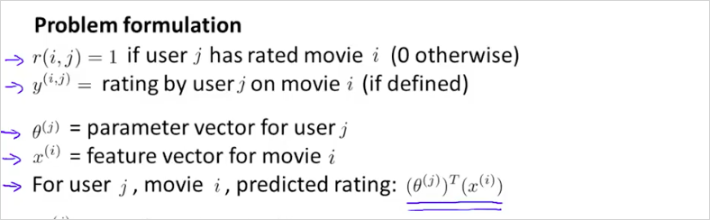
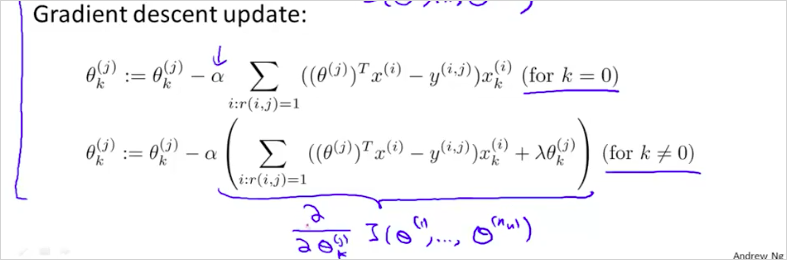
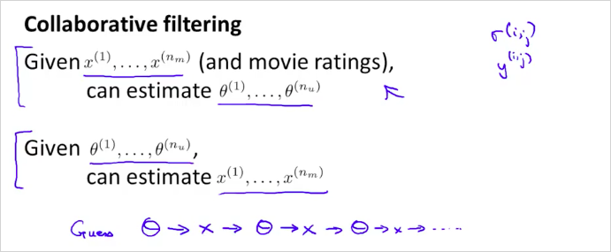
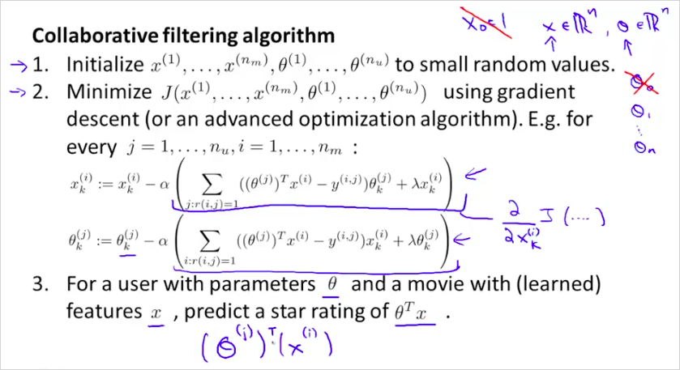
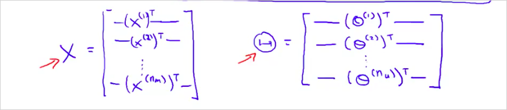
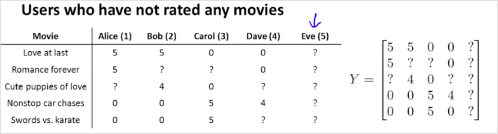
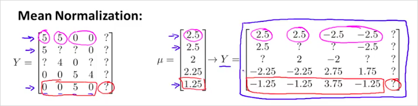

  

  
# 12. Recommander Systems  
---  
  
<!-- toc -->  

실리콘밸리에서, 어떤 분야에 ML을 적용하고 있는지(싶은지) 물었을때, 많은 수의 회사가 추천 시스템이라고 답했다고 한다.   추가로 현업에서 사용하는 추천 알고리즘(Recommander Systems)은 12장에서 배울 Content-based recommander system 과, 13장에서 배울 Collaborative filtering 을 사용한다. 이것보다 더 좋은 방법론이 아직 개발되지 않았다고 한다. 참고로 다음은 카카오에서 사용하는 음악추천 알고리즘인데 슬라이드를 넘기다보면 우리와 같이 CBF, CF 를 사용함을 알 수 있다.    
  
[눈으로 듣는 음악 추천 시스템, 최규민, Kakao, 2018](https://www.slideshare.net/ifkakao/ss-113740836)  
  
  
  
## 12.1. Predicting Movie Ratings: Problem define  
---  
  
추천 시스템의 예를 살펴보자.  다음과 같이 영화 평가 데이터가 있다.    
  
    
  
다음과 같은 4개의 parameter를 만들어 사용한다.   
  
> $$n_u = 4$$ 유져의 수     
$$n_m = 5$$ 영화 갯수    
$$r(i,j)$$ 는 사용자 j가 영화 i에 평가를 했는지 여부다. 1또는 0의 값을 갖게 된다.     
$$y^{(i,j)}$$ 는 사용자 j가 영화 i에 평가를 매긴 점수이다. 0 ~ 5까지의 값을 가진다. 이 값은 $$r(i,j) = 1$$ 일때만 정의될 수 있다.      
  
그리고 초록색 박스는 로맨틱 영화이고 빨간색 박스는 액션 영화라고 했을때, Alice와 Bob은 로맨틱영화에 더 많은 점수를 줬고, 반면 액션영화에는 더 낮은 점수를 매겼다.  Carol, Dave는 그 반대이다.    이런경우 위 데이터에서 `?`를 예측해 보자는 것이다. 다시말해서 특정 사용자 j 가 특정 영화 i를 어떤 값으로 평가할지 예측하는것이다.    직관적으로 생각했을때, Alice와 Bob 은 로맨틱 영화에 더 높은 점수를 매길 가능성이 크고 Carol, Dave는 그 반대일것이다.  Recommander Systems을 이용하면 그 값을 계산(예측)할 수 있다.  이것이 왓챠나 넷플릭스를 사용할때 볼수 있는 평가하지 않은 영화에 대한 내 예상점수인 것이다.   이 점수를 예측하기 위해서는 각 사용자가 평가한 데이터에서 어떤 요소를 추출해야할지 생각해보면 다음이 있을 수 있다.  (어떤 장르에 더 많은 평가를 했는지 /높은 점수를 매겼는지, 평가한 영화의 특징(태그), 영화 클릭 횟수, 감독 선호도, 국가 선호도, 등) 이것이 우리가 정의할 feature $$x$$ 인 것이다!    
  
  
## 12.2. Predicting Movie Ratings: Practice  
---  
  
여기서 사용할 방법론은 Content-based recommander system 이다.  이것은 Linear regression을 사용한다.   다음의 데이터 셋을 다시 보자.    
  
  
  
여기서 우리는 feature를 다음과 같이 정의할 수 있다. 영화별로 로맨틱 영화의 정도(degree)를 측정할 수 있을 것이고 그것을 $$x_1$$로 기록하였다. 액션영화도 마찬가지로 그 정도를 $$x_2$$ 로 나타내었다.  하나의 기준(feature $$x$$)으로 각 영화의 degree를 나타낸것이다. 이런 feature들이 더 많아질 수 있다. 여기선 두개를 사용했다.    그리고 영화 $$x^{(1)}$$ 에 해당하는 feature vector를 나타내면 다음과 같다. $$x^{(5)}$$ 도 [1, 0, 0.9] 으로 나타낼수 있을것이다.  여기서 맨처음 값 1은 bias이다.   
  
$$  
x^{(1)} =   
\begin{bmatrix}  
1 \\  
0.9 \\  
0 \\  
\end{bmatrix}  
$$  
  
그렇다면 이제 어떻게 `?` 값을 계산할 수 있나? 간단하게 다음과 같이 계산할 수 있다.     
  
$$  
(\theta^{(j)})^T x^{(i)}  
$$  
> Where,    
j: 사용자 번호    
i: 영화 번호    
$$ \theta^{(j)} \in \mathbb{R}^{n+1}$$    
n: feature 갯수     
  
더 구체적인 예를 보자. j가 1인 Alice는 영화 "Cute puppies of love"를 몇점으로 평가할 수 있을까?   
  
먼저 feature vector $$x^{(3)}$$ 는 다음과 같다.    
  
$$  
x^{(3)} =   
\begin{bmatrix}  
1 \\  
0.99 \\  
0 \\  
\end{bmatrix}  
$$  
  
만약 어떤 특정 알고리즘을통해 Alice에 대한  $$\theta^{(1)}$$ 벡터가 다음과 같이 구해졌다고 가정해 보자. (이 $$\theta$$ 를 구하는것이 학습을 통해 구하는것이며, ML을 통해 구할 목표다. 추가로 여기서 사용한것은 Linear regression이다.)   
  
$$  
\theta^{(1)} =   
\begin{bmatrix}  
0 \\  
5 \\  
0 \\  
\end{bmatrix}  
$$  
  
따라서, $$ (\theta^{(j)})^T x^{(i)} $$ 을 계산하면 $$(0 \times 1) + (5 \times 0.99) + (0 \times 0) $$ 이므로 4.95 이다.   따라서 Alice는 영화 "Cute puppies of love"를 4.95점으로 평가할 것으로 예측할 수 있는 것이다.   
  
---  
`MINI Quize`:    
 다음과 같은 trainig example과 feature x 가 있을때, $$ \theta^{(3)} $$ 는 어떤 값으로 학습이 될 가능성이 높은가?   
  
  
  
j=3 인 Carol은 액션영화만 극단적으로 5점으로 평가 했으므로 다음과 같을 것이다.    
  
$$  
\theta^{(3)} =   
\begin{bmatrix}  
0 \\  
0 \\  
5 \\  
\end{bmatrix}  
$$  
  
---  
  
정리해보면 다음과 같다.    
  
  
  
그리고 $$\theta^{(j)}$$ 를 학습하기 위해서 다음을 계산하면 된다.    $$m^{(j)}$$ 은 유져 j가 평가한 영화갯수이다.   아래 $$\sum$$의 $$i:r(i,j)=1$$ User j 가 평가한 모든 영화를 더한다는 의미이다.   
  
  
  
쉽게 말해서 j에 해당하는 $$\theta$$를 가지고 영화 i를 예측한 값과 실제 j가 평가한 y값과의 차이가 최소가 되는 $$\theta$$ 를 계산하면 되는것이다.  + Regularization.  다시 정리하면 다음과같다. 유져 j하나를 계산하기 위해서는 다음을 계산한다.   
  
  
  
위는 유져 하나에 대한 값이지만, 결국 우리는 모든 유져의 $$\theta$$ 를 구할것이다. 그것은 다음과 같이 계산할 수 있다.    
  
  
  
  
  
$$\theta$$를 계산하기 위해서 Gradient descent는 다음과 같이 계산하면 된다. $$\alpha$$는 learning rate 이다.    
  
  
  
  
  
## 12.3. Collaborative Filtering  
---  
  
실제 영화는 더 복합적인 feature를 가지고 있다. 이번에는 content-based recommander system이 아닌 다른방법에 대해 알아보자.    Collaborative Filtering 은 어떤 feature가 필요한지 스스로 학습하는 Feature learning 이다.   다시말해 영화가 로맨틱한 정도와 액션인 정도의 값을 어떻게 구할 수 있는지이다. 이 값을 학습한다.    다음의 training data를 다시한번 보자. 해당 영화가 얼마나 로맨틱한지 얼마나 액션스러운지 일반적으로 정하는것이 쉽지 않다. 그래서 이것을 학습시켜보는 것이다.   
  
  
  
먼저 위의 4개의 $$\theta$$ 와 같이 각 사용자가 얼마나 로맨틱영화를 좋아하는지, 얼마나 액션영화를 좋아하는지 우리에게 알려주었다고 가정해보자.   다시말해서 각 사용자 j 스스로가 본인의 $$\theta^{(j)}$$를 정하는것이다.  우리가 이 정보만 얻을 수 있다면, 우리는 역으로 feature $$x_1$$ $$x_2$$ 를 추론할 수 있게 된다.    첫번째 영화에 대한 $$x^{(1)}$$ feature 벡터는 어떻게 계산할 수 있나? 먼저 Alice의 $$\theta^{(1)}$$ 을 이용해 계산해보자. 그러면 다음과 같은 관계를 얻을 수 있을 것이다.   $$(\theta^{(1)})^T x^{(1)} = 5$$ 즉 Alice는 영화 $$x^{(1)}$$ 을 5점을 줄것이라는 것이다. 이런식으로 첫번째 영화$$x^{(1)}$$ 에 대해서 우리가 얻은 각 사용자의 $$\theta^{(j)}$$ 를 모두 계산해보면 다음과 같게 된다.   
  
$$  
(\theta^{(1)})^T x^{(1)} \approx 5 \\  
(\theta^{(2)})^T x^{(1)} \approx 5 \\  
(\theta^{(3)})^T x^{(1)} \approx 0 \\  
(\theta^{(4)})^T x^{(1)} \approx 0 \\  
$$  
  
---  
`MINI Quize`:  
다음을 계산해보자. 답은 0.5가 된다. $$\theta$$ * `?` 는 User가 매긴 점수가 되어야 하기 때문이다.    
  
  
---  
  
종합해보면, feature x 의 값을 다음과 같이 구할 수 있다.    공식은 기존의 cost function과 동일하고 지난번에는 x를 알고 $$\theta$$ 를 구하는 것이었다면, 이번에는 $$\theta$$ 가 주어졌을때, x를 얻는 cost function인 것이다.   
  
  
  
그리고 실제로는 직전에 $$\theta$$ 를 구할때 처럼 주어진 모든 User의 $$\theta$$를 통해 모든 feature $$x^{(i)}$$ ($$1 ~ n_m$$개) 를 계산해야하기 때문에 최종 공식은 다음과 같게 된다.    
  
  
  
그리고 최종 $$x$$ 는 gradient descent 알고리즘을 이용해 구한다.   이전 계산과 비교해보면 이렇다. 결국 $$x$$가 주어졌을때 $$\theta$$ 구할거냐 $$\theta$$가 주어졌을때 $$x$$ 구할거냐의 문제다.   
  
  
  
이 둘을 조합해서 사용하면 더 정밀한 결과를 얻을 수 있을것이다. 그것이 __Collaborative Filtering__ 알고리즘이다.    어떤 방식으로 조합할 수 있을까?  
  
Initial random $$\theta$$ -> $$x$$ -> $$\theta$$ -> $$x$$ -> $$\theta$$ -> $$x$$ ...  
  
먼저 random 하게 $$\theta$$ 를 구해본 뒤 이것을 가지고 $$x$$ 를 구한다. 그뒤 그 $$x$$ 를 가지고 다시 조금 더 정확한 $$\theta$$ 를 구한다. 또다시 그 $$\theta$$ 를 가지고 보다 더 정확한 $$x$$ 를 구해본다. 이것을 반복하다보면 결국 매우 훌륭한 $$x$$ 와 $$\theta$$ 를 얻을 수 있다.  
  
  
  
## 12.4. In practice of Collaborative Filtering  
---  
  
  
  
실제로는 Random $$\theta$$ -> $$x$$ -> $$\theta$$ -> $$x$$ -> $$\theta$$ -> $$x$$ ... 처럼 순서대로 구할 필요는 없다. 이 둘을 동시에 진행하는것이 가능하다. 다음과 같이 새로운 cost function $$J()$$을 정의함으로써 구현이 가능하다.   
  
위의 두 공식을 더한것과 동일하다. $$\sum$$ 의 $$(i,j):r(i,j)=1$$ 은 위의 두공식의 각각의 것을 더한것과 동일한 의미를 갖는다.   
  
  
  
결국 $$J()$$ 를 최소화 하는 parameter $$x$$ $$\theta$$ 를 구하면 되는것이다.   
  
  
  
  
알고리즘은 다음과 같다.    
  
  
  
Gradient descent 는 cost function $$J(x, .., \theta, ..)$$ 에 대해서 $$x^{(i)}$$ 와 $$\theta^{(j)}$$에 대해서 각각 편미분한 것을 이용한다.    
  
  
## 12.5. Low Rank Matrix Factorization  
---  
  
  
벡터화 된 Collaborative Filtering 알고리즘에 대해 알아본다.    먼저 유져의 영화 평가 정보는 다음과 같이 Y matrix로 표현 가능하다.    
  
  
  
그리고 Y의 예측값인 Predicted ratings는 우측과 같이 계산될 수 있다.    
  
  
  
그리고 matrix X 와 \Theta 를 다음과 같이 정의해보자.   
  
  
  
그렇다면 Predicted ratings, Y 의 예측값은 다음과 같이 계산 될 수 있다.   
  
$$  
X\Theta^T  
$$  
  
이렇게 벡터화한것을    __Low Rank Matrix Factorization__ 라고 부른다.    
  
## 12.6. Finding related movies  
---  
  
그렇다면, movies i와 유사한 영화들 j 는 어떻게 구할 수 있을까?    영화 i의 feature $$x^{(i)}$$ 가 영화 j 의 feature $$x^{(j)}$$ 가 유사하다면, 즉 차이가 작다면, 관련도가 매우 높은 영화라고 할 수 있지 않겠는가?  이를 수학적으로 표현하면  $$  small || x^{(i)} - x^{(j)} ||   $$  이다.  따라서 만약 영화 i 와 유사도가 높은 5개의 영화를 찾고자 한다면 $$||x^{(i)} - x^{(j)}||$$ 가 가장 작은 영화 $$j$$ 를 5개 선정하면 되는것이다.     
  
  
  
  
## 12.7. Implementational Detail: Mean Normalization  
---  
  
Mean Normalization 을 사용하면 종종 더 잘 동작할 수 있다. 만약 어떠한 영화도 평가하지 않은 사용자가 있다고 해보자.    
  
  
  
이 사용자에 대해서 Collaborative Filtering 을 이용하면 어떤 값을 예측해주는지 살펴보자.    

$$\theta^{(5)}$$에대해서 영향이 있는 유일한 항은 마지막항이다. 따라서 cost function J() 를 최소화 할때, 사용자 5 번에 대해서는 $${\lambda \over 2} [(\theta^{(5)}_1)^2 + (\theta^{(5)}_2)^2]$$ 을 계산하면된다.   결국 $$\theta^{(5)}$$ 는 [0; 0] 이 된다. 따라서 $$\theta^{(5)}$$ 에 대해서 모든 $$x^{(i)}$$를 계산하면 다음과 같이 0이 될것이다.  
  
$$  
(\theta^{(5)})^T x^{(i)} = 0  
$$   
  
따라서 사용자5 Eve는 모든영화에 대해서 0으로 예상점수를 줄 수 있을것이다.    이 방법은 매우 Useless 해보인다. 다른방법을 살펴보자.    바로 다른 사용자가 평가한 값을 평균내는것이다. 이것이 __Mean Normalization__ 방법이다.    

다음과 같이 평균은 $$\mu$$ 벡터로 표현해보자. 그리고 Y에서  $$\mu$$ 를 뺀다. 이것은 평균을 0으로 normalize한것이다. 이렇게하면 평균이 0이 된다.   
  
   
  
  
이렇게 변경한 Y matrix를 가지고 parameter $$\theta^{(5)}$$ 와 $$ x^{(i)}$$ 를 학습할 것이다.   따라서 영화 i에 대해서 사용자 j의 예측값은 다음과 같이 될 것이다. $$\mu$$ 를 다시 더해서 original 로 돌아간다.   
  
  
  
사용자 5에 대해서 이것을 계산해보면 $$\mu_i$$ 만 남는다. 즉 아무것도 평가하지 않은 사용자에 대해서 영화 $$ x^{(i)}$$ 를 평균값으로 예측해준다는 의미다.    
  
  
