  

  
# 13. Large scale machine learning  
---  
  
<!-- toc -->  

Gredient descent with large datasets.  we will be covering large scale machine learning. Machine learning works best when there is an abundance of data to leverage for training. With the amount data that many websites/companies are gathering today, knowing how to handle ‘big data’ is one of the most sought after skills in Silicon Valley.  
  
  
  
## 13.1 Learning With Large Datasets  
---  
  
왜 Large Datasets 이 중요할까? 가장 좋은 성능을 내는 알고리즘은 low-bais 즉 많은 수의 training data가 있어서 underfit하지 않는것이다.    그러나 Large Datasets 을통해 학습하는것은 그만의 문제를 가지고 있다.  computational problem 을 가진다.   Gradient descent 는 다음과 같이 구한다. 만약 training example 갯수 m이 100,000,000개라고 하자. 단하나의 기울기를 구하는데 100,000,000번의 덧셈을 계산해야한다.    
  
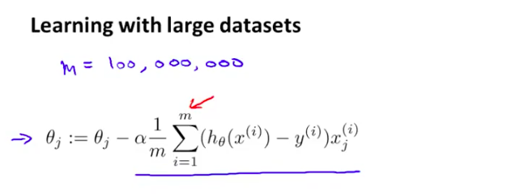  
  
이번 장에서는 이러한 문제를 해결하는 또 다른 방법에 대해서 알아볼것이다.   
  
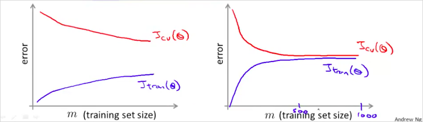  
만약 m 을 1000개만 선택한다면 어떨까?   위의 learning curve를 보자. 우측은 high bias이다. . learning curve를 그렸을때, 우측과 같다면, 좌측의 형태로 변경하면 된다.    m을 적게 선택해도 좌측과 같은 curve가 나오면 괜찮다?    
  
"우선은 이렇게 많은 데이터가 과연 꼭 필요한지를 확인하는 것이 좋다. 가령, 임의로 뽑은 m=1,000 subset만으로 충분히 학습이 가능하다면 굳이 그 모든 데이터를 사용하지 않아도 된다. 이는 learning curve 를 그려봄으로써 확인할 수 있다. 데이터를 더 넣어주어도 더이상 성능 개선이 없는 high bias 형태라면 적당량 이상의 데이터를 넣어줄 필요가 없다." (text 출처: https://wikidocs.net/7178)  
  
## 13.2. Stochastic Gradient Descent  
---  
  
large training set에서의 gradient descent의 문제는 computational cost가 엄청나게 크다는 것이다.    이것을 해결하기 위한 Stochastic Gradient Descent에 대해서 알아보자.    우리는 Linear regression에서 다음을 살펴보았다. 여기서 박스부분이 연산 비용이 상당히 크다는것을 알수있다. 고작 한 step 만 하상하는데도 말이다.    
  
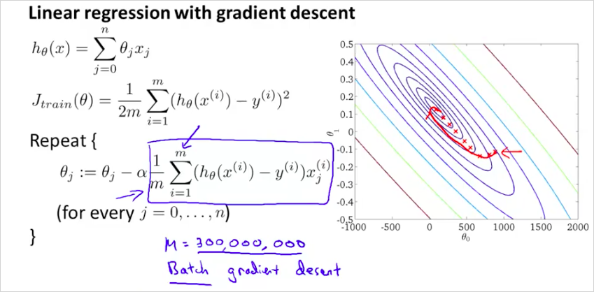  
  
  
Stochastic Gradient Descent의 cost function은 다음과 같다. 전체 training example m을 모두 더하는것이 아니라 $$i$$ 번째 example이 얼마나 맞는지만 확인하는 것이다.  즉 $$i$$ 에 대한 $$h_\theta{(x^{(i)})}$$_ $$y^{(i)}$$ 의 차이를 구해보는것이다.    
  
_  
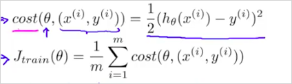  
  
다시말하면, 300,000,000 개를 전부 오랫동안 계산해서 하나의 single step을 구하지말고, 그 중간에 작은(더 부정확할수 있는) step을 하나 계산해보자는 것이다.   
  
알고리즘은 다음과 같다.   
  
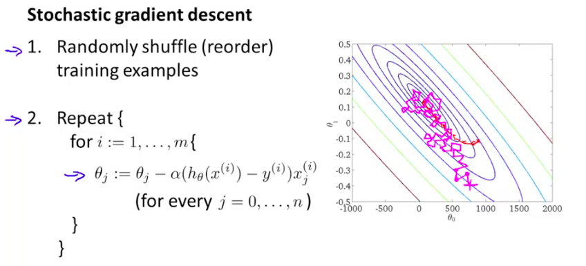  
  
먼저 dataset을 섞는다.    그 뒤에 하나의 example에 대한 한 step $$\theta$$ 를  계산한다. 이것을 반복하면서 $$\theta$$ 를 개선한다.    그러니까 기존방법처럼 하나의 step을 계산하기 위해서 모든 m을 다 계산 해보는것이 아니라, single example만 계산한뒤 m번 반복해보는것이다.   
   
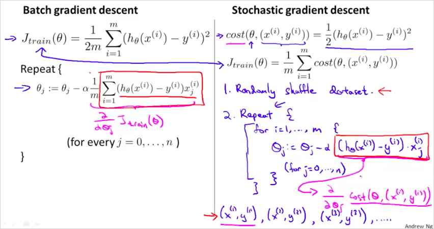  
  
보통 global minimum을 향해 가지만 항상 그곳에 수렴하는것은 아니다. Batch gradient descent처럼 한곳에 수렴하지 않는다.    global minumum 주의를 돌것이다. 따라서 global minumum 에서 가까운곳을 돌고있다면 꽤 좋은 hypothesis 를 얻었다고 볼 수 있다.    Repeat {} 은 몇회정도 반복하는게 좋을까 1~10회정도 반복한다.    따라서 더 빠르다!  Batch gredient descent는 하나의 step을 하강하는데 m 을 모두 계산하는 반면,  Stochastic Gradient Descent는 정확도는 떨어질 지라도 빠르게 하강할 수 있다.    
  
  
## 13.3. Mini-Batch Gradient Descent  
---  
  
Mini-Batch Gradient Descent 는 종종 Stochastic Gradient Descent 보다 더 빠를 수 있다.   Mini-Batch Gradient Descent 는 Batch Gradient Descent 와 Stochastic 의 중간즘이라고 보면 된다.    
  
이 세가지를 비교해보면 다음과 같다.   
  
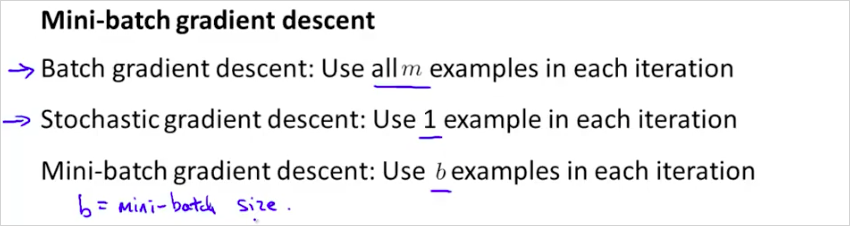  
> b 는 mini-batch size로 1 과 m 의 사잇값이다.  보통 2~100 사이이다.    
  
알고리즘은 다음과 같다.   
  
  
> b=10이면 gradient는 10개의 example을 누적하여 더해서 계산한다. (stochastic 은 1개, batch는 1000개)    
300,000,000 번을 더하여 하나의 step을 얻는것보다는 훨씬 빠른것이다.   적절한 b값과 좋은 vectorized implementation 을 하면 좋은 성능을 낼 수 있다.   
  
  
## 13.4. Stochastic Gradient Descent Convergence  
---  
  
다음 두가지를 알아보자.   
  
- 어떻게 gradient descent가 수렴하는지 확신할수 있는가?   
- 어떻게 learning rate $$\alpha$$ 를 구할 수 있나?  
  
Stochastic Gradient Descent를 하는 중간에 $$\theta$$ 를 update 하기 전에 hypothesis가 잘 동작하고 있는건지 cost를 계산해서 확인해보면 어떨까?   
   
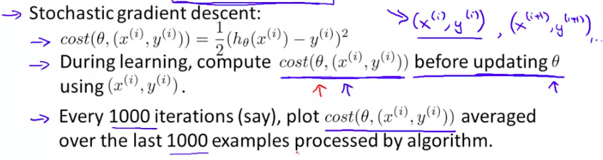  
  
1000 번의 반복마다, cost(i) 함수를 plot해보는것이다.  m 전체를 계산하는 J()와는 다르다.    
  
다음과 같이 plot 해 보았을때,  
  
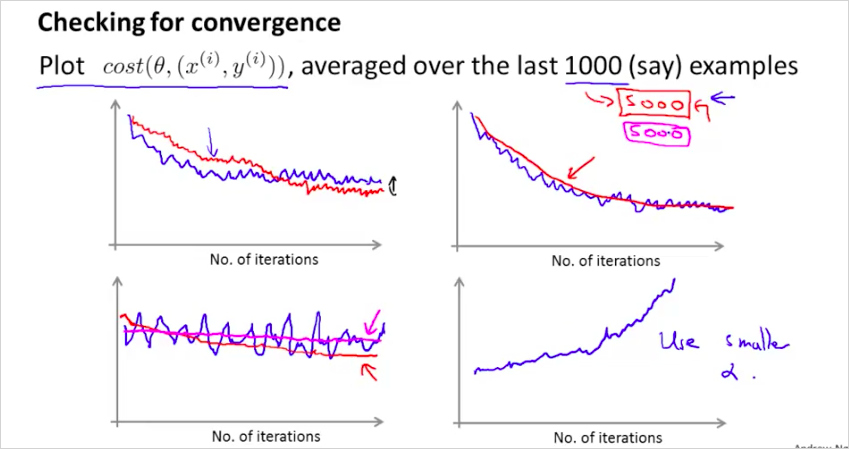  
  
- 너무 noisy 하게 plot되면 example 수를 늘려라  
- cost가 증가하면 $$\alpha$$ 를 줄여야한다.   
  
  
## 13.5. Advanced Topics: Online Learning  
---  
지금까지는 이미 수집한 training example을 기반으로 ML을 했다. 학습을 했다. 만약, training example이 계속해서 수집된다면?  수많은 training data가 막대하게 들어올때는 어떻게 하면 좋을까?  With a continuous stream of users to a website, we can run an endless loop that gets (x,y), where we collect some user actions for the features in x to predict some behavior y.  You can update θ for each individual (x,y) pair as you collect them. This way, you can adapt to new pools of users, since you are continuously updating theta.  
  
  
예를 들어, 한 택배 회사 웹사이트에서 출발지와 배송지를 입력하면 배송비 견적을 제시해준다고 하자. 사용자들은 해당 택배 서비스를 이용하기로 결정할 수도 있고 (y=1) 아닐 수도 있다 (y=2).  
  
Feature x는 사용자 정보, 출발지, 배송지, 그리고 견적가 등이 될 수 있다.  
  
  
  
logistic regression을 사용해 online learning을 하면 다음과같이 구할수 있다.   
  
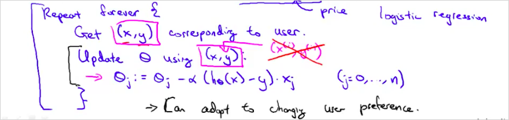  
  
일반적인 logistic regression과 다른 점이라면 하나의 example마다 θ를 업데이트하고 한 번 사용한 example은 버린다는 점이다.  이 방법을 사용하면 변화하는 사용자 성향에 맞춰 최적화할 수 있다.  In the approach to online learning discussed in the lecture video, we repeatedly get a single training example, take one step of stochastic gradient descent using that example, and then move on to the next example.  
  
  
다른 예를 보자.   만약 유져가 다음과 같이 검색을 했을때, "Android phone 1080p camera" 그에 해당하는 10개의 결과물을 return 해야한다면 어떻게 해야할까?   
  
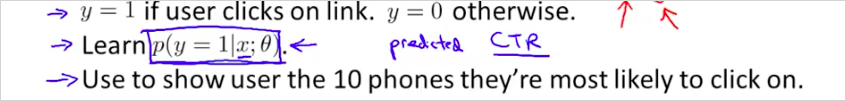  
  
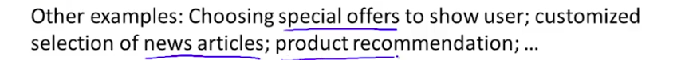  
   
  
  
  
## 13.6. Advanced Topics: Map Reduce and Data Parallelism  
---  
  
지금까지는 하나의 컴퓨터에서 하나의 ML알고리즘을 사용했다. 이번에는 여러개의 ML알고리즘을 동시에 사용하는 방법에 대해서 알아볼 것이다.   training examples 을 4개로 나눠서 4개의 PC 에서 1개의 알고리즘으로 학습시킨다.  4배 빠른속도로 학습할 수 있다.    
  
  
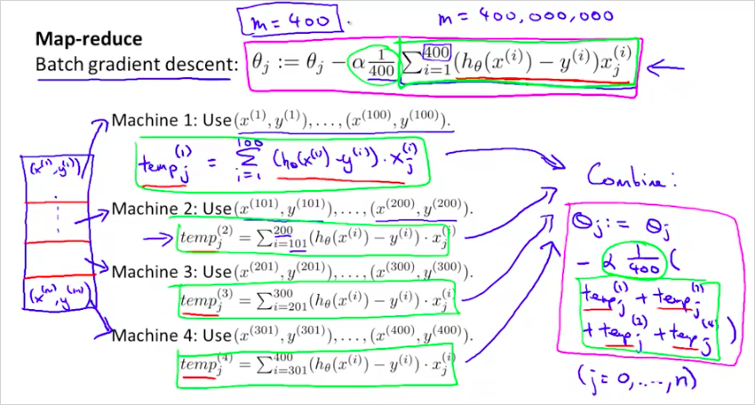  
  
일반적으로는 다음과 같다.   
  
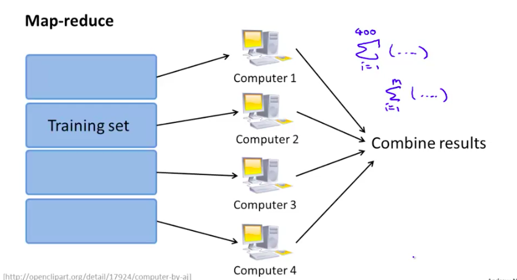  
  
하나의 컴퓨터에서 멀티코어를 가지고 나눌수도 있다.    
   
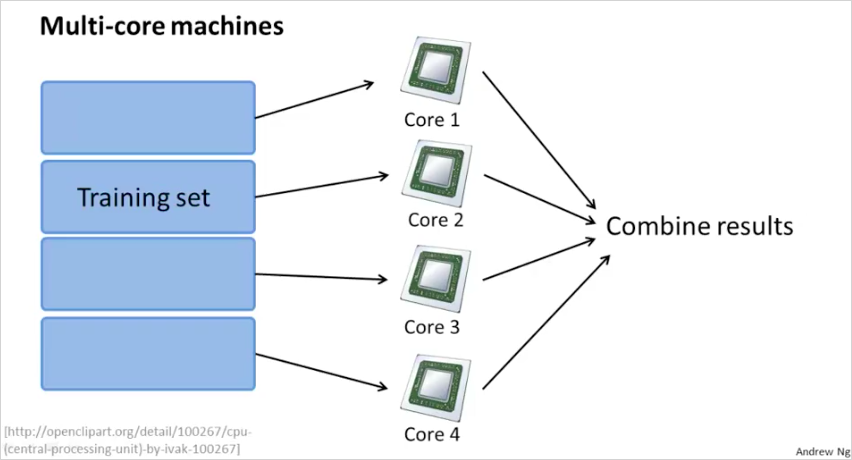  
  
  
