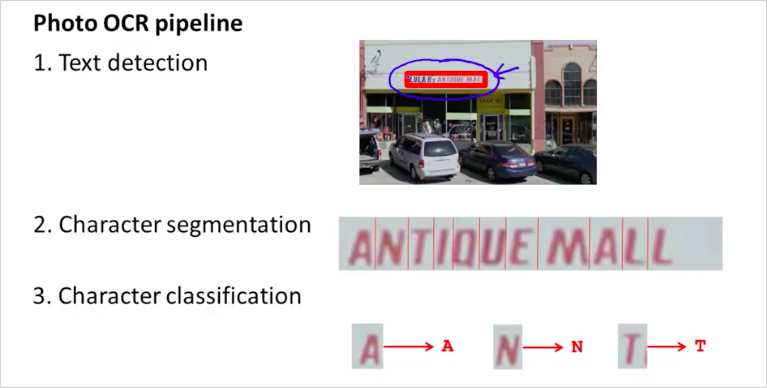
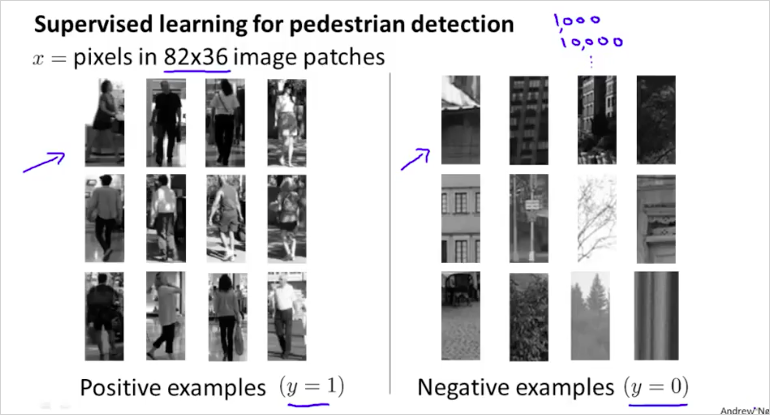
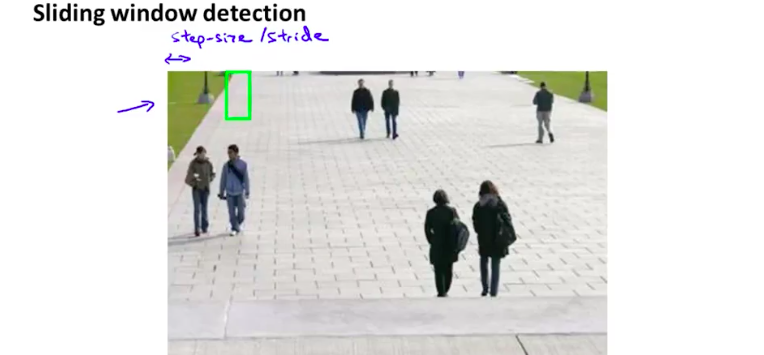
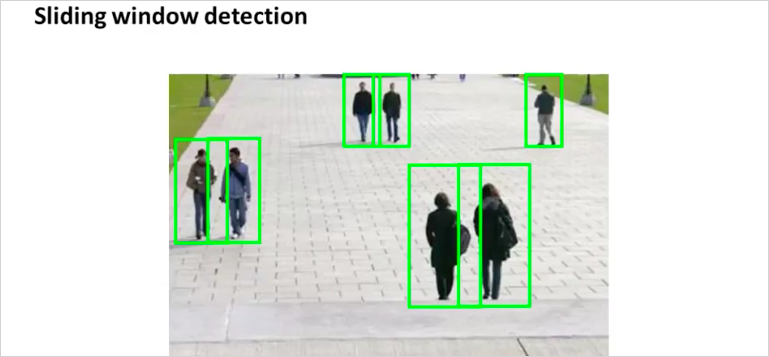
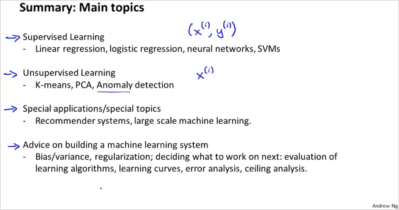

  

  
  
# 14. Application Example: Photo OCR  
---  
   
Photo OCR 은 사진에서 문자를 추출하는것이다.    
  
다음과 같은 절차를 밟는다.   
  
  
  
  
## 14.1. Sliding Windows  
---  
  
  
  
step size 단위로 window를 옮겨서 보행자를 찾는다.    
window크기도 변경해서 탐색한다.   
  
  
  
  
  
## 14.2. Summary  
---  
  
  
  
