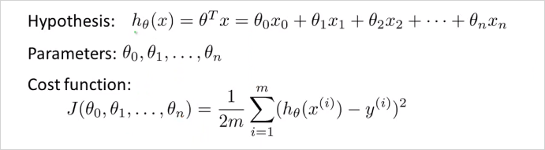
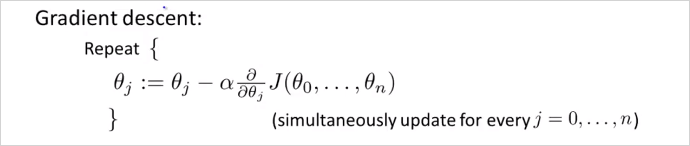

  

# 2.1. Multivariate Linear Regression    
---  

<!-- toc -->  

이번 챕터에서는 하나 이상의 variable 또는 하나 이상의 feature를 사용하는 보다 강력한 Linear regression에 대해 알아볼 것이다.     
  
## 2.1.1. Multiple Features    
  
    
지금까지는 $$x$$ (집 크기) 라는 하나의 feature만 사용했다. 이것을 집의 가격을 결정(예측)하는 요소로 사용했다. 그런데 집값을 결정짓는 요소는 집 크기하나 말고도 더 많을 수 있다. 이럴때 Linear regrresion을 어떻게 할수 있을까? 다음의 예시처럼 집의 크기와 방의 갯수, 층수, 연식 등등으로 고려해서 집값을 예측(결정) 할 수 있을 것이다. 침실 수, 층 수, 연식, 가격이라는 4개의 feature를 이용해 집값을 예측해 볼 것이다.   
  
    
  
일단 먼저 새로운 notation은 다음과 같이 약속한다. 참고로 이런 notation은 machine learning 강의마다 다르다.       
  
    

이 예시에서 4개의 feature가 있으므로 n = 4이다. (m은 테이블의 행의 갯수(training data의 갯수)임에 유의) 여기서 $$x^{(2)}$$는 두번째 training set(두번째 행)의 데이터를 가진 4차원 vector다. 다시말해 두번째 집의 가격을 결정짓는 요소들이다. 추가로 아래첨자는 feature 번호다. 가령 $$x^{(2)}_3$$는 테이블에서 2를 가리킨다.     
$$x^{(2)} = \begin{bmatrix} 1416 \\ 3 \\ 2 \\ 40 \end{bmatrix}$$   

그리고 feature가 1개에서 4개로 늘어났으므로 Hypothesis function의 형태도 달라져야한다. 이전에 $$  h_\theta(x) = \theta_0 + \theta_1x \\    $$  였다면 이번에는 $$  h_\theta(x) = \theta_0 + \theta_1x_1 + \theta_2x_2 + \theta_3x_3 + \theta_4x_4   $$ 를 사용할것이다. 가령 이 예제에서 hypothesis function은 $$  h_\theta(x) = 80 + 0.1x_1 + 0.01x_2 + 3x_3 - 2x_4 $$와 같을 수 있다. ($$\theta_4$$ 가 $$-2$$인 이유는 집이 오래될 수록 집값은 떨어지기 때문이다. ) 결국 $$h_\theta(x)$$ 에서 $$\theta_j$$는 feature $$x_j$$에대한 가중치라고 볼수 있다. 따라서 n개의 feature가 있다면 가설함수는 아래와 같다.     
  
    
  
Feature 벡터 X와 parameter 벡터 $$\theta$$가 있다.  결국 X는 n차원 벡터고 $$\theta$$ 도 만찬가지로 n차원 벡터다.  이 두 벡터를 곱하면 $$h_\theta(x)$$ 가 된다. 곱셈의 편의를 위해서 $$\theta$$ 벡터는 transpose 한다. (nx1, nx1 끼리는 곱셈불가하기 때문에  1xn * nx1 의 형태로 변경해야함) 따라서 hypothesis function 을 벡터화(vectorization)하면 $$ h_\theta(x) = \theta^TX $$ 같이 간략히 표현된다.    
  
$$  
\begin{align*}h_\theta(x) =\begin{bmatrix}\theta_0 \hspace{2em} \theta_1 \hspace{2em} ... \hspace{2em} \theta_n\end{bmatrix}\begin{bmatrix}x_0 \newline x_1 \newline \vdots \newline x_n\end{bmatrix}= \theta^T x\end{align*}    
$$  
  
이것을 __Multivariate Linear regression__ 이라고 부른다. 다변수 선형회귀도 궁극적으로 해결하려는 것은 training set의 데이터를 가지고 $$\theta_n$$ 들을 구하는 것이다. 그 $$\theta$$ 로 이루어진 $$h_\theta()$$는 training set을 가장 유사하게 모사하는함수다. 여기서도 cost function J()를 새롭게 정의하게 될것이다.  
  
  
## 2.1.2. Gradient Descent for Multiple Variables    
  
변수가 여러개인 linear regression 의 Gradient Descent 는 어떻게 할까? 아래 공식과 같다. cost function 자체는 동일하다. 여기서 여러개의 parameter $$\theta_0 ... \theta_n$$ 는 모두 간단하게 벡터 $$\theta$$ 로 바꿔서 표기할 수있다.      
    
    
  
feature가 1개 이상일때 Gradient Descent 알고리즘을 아래와같고 결국 각 $$\theta$$ 는 그 아래와같이 계산 될 수 있다. 개념상 이해하는데는 feature 가 1개일때랑 크게 차이가 없다.      
  
    
  
우리가 최종 계산할 parameter $$\theta_0 ... \theta_n$$ 계산 공식!    
  
$$  
\begin{align*} & \text{repeat until convergence:} \; \lbrace \newline \; & \theta_0 := \theta_0 - \alpha \frac{1}{m} \sum\limits_{i=1}^{m} (h_\theta(x^{(i)}) - y^{(i)}) \cdot x_0^{(i)}\newline \; & \theta_1 := \theta_1 - \alpha \frac{1}{m} \sum\limits_{i=1}^{m} (h_\theta(x^{(i)}) - y^{(i)}) \cdot x_1^{(i)} \newline \; & \theta_2 := \theta_2 - \alpha \frac{1}{m} \sum\limits_{i=1}^{m} (h_\theta(x^{(i)}) - y^{(i)}) \cdot x_2^{(i)} \newline & \cdots \newline \rbrace \end{align*}    
$$  
  
  
## 2.1.3. Gradient Descent in Practice I - Feature Scaling    
  
Feature Scaling 이란? 만약 여러개의 feature가 비슷한 크기의 범위를 갖는 값이라면 Gradient Descent가 더 빠르게 수렴할 수 있다.  더 적은 수의 반복으로 목적지에 수렴이 가능하다.     
  
    
가령 $$x_1$$ 값이 0 ~ 2000 의 범위를 갖고 $$x_2$$는 1 ~ 5 의 범위를 갖는다고 가정하면 그 두개의 feature의 범위 차이가 매우 크기 때문에 왼쪽 처럼 등고선이 매우 길쭉하게 나타난다. 그러면 기울기 하강은 더 난해하고 복잡한 경로로 오랫동안 일어나게 된다. 만약 우측처럼 범위를 동일하게 맞춰주면 등고선의 모양은 거의 원형이라 더 빠르게 하강할 수 있다. 따라서 이렇게 각 feature의 scale을 비슷하게 조정할 필요가 있다. (정확하게 똑같이 맞출필요는없다. 대충 비슷하게만 맞으면 된다.)  이것이 이번장에서 다룰 __Feature Scaling__이다.     
  
  
    
> Feature Scaling 기법중 하나는 Mean normalization이다. 이것은 x를 대략 -0.5 ~ 0.5 범위로 scale 시킨다. 방법은     
  
$$  
x_n := {x_n - \mu_n \over s_n}    
$$  
> $$\mu_1$$ 은 x_1의 평균이다.     
> $$s_1$$ 은 보통 최대값-최소값으로 하면된다.     
  
  
## 2.1.4. Gradient Descent in Practice II - Learning Rate    
  
이번에는 learning rate $$\alpha$$를 어떻게 정하는지 알아본다.     
  
    
Gradient Descent가 잘동작한다면 j()는 매 iteration마다 감소해야한다. 300 회 반복 부터는 cost function 이 거의 줄어들지 않고 수렴한다. Gradient Descent 가 수렴하는 iteration 횟수는? 경우에 따라 다양하기 때문에 사전에 알기 어렵다.  __Automatic Convergence Test__라는 Gradient Descent 가 수렴하는지 안하는지 알려주는 test가 존재 하기도 한다. 만약 J 가 감소하지 않고 증가한다면 명백한 문제가 있는것이고, 더 작은 learning rate $$\alpha$$ 사용해야한다는 뜻이다. 적절한 learning rate $$\alpha$$ 알아서 찾아서 좋은 Gradient Descent를 구현해야한다. 특별히 정답은 없는듯.    
  
To summarize:    
  
- If $$\alphaα$$ is too small: slow convergence.    
- If $$\alphaα$$ is too large: may not decrease on every iteration and thus may not converge.    
  
## 2.1.5. Features and Polynomial Regression    
  
이번에는 어떻게 Feature를 선택할지, 적절한 Feature의 선택으로 강력한 학습 알고리즘을 만드는 방법에대해 알아본다. Polynomial Regression(다항 회귀?)에 대해서도 알아본다.  Polynomial Regression은 linear regression 을이용해서 복잡한 비선형 함수에도 적용하는 것이다.     
  
    
  
이런경우는 굳이 $$x_2$$ 까지 항을 늘려서 모델(가설함수)을 만들 필요가 없다. $$x_1$$을 넓이로 바로 사용해도 된다.     
  
    
    
위와같은 형태의 training data가 존재한다고 하자. hypothesis function이 $$h_\theta (x) = \theta_0 + \theta_1 x_1$$  일 때, x1 에 연관된 feature를 추가하여 2차 함수꼴로 만들 수 있다.    
$$  
h_\theta (x) = \theta_0 + \theta_1 x_1 + \theta_2 x_1^2    
$$  
여기서 $$\theta_2 x_1^2$$ 가 $$x_2^2$$ 가 아니라 $$x_1^2$$ 임을 유의하자. 결국 feature는 하나인것이다. 하나의 feature를 가지고 제곱이나 제곱근등등으로 형태를 변경하여 함수모양을 바꿀수 있다. 이것은 결국 feature가 하나 더 늘어나는것과 같은 의미이다. 결국 $$x_1 = x_1$$, $$x_2 = (x_1)^2$$ 와 같다. 이차함수형태의 모델을 사용하면 나중에 감소하는 구간이 생기기에 적합하지 않다. 이럴땐 3차 함수 형태를 사용하는게 더 적합하다. $$  h_\theta (x) = \theta_0 + \theta_1 x_1 + \theta_2 x_1^3 + \theta_3 x_1^3  $$  이렇게 3차 함수꼴로 나타냈을때 그리고 아래와 같이 제곱근 형태의 함수를 사용하는게 더 적합할 수도 있다. $$  h_\theta (x) = \theta_0 + \theta_1 x_1 + \theta_2 \sqrt{x_1}  $$  이러한 함수형태를 자동으로 찾아주는 알고리즘이 존재한다. 앞으로는 그것을 사용할것이다. 

이렇게 feature 하나를 가지고 새로운 feature를 만들면 feature scaling이 중요해진다. $$x_1$$이 1~1000 범위를 갖는다면, 그로부터 만든 새 feature인 $$(x_1)^2$$는 1 ~ 1000000 의 범위를 갖게 될것이기 때문이다. 이 둘의 차이가 너무 크면 gradient descent 가 엄청 느려진다.     
  
- Polynomial feature  생성하는 방법:  
만약 training data의 feature가  $$x_1$$  $$x_2$$ 이렇게 주어진다면, 그 두개의 feature 벡터를 가지고 다음의 polynomial feature 값을 모두 연산하여 새로운 matrix를 생성한다. 그리고 각 polynomial feature에 해당하는 가중치  $$\theta$$ 를 적절하게 선택(Gredient descent등 사용)하여, Polynomial한 $$h_\theta(x)$$ 함수를 생성할 수 있는것이다.    
$$  
x_1 , x_2 , x_1^2, x_2^2, x_1x_2, x_1^3, x_1^2x_2, x_1x_2^2 , x_2^3, ....  
$$  
Training set을 가지고 그 데이터를 잘 모사하는 $$h_\theta(x)$$를 만들때, 함수형태를 먼저 찾는것이 아니다. 모든 형태를 만든다음에  $$x$$ 의 parameter (혹은 weight)  $$\theta$$를 0으로 만들던지 하여 불필요한 항을 제거하는 방식으로 함수 형태를 찾는것이다.    
  
- Polynomial feature  생성 알고리즘(in Octave):  
연습문제 ex2_reg.m 의 mapFeature.m 참고  
	```matlab  
	X = mapFeature(X(:,1), X(:,2));  
	```  
	> $$x_1$$, $$x_2a$$ feature가 X벡터에 있을때  
  
	```matlab  
	function out = mapFeature(X1, X2)  
  
	degree = 6;		% 몇차 polynomial feature까지 생성할 것인지  
	out = ones(size(X1(:,1)));  
	for i = 1:degree  
	    for j = 0:i  
		out(:, end+1) = (X1.^(i-j)).*(X2.^j);  
	    end  
	end  
	end  
	```  

