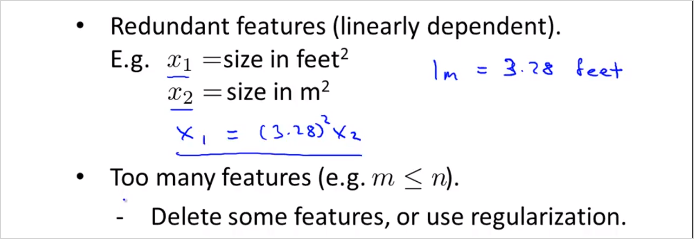

  

# 2.2. Computing Parameters Analytically    
---  
  
<!-- toc -->  

  
## 2.2.1. Normal Equation    
  
Normal Equation은 최적의 $$\theta$$ 를 구할 수 있는 또다른 방법이다.  gradient descent 와는 다른 방식으로 각각 장/단점이 있다. Normal Equation은 $$\theta$$ 를 반복계산 없이 공식하나로 한번에 구할 수 있다. 다음의 training set을 보자.     
  
    
> 4개의 feature가 있고 결과가 있다. 이것을 각각 X matrix와 y 벡터로 복사한다. 계산의 편의를 위해  1을 갖는 $$x_0$$ 열이 추가되었음에 유의. 이것을가지도 아래 Normal Equation 공식에 대입해 계산하면 바로 $$\theta$$를 구할 수 있다!    
  
$$  
\theta = (X^TX)^{-1}X^Ty    
$$  
  
이렇게 계산된 $$\theta$$ 는 cost function J를 최소화하는 값이다.     
  
    
  
만약 $$i$$번째 하나의 training data가 위의 $$x^{(i)}$$ 처럼 n + 1 크기의 벡터로 주어진다면, 이것으로 우측과 같이 Design Matrix X를 만든다. (결국 이전 예시처럼 테이블을 그대로 matrix에 복사한것과 동일한 구성임)    
  
더 간단한 예를들면 아래와 같다.    
    
  
$$\theta$$ 를 구하는 Octave 명령어    
  
```matlab    
pinv(X'*X)*X'*y    
```  
  
반복 계산도 필요없고 적절한 $$\alpha$$를 찾아야하는 수고가 없다. 또한 Feature scaling도 필요없다. ~~이렇게 좋은 방법이 있다니?~~  그러나 결론적으로Normal Equation에 매우 치명적인 단점이 있다. n(feature갯수)가 엄청 커지면 Normal Equation은 못쓴다. 복잡도가 $$O(n^3)$$ 으로 연산속도가 엄청나게 느려지기 때문이다.     
  
Gradient descent 와 Normal equation을 비교하면 아래와 같다.     
    
  
보통 n=10000 정도까지는 Normal equations을 사용해도 괜찮다고 한다. 현대 컴퓨팅 파워로 이정도계산 까지는 실용적인 속도를 얻을 수 있다.     
  
  
## 2.2.2. Normal Equation Noninvertibility    
  
역행렬이 없는 Normal Equation은 어떻게 구해야할까?    
$$  
\theta = (X^TX)^{-1}X^Ty    
$$  
$$X^TX$$ 가 역행렬이 없는 경우가 있기 때문이다.     
  
다음의 두가지 경우에 $$X^TX$$ 에 역행렬이 없다.     
    
> 1번은 각 feature가 $$x_1 = (3.28)^2x_2$$ 처럼 선형적으로 종속적인 관계일때이다. 이럴땐 둘 중 한feature를 제거해도 된다.    
> 두번째는 피쳐갯수(n)이 training set갯수(m)보다 많을때이다. 이럴땐 어떤 feature들을 지우거나, regularization기법을 사용한다.      
  
    
  
