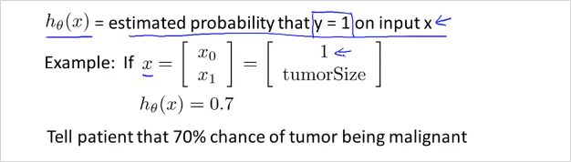
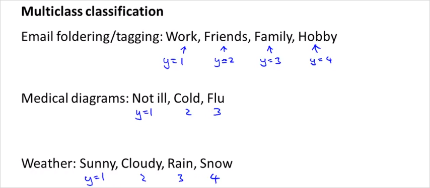

  

# 3.1. Logistic Regression
---  
  
  
<!-- toc -->  

    
Logistic regression is a method for classifying data into discrete outcomes. For example, we might use logistic regression to classify an email as spam or not spam.  
  
  
## 3.1.1. Classfication  
---  
  
이번 챕터에서는 어떻게 Classfication 분류 알고리즘을 어떻게 개발할수 있는지 알아본다. 우선 linear regression을 classification에 적용하는것은 가능해보이기는 하나. 데이터가 동떨어진 곳에 하나만 추가되어도 가설함수가 바뀌기 때문에 옳지 못한 결과를 만들어낼 수 있다.  따라서 y가 0또는 1인 binary classification problem 에 집중할것이다.   
  
## 3.1.2. Logistic Regression  
---  
(용어는 Regression 이지만 Classfication 문제임)  
  
Logistic Regression 에서 아래와 같은 범위를 갖는 가설함수를 만들것이다.   
$$  
0 \leq h_\theta(x) \leq 1  
$$  
  
  

$$  
\begin{align*}& h_\theta (x) = g ( \theta^T x ) \newline \newline& z = \theta^T x \newline& g(z) = \dfrac{1}{1 + e^{-z}}\end{align*}  
$$  

그렇게 하기 위해서는 가설함수 $$h_\theta(x)$$를 $$g(z)$$ 형태로 변화시켜야한다. 그 이유는 $$0 \leq h_\theta(x) \leq 1$$를 만족시키도록 만들기 위해서이다. 그래프로 그리면 시그모이드 함수의 형태로 나타나고 범위가 1이하 0이상을 만족한다. 이제 우리가할일은 $$\theta$$ 파라미터를 우리의 데이터에 맞게 맞추는것이다. 파라미터를 찾는 알고리즘은 후에 다시 살펴본다.   
  
  
  

$$g(z)$$의 결과는 항상 0 이상 1이하를 만족한다.  
  
  
  
h(x)는 입력값 x에대해서 y가 1일 확률을 추청하는 함수이다.   가령 위그림과 같이 x의 feature가 두개 즉 feature 벡터 x가 있을때. (하나는 1, 하나는 종양크기) 만약 가설함수가 0.7로 나왔다면, 결과를 이렇게 해석할 수 있다. y=1일 확률 즉 악성종양일 확률이 70%이라고.   이것을 수학적으로 더 엄밀하게 표현하면 아래와 같다.   
  
$$  
\begin{align*}& h_\theta(x) = P(y=1 | x ; \theta) = 1 - P(y=0 | x ; \theta) \newline&  
P(y = 0 | x;\theta) + P(y = 1 | x ; \theta) = 1\end{align*}  
$$  
> $$h_\theta(x) = P(y=1 | x ; \theta)$$  해석:  
>  Probability that y=1, given x, parameterized by $$\theta$$  
> y가 1일 가능성, 주어진 x, 즉 환자가 특징 x로 나타내지는 특정 종양의 크기를 가질때, 이것이 $$\theta$$에 매개된 가능성이다.   
  
  
  
## 3.1.3. Decision Boundary  
---  
  
$$h(x)$$가 계산하는것이 정확히 무엇이냐? 가설함수가 예측하는 값이 언제 y=1이고 0인지 이해해보자.   
  
  
  
  
가령 $$h_\theta(x) \geq 0.5$$ 일때 y = 1이라고 가정한다면, $$h_\theta(x) = g(\theta^T x) \geq 0.5 $$ 와 같다. 그래프를 보면 $$z \geq 0$$일때 $$g(z) \geq 0.5$$이므로 $$z = \theta^Tx \geq 0$$ 일때 와 같다.   
  
__즉 $$\theta^Tx \geq 0$$ 이면, $$y = 1$$ 로 예측할 수 있다. __  
  
$$  
\begin{align*}& h_\theta(x) \geq 0.5 \rightarrow y = 1 \newline& h_\theta(x) < 0.5 \rightarrow y = 0 \newline\end{align*}  
$$  
  
  
  
  
가령 $$h(x)$$ 가 위처럼 $$g(\theta^Tx)$$ 형태일때, $$\theta$$ 벡터가  $$\theta = \begin{bmatrix} -3 \\ 1 \\ 1 \end{bmatrix}$$ 라고 가정하면, $$\theta^Tx $$ 가 0보다 큰 경우, 즉 y=1일 경우는 그래프가 나타태는 영역과 같다. $$x_1$$ $$x_2$$는 training set이다.  $$x_1 + x_2 \geq 0$$ 이 나타내는 영역이 y=1인것이다.  이때 $$h(x) = g(\theta^Tx) \geq 0.5$$를 만족한다.   이 경계를 나타내는 함수를 __Decision Boundary__ 라고 부른다!  (The decision boundary is the line that separates the area where y = 0 and where y = 1. It is created by our hypothesis function. )
  
실제로($$x_1, x_2$$)이 (1,1)과 (3,3)일때 $$h_\theta(x)$$를 계산해보면 다음과 같다.   
  
- (3,3)일때 -> $$\theta^Tx = 3$$  
	```matlab  
	octave:6> 1 / (1 + e^-(3))  
	ans =  0.95257  
	```  
	> 0.5보다 큼 -> y=1 일확률 95%  
  
- (1,1)일때 -> $$\theta^Tx = -1$$  
	```matlab  
	octave:7> 1 / (1 + e^-(-1))  
	ans =  0.26894  
	```  
	> 0.5보다 작음 -> y=1 일 확률 27%  
  
## 3.1.4. Non-linear Decision Boundary  
---  
  
  
  
일반적인 경우 logistic regression은 linear한 decision boundary 밖에 찾을 수 없다. (since logistic regression will only be able to find a linear decision boundary)  따라서 Decision Boundary가 non-linear한 경우의 예는 위와 같다. ($$\theta^Tx$$) 는 feature 두개를($$x_1$$ $$x_2$$) 가지고Polynomial 한 변수를 사용했음에 유의 ($$x_1^2$$ $$x_2^2$$)  $$\theta$$가 Decision Boundary 모양을 결정한다 training data가 하는게 아님.  
  
  
  
Polynomial 한 feature를 더 복합적으로 사용하면 더 복잡한 모양의 Decision Boundary를 얻을 수 있다.  결국 이 3 장에서 할일은. training set x가 있을때 적절한 Decision Boundary함수 그래프 모형(?)을 선택하고 $$\theta$$ 를 구한다. 최적의 $$\theta$$는 당연히도 cost function $$J(\theta)$$를 최소화하는 값으로 구할것이다. 그렇게 해서 구해진 가설함수 $$h_\theta(x)$$는 주어진 x가 y=1영역인지 아닌지를 판단해준다. 확률값으로.  
  
  
  
## 3.1.5. Cost function  
---  
  
이번 챕터에서는 어떻게 적절한 parameter $$\theta$$를 구할수 있는지 알아본다.   
  
  
> m개의 Training set이 위와같고,  feature 벡터 $$x$$ 가 위와 같을때.  $$\theta$$를 어떻게 선택할 수 있을까?  
  
Logistic regression의 cost function 은 다음과 같다.   
  
$$  
\begin{align*}& J(\theta) = \dfrac{1}{m} \sum_{i=1}^m \mathrm{Cost}(h_\theta(x^{(i)}),y^{(i)}) \newline & \mathrm{Cost}(h_\theta(x),y) = -\log(h_\theta(x)) \; & \text{if y = 1} \newline & \mathrm{Cost}(h_\theta(x),y) = -\log(1-h_\theta(x)) \; & \text{if y = 0}\end{align*}  
$$  
> y=1일때, y=0일때 다르다.   
  
$$J(\theta)$$는 training examples의 모든 $$i$$에 대한 합이고 하나의 $$i$$에 해당하는 Cost($$h_\theta(x)$$, y)는 예시는 아래와 같다.    참고로 Linear regression에서 cost function은 "실제값과 예측값의 차이"였다. Logistic regression 에서는 log함수 형태를 선택했다. 예측값(y= 0또는 1)이 실제값(y= 0또는 1)과 가까우면 0이고 틀리면 무한대가 된다. 결국 개념상 예측값($$h_\theta(x)$$, y=1일 확률값) 과 실제값(y)의 차이인것은 동일하다.  Logistic regression은 실제값 y가 0또는 1밖에 없기 때문에 cost func를 두개로 나눌수 있는것.   
  
참고: m개의 training data가 필요한 시점은 언제부터 인가? 다시 말해 m개의 데이터를 통해 학습하는 단계는 언제부터인가?   
-> Cost function J($$\theta$$)를 계산하는 시점이다. J($$\theta$$)는 각 training set으로 부터 계산된 값을 모두 더해야하기 때문이다. 이 지점을 Learning 한다고 표현하는것 같다.   
  
만약 y=1일때 cost function $$J(\theta)$$는 아래와 같이 그릴 수 있다. x축인 $$h_\theta(x)$$ 의 범위는 0 에서 1사이이다.   
  
  
반대로 y=0일때는 다음과 같다.   
  
  
만약 y=1로 예측을 하는 cost 함수에서 $$h_\theta(x) = 0$$ 이 나오면 대단한 오류이기 때문에 cost즉 $$J(\theta)$$가 무한대이다.   
  
  
$$  
\begin{align*}& \mathrm{Cost}(h_\theta(x),y) = 0 \text{ if } h_\theta(x) = y \newline & \mathrm{Cost}(h_\theta(x),y) \rightarrow \infty \text{ if } y = 0 \; \mathrm{and} \; h_\theta(x) \rightarrow 1 \newline & \mathrm{Cost}(h_\theta(x),y) \rightarrow \infty \text{ if } y = 1 \; \mathrm{and} \; h_\theta(x) \rightarrow 0 \newline \end{align*}  
$$  
  
  
## 3.1.6. Simplified Cost Function and Gradient Descent  
---  
  
- Cost Function  
  
y=1일때와 0일때 경우로 나뉜 cost function은 아래와같이 하나의 식으로 합칠수 있다. y=1과 y=0을 대입해보면 동일하다.   
  
  
그리고 $$J(\theta)$$는 아래와 같은 공식으로 나타낼 수 있다.   
  
  
  
이것을 Vectorized 하면 아래와 같다. 실제 Octave로 계산할때는 아래의 식을 사용한다.   
  
$$  
\begin{align*} & h = g(X\theta)\newline & J(\theta) = \frac{1}{m} \cdot \left(-y^{T}\log(h)-(1-y)^{T}\log(1-h)\right) \end{align*}  
$$  
  
  
- Gredient Descent 알고리즘.   
  
$$\theta_j$$ 를 구하는 알고리즘도 아래와 같다.   
  
$$  
\begin{align*}& Repeat \; \lbrace \newline & \; \theta_j := \theta_j - \alpha \dfrac{\partial}{\partial \theta_j}J(\theta) \newline & \rbrace\end{align*}  
$$  
  
편미분해서 도함수(Derivative)를 대입하면   
  
$$  
\begin{align*} & Repeat \; \lbrace \newline & \; \theta_j := \theta_j - \frac{\alpha}{m} \sum_{i=1}^m (h_\theta(x^{(i)}) - y^{(i)}) x_j^{(i)} \newline & \rbrace \end{align*}  
$$  
  
결국 Gredient Descent 알고리즘이 Linear regression과 완벽히 동일 하다!!    (각 $$\theta$$ 값은 동시에(simultaniously) 계산되어야하는 것도 마찬가지)  
  
  
> Linear regression 과 딱하나 __차이가 있다면 $$h_\theta(x)$$ 의 형태이다. __  
> - Linear regression  
>  $$h_\theta(x) = \theta^Tx$$    
> - Logistic regression  
>  $$h_\theta(x) = {1 \over (1 + e^{-\theta^Tx})}$$  
  
결국 Vectorized 하면  $$\theta$$는 아래와 같이 구할 수 있다.    
  
  
  
  
## 3.1.7. Advanced Optimization  
---  
  
For logistic regression, sometimes gradient descent will converge to a local minimum (and fail to find the global minimum). This is the reason we prefer more advanced optimization algorithms such as fminunc (conjugate gradient/BFGS/L-BFGS/etc).  Octave 라이브러리 fminunc() 사용, theta vector를 Gradient descent보다 빨리 찾을 수 있음.  https://www.coursera.org/learn/machine-learning/supplement/cmjIc/advanced-optimization  
  
## 3.1.8. Multi-Class Classification  
---  
  
아래 예와 같이, 이메일을 여러 태그로 분류하는 경우등, 두개 이상으로 분류하는 경우는 어떻게 하는지 알아보자.   
  
  
  
아래와 같이, 3가지로 분류해야 한다면, One vs All 형태의 가설함수를 3개를 만들면 된다. 그뒤에 예측할때는 x에대해서 세개의 가설함수 전부를 돌려보고 결과인 y=1일 확률이 가장 높은 class로 선택하면 된다.   
  
  
  
이것을 수식으로 표현하면  
  
$$  
\begin{align*}& y \in \lbrace0, 1 ... n\rbrace \newline& h_\theta^{(0)}(x) = P(y = 0 | x ; \theta) \newline& h_\theta^{(1)}(x) = P(y = 1 | x ; \theta) \newline& \cdots \newline& h_\theta^{(n)}(x) = P(y = n | x ; \theta) \newline& \mathrm{prediction} = \max_i( h_\theta ^{(i)}(x) )\newline\end{align*}  
$$  
  
>$$h_\theta^{(0)}(x)$$ 부터  $$h_\theta^{(n)}(x)$$ 까지 다 돌려보고 그중에 가장 큰값을 갖는 i를 선택하면 된다.    
  
  
