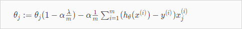

  

# 3.2. Overfitting problem  
---

  
<!-- toc -->  

## 3.2.1. Overfitting 이란?  
  

Feature를 많이 둘 수록 Training data을 더 정확히 모사할 수 있다.  하지만 가설함수가 너무 Training data에만 적합해서 Training data는 거의 정확하게 예측하지만 새로 들어온 데이터에 대해서는 예측을 못하는 문제가 발생할수 있다.  해당 가설함수로 문제를 일반화(generalize)하는것을 실패했다.  그림 맨 왼쪽은 Underfit (high bias, preconception 이라고도 표현할수 있음), 오른쪽이 Overfit, 가운데가 적합하다.  강의 뒷편에서 학습알고리즘이 Overfitting인지 아닌지 분석하는 툴에대해 살펴볼 것이다.   

Feature가 너무 많을때 Overfitting이 발생할 수 있다. 해결책은 크게 두가지이다.   

- 1) Reduce the number of features:  
	- Manually select which features to keep.  
	- Use a model selection algorithm (studied later in the course).  
  
- 2) __Regularization__  
	- Keep all the features, but reduce the magnitude of parameters $$\theta_jθ$$   
	- Regularization works well when we have a lot of slightly useful features.  
	이번 장에서 다룰 내용  
  
## 3.2.2. Cost function  

  

  

Regularization 은 이렇게 cost function 에 특정$$\theta_j$$에 큰 가중치를 부여(패널티 부여)해서 최종적으로 $$\theta_j$$ 의 크기를 0에 가깝게 만드는것이다. 이렇게하면 4차 함수를 쓰더라도 2차함수 모델에 근접하게 만들 수 있다.   

  

그렇다면 어떤 $$\theta_i$$를 선택해서 Regularization할 것인가? 우리는 어떤게 맞는지 알수없다. 그래서  다음의 공식으로 모든 parameter  $$\theta_i$$에 대해서 값을 줄여(shrink)서 cost function값을 확인해 보는 것이다.  $$J(\theta)$$ 의 공식에 $$\color{royalblue}{+ \lambda \sum_{i= 1}^{100} \theta_j^2}$$ 부분이 추가된다.   

In regularized linear regression, we choose $$\theta$$ to minimize:   

$$
J(\theta) = \frac{1}{2m} \sum_{i=1}^{m} \left( h_\theta( x^{(i)}) - y^{(i)} \right)^2 \color{royalblue}{+ \lambda \sum_{i= 1}^{100} \theta_j^2} 
$$

The $$\lambda$$ is the regularization parameter. It determines how much the costs of our theta parameters are inflated.  어떤 $$\lambda$$를 적용 했을때, 모든 $$\theta$$에대해서 가장 cost function이 작아지는지 확인?  어떤 feature에 대한 parameter $$\theta_j$$ 가 있을때 그 파라미터에대해서  $$J(\theta)$$를 구해보면, 왼쪽항은 줄어들지만, 람다항 $$+ \lambda \sum_{i= 1}^{100} \theta_j^2$$은 커진다. 이 둘의 조합을 통해 결국 가장 작은 값을 갖는 $$\theta_j$$ 를 찾으면 overfitting을 방지한 $$\theta$$값을 찾을 수 있을 것이다.   $$\lambda$$ 가 또 너무 커도 Underfitting이 발생할 수도 있음에 주의해야 한다.  

## 3.2.3. Regularized Linear Regression  

Overfitting 을 피하기 위해서 Linear Regression 에서 Regularized하는 방법에 대해 알아보자.   Regularized 를 Gradient descent 알고리즘에 적용하면 다음과 같다. $$\theta_0$$인 경우는 seperated 되었다는점에 주의 (어차피 1이기 때문이다.)  

  
> 분홍색 부분은 $$J(\theta)$$를 편미분한 도함수이다. 증명은 생략한다.   

$$\theta_j$$ 항을 모아서 쓰면 다음과 같다.   
  

$$1 - \alpha {\lambda \over m}$$ 항(term)은 흥미로운 영향을 준다.  $$1 - \alpha {\lambda \over m} < 1 $$ 이다. 그리고  $$\theta_j$$ 자체를 약간 줄인다. 그 우측 항은 기존 gradient descent 와 동일하다.   

Normal Equation 은 어떻게 적용할 수있는지 살펴보자.   간단하다 공식은 아래와 같다. L matrix 크기는  (n+1) x (n+1) 이다. (n:feature갯수)  
$$
\begin{align*}& \theta = \left( X^TX + \lambda \cdot L \right)^{-1} X^Ty \newline& \text{where}\ \ L = \begin{bmatrix} 0 & & & & \newline & 1 & & & \newline & & 1 & & \newline & & & \ddots & \newline & & & & 1 \newline\end{bmatrix}\end{align*}  
$$

## 3.2.4. Regularized Logistic Regression  

Overfitting 을 피하기 위해서 Logistic Regression 에서  Regularized하는 방법에 대해 알아보자.   

  

$$h_\theta(x)$$가 위와 같을때 Decision boundary는 매우 복잡할 것이고 trainig set에는 매우 적합하지만 새로운 데이터에는 과적합(Overfit) 하다.    따라서 Regularized 된 cost function $$J(\theta)$$는 위와 같다. 기존의 $$J(\theta)$$에서 람다 항이 추가되었다.   이것을 가지고 Gradient descent 알고리즘에 적용하면 다음과 같다.   

  
> $$h_\theta(x)$$ 함수의 형태가 linear regression과 다름에 유의.  

