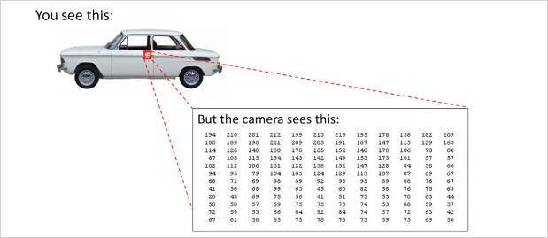

  

# 4. Neural Networks  
---  
  
## 4.1. 배경  
---  
  
이미 linear regression, logistic regression이 기계학습에 사용되고 있는데, 신경망 알고리즘은 왜 필요할까?  
  
  
  
feature가 늘어날수록 Polynomial 항들은 기하급수적으로 늘어난다. 연산속도나 복잡도등이 매우 높아진다. feature가 늘어날때, 비선형적 요소를 계속 추가하는것은 좋지 않다.   
  
logistic regression을 이용해서 자동차인지 아닌지 분류하는 non-linear boundary classification 예를 살펴보자.  
  
  
  
위,그림과 같이 컴퓨터 비전 문제는 결국 픽셀의 밝기등의 정보에 대한 matrix를 다루는 것이다. 그리고이 이미지에서 우리가 해결할것은 결국 이 matrix를 보고 이 숫자들이 자동차의 손잡이를 나타낸다고 말해줘야한다.   
  
  
다시 자동차로 돌아와서, 두개의 픽셀 위치를 선정해서 색깔을 값을 plotting한다고 해보자. 즉 feature가 2개다. 그렇게 여러종류의 사진을 plot해보면 아래와 같은 형태가 될 것이다.   
  
  
만약 50x50 픽셀 이미지가 있고 모든 픽셀을 feature로 선택한다면 feature갯수가 무려 2500개다. 만에하나 Quadratic feature($$x_i \times x_j$$)라도 사용한다면 300만개가 넘을 것이다. feature갯수가 증가하면 연산량뿐만 아니라 overfitting의 가능성도 높아진다.   
  
결국 n이 엄청 클때 복잡한 비선형 가설을 학습하는데 단순히 logistic regression을 사용하는것은 적합하지 않다. 복잡한 가설과 복잡한 비선형 가설에서도, n이 클때도 Neural Networks알고리즘을 통하면 이문제를 좀더 쉽게 해결할 수있다.   
  
결론: complex non-linear hypothesis를 구하기 위해서!  
  
  
## 4.2. 지난 내용 remind  
---  
  
- Logistic regression에서 $$\theta^Tx$$ 의 의미는 무엇인가?  
모든 input feature  $$x_0$$, $$x_1$$, ..., $$x_n$$ 에 각각 가중치  $$\theta$$ (parameter 또는 weight) 를 고려한 수치. 그렇게 만들어진 $$\theta^Tx$$ 는 결국 __Decision boundary 경계선__을 의미한다.   
  
## 4.3. Neuron model: Logistic Unit  
---  
  
  
  
뉴런 세포는 input(수상돌기, dendrites)과 output(축삭돌기, axon)이 있으며 이것을 위와 같이 수학적 모델로 나타낼 수 있다.  $$x_1$$,$$x_2$$,$$x_3$$는 input wire로 연결되어있고 가운데 원은 세포라고 볼수 있다. 그리고  $$h_\theta(x)$$ 로 향하는것이 output wire이다.  $$h_\theta(x)$$ 는 Logistic regression의 가설함수와 마찬가지로, Sigmoid 함수 $$g(x)$$의 형태를 띈다. 그리고 feature  $$x$$와  $$\theta$$ 벡터가 있다.  $$\theta$$는 Weight(가중치)라고 표현한다. 우리가 지금까지 Parameter라고 불렀던것과 동일하다.  $$x_0$$는 bias unit이라고 표현하며 항상 1의 값을 가지므로 굳이 나타내지 않아도 된다.  
이것이 하나의 뉴런을 나타낸 다이어그램이다.   
  
- NN 에서 $$a_i^j$$ 의 의미는 무엇인가?   
동일한 feature에 i마다 서로다른 가중치를 곱해 만들어진 Decision boundary 기준으로 어떤 side에 위치해 있는지 0, 1로 (혹은 확률값)으로 결과를 주는 함수 $$g(z)$$. 위 그림에서 $$a_1^{(2)}$$ 는 하나의 기준 ($$\theta_1^{(1)}$$)을 가지고 정한 하나의 "분류"   $$a_2^{(2)}$$ 도 마찬가지로 또다른 기준을 적용한 분류이다. 모두 동일한 feature에 서로다른 기준(가중치)를 반영해 만들어진것이다.   
하나의 logistic regression은 하나의 decision boundary를 가지고 있다. 하나의 logistic regression 의 hypothesis인 $$a_i^j$$ 는 고유의 decision boundary를 가지고 있는것이고, 결국 NN에서는 층(layer)별로 가지고 있는 desicion boundary들을 기준으로 추상화 시켜서 또다른 desicion boundary 를 생성시키는 것이다. 한마디로 층별로 새로운 desicion boundary 를 생성하는 것과 같다. 그리고 최종 desicion boundary는 최종 class 갯수만큼 나올것.   
  
  
## 4.4. Neural Network  
---  
  
그렇다면 여러개의 뉴런은 어떻게 표현할까?  
  
  
  
  
Layer 1은 input layer, Layer3은 output layer라고 부른다. input과 output이 아닌 layer는 Hidden Layer라고 부른다. 위 예제에서는 히든 레이어는 1개이나 두개가 될 수도 있다.    
  
이것을 수학적 정의로 나타내보자.   
  
  
  
Hidden Layer의 node를 $$a_i^{(j)}$$ 라고 표현하고 Activation unit이라고 부른다. __윗첨자 $$(j)$$는 layer 번호__이고, 아래첨자 __i는 feature번호__라고 볼수있다. $$a_i^{(2)}$$ 은 두번째 layer의 activation node이고, $$a_i^{(3)}$$ 은 세번째 layer의 activation node이다. 각 $$a_i^{(j)}$$ node가 갖는 $$\Theta_{ab}^{(j)}$$(weight)는 feature 별로(행 별로) 다를 수 있다. 참고로 각 activation node의 값은 sigmoid함수로 계산되기 때문에 0에서 1의 range를 갖는다.    
$$\Theta_{ab}^{(j)}$$ 에서 아래첨자 a,b는 $$\Theta^{(j)}$$ matrix의 행과 열을 의미한다. 크기가 $$a \times b$$ 인 matrix. 그리고 j번째 layer의 b번째 유닛에서 j+1번째 layer의 a번째 유닛으로 향하는 가중치를 의미한다.  (참고로 윗첨자 아래첨자 기준은 표기 하는 사람 마다 기준이 다른것같다.)  
  
$$\Theta^{(j)}$$는 각 feature에 따른 weight가 기록된 matrix이다. 크기를 구하는방법은 아래에서 다시 설명한다. 수학으로 표현하면 $$\Theta^{(i)} \in \mathbb{R^{3\times4}}$$  
참고: $$\mathbb{R^n}$$ : refers to the set of n-dimensional vectors of real numbers.    
  
Layer1의 $$x$$ 와  $$\Theta^{(1)}$$를 가지고 layer2의 $$a_i^{(2)}$$를 생성하고     
Layer2의 $$a_i^{(2)}$$ 와  $$\Theta^{(2)}$$를 가지고 layer3의 $$a_i^{(3)}$$를 생성한다.  
...  
  
결국 최종적으로  $$h_\Theta(x)$$ 는 $$a_1^{(3)}$$이 되고 $$ g(\Theta_{10}^{(2)}a_0^{(2)} + \Theta_{11}^{(2)}a_1^{(2)} + \Theta_{12}^{(2)}a_2^{(2)} + \Theta_{13}^{(2)}a_3^{(2)}) $$ 으로 계산된다.  $$h_\Theta(x)$$ 의 $$\Theta$$는 대문자임에 유의 regression에서의 가설함수와 다르다.  
  
이 과정을 간략하게 벡터로 표기하면  
$$  
\begin{bmatrix}x_0 \newline x_1 \newline x_2 \newline x_3\end{bmatrix}\rightarrow\begin{bmatrix}a_1^{(2)} \newline a_2^{(2)} \newline a_3^{(2)} \newline \end{bmatrix}\rightarrow h_\theta(x)  
$$  
  
아래에서  $$\theta$$ matrix의 크기는 몇$$\times$$몇 일까?   
  
만약 하나의 네트워크에서 layer$$j$$ 의 유닛 갯수가 $$s_j$$ , layer$$j+1$$의 유닛 갯수가 $$s_{j+1}$$개라면 matrix $$\Theta^{(j)}$$의 크기는 다음과 같이 구할 수 있다.   
$$  
s_{j+1} \times (s_j + 1)  
$$  
따라서, 위의 도식에서 $$\Theta^{(1)}$$ 의 크기는 4 $$\times$$ 3 이다.  
  
## 4.5. Forward propagation: Vectored Implementation  
---  
  
이것을 Forward propagation 이라고 한다.   
  
$$  
\begin{align*} a_1^{(2)} = g(\Theta_{10}^{(1)}x_0 + \Theta_{11}^{(1)}x_1 + \Theta_{12}^{(1)}x_2 + \Theta_{13}^{(1)}x_3) \newline a_2^{(2)} = g(\Theta_{20}^{(1)}x_0 + \Theta_{21}^{(1)}x_1 + \Theta_{22}^{(1)}x_2 + \Theta_{23}^{(1)}x_3) \newline a_3^{(2)} = g(\Theta_{30}^{(1)}x_0 + \Theta_{31}^{(1)}x_1 + \Theta_{32}^{(1)}x_2 + \Theta_{33}^{(1)}x_3) \newline h_\Theta(x) = a_1^{(3)} = g(\Theta_{10}^{(2)}a_0^{(2)} + \Theta_{11}^{(2)}a_1^{(2)} + \Theta_{12}^{(2)}a_2^{(2)} + \Theta_{13}^{(2)}a_3^{(2)}) \newline \end{align*}  
$$  
  
이것을 수학적으로 더 간단히 표현해보자.   
g()가 계산하는 항을 간단히 $$z_i^{(j)}$$라고 표현해보자.   
  
$$  
\begin{align*}a_1^{(2)} = g(z_1^{(2)}) \newline a_2^{(2)} = g(z_2^{(2)}) \newline a_3^{(2)} = g(z_3^{(2)}) \newline \end{align*}  
$$  
  
즉 z를 일반화하면 다음과 같다.   
  
$$  
z_k^{\color{red}(2)} =   
\Theta_{k,0}^{\color{red}(1)}x_0 +  
\Theta_{k,1}^{\color{red}(1)}x_1 + ... +  
\Theta_{k,n}^{\color{red}(1)}x_n   
$$  
  
그리고 이것은 많이 보았던 형태로, 다음 벡터의 곱으로 표현될 수 있다!  
$$  
\begin{align*}x = \begin{bmatrix}x_0 \newline x_1 \newline\cdots \newline x_n\end{bmatrix} &z^{(j)} = \begin{bmatrix}z_1^{(j)} \newline z_2^{(j)} \newline\cdots \newline z_n^{(j)}\end{bmatrix}\end{align*}  
$$  
  
## 4.6. Neural Network Learning its Own Features  
---  
  
  
  
  
> 만약 Layer1을 가린다면 계산은 Logistic regression과 동일하다.   
  
그리고 흥미로운 점은 node a1, a2, a3은 그들 스스로 input node들로부터 학습한 결과라는 점이다.  (And the cool thing about this, is that the features a1, a2, a3, they themselves are learned as functions of the input. )  
  
반면 NN이 Logistic regression보다 뛰어난점은 Logistic regression에서 처럼 Layer 1의 $$x_1, x_2, x_3$$ feature에 제약조건을 걸지 않더라도, 새로운 그것만의 feature $$a_1, a_2, a_3$$를 만들(학습시킬)수 있다. $$x_1x_2$$ 같은 polynomial feature를 생성하지 않고도 말이다. 그래서 결국 더 나은 hypothesis 를 사용할 수 있게 된다.   
  
Logistic regression에서는 각 feature $$x_i$$에 해당하는 가중치  $$\theta$$를 어떻게 정하느냐에 따라서, 그리고 training data들을 더 잘 모사하는 가설함수를 만들기 위해 어떤 polynomial feature를 추가하느냐에 따라서, 예측결과의 정확도가 높아지는데, 그것은 어렵고 연산량만 많아진다.   
Neural network는 이런 까다로운 작업 필요없이 각 layer단계에서 적절한  $$\Theta$$ matrix(가중치)를 선택하여 layer 단계별로 더 유용하게 추상화하여 결국 최종 예측을 더 정확하게 한다는 의미인듯하다.   
  
## 4.7. Examples  
---  
  
### OR function  
  
Sigmoid 함수의 결과는 0과 1이 될 수 있다.  NN을 통해 0과 1을 다루는 디지털 논리게이트를 모델링 할 수 있다.   
  
  
> $$z = 4.6$$ 이상이면 1에 가깝고,   
> $$z = -4.6$$ 이하면 0에 가깝다.   
  
  
> 가중치(weight)는 화살표에 나타내면 좀 더 직관적이다.   
  
이것을 수학적으로 표현하면  
$$  
\begin{align*}\begin{bmatrix}x_0 \newline x_1 \newline x_2\end{bmatrix} \rightarrow\begin{bmatrix}g(z^{(2)})\end{bmatrix} \rightarrow h_\Theta(x)\end{align*}  
$$  
  
그리고 아래와 같은 결과가 도출되어 OR에 해당하는 진리표와 결과가 같다.   
$$  
\begin{align*}& h_\Theta(x) = g(-30 + 20x_1 + 20x_2) \newline \newline & x_1 = 0 \ \ and \ \ x_2 = 0 \ \ then \ \ g(-30) \approx 0 \newline & x_1 = 0 \ \ and \ \ x_2 = 1 \ \ then \ \ g(-10) \approx 0 \newline & x_1 = 1 \ \ and \ \ x_2 = 0 \ \ then \ \ g(-10) \approx 0 \newline & x_1 = 1 \ \ and \ \ x_2 = 1 \ \ then \ \ g(10) \approx 1\end{align*}  
$$  
  
### The others  
  
아래와 같은 parameter로 OR 뿐만아니라, AND, NOR도 가능.  
  
$$  
\begin{align*}AND:\newline\Theta^{(1)} &=\begin{bmatrix}-30 & 20 & 20\end{bmatrix} \newline NOR:\newline\Theta^{(1)} &= \begin{bmatrix}10 & -20 & -20\end{bmatrix} \newline OR:\newline\Theta^{(1)} &= \begin{bmatrix}-10 & 20 & 20\end{bmatrix} \newline\end{align*}  
$$  
  
아래의 모델로 $$(NOT x_1) AND (NOT x_2)$$의 형태도 구현이 가능하다.   
  
  
- XNOR  
  
두개의 Layer를 두면 더 복잡한 논리게이트 연산도 가능하다.   
  
$$  
\begin{align*}\begin{bmatrix}x_0 \newline x_1 \newline x_2\end{bmatrix} \rightarrow\begin{bmatrix}a_1^{(2)} \newline a_2^{(2)} \end{bmatrix} \rightarrow\begin{bmatrix}a^{(3)}\end{bmatrix} \rightarrow h_\Theta(x)\end{align*}  
$$  
  
$$\Theta^{(1)}$$ matrix에서(즉, layer1에서) AND와 OR를 사용하고   
  
$$  
\Theta^{(1)} =\begin{bmatrix}-30 & 20 & 20 \newline 10 & -20 & -20\end{bmatrix}  
$$  
  
$$\Theta^{(2)}$$ matrix에서(layer2에서)OR를 사용하면   
  
$$  
\Theta^{(2)} =\begin{bmatrix}10 & -20 & -20\end{bmatrix}  
$$  
  
아래와 같은 진리표를 얻을 수 있다!  
  
  
  
  
### Multiclass Classification  
  
NN을 통해 하나 이상의 Category로 구분할 수도 있다.    
  
다음은 NN을 이용해 수기로 쓴 번호를 인식한 것이다. 이것도 0부터 9까지 10개의 기호를 분류하는 Multiclass Classification 이다.    
  
  
> by Yann LeCun  
  
가운데 보이는 9는 input layer이다. 왼쪽에 보이는 것이 보다 추상화 시킨 Hidden layer 1 그리고 그 다음단계 Hidden layer2, 그 다음단계 Hidden layer3 이된다. 그리고 최종 output은 answer: 9 이다. (이것은 마치 대상에서 점차 의미를 제거하는것과 동일하다. 단계별 추상화의 최종 결과물에는 모든 의미가 사라지고 기호만이 남는다. 이것이 뇌의 근본 동작원리라면, 인간의 결국 뇌는 의미 제거장치인 것이다. 참고: 인포메이션, 제임스 글릭)  
  
  
  
만약 4개의 사진을 분류한다고 하면, 여러 layer를 거쳐 나온 최종 결과물은 4개의 $$4 \times 1$$ 벡터 이다.   
  
  
  
최종 결과는 y 벡터로 표현가능하다.   
  
  
  
  
