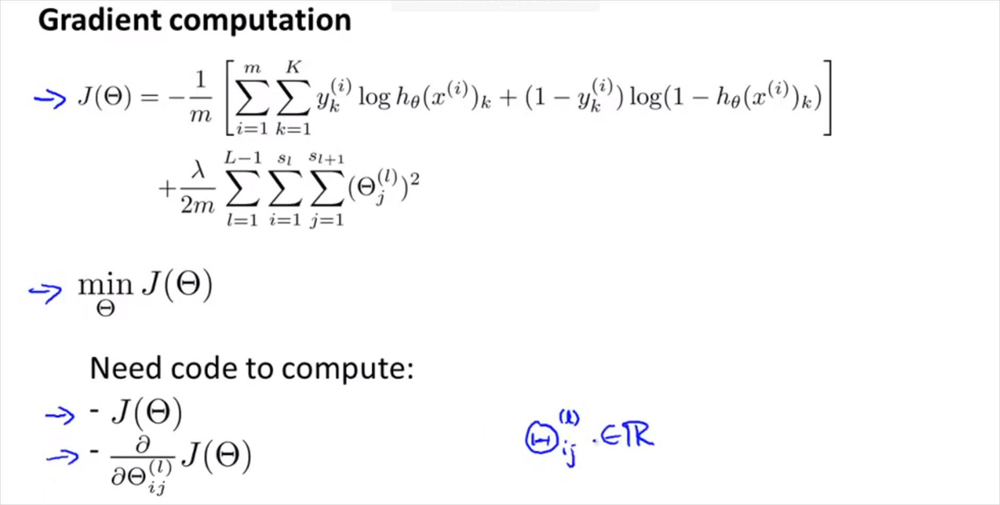
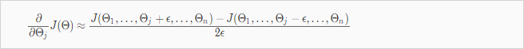

  

  
  
# 5. Neural Networks: Learning  
---  
  
  
## 5.1 Cost function  
---  
  
  
  
두종류의 classification 에대해서 알아볼것이다. 하나는 이진 분류, 나머지하나는 멀티 분류이다. 최종 분류되는 종류 Class갯수는 $$K$$로 나타낸다. 따라서 $$h_\theta(x)$$ 는 $$K$$ 차원 벡터다.   
  
중요한점: 예측 값 y 벡터는 class갯수 K의 크기를 갖는 벡터다.  $$K \times 1$$ 의 크기를 갖는다. 한 벡터는 위 그림처럼 최종 분류된 하나의 class만 1이고 나머지는 0으로 구성된다.   
  
용어 정리.  
  
$$L$$ = total number of layers in the network  
$$s_l$$ = number of units (not counting bias unit) in layer l  
$$K$$ = number of output units/classes  
  
Logistic regression의 경우, cost function은 다음과 같이 정의 했었다.    
  
  
$$  
J(\theta)   
= -\frac{1}{m}   
\sum_{i=1}^{m} \left[   
y^{(i)} \log h_\theta ( x^{(i)} )   
+ \left( 1-y^{(i)}  \right)  \log \left(  1-h_\theta ( x^{(i)}) \right)  
\right]   
+ \frac{\lambda}{2m} \sum_{j=1}^{n} \theta_{j}^{2}  
$$  
  
Neural Network에서는 다음과같이 정의한다.   
  
$$  
h_\theta(x) \in \mathbb{R}^k, \quad   
\left( h_\theta (x) \right)_i = i^{\mathrm{th}} \text{ output}  
$$  
  
윗첨자 $$i$$는 $$i$$ 번째 output을 의미한다($$i \leq m$$). $$(h_\theta(x))_i$$의 $$i$$는 $$h_\theta(x)$$ 의 $$i$$번째 element 를 의미 ($$i \leq m$$)  
$$h_\theta(x)$$ 는 $$K$$ 차원 벡터  
  
$$  
J(\theta)   
= -\frac{1}{m} \left[   
\sum_{i=1}^{m} {\color{royalblue}{\sum_{k=1}^{K}}}  y_{\color{royalblue}{k}}^{(i)}   
\log { {\left( h_\theta ( x^{(i)} ) \right)}_{\color{royalblue}{k}} }  
+ \left( 1-y_{\color{royalblue}{k}}^{(i)}  \right)   
\log \left(  1-h_\theta ( x^{(i)}) \right)_{\color{royalblue}{k}}  
\right]   
+ \frac{\lambda}{2m}   
{\color{royalblue}{\sum_{l=1}^{L-1} \sum_{i=1}^{s_L}}} \sum_{j=1}^{s_{L+1}} \color{royalblue}{(\Theta_{ji}^{(l)})^2}  
$$  
  
$${\color{royalblue}{\sum_{k=1}^{K}}}$$ : 는 class가 K 개 이므로 K개의 output을 모두 더함을 의미한다. 그래서 각 항에 아랫첨자 $$k$$가 존재한다. $$y_k$$ 는 각 가설함수에 상응하는 k번째 실제값이다.   
  
$${\color{royalblue}{\sum_{l=1}^{L} \sum_{i}^{}}} \sum_{j=1}^{n} \color{royalblue}{(\Theta_{ji}^{(l)})^2}$$ : 항은 Regularization 용이며, 모든  $$\Theta$$ 요소를 다 더한다는 의미이다.  $$\Theta$$가 각 레이어 마다 $$s_{L+1} \times (s_L + 1)$$ 크기 만큼 있기 때문이다.   
참고로 여기서 $$j$$ 는 계산될 layer 유닛 번호, $$i$$는 현재 layer 유닛 번호이다.   
  
- Initial parameter $$\Theta$$  
우리는 시작할때 완전히 랜덤값의 weight $$\Theta$$를 가지고 시작할것이다. gradient descent 가 반복될때마다. 올바른 $$Theta$$ 값이 선택될(학습될)것이다. 그런데 먼저 gradient를 계산해야한다. 그때 필요한것이 Backpropagation Algorithm 알고리즘이다.   
  
## 5.2. Backpropagation Algorithm  
---  
  
머신러닝은  cost function J()에 대한 미분을 계산해야한다. Backpropagation는 이 미분을 효율적으로 계산하는 방법이다.  늘 그랫듯이, parameter $$\theta$$를 학습하기 위해, cost function J()를 최소화해야 하는데 Backpropagation 이 그것을 위한 방법이다.   
  
Input layer에서 출발해서 output을 구하는 forward propagation과는 반대로, BP는 output layer에서 시작한다. 즉, 마지막 결과의 'error'를 먼저 구하고, 해당 error 값을 이용해 각각의 node에서의 error 를 계산한다.(https://wikidocs.net/4262)  
  
  
  
  
결국 계산해야할 값은 cost function J()와 J()의 미분도함수(gradient)이다.   
  
이전에 보았듯이 Forword propagation은 아래와 같이 계산된다.   
  
  
  
BP의 에러값 $$\delta$$는 다음의 그림을 보면 직관적이다. 최종 결과물의 오차는 단순하다. (output - expected) 이다. 이 오차는 누적된것일 것이고, 그 오차들을 이전레이어부터 추적하는것이다. 그렇게 오차를 최소화 하는 방향으로 $$\Theta$$ 를 구할 수 있을것.    
  
> (출처 : http://andrew.gibiansky.com/blog/machine-learning/machine-learning-neural-networks/)  
  
만약 $$w(6,2)$$이 매우 크다면, 매우 큰 output2 가 만들어질 것이고 이것은 매우 큰 Error2를 만든다. 이것은 BP를 할때 큰 비중이 할당될 것이다.   
  
  
어쨋든 BP를 마치면 모든 유닛에 $$\delta$$를 구했다면 cost fuction J()의 Gradient(미분도함수)가 나온다.    
  
Back propagation은 다음과 같이 계산한다.  __$$\delta$$ 는 l 레이어에 있는 node j 에 오류가 있는지를 의미한다. __  
Layer가 4개인 경우, $$\delta^{(4)}$$ 는 단순하게 a(4) 에서 label y 를 뺀값이나, 다음 $$\delta^{(3)}$$ 부터는 가중치($$\Theta$$)를 고려해서 계산된다. $$\delta^{(l)} = ((\Theta^{(l)})^{T} \delta^{(l+1)}) .* g'(z^{(l)})$$  
 $$g'(z^{(3)})$$ 은 미분도함수로  $$g'(z^{(l)}) = a^{(l)}.*(1 - a^{(l)})$$ 과 같이 계산된다.   $$\delta^{(1)}$$ 는 계산하지 않는다.'   
  
  
  
최종적으로 위의 계산을 마치면, 만약 $$\lambda = 0$$ 일때, 아래와 같은 결과가 나옴을 증명할 수 있다~~(고 한다)~~.   
  
$$  
\dfrac{\partial }{\partial \Theta_{i,j}^{(l)}}J(\Theta) = a_j^{(l)}\delta_i^{(l+1)}  
$$  
  
  
이것을 계산하는 BP 알고리즘은 아래와 같다. 이것은결국 cost function J()의 미분도함수를 계산 하는 과정이다.    
  
  
  
$$\Delta$$ 는 $$a_j^{(l)}\delta_i^{(l+1)}$$ 를 누적해서 더한것을 의미한다. (그래서 0으로 초기화해서 시작)  
순서대로 살펴보면 먼저 Forward propagation 을 하여  $$a^{(l)}$$ 계산을 마친다.   
그 뒤에 back propagation으로  각 $$\delta$$ 를 구한다.   
그리고 그 두항을 곱해서 $$\Delta$$에 누적해서 더한다. (j = 0) 이 아닐때는 regularization \lambda 항이 추가됨에 유의 j = 0일때는 bias 항이기 때문에 필요없음.   
그렇게 해서 나온 결과를 $$D_{ij}^{(l)}$$ 라고 표현할 것이다.   
$$D_{ij}^{(l)}$$ 가 결국 cost function J() 의 미분도함수가 되는것이다.    
  
$$  
D_{i,j}^{(l)} = \dfrac{\partial J(\Theta)}{\partial \Theta_{i,j}^{(l)}}  
$$  
  
BP 이해 추천 사이트:  
https://www.youtube.com/watch?v=Ilg3gGewQ5U    
http://neuralnetworksanddeeplearning.com/    
http://neuralnetworksanddeeplearning.com/chap2.html  
  
## 5.3. Backpropagation Intuition  
---  
  
Backpropagation 의 의미를 좀 더 이해해보자.   
먼저 FP의 경우 $$z_1^{(3)}$$은 아래와 같이 가중치를 곱한 형태로 계산됨을 이미 살펴보았다. BP또한 방향만 반대 일뿐 매우 유사하다. $$\delta$$ 를 방향만 반대로 계산 하는것이다.    
  
  
  
BP는 아래와 같이 반대로 계산된다. $$\delta_2^{(2)}$$는 layer 3을 향하는 가중치($$\Theta$$)를 곱해서 계산된다. $$\delta_2^{(3)}$$ 도 마찬가지다.  bias unit은 계산되지 않음에 유의  
  
  
  
  
## 5.4. Backpropagation in Practice  
---  
  
Octave에서 실제로 어떻게 사용하는지 알아보자.   
  
### 5.4.1. A. Implementation Note: Unrolling Parameters  
  
결국 NN 에서는 아래의 matrix를 이용하게 된다.  $$\theta$$는 weitght, $$D$$ 는 cost function J()의 미분 도계수를 의미한다.   
$$  
\begin{align*} \Theta^{(1)}, \Theta^{(2)}, \Theta^{(3)}, \dots \newline D^{(1)}, D^{(2)}, D^{(3)}, \dots \end{align*}  
$$  
  
  
  
fminunc() 등을 사용해 optimizing 하기 위해서 아래와 같이 각 matrix를 하나의 벡터로 합친다(unroll)  
  
```matlab  
thetaVector = [ Theta1(:); Theta2(:); Theta3(:); ]  
deltaVector = [ D1(:); D2(:); D3(:) ]  
```  
  
각 matrix는 아래와 같은 명령으로 다시 분리할 수 있다.   
  
```matlab  
Theta1 = reshape(thetaVector(1:110),10,11)  
Theta2 = reshape(thetaVector(111:220),10,11)  
Theta3 = reshape(thetaVector(221:231),1,11)  
```  
  
  
예를들어 3개의 레이어가 있고 각 unit의 갯수가 다음과 같다고 할때 아래와 같이 나타낼 수 있다.   
  
  
  
결국 이전 챕터에서 살펴 보았던 BP알고리즘을 더욱 간단히 도식화 하면 다음과 같다.   
fminunc() 의 parameter인 @costFunction이 cost J($$\Theta$$)와 그의 미분계수 $$D$$를 구하는 함수다.   
  
  
  
  
### 5.4.2. Gradient Checking  
  
BP에 문제가 없는지 확인할 수있는 방법이다. 항상 사용됨.   
  
  
  
$$\Theta$$가 하나일때 2$$\epsilon$$ 만큼 떨어진 두 지점의 기울기를 이용하면 J() 의 미분계수를 추정할 수 있을것이다. 그리고 Octave에서 다음과 같이 implement 된다.   
  
```matlab  
gradAppros = (J(theta + EPSILON) - J(theta - EPSILON)) / (2*EPSILON)  
```  
  
멀티 parameter인 경우로 보다 일반화하면 다음과 같다.   
  
  
  
그리고 Octave에서 다음과 같이 implement 된다.   
  
```matlab  
epsilon = 1e-4;  
for i = 1:n,  
  thetaPlus = theta;  
  thetaPlus(i) += epsilon;  
  thetaMinus = theta;  
  thetaMinus(i) -= epsilon;  
  gradApprox(i) = (J(thetaPlus) - J(thetaMinus))/(2*epsilon)  
end;  
```  
  
그리고 Gradient Checking으로 계산된 gradApprox(i)과 BP로 계산된 미분계수 $$D$$벡터가 같은지 확인하면 되는것이다.   
  
gradApprox(i) = DVec   
  
따라서 Gradient Checking을 사용하는 방법을 정리하면 다음과 같다.   
  
  
  
다시 Training하기 전에 Gradient Checking을 끄지 않으면 엄청 느려질 수 있음에 주의해야한다.   
Once you have verified once that your backpropagation algorithm is correct, you don`t need to compute gradApprox again. The code to compute gradApprox can be very slow.  
  
  
### 5.4.3. Random Initialization  
  
기존처럼 $$\Theta$$ 의 초기값을 0으로 정하는것은 NN에서 동작하지 않는다. 그이유는 잘 이해하지 못했음.  따라서 다음과 같이 $$\Theta$$의 초기값을 구한다. 결과적으로 $$\Theta$$ 의 범위는 $$-\epsilon$$ ~ $$\epsilon$$ 이 될 것이다.   
  
  
  
Octave로 implement 하면:  
  
```matlab  
If the dimensions of Theta1 is 10x11, Theta2 is 10x11 and Theta3 is 1x11.  
  
Theta1 = rand(10,11) * (2 * INIT_EPSILON) - INIT_EPSILON;  
Theta2 = rand(10,11) * (2 * INIT_EPSILON) - INIT_EPSILON;  
Theta3 = rand(1,11) * (2 * INIT_EPSILON) - INIT_EPSILON;  
```  
> rand(x,y) is just a function in octave that will initialize a matrix of random real numbers between 0 and 1.  
  
  
### 5.4.4. Putting it Together  
  
지금까지 NN에서 다룬 내용을 모두 종합해보자.   
  
첫번째로 적절한 Network architecture를 선택한다. 그것은 다음을 선택하는것이다.    
- Input Unit 갯수  
- Output Unit 갯수  
- layer 당 hidden unit 갯수 (많을수록 성능 향상, 연산 cost 증가)  
  
  
Training a Neural Network  
  
1. __Randomly initialize__ the weights  
2. Implement __forward propagation__ to get $$h_\Theta(x^{(i)})$$  
3. Implement the __cost function__  
4. Implement __backpropagation__ to compute partial derivatives  
4번까지 정리하면 이런 모양  
  
  
5. Use __gradient checking__ to confirm that your backpropagation works. Then disable gradient checking.  
6. Use __gradient descent__ or a __built-in optimization function__ to minimize the cost function with the weights in theta.  
  
  
  
최고점은 $$h_\theta(x)^{(i)}$$ 가 실제 값 $$y^{(i)}$$ 와 가장 차이가 큰 것이고, 최저점은  $$h_\theta(x)^{(i)}$$ 가 실제 값 $$y^{(i)}$$ 에 가장 가깝다는 뜻이다.    
gradient descent는 기울기를 하강하는 것이고, BP는 기울기를 하강할때 방향을 설정하는것과 같다.   
  
