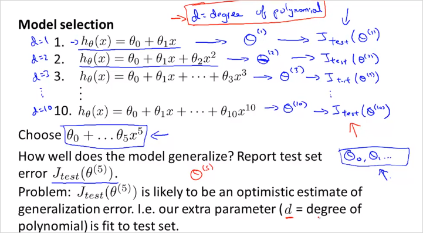
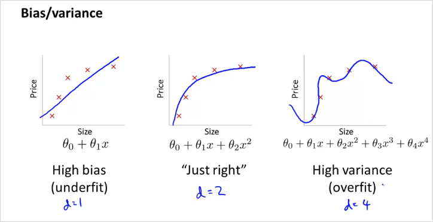
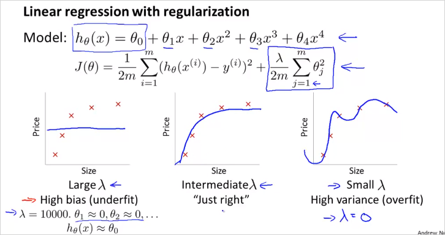
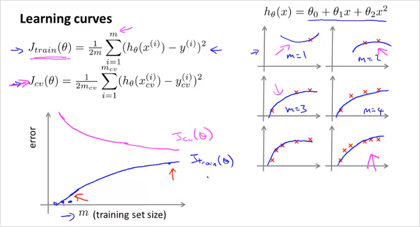

  

  
  
# 6. Advice for Applying Machine Learning  
  
  
  
만약 housing price 문제를 ML로 해결한다고 할때, 성능 개선을 위해서 위와같은 전략들을 시도해볼 수 있을것이다.   
그러나 이 방법들을 무작정 시도하기보다는 체계적으로 사용하는것이 효율적일 것이다. 6장에서는 다음 두가지로 어떻게 체계적으로 사용할수 있는지 알아본다.   
  
1. how to evaluate learning algorithm  
2. ML diagnostic  
  
## 6.1. Evaluating a Hypothesis  
---  
  
이번챕터에서는 Hypothesis 에대해서 평가하는 방법과, underfitting, overfitting을 피할 수 있는 방법에 대해서 알아본다.   
  
  
  
70%를 training example, 30% 를 test example로 나눠서 cost function을 계산해본다.   
overfitting 인경우는 training error(cost) $$J(\Theta)$$ 는 매우 낮고, test error $$J_{test}(\Theta)$$ 는 클 것이다.  
  
순서는 다음과 같다.   
- Training/ testing procedure for linear regression  
	1. Learn parameter θ from training data (min. training error $$J(\Theta)$$)  
	2. Compute test set error $$J_{test}(\Theta)$$   
  
The test set error:  
  
  
  
## 6.2. Model Selection and Train/Validation/Test Sets  
---  
  
  
  
  
training example에서 적합한 모델 d=5 를 골랐지만 이게 정말  generalize (다른문제도 정확히 예측)할 수 있는것인지 어떻게 알수 있을까?  
따라서 주어진 데이터를 단순히 training/test로만 나눌것이 아니라, d를 fit하기 위한 set역시 만들어야한다.   
  
  
이렇게 3개로 나눈다. 계산은 다음과같이 한다.   
  
  
  
방법은,   
1. 10 차원 polinormial 모델들에서 각 min $$J(\theta)$$를 통해  $$\Theta$$ 를 구한다.   
2. 해당 $$\Theta$$ 를 가지고 먼저  $$J_{CV}(\Theta)$$ 를 구해보는것이다.   
만약 그렇게 계산했더니 4차원 poli모델이 가장 낮은값이 나왔을때, $$J_{CV}(\Theta^{(4)})$$  
3. 해당 모델을 가지고 $$J_{test}(\Theta^{(4)})$$를 구해본다. 다시 말해 다른 traning set에 계산을 해보는것이다.    
  
## 6.3.Diagnosing Bias vs. Variance  
---  
> polinormial 차원수 d에 따라서  
  
learning알고리즘을 돌릴때, 원하는대로 동작하지 않는다면 거의 대부분 high Bias문제 또는 high Variance 문제이다. 다시말해 underfitting 문제, 또는 overfitting 문제라는 말이다.   
이 것을 어떻게 구분할 수 있는지 알아보자.   
  
  
  
> d 는 polinormial degree(차원)을 의미한다.   
  
  
  
training examples 내 에서 구한 train error $$J_{train}(\Theta)$$ 는 d 가 많아질수록 에러율이 낮아진다. 반면 그럴수록 다른 data set example로 구분해놓은 Cross validation Set (CV) 에서는 해당 모델로는 더욱 맞지 않게 된다. 해당 모델은 training example에서만 정확히 모사되기 때문이다(Overfit). 그래프로 표현하면 위와 같다. 따라서,  
  
Underfit(High Bias)일 경우는 Cost(or error) $$J_{train}(\Theta)$$가 값이 크고 $$J_{CV}(\Theta)$$ 또한 값이 크다. 그리고 그 둘값이 비슷하다.   
Overfit(High Variance) 인경우는 $$J_{train}(\Theta)$$이 매우 낮고,  $$J_{CV}(\Theta)$$ 값이 상대적으로 크다.   
  
  
- __High bias (underfitting)__: both $$J_{train}(\Theta)J$$ and $$J_{CV}(\Theta)J$$  will be high. Also, $$J_{CV}(\Theta) \approx J_{train}(\Theta)$$   
  
- __High variance (overfitting)__: $$J_{train}(\Theta)$$  will be low and $$J_{CV}(\Theta)$$ will be much greater than $$J_{train}(\Theta)$$  
  
  
  
  
## 6.4. Regularization and Bias/Variance  
---  
> $$\lambda$$ 크기에 따라서   
  
Linear regression 의  regularization 하는 경우에 대해서도 알아보자.   
  
  
> $$\lambda$$ 크기에 따라서 bias 가 될 수 있고, variance가 될 수 있다.   
  
그렇다면 어떻게 적절한 $$\lambda$$를 선택할 수 있을까?  
  
  
  
  
먼저 $$\lambda$$ 는 0부터 0.01 을 제곱해서 늘려가며 12번 try한다.   
그렇게  각 min $$J(\theta)$$를 통해  $$\Theta$$ 를 구한다.   
2. 해당 $$\Theta$$ 를 가지고 먼저  $$J_{CV}(\Theta)$$ 를 구해본다.   
만약 그렇게 계산했더니 5번째 $$\lambda$$ 를 사용한 regularized model이 가장 낮은값이 나왔을때, $$J_{CV}(\Theta^{(5)})$$  
3. 해당 모델을 가지고 $$J_{test}(\Theta^{(5)})$$를 구해본다.   
  
(위의 방법과 매우 유사)  
  
  
  
$$\lambda$$ 가 작으면  $$J(\theta)$$도 작아짐에 유의  
  
  
## 6.5. Learning Curves  
---  
> Training Example 수 m 에 따라서  
  
  
일반적으로 m이 적을때는 $$J_{train}(\Theta)$$ 는 training examples를 정확히 모사한다. 극단적으로 m=1,2,3일때 타원의 곡선은 3점을 지나기 때문에 cost가 0이다. 반면 이 모델로 cross validate set 데이터에 적용해봤을때는 오차가 발생한다.   
  
  
- High bias (underfit)  
  
  
우측상단 공식처럼 high bias인 hypothesis (직선,linear) 가 있을때, m이 작으면 cv set을 더 정확히 표현할 수 없다. (파란색 그래프) 그리고 m 이 더 늘어난다고 하더라도, 절대적 $$J_{CV}(\Theta)$$ 크기는 크게 떨어지지 않는다. 금방 flattened 되어버린다.  
  
$$J_{train}(\Theta)$$ 은 m이 적을때 무척 낮다가 사이즈가 커질수록 높아지는데 금방 Cross validation error 값에 수렴한다. 이유는 적은 수의 파라미터로  많은 양의 데이터를 표현하기에는 한계가 크기 때문이다.  
  
또한 흥미로운점은, 러닝 알고리즘이 high bias(underfit) 인 경우에는 더 많은 training data를 모아봤자, 별 도움이 안된다는 것이다. 왜냐하면 그래프에서 볼 수 있듯이, m 이늘어나도 $$J_{CV}(\Theta)$$는 크게 작아지지 않기 때문이다. (it`s basically fattened up)  
  
만약 __적은수의 feature갯수를 가지고 모델을 만들고 예측할 예정이라면 굳이 많은 양의 training data를 수집할 필요가 없다는 뜻이다.__ 어차피 오차율이 높기 때문에 모델이 정밀하게 예측하기 힘들기 때문에 .   
  
  
- High variance (overfit)  
  
  
Training example에서 많은 수의 feature가 있을때(높은 degree의 polinormial 피쳐등) m의 크기가 커질수록 데이터를 정확히 나타내기는 힘들지만 그래도 크게 틀리지는 않는다. (적어도 training data내에서는) 그래서 $$J_{train}(\Theta)$$는 크게 가파르지 않게 증가한다.  
  
반면, $$J_{CV}(\Theta)$$는 high bias와 마찬가지로 m이 커질수록 낮아진다. overfit인데 m이 커질수록 error값이 더 커지지 않는 이유는 cross validate set 크기도 어느정도 크기 때문에 training set과 크게 차이가 없을 것이기 때문이다.   
  
따러서, m이 작다면 이 둘이 수렴하는 값(gap)의 차이가 큰편이고 m이 커질수록 둘의 차이가 줄어든다.  따라서 __High variance인 경우, 다시말해 feature가 많아서 overfitting의 위험이 있는 모델인 경우, training example을 더 많이 모을 수록 저 정확히 예측할수 있다.__  
  
질문: feature 를 늘릴때, polinormial feature밖에 추가를 못하는지? 가령 로그함수나, 제곱근함수 등은 사용할 필요가 없나? -> 수치해석에 따르면 모든 미분가능한 함수는 다항식의 합으로 근사할 수 있다(Taylor Series)    
  
  
## 6.6. Deciding What to Do Next Revisited  
---  
  
지금까지를 정리하면 다음과 같다.   
  
  
  
그리고 마지막으로 NN에 대해서도 알아보자.   
  
  
  
적은수의 parameter와 layer수는 underfitting 이고 많은 수는 그반대.  
  
hidden unit layer갯수에 따라 어떻게 달라질까?  
  
  
Model Complexity Effects:  
- Lower-order polynomials (low model complexity) have high bias and low variance. In this case, the model fits poorly consistently.  
- Higher-order polynomials (high model complexity) fit the training data extremely well and the test data extremely poorly. These have low bias on the training data, but very high variance.  
  
- In reality, we would want to choose a model somewhere in between, that can generalize well but also fits the data reasonably well.  
  
