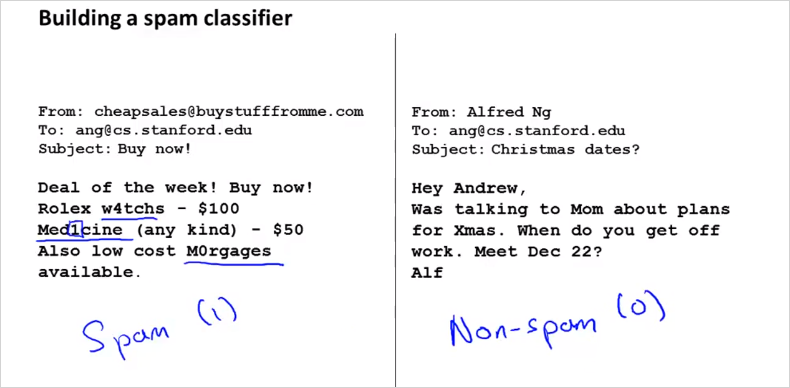

  

  
# 7. Machine Learning System Design  
  
## 7.1 Building a Spam Classifier  
---  
  
다음과 같은 이메일에서 spam 인지 아닌지 classify 하는 러닝 시스템을 만들어보자.   
  
  
  
training example을 디자인 해보자.   
feature는 스팸일 가능성이 높은 단어라고 할수 있다. 그리고 결과  y는 실제 mail이 스팸인지 아닌지 이다. 100개의 단어를 feature x로 두었을때 아래와 같이 나타내보자.   
그랬을때 실제 메일에는 deal, buy, now 가 있으니 feature 벡터 x는 아래와 같이 나타낼 수 있다. 크기는 100x1 이다.   
  
Insight: 결국 각 feature $$x_j$$ 에 가중치($$\theta_j$$)가 부여될 것이고, 학습을 하는것은 그  $$\theta$$를 구하는것과 같다. 그렇게 구해진 hypothesis 로 이메일을 예측하는것이다.   
  
  
> 실제로는 10000~50000 여개의 단어를 feature로 사용한다. (100개를 수동으로 선택하는것이 아님)  
  
에러를 줄이기 위해서는 다음과 같은 작업들을 추가로 할 수 있다.   
- 데이터 추가 수집  
- 좀 더 복잡한 feature 개발 (email header에서 추출)  
- 좀 더 복잡한 feature 개발2 (message body)  
- 스펠링 체크 알고리즘 적용  
  
  
- 추천하는 방법  
> 출처: https://wikidocs.net/4661  
  
1. 빠르게 구현할 수 있는 간단한 알고리즘으로 시작하자. 구현한 후 cross-validation data로 테스트 한다.  
2. Learning curve를 그려서 데이터를 늘리거나, feature를 늘리거나, 혹은 다른 어떤 방법이 도움이 될지 결정한다.  
3. Error analysis: 에러를 일으키는 데이터(in cross-validation set)를 수동으로 분석한다. 어떤 종류의 데이터가 일정한 경향의 에러를 발생시키는지 관찰한다.  
  
예를 들어, 500개 cross-validation data 중 100개 email이 잘못 분류되었다고 하자. 이 100가지 에러를 확인하여 다음과 같은 기준에 의해 분류한다.  
  
(i) What type of email it is (ii) What cues (features) you think would helped the algorithm classify them correctly  
  
(i) 의 경우,  
  
약팔이: 12개  
짝퉁: 4개  
피싱: 53개  
기타: 31개  
였다면, '피싱'으로 분류된 메일에 대한 성능을 높이는 방법을 찾도록 하는 것이 가장 효과적일 것이다.  
  
(ii) 의 경우,  
  
의도적인 철자법 오류: 5건  
unusual email routing: 16건  
unusual punctuation: 32건  
이었다면 unusual punctuation 을 검출하는 방법을 찾는 것이 효과적일 것이다.  
  
  
## 7.2. Handling Skewed Data  
---  
  
## 7.3. Using Large Data Sets  
---  
  
  
