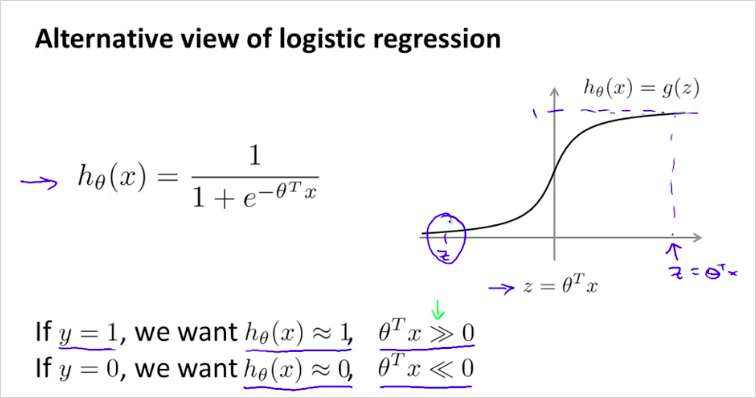
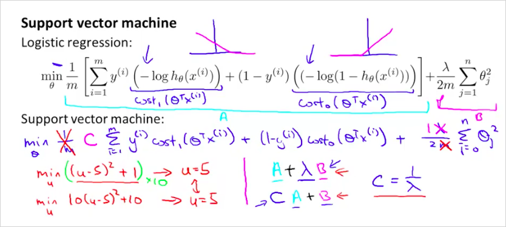
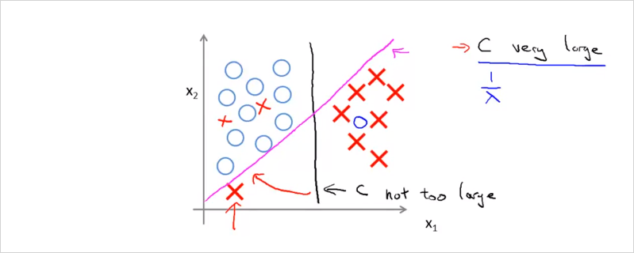
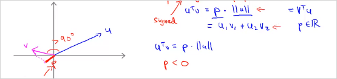
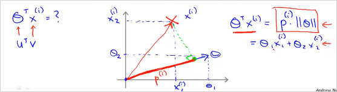
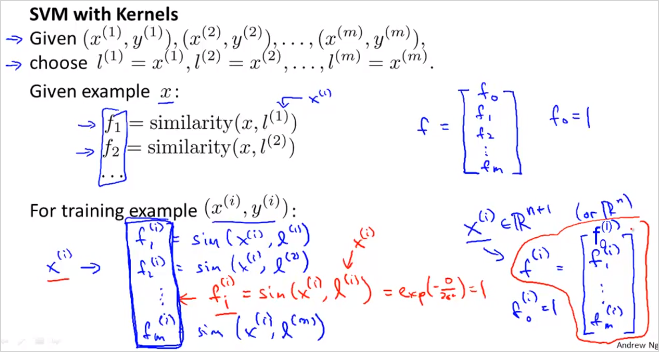
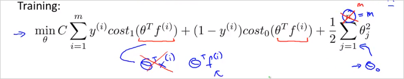

  

  
# 8. Support Vector Machines  
---  
  
지금까지 여러가지 supervised learning 에대해 살펴보았다. 마지막으로 또다른 supervised learning 인 SVM에 대해서 알아본다.   
  
Logistic regression와 NN 과 비교했을때, SVM은 복잡한 비선형 함수에 대해서  때때로 더욱 명료하고 강력한 방법이 될 수 있다.   
  
decision boundary 에 큰 gap 을 만듦으로써 더 명확히 classify  할 수 있는것 처럼 보임.  
Support vector는 desicion boundary 를 support 하는 또 다른 경계를 의미한다. 양 극단의 데이터 포인트를 나타낸 선이다.   
  
  
  
## 8.1. Optimization Objective  
---  
  
또 다른 관점의 Logistic regression  
  
  
  
  
즉, y=1 일 때 $$\theta^Tx$$를 0보다 엄청 크게 만들어주고, y=0일 때 $$\theta^Tx$$를 0보다 엄청 작게 만들어주는 θ를 찾고 싶은 것이다.  
  
  
  
  
SVM 의 cost function은 log를 사용하지 않고 piecewise-linear를 사용한다.   
$$cost_1(z)$$ 은 z가 커지면 cost 는 낮아진다. z 가 1 이하가 되면 cost가 커진다.   
$$cost_2(z)$$ 은 그 반대.  
  
  
  
cost function은  
SVM 에서는 $$A + \lambda B$$ 의 형태가 아니라, $$CA + B$$ 의 형태를 갖는다.   
새롭게 정의한 $$cost_1(z)$$ $$cost_2(z)$$ 를 대입하면 다음과 같다.   
  
  
  
  
특징은, $$1 \over m$$ 을 사용하지 않는다. $$\lambda$$ 대신 $$C = {1 \over \lambda}$$ 를 사용한다.   
Regularization 이 뒷항이 아니라 앞 항에 있음 주의  
  
Hypothesis 는 다음과 같다. logistic regression 처럼 0~1 사이의 확률값이 아니라, 0 아니면 1의 값을 갖는다.  
  
  
  
  
  
  
## 8.2. Large margin classification  
---  
  
  
  
  
z가 1보다 클 때만 $$cost_1(z)$$가 0이 된다. (LR에서는 0이 기준이었음)  
z가 -1보다 작을 때만 $$cost_2(z)$$가 0이 된다.  
  
만약 C를 매우 큰 값을 둔다면 어떻게 될까?  
min cost를 찾을때 첫번째 항이 거의 0이 될 것이다.   
이렇게 하면 margin이 최대가 되는 decision boundary를 찾을 수 있다.   
  
  
위처럼 보라색, 초록색 으로 경계를 나눌수도 있다. 하지만 검은 선이 최적의 경계선이 될 것이다. suport vector와 decision boundary의 차이인 margin이 최대가 되는 decision boundary가 최적의 경계가 되는것이다.   
  
  
  
만약 `X`하나가 좌측 하단에 있을때,   
C가 엄청 크면 보라색의 boundary를 갖게 될 것이고, C가 크기 않으면 검은색의 boundary를 갖게 될 것이다.   
  
  
  
그리고 데이터들이 linear하게 구분할수 없는경우도 마찬가지다. C가 크지 않으면 자잘한 데이터들은 무시된다.   
C가 크면 C가 충분히 크기 때문에 조금 다른 위치에있는 데이터에 대해서도 경계조건을 최대화하는 svm의 원리에 따라 민감하게 반응하여 최대가 되는 위치로 decision boundary가 구해진다.   
따라서 C의 크기에 따라서 trade-off 관계가 발생한다.   
  
## 8.3. Mathematics Behind Large Margin Classification  
---  
  
위의 내용이 수학적으로 어떻게 이루어지는지 살펴보자.   
  
- Vector inner product (내적)  
  
  
  
p 는 벡터 v를 벡터 u에 투영한 길이이다. $$||u||$$ 는 벡터 u의 길이이다.   
아래 두 곱은 서로 동일한 결과를 갖는다. 그리고 결과도 모두 real number이다.   
아래와 같은경우는 p가 음수가 될 수도 있다.   
  
  
  
$$  
\begin{matrix}  
u^Tv &=& p \cdot ||u|| \\  
     &=& u_1v_1 + u_2v_2   
\end{matrix}  
$$  
  
  
min cost function의 두번째 항은 다음과 같이 나타낼 수 있다. $$\theta$$의 norm의 제곱, 즉 벡터 길이의 제곱이다. $$||\theta||^2$$ ($$\theta_0$$ 은 0이라고 가정한다. )  
  
  
  
그렇다면 $$\theta^Tx^{(i)}$$ 는 어떻게 나타낼까? 다음과 같다. 즉 $$p^{(i)} \cdot ||\theta||$$ 가 1보다 커야 y=1이다.   
  
  
  
C 가 크면 결국 min cost는 아래와 같다.   
  
$$  
\underset{\theta} {min} {1 \over 2} \sum_{j=1}^n \theta_j^2 = {1 \over 2} ||\theta||^2  
$$  
  
좌측의 예를 보자.  
  
Decision boundary가 초록색이라고 할때 $$\theta$$ vector는 파란색 수직으로 나타난다.  
또한 $$\theta_0$$ 가 0인것의 의미는  $$\theta$$벡터의 origin이 (0,0)이라는 뜻이다. 0이 아니면 원점을 지나지 않고 다른 위치를 지나게 된다.   
  
  
  
그렇다면 다음을 보자.   
$$x^{(1)}$$ 과  $$x^{(2)}$$ 이 각각 아래의 데이터를 나타낸다.   
decision boundary가 초록색일때 $$\theta$$벡터에 투영(projection)시킨 $$p^{(1)}$$과 $$p^{(2)}$$(음수값)를 구하면 매우 작다. $$p^{(1)} \cdot ||\theta|| \geq 1$$ 를 만족하려면 $$||\theta||$$가 매우 커야한다. 반대도 마찬가지.  
  
  
  
반면, 다음의 우측의 예를 보면 p가 더 크다. 따라서 $$||\theta||$$가 더 작다.   
모든 data의 p를 계산했을때 가장 큰값을 선택하면, SVM hypothesis의  margin이 더 커지는 것이다!  
  
  
  
  
질문: $$\theta$$ 벡터가 왜 decision boundary에 직교(orthogonal) 하는가?  
그래서  $$\theta$$ 는 어떻게 계산된다는것?  
  
  
## 8.4. Kernel  
---  
  
이번엔 non-linear한 decision boundary의 SVM 에 대해 알아보자.   
  
  
각 polinormial feature들을 $$f_i$$ 라고 표기한다.   
이 $$f_i$$ 를 어떻게구하면, non-linear한 decision boundary 를 구할 수 있을까?  
  
  
  
만약 임의의 landmark 세개를 선택했을때 ($$l^{(1)}, l^{(2)}, l^{(3)}$$ ) x로 주어진 데이터를 예측한다고하면,  f는 위와 같이 계산할 수 있다. __feature f는 원래 feature가 각 landmark에 얼마나 가까운가를 나타내는것으로 정의한다.__   similarity function이 바로 Kernel이다. 구체적으로 여기서는 가우시안 커널을 사용했다(Gaussian kernels)  
  
이게 무슨 의미인지 살펴보자.   
  
  
  
만약 x가 landmark $$l^{(1)}$$ 과 거의 가까울때, $$f_1$$ 을 계산하면 1에 가깝다.   
반면 x가 landmark $$l^{(1)}$$ 과 매우 멀때, $$f_1$$ 을 계산하면 0에 가깝다.   
  
그리고 임의의 landmark $$l^{(1)}, l^{(2)}, l^{(3)}$$ 세개는 새로운 new feature x가 될 수 있다.   
  
$$l^{(1)}$$ 이 (3,5) 이고 $$\sigma^2 = 1$$ 일때, 이것을 그래프로 그려보면 다음과 같다.   
x가 (3,5) 일때 는 $$f_1$$ 이 1이고 멀리떨어질수록 $$f_1$$은 0에 가깝다.    
  
  
  
$$\sigma^2$$ 는 가우시안 kernel의 parameter이다. 이 값에 따라 f가 어떻게 변화하는지 보자.  
$$\sigma^2$$가 작을수록 더 빠르게 0에 가까워질수있다.   
  
  
  
다음의 예를 한번보자. 만약 training example의 x 하나(보라색)를 선택했을때 $$\theta$$ 는 다음과 같이 주어지고 f를 계산햇을때 다음과 같다면, 해당 hypothesis를 계산하면 0.5 이므로 0보다 크다. 따라서 예측하고자 하는 위치 x는 $$y=1$$ 로 예측할 수 있다.   
  
  
  
그리고 하늘색 x를 선택해 계산해보면 y=0으로 예측할 수 있다.   
  
  
  
결국 decision boundary는 $$l^{(1)}$$ $$l^{(2)}$$ 에 가까울때 $$y=1$$ 로 예측가능하고 위의 빨간 선과같다.  
  
## 8.5. Choosing the Landmarks  
---  
  
그렇다면 무슨 기준으로 어떻게 landmark를 선택할수 있을까?   
한가지 방법은 모든 training set들을 landmark로 선택해보는것이다. (m개)  
  
  
  
  
데이터 x가 주어졌을때(여기서 x는 trainig set 또는 CV 또는 test set이 될수 있다)  trainig set과 완벽히 동일하게 선택한 landmark l을 이용해 모든 f 를 계산해본다. 그렇게 f 벡터를 구하면 이것을 x벡터대신 새로운 feature벡터로 사용한다.   
  
  
  
즉 주어진 $$x$$에 대해  $$\theta^T f$$를 계산 했을때,  $$\geq 0$$ 이면, $$y =1$$ 로 예측할 수 있는것이다.   
  
  
그렇다면  $$\theta$$는 어떻게 구하나?  
다음의 cost function gradient를 이용해 구한다. 기존의 x대신 f 를 사용했음에 유의한다.    
  
  
  
  
Overfitting vs underffiting  
  
  
  
C를 늘리면($$\lambda$$줄이면) underfit 해결  
$$\sigma^2$$를 늘리면, overfit 해결  
  
  
## 8.6. SVMs in Practice  
---  
  
$$\theta$$를 구하기 위해서, 직접 구현 하지말고 잘 구현되어있는 S/W package를 사용해라. 다음의 유명한 라이브러리가 있음.  
  
- __liblinear__  
- __libsvm__  
  
이들을 사용하기 위해서는 먼저 parameter C를 선택해야하고, 어떤 Kernel(simularity function)을 사용할것인지 선택해야한다.   
No kernel은 linear kernel을 의미한다. predict $$y=1$$, if  $$\theta^Tx \geq 0 $$.  
가령, 만약 feature 갯수 n 이 크고, training examples 갯수 m이 작다면 linear kernel을 사용하는게 낫다.   
  
만약 Gaussian Kernel을 선택했다면, bias-variance trade-off 관계를 잘 고려해서, $$\sigma^2$$ 도 선택해야한다.   
  
Octave/matlab 에는 다음과같은 라이브러리를 사용하면 된다.   
x1에 $$x^{(i)}$$ , x2에 landmark $$l^{(i)}$$ 을 전달하면 된다. 때때로 kernel function을 선택해야할 필요도 있음. 그러면 내부적으로 f feature를 계산 해준다.   
그리고 사전에 feature scailing 도 필요하다.   
  
  
  
Linear kernel, Gaussian Kernel 말고도 여러가지 Kernel이 있다.   
  
  
  
이번에는 SVM으로 Multi-class classification을 해보자. 마찬가지로 라이브러리가 잘 나와있다.    
이전에 배웠던 one vs all 방법처럼 y = i 부터 K번째 까지 반복하며 SVM을 진행하여 여러가지 데이터를 구분할 수 있다.  
  
  
  
  
`중요` 그렇다면 언제 Logistic regression을 사용하고, 언제 SVM 을 사용하면 될까??  
  
- feature가 많고, training example이 적다면 (n = 10000, m = 10 ~ 1000)  
-> logistic regression또는 kernel없는 SVM을 사용하는게 유리하다.   
  
- feature가 적고, training example이 중간정도라면 (n = 1~1000, m = 10 ~ 10000)  
-> SVM with Gaussian kernel을 사용하는게 좋다.   
  
- feature가 적고, training example이 많다면 (n = 1~1000, m = 50000+)  
-> 먼저 feature를 더 만들고,    
-> logistic regression또는 kernel없는 SVM을 사용하는게 유리하다.   
  
- NN은 위의 모든 경우에 잘 동작할것이다. 그러나 train이 더 느릴 수 있다.   
  
  
