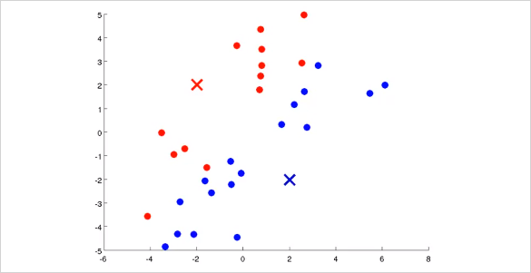
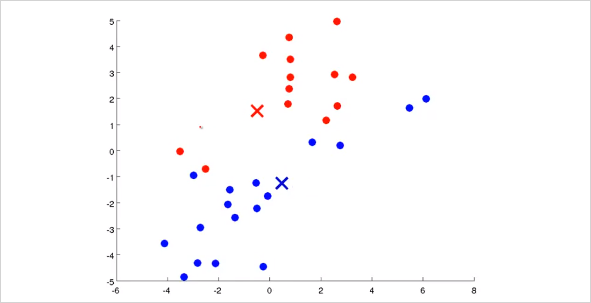
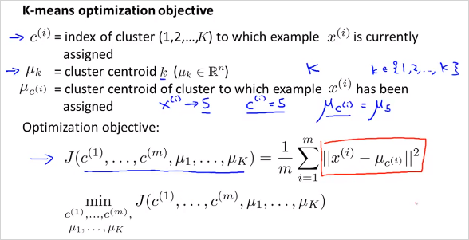
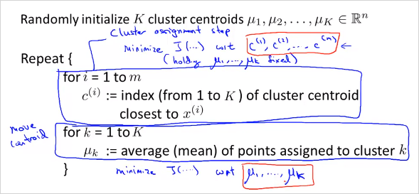

  

  
  
# 9. Unsupervised Learning, Dimensionality Reduction  
---  
  
<!-- toc -->  

  
이번 챕터에서는  Unsupervised Learning 에 대해 알아본다. Unsupervised Learning 은 무엇인가? 다음을 보자.  먼저 Supervised Learning은 다음과 같이 training sets에 input과 그에 상응하는 label y 이 존재한다.이 label은 정답을 의미한다. 따라서 plot할때 이미 명확히 구분이 된다.   
  
  
  
반면 Unsupervised Learning 은 training sets 에 label y가 없다. 따라서 주어진 input x들에서 label y 를 발견하는것이 Unsupervised Learning 의 목적이다. 그렇게 label을 발견하는것을 clustering algorithm 이라고 한다.   
  
  
  
## 9.1 K-Means Algorithm  
---  
  
그러면 이렇게 clustering 하는 algorithm 중 하나인 K-Means Algorithm 에 대해 알아보자.   동작 원리는 다음과 같다.   먼저 다음과 같이 주어진 training data가 있다.   
  
  
  
거기에 random하게 두 점을 찍는다. 그것을 Cluster Centroid 라고 부르며, 우리는 이것을 Iteration을 통해 최종적으로 각 그룹 점들의 중간에 위치시킬 것이다.   
  
  
  
먼저 모든 training set은 두개의 Cluster Centroid 중 어디에 더 가까운지 나타낼 수 있다. 그렇게 초기 label을 정할 수 있다. 이 예제에서는 색으로 표기함.  
  
  
  
그 뒤 각 cluster에 해당하는 모든 점들의 평균(Mean)을 구해본다. 그러면 다음과 같이 위치가 약간 바뀌게 될 것이다.   
  
  
  
그리고 다시 각 training set들이 새롭게 바뀐  Cluster Centroid 중 어디에 더 가까운지 label을 정하면 다음과 같이 바뀔것이다.   
  
  
  
이제 위의 과정을 다시 반복하면 Cluster Centroid 는 다음과 같이 또 바뀔것이고  
  
  
  
결국 Cluster Centroid 가 바뀌지 않는 위치로 수렴하게 된다. 이렇게 clustering이 완료된다. 모든 training sets들이 각각 label 을 갖게 되었다.   
  
  
  
K-Mean 알고리즘의 Input형태는 다음과 같다.   $$K$$와 training set $$x^{(i)}$$ 이다.   K 를 우리가 직접 선정해야한다.(~~이것이 K-mean 알고리즘의 최대 단점이기도 하다~~)  
  
  
  
  
위에서 살펴본 K-Mean 알고리즘은 다음과 같다.   
  
  
  
0. K가 두개라고 가정했을때, 먼저 초기 cluster centroid $$\mu_1$$ $$\mu_1$$ 를 정하고 이것을 반복해서 업데이트 할것이다.   
1. 첫번째 반복문(m회)은 __Cluster Assignment Step__ 이다.   
모든 training set마다 $$c^{(i)}$$ 라는 인덱스를 갖는데 일종의 label이다.  각 $$i$$번째 training set $$x^{(i)}$$ 가 어떤 cluster centroid 에 가까운지 표기하는 것이다.  가령 K가 두개일때는 $$c^{(i)}$$가 1 또는 2(3또는5 whatever)가 된다.  이것을 대략적으로 다음과같이 계산한다. $$c^{(i)} = k , min_k||x^{(i)} - \mu_k||^2$$ 거리가 가장 작은 값의 인덱스이다.   
  
2. 두번째 반복문(K회)은 __Move Centroid Step__이다.   
$$\mu_k$$ 를 새롭게 계산하는것이다. 만약 $$x^{(1)}, x^{(5)}, x^{(6)} ,x^{(10)} $$의 $$c^{(i)}$$가 모두 2로 cluster되었다고 할때 $$\mu_2$$ 를 업데이트하려면 다음과 같이 하면 된다.   
$$  
\mu_2 = {1 \over 4} [x^{(1)} + x^{(5)} + x^{(6)} + x^{(10)}] , \in \mathbb{R}^{n}  
$$  
  
  
  
  
K-mean 알고리즘은 명확히 분류하기 어려운 training data도 분류해줄 수 있다. 오른쪽의 경우가 그러한 예인데 옷 사이즈에 대한 분류이다.   
  
## 9.2. Optimization Objective  
---  
  
다른알고리즘과 마찬가지로 K-mean 알고리즘도 최적화 할 수 있다.   
  
  
  
대문자 K는 분류하는 갯수 전체이고 소문자k는 각 class를 의미한다.   $$\mu_{c^{(i)}}$$는 Interation step별로 $$c^{(i)}$$로 할당된 $$x^{(i)}$$ 들의 cluster centroid를 의미한다.   결국 K-mean 알고리즘의 목적도 Cost를 최소화하는 $$c^{(i)}$$, $$\mu_i$$를 찾는것이다.   위의 cost function은 _Distortion function_ 이라고도 불린다.   
  
  
  
  
알고리즘에서 첫번째 반복문인 Cluster assignment step에서는 하는일의 수학적 의미는 무엇인가?     Centoid $$\mu^k$$ 가 고정된 상태에서 변수 ($$c^1, c^2 .., c^m$$) 를 이용해 cost $$J()$$ 를 최소화 하는것과 같다.    마찬가지로 두번째 Move centroid step 에서는 Centoid $$c^i$$ 가 고정된 상태에서 변수 ($$\mu_1, \mu_2 .., \mu^k$$) 를 이용해 cost $$J()$$ 를 최소화 하는것과 같다.    
  
## 9.3. Random Initialization  
---  
  
초기 Cluster centroid를 더 잘 선택할 수 있는 방법을 알아보자.   다음 그림처럼 K=2일때 trainig example에서 random하게 두개를 선택한다면,  초기에 어떤 Cluster centroid 를 선택하느냐에 따라서 최종 solution이 다를 수 있다.   
  
  
> (질문) 그런데 두 데이터셋 모두 결국 잘 clustering 될것같이 보임.  
  
다음 그림처럼 맨위와같이 clustering되면 좋겟지만, 때에따라서 아래 두가지 모양처럼 clustering될 수도 있다. (local optima에 빠짐)  
  
  
  
해결 방법은 여러 가짓수의 Cluster centroid 모두 선택해서 확인해보는것이다! 그렇게 distortion function J()를 모두 계산해본뒤에 가장 작은 cost를 갖는 Cluster centroid 를 선택하면 된다!  그것을 Random initialization 방법이라고 부르고 그 알고리즘은 다음과 같다.     
  
  
  
참고로 이방법은 K가 적을때 (2~10) 더 효과가 크다.   
  
  
## 9.4. Choosing the Number of Clusters  
---  
  
위에서도 언급했지만 cluster 갯수 K를 수동으로 정해야한다는 문제가 있다. 그래서 주어진 데이터 집합에서 구하고자 하는 클러스터의 숫자를 설정할 때 여러가지 방법론들이 존재한다.   
  
- Rule of thumb  
가장 간단한 방법은 다음과 같이 정할 수 있다. (데이터 수 m)  
출처: [wikipedia: K-평균_알고리즘](https://ko.wikipedia.org/wiki/K-%ED%8F%89%EA%B7%A0_%EC%95%8C%EA%B3%A0%EB%A6%AC%EC%A6%98)  
  
$$  
{\displaystyle k\approx {\sqrt {m/2}}}  
$$  
  
  
- Elbow Method  
클러스터의 수를 순차적으로 늘려가면서 결과를 모니터링 한다. 만약 하나의 클러스터를 추가했을 때 이전보다 훨씬 더 나은 결과를 나타내지 않는다면, 이전의 클러스터의 수를 구하고자 하는 클러스터의 수로 설정한다.  
  
  
  
  
> K갯수에 따라 cost J()를 계산해봤을때 왼쪽 그래프 처럼 꺾이는 부분이 있다면 올바른 K 갯수가 될 수있다. (마치 사람 팔의 elbow 모양) 그러나 만약 우측과 같다면 K를 선택하기 모호하다.   
  
- K-means for a Later Purpose  
분류하는 목적에따라 인간의 직관으로 선택하는것이다.   
  
  
  
  
# 10. Dimensionality Reduction  
  
Dimensionality Reduction은 Unsupervised Learning의 두번째 type 이다. 말그대로 차원을 줄이는방법.   이것으로 Data를 절약할 수 있고, 쉽게 visualizing하여 데이터를 좀 더 직관적으로 이해할 수 있게 해준다. (4 차원이상의 feature는 visulizing 하기 어렵다.)  
  
  
  
  
엄청 많은feature가 있다고 했을때, 연관성이 무척 높은 feature 두개를 하나로 reduce 할 수 있다. 위 예에서는 하나는 cm단위의 길이이고 하나는 inch 단위의 길이이다. 둘다 길이에 대한 feature이기 때문에 연관성이 무척 높다.   이것을 feature 2개인 2demension 에서 1차원으로 차원을 줄여서 합칠 수 있는것이다.    
  
  
  
$$x_1, x_2$$ 가 아니라 new feature $$z_1$$ 을 만든다.   2차원에서 1차원으로 줄이는것 뿐만아니라 더 고차원에서도 가능하다. 3차원에서 2차원으로 줄이는 것은 다음과 같다.   
  
  
  
feature 3개의 공간 상에 있는 점들을 new feature $$z_1, z_2$$ 평면 상으로 projection시킨다.   다음과 같이 많은 feature가 있다고 하자. 어떻게 visualizing 할 수 있나?   
  
  
  
위처럼 50 차원의 feature 벡터 $$x^i$$ 를 사용하는것이 아니라, 다음과 같이 2차원의 $$z^i$$ 벡터를 새로 만든다. 50D -> 2D  50가지의 feature를 두가지로 줄이면 다음과 같은 feature를 생각해볼수 있다.   $$z_1$$ 은 나라의 지표에대한 전체적인 크기를 나타낸다.   $$z_2$$ 는 인구 하나당 크기를 나타낸다.   
  
이를 그려보면,  
  
  
  
