<script type="text/x-mathjax-config">
	MathJax.Hub.Config({tex2jax: {inlineMath: [['$','$'], ['\\(','\\)']]}});
</script>
<script type="text/javascript" src="https://cdn.mathjax.org/mathjax/latest/MathJax.js?config=TeX-MML-AM_CHTML">
</script> 
    
# Machine Learning course 정리 by Andrew Ng      
---
> 작성: 김지훈 (jihuun.k@gmail.com)
    
이 문서는 Andrew Ng 교수의 Coursera class 인 Machine Learning 강의 에서 배운 내용을 정리한 문서이다.  
강의 링크: [https://www.coursera.org/learn/machine-learning](https://www.coursera.org/learn/machine-learning)  
  
  

## Table Of Contents  
---


- [Machine Learning course 정리 by Andrew Ng](#machine-learning-course----by-andrew-ng)
- [1. Introduction](#1-introduction)
  * [1.1. Introduction](#11-introduction)
    + [1.1.1. 응용분야](#111-----)
    + [1.1.2. ML 두가지 정의](#112-ml-------)
    + [1.1.3. ML 알고리즘 종류](#113-ml--------)
    + [1.1.4. Supervised Learning (지도 학습)](#114-supervised-learning--------)
    + [1.1.5. Unsupervised Learning (비지도 학습)](#115-unsupervised-learning---------)
    + [1.1.6. 참고: Reinforcement Learning](#116-----reinforcement-learning)
  * [1.2. Linear Regression with One Variable](#12-linear-regression-with-one-variable)
    + [1.2.1. Model and Cost Function](#121-model-and-cost-function)
    + [1.2.2 Linear Regression](#122-linear-regression)
    + [1.2.3. Model Representation](#123-model-representation)
    + [1.2.4. Cost Function (비용함수)](#124-cost-function-------)
    + [1.2.5. Simplified Cost function of Linear Regression](#125-simplified-cost-function-of-linear-regression)
    + [1.2.6. Cost function of Linear Regression](#126-cost-function-of-linear-regression)
    + [1.2.7. Parameter Learning (Gradient Descent)](#127-parameter-learning--gradient-descent-)
    + [1.2.8. Gradient Descent 알고리즘 수학적 정의](#128-gradient-descent------------)
    + [1.2.9. Learning rate와 미분계수](#129-learning-rate------)
    + [1.2.10. Gradient Descent for Linear Regression](#1210-gradient-descent-for-linear-regression)
  * [1.3. Linear Algebra Review](#13-linear-algebra-review)
    + [1.3.1 Vector](#131-vector)
    + [1.3.2 Matrix addition and substriction and 스칼라곱](#132-matrix-addition-and-substriction-and-----)
    + [1.3.3. Matrix * Vector Multiplication](#133-matrix---vector-multiplication)
    + [1.3.4. Matrix * Matrix Multiplication](#134-matrix---matrix-multiplication)
    + [1.3.5. Matrix Multiplication Properties](#135-matrix-multiplication-properties)
    + [1.3.6. Inverse and Transpose](#136-inverse-and-transpose)
- [2. Linear Regression with Multiple Variables](#2-linear-regression-with-multiple-variables)
  * [2.1. Multivariate Linear Regression](#21-multivariate-linear-regression)
    + [2.1.1. Multiple Features](#211-multiple-features)
    + [2.1.2. Gradient Descent for Multiple Variables](#212-gradient-descent-for-multiple-variables)
    + [2.1.3. Gradient Descent in Practice I - Feature Scaling](#213-gradient-descent-in-practice-i---feature-scaling)
    + [2.1.4. Gradient Descent in Practice II - Learning Rate](#214-gradient-descent-in-practice-ii---learning-rate)
    + [2.1.5. Features and Polynomial Regression](#215-features-and-polynomial-regression)
  * [2.2. Computing Parameters Analytically](#22-computing-parameters-analytically)
    + [2.2.1. Normal Equation](#221-normal-equation)
    + [2.2.2. Normal Equation Noninvertibility](#222-normal-equation-noninvertibility)
- [3. Logistic Regression, Regularization](#3-logistic-regression--regularization)
  * [3.1. Classfication](#31-classfication)
  * [3.2. Logistic Regression](#32-logistic-regression)
  * [3.3. Decision Boundary](#33-decision-boundary)
  * [3.4. Non-linear Decision Boundary](#34-non-linear-decision-boundary)
  * [3.5. Cost function](#35-cost-function)
  * [3.6. Simplified Cost Function and Gradient Descent](#36-simplified-cost-function-and-gradient-descent)
  * [3.7. Advanced Optimization](#37-advanced-optimization)
  * [3.8. Multi-Class Classification](#38-multi-class-classification)
  * [3.9. Overfitting problem](#39-overfitting-problem)
    + [3.9.1. Overfitting 이란?](#391-overfitting----)
    + [3.9.2. Cost function](#392-cost-function)
    + [3.9.3. Regularized Linear Regression](#393-regularized-linear-regression)
    + [3.9.4. Regularized Logistic Regression](#394-regularized-logistic-regression)
  * [ex2-1: Logistic Regression](#ex2-1--logistic-regression)
    + [0. ex2.m](#0-ex2m)
    + [1. plotData.m](#1-plotdatam)
    + [2. sigmoid.m](#2-sigmoidm)
    + [3. costFuncion.m](#3-costfuncionm)
    + [4. predict.m](#4-predictm)
  * [ex2-2: Regularized Logistic Regression](#ex2-2--regularized-logistic-regression)
    + [1. mapFeature.m](#1-mapfeaturem)
    + [1. costFunctionReg.m](#1-costfunctionregm)
- [4. Neural Networks](#4-neural-networks)
  * [4.1. 배경](#41---)
  * [4.2. 지난 내용 remind](#42-------remind)
  * [4.3. Neuron model: Logistic Unit](#43-neuron-model--logistic-unit)
  * [4.4. Neural Network](#44-neural-network)
  * [4.5. Forward propagation: Vectored Implementation](#45-forward-propagation--vectored-implementation)
  * [4.6. Neural Network Learning its Own Features](#46-neural-network-learning-its-own-features)
  * [4.7. Examples](#47-examples)
    + [OR function](#or-function)
    + [The others](#the-others)
    + [Multiclass Classification](#multiclass-classification)
  * [ex3-1 Multi-class classification](#ex3-1-multi-class-classification)
    + [lrCostFunction.m](#lrcostfunctionm)
    + [oneVsAll.m](#onevsallm)
    + [predictOneVsAll.m](#predictonevsallm)
  * [ex3-2 Neural Networks](#ex3-2-neural-networks)
    + [predict.m](#predictm)
- [5. Neural Networks: Learning](#5-neural-networks--learning)
  * [5.1 Cost function](#51-cost-function)
  * [5.2. Backpropagation Algorithm](#52-backpropagation-algorithm)
  * [5.3. Backpropagation Intuition](#53-backpropagation-intuition)
  * [5.4. Backpropagation in Practice](#54-backpropagation-in-practice)
    + [5.4.1. A. Implementation Note: Unrolling Parameters](#541-a-implementation-note--unrolling-parameters)
    + [5.4.2. Gradient Checking](#542-gradient-checking)
    + [5.4.3. Random Initialization](#543-random-initialization)
    + [5.4.4. Putting it Together](#544-putting-it-together)
  * [ex4-1 : neural networks](#ex4-1---neural-networks)
    + [1. feedforward and cost function (without regularization)](#1-feedforward-and-cost-function--without-regularization-)
    + [2. regularized cost function](#2-regularized-cost-function)
  * [ex4-2 Backpropagation](#ex4-2-backpropagation)
    + [1. sigmoid gradient](#1-sigmoid-gradient)
    + [2. Random initialization](#2-random-initialization)
    + [3. Backpropagation](#3-backpropagation)
    + [4. Regularizaed Neural networks](#4-regularizaed-neural-networks)
  * [ex4.m](#ex4m)
- [6. Advice for Applying Machine Learning](#6-advice-for-applying-machine-learning)
  * [6.1. Evaluating a Hypothesis](#61-evaluating-a-hypothesis)
  * [6.2. Model Selection and Train/Validation/Test Sets](#62-model-selection-and-train-validation-test-sets)
  * [6.3.Diagnosing Bias vs. Variance](#63diagnosing-bias-vs-variance)
  * [6.4. Regularization and Bias/Variance](#64-regularization-and-bias-variance)
  * [6.5. Learning Curves](#65-learning-curves)
  * [6.6. Deciding What to Do Next Revisited](#66-deciding-what-to-do-next-revisited)
  * [ex5](#ex5)
    + [Part 2: Regularized Linear Regression Cost](#part-2--regularized-linear-regression-cost)
    + [Part 3: Regularized Linear Regression Gradient](#part-3--regularized-linear-regression-gradient)
    + [Part 4: Train Linear Regression](#part-4--train-linear-regression)
    + [Part 5: Learning Curve for Linear Regression](#part-5--learning-curve-for-linear-regression)
    + [Part 6: Feature Mapping for Polynomial Regression](#part-6--feature-mapping-for-polynomial-regression)
    + [Part 7: Learning Curve for Polynomial Regression](#part-7--learning-curve-for-polynomial-regression)
    + [Part 8: Validation for Selecting Lambda](#part-8--validation-for-selecting-lambda)
- [7. Machine Learning System Design](#7-machine-learning-system-design)
  * [7.1 Building a Spam Classifier](#71-building-a-spam-classifier)
  * [7.2. Handling Skewed Data](#72-handling-skewed-data)
  * [7.3. Using Large Data Sets](#73-using-large-data-sets)
- [8. Support Vector Machines](#8-support-vector-machines)
  * [8.1. Optimization Objective](#81-optimization-objective)
  * [8.2. Large margin classification](#82-large-margin-classification)
  * [8.3. Mathematics Behind Large Margin Classification](#83-mathematics-behind-large-margin-classification)
  * [8.4. Kernel](#84-kernel)
  * [8.5. Choosing the Landmarks](#85-choosing-the-landmarks)
  * [8.6. SVMs in Practice](#86-svms-in-practice)
  * [ex6-1. support vector machines](#ex6-1-support-vector-machines)
    + [1. Try different value of C](#1-try-different-value-of-c)
    + [2. Gaussian Kernel](#2-gaussian-kernel)
    + [3. Gaussian Kernel for non-linear](#3-gaussian-kernel-for-non-linear)
    + [4. Find best C and Sigma](#4-find-best-c-and-sigma)
  * [ex6-2 Spam classification](#ex6-2-spam-classification)
    + [Part 1: Email Preprocessing](#part-1--email-preprocessing)
    + [Part 2: Feature Extraction](#part-2--feature-extraction)
    + [Part 3: Train Linear SVM for Spam Classification](#part-3--train-linear-svm-for-spam-classification)
    + [Part 4: Test Spam Classification](#part-4--test-spam-classification)
    + [Part 5: Top Predictors of Spam](#part-5--top-predictors-of-spam)
    + [Part 6: Try Your Own Emails](#part-6--try-your-own-emails)
- [9. Unsupervised Learning, Dimensionality Reduction](#9-unsupervised-learning--dimensionality-reduction)
  * [9.1 K-Means Algorithm](#91-k-means-algorithm)
  * [9.2. Optimization Objective](#92-optimization-objective)
  * [9.3. Random Initialization](#93-random-initialization)
  * [9.4. Choosing the Number of Clusters](#94-choosing-the-number-of-clusters)
- [10. Dimensionality Reduction](#10-dimensionality-reduction)
  * [10.1. PCA (Principal Component Analysis)](#101-pca--principal-component-analysis-)
  * [10.2. PCA, Data pre-processing](#102-pca--data-pre-processing)
  * [10.3. PCA algorithm](#103-pca-algorithm)
  * [10.4. Reconstruction from Compressed Representation](#104-reconstruction-from-compressed-representation)
  * [10.5. Choosing the Number of Principal Components](#105-choosing-the-number-of-principal-components)
  * [10.6. Supervised Learning Speedup](#106-supervised-learning-speedup)
  * [ex7: K-means clustering and PCA](#ex7--k-means-clustering-and-pca)
    + [Part 1: Find Closest Centroids](#part-1--find-closest-centroids)
    + [Part 2: Compute Means](#part-2--compute-means)
- [11. Anormaly Detection](#11-anormaly-detection)
  * [11.1. Gaussian Distribution](#111-gaussian-distribution)
  * [11.2. Anormaly detection algorithm](#112-anormaly-detection-algorithm)
  * [11.3. Developing and Evaluating an Anomaly Detection System](#113-developing-and-evaluating-an-anomaly-detection-system)
  * [11.4. Anomaly Detection vs. Supervised Learning](#114-anomaly-detection-vs-supervised-learning)
  * [11.5. Choosing What Features to Use](#115-choosing-what-features-to-use)
  * [11.6. Multivariate Gaussian Distribution](#116-multivariate-gaussian-distribution)
- [12. Recommander Systems](#12-recommander-systems)
  * [12.1. Predicting Movie Ratings: Problem define](#121-predicting-movie-ratings--problem-define)
  * [12.2. Predicting Movie Ratings: Practice](#122-predicting-movie-ratings--practice)
  * [12.3. Collaborative Filtering](#123-collaborative-filtering)
  * [12.4. In practice of Collaborative Filtering](#124-in-practice-of-collaborative-filtering)
  * [12.5. Low Rank Matrix Factorization](#125-low-rank-matrix-factorization)
  * [12.6. Finding related movies](#126-finding-related-movies)
  * [12.7. Implementational Detail: Mean Normalization](#127-implementational-detail--mean-normalization)
  * [ex8: Recommander System](#ex8--recommander-system)
- [13. Large scale machine learning](#13-large-scale-machine-learning)
  * [13.1 Learning With Large Datasets](#131-learning-with-large-datasets)
  * [13.2. Stochastic Gradient Descent](#132-stochastic-gradient-descent)
  * [13.3. Mini-Batch Gradient Descent](#133-mini-batch-gradient-descent)
  * [13.4. Stochastic Gradient Descent Convergence](#134-stochastic-gradient-descent-convergence)
  * [13.5. Advanced Topics: Online Learning](#135-advanced-topics--online-learning)
  * [13.6. Advanced Topics: Map Reduce and Data Parallelism](#136-advanced-topics--map-reduce-and-data-parallelism)
- [14. Application Example: Photo OCR](#14-application-example--photo-ocr)
  * [14.1. Sliding Windows](#141-sliding-windows)
  * [14.2. Summary](#142-summary)
- [15. Vectorized implementations (in Octave)](#15-vectorized-implementations--in-octave-)
  * [15.1. Vector A가 있을때, $sum(A.^2)$ ?](#151-vector-a--------sum-a-2----)
  * [15.2. loop 제거방법](#152-loop-----)
  * [15.3. Built-in Function: vectorize (fun)](#153-built-in-function--vectorize--fun-)
  * [15.4. Vectorization built-in 함수 목록 in Octave](#154-vectorization-built-in-------in-octave)

<small><i><a href='http://ecotrust-canada.github.io/markdown-toc/'>Table of contents generated with markdown-toc</a></i></small>

  
  
# 1. Introduction    
---  
  
  
## 1.1. Introduction    
---  
  
  
### 1.1.1. 응용분야    
  
- 빅 데이터 분석    
- 사람이 일일이 프로그래밍할수 없는 분야    
무인vehicle, 자연어처리, 손글시인식, 영상처리    
- Self-customizing programs    
- understanding human learning    
    
### 1.1.2. ML 두가지 정의    
  
- 컴퓨터에게 특정한 프로그래밍 없이도 스스로 학습할 수 있게 만들어주는 연구    
"Machine learning as the field of study that gives computers the ability to learn without being explicitly learned."     
    
- 작업 T가있고, P로 성능이 측정될때, 그 P가 경험E를 통해 학습하며 향상되는 프로그램.    
om Mitchell provides a more modern definition: "A computer program is said to learn from experience E with respect to some class of tasks T and performance measure P, if its performance at tasks in T, as measured by P, improves with experience E."    
    
Example: playing checkers.    
  
E = the __experience of playing many games__ of checkers    
T = the __task__ of playing checkers.    
P = the probability that the program will __win__ the next game.    
  
### 1.1.3. ML 알고리즘 종류    
  
- Supervided learning: 컴퓨터에게 무엇을 어떻게 하는지 알려줌    
- Unsupervided learning: 그 반대    
- Others    
	Reinforcement Learning    
	Recommender systems    
    
이 강좌는  Supervided learning, Unsupervided learning 두가지에대해 중점적으로 배운다.     
  
  
### 1.1.4. Supervised Learning (지도 학습)    
  
data set이 이미 있고 우리는 그 데이터에 대한 __답을 이미 알고있을때__, 그런 상태에서 컴퓨터를 학습시키는 방법    
우리가 알고리즘에게 정확한 답을 알고있는 data set을 준다.    
data set의 형태는 [data, label] 이다. 즉 [데이터, 그에 상응하는 답]    
따라서 예측하는 대상은 label이 아직 정해지지 않은 data set인 것이다.      
  
사례: 손글씨 숫자(http://solarisailab.com/archives/1785)    
  
이때 예측하는 결과값이 연속인지/이산적인지에 따라 다음 처럼 두가지로 분류된다.      
  
- __Regression problem__: 연속적인 결과값을 예측    
	다음 3달동안 얼마나 많은 제품이 팔릴지 예측하는것    
- __Classification problem__: 이산적인 결과값을 예측    
	각 계정이 해킹을 당했는지/아닌지 판단하기    
    
예시1) 부동산 팔 집값 예측    
  
-  Classification 문제    
  
이산적인 결과값을 예측하는 문제    
예시2) 종양 크기에 따라서 양성/음성 예측.    
  
먼저 단순히 종양의 크기에 따라 분류할 수 있다.     
두번째로 아래 그래프 처럼 크기에 나이라는 속성(feature)도 같이 고려하여 분류할 수 있다.    
그것 뿐만아니라 더많은 속성을 고려할 수 있다. Clump 두께, 종양 세포크기의 균일함, 모양의 균일함 등등..    
Learning 알고리즘은 이런 속성이 두 세개를 넘어서 무한이 많아질 수 있다.     
  
> 질문: 그렇게 되면 그래프의 축이 무한히 많아지는것이다. 그 무한히 많은 축(차원)에서 아래 linear한 직선같이 구분지을 수 있는 함수를 찾는것이 중요한것 같다. 그것이 예측 모델을 찾는것?    
  
    
  
  
### 1.1.5. Unsupervised Learning (비지도 학습)    
  
반면 비지도학습은 데이터에 대한 label(정답)이 주어지지 않은 상태에서 컴퓨터를 학습시키는 방법이다.     
즉 [data] 의 형태로 학습을 진행한다. 따라서 주로 데이터에 숨겨진 특징이나 구조를 발견하는데 사용된다.     
  
- Clustering 알고리즘: 주어진 data들을 clustering함    
- Non-Clustering 알고리즘: 칵테일 파티장 녹음데이터에서 특정음성만 분리해냄.    
    
사례:    
수많은 뉴스를 자동으로 clustering해서 분류하는 알고리즘    
특정 유전자로 개체별 특성 분류    
천문학     
소셜 네트워크    
  
    
> 각 o가 어떤걸 의미하는지는 모르나, 두개의 그룹으로 분류되는것처럼 보임    
  
    
> 비슷한 종류의 유전자끼리 분류가 됨    
  
  
### 1.1.6. 참고: Reinforcement Learning    
  
강화학습은 에이전트가 주어진 환경(state)에 대해 어떤 행동(action)을 취하고 이로부터 어떤 보상(reward)을 얻으면서 학습을 진행한다. 이때, 에이전트는 보상(reward)을 최대화(maximize)하도록 학습이 진행된다    
  
  
## 1.2. Linear Regression with One Variable    
---  
  
### 1.2.1. Model and Cost Function    
---  
  
이번장에서는 Linear regression 알고리즘에 대해 알아보고 Model에 대해서 그리고 지도학습의 전체 과정에 대해서 알아볼 것이다.     
Linear regression predicts a real-valued output based on an input value. We discuss the application of linear regression to housing price prediction, present the notion of a cost function, and introduce the gradient descent method for learning.    
  
### 1.2.2 Linear Regression     
  
그림과 같은 데이터가 있을때, 1250 사이즈의 집이 있다고 치면, 얼마의 값으로 팔면 좋을지 예측하는 문제가 있다고 하자. 가장 먼저 해볼 수 있는것은 Model을 만드는 것이다. 가장 간단한 모델은 그림의 분홍색 그래프처럼 linear 한 선을 그어보는 것이다.     
이것이 Supervised learning의 한 예시이다. 그이유는 이 문제에서 나의 문제(팔 가격 예측)에 적합한 답을 주기 때문이다.     
  
    
  
이것은 traning set이라고 하는 data set이다. 우리가 할 수 있는 일은 이 데이터로부터 어떻게 주택 가격을 예측할지 학습시키는 것이다.     
  
  
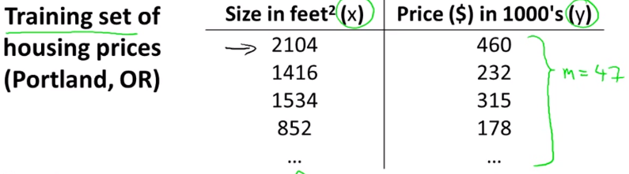    
  
다음의 notation을 사용한다.     
  
`m`: 학습 데이터 갯수    
`x`: input값, feature    
`y`: output, target    
  
위의 그림에서 $x_1 = 2104,  x_2 = 1416, y_1 = 406$ 이다.    
  
### 1.2.3. Model Representation    
  
Hypothesis Function (가설 함수)    
  
    
> training set 데이터를 학습 알고리즘을 거치면 함수가 나오는데 그것을 `h`라고 표기한다. Hypothesis Function 이라고 부른다.    
  
Hypothesis Function은 다음과 같이 수식으로 나타낼 수 있다.     
  
$$  
h_\theta(x) = \theta_0 + \theta_1x    
$$  
  
  
### 1.2.4. Cost Function (비용함수)    
  
Cost Function으로 Hypothesis Function의 정확도를 평가할 수 있다.     
h(x) 함수는 아래와같이 표현된다.     
$\theta_0$ $\theta_1$ 을 어떻게 선택하느냐에 따라 $h(x)$는 아래 그림과 같다.    
결국 목적은 주어진 training set을 가지고, a function h : X → Y so that h(x) is a “good” predictor for the corresponding value of y 하도록 학습하는 것이다.     
  
  
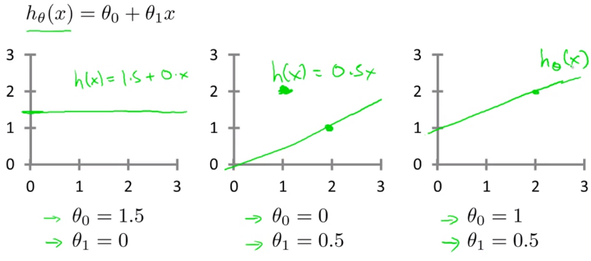    
  
결국 세타0 세타1 을 적절하게 선택하여 h(x) - y (예측값 - 실제값)의 차이가 최소화가 되도록하면 된다.     
그것을 찾는 방법을 공식화하면 다음과 같다. 이것이 Cost Function이다.     
J()로 표현되는 이 Cost Function은 오차함수의 제곱이라도고 불린다. 이 제곱함수는 회귀분석에서 가장 많이 사용된다. (제곱을 하는 이유는 음수, 또는 미분을 해야하기 때문으로 생각됨)     
  
  
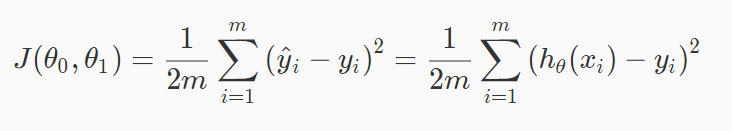    
> training set에서 각 (예측값i - 실제값i)을 제곱하고 합을구한뒤 평균을 낸다.      
  
    
  
결국 목적은 Cost Function을 최소화 하는것이다. Cost Function이 작아질 수록 Hypothesis Function의 정확도는 향상된다.    
  
$$  
h_\theta(x) 정확도 \propto {1 \over J(\theta_0, \theta_1)}    
$$  
  
  
### 1.2.5. Simplified Cost function of Linear Regression    
  
  
가설/비용함수 개념을 더 잘 이해하기 위해서 우리는 \theta_0 를 0으로 만든 단순화 버전을 사용할 것이다.  단순화 시킨 $h_\theta(x)$ 의 그래프는 원점을 지난다.     
정리하면 다음과 같다.     
  
| | basic |simplified|  
|----|--------------------------|---------------------|  
|__Hypothesis__:   | $ h_\theta(x) = \theta_0 + \theta_1x $ | $ h_\theta(x) = \theta_1 $ |  
|__Parametears__:  | $ \theta_0 , \theta_1 $ | $ \theta_1 $|  
|__Cost Function__:| $ J(\theta_0 , \theta_1) = \frac{1}{2m}\sum\limits_{i = 1}^{m}(h_\theta(x^{(i)}) - y^{(i)})^2 $ | $ J(\theta_1) = \frac{1}{2m}\sum\limits_{i = 1}^{m}(h_\theta(x^{(i)}) - y^{(i)})^2 $|  
|__Goal__:         | $ \underset{\theta_0 , \theta_1}{minimize} \ J(\theta_0 , \theta_1) $ | $ \underset{\theta_1}{minimize} \ J(\theta_1) $|  
  
    
  
| 가설함수 $ h_\theta(x) = \theta_1 $    | 비용함수  $ J(\theta_1) $  |  
|------------------------------|-------------------|  
| input값 $x$ 에 대한 함수 | parameter $\theta$ 에 대한 함수 (직선의 기울기를 좌우함) |  
  
다음과 같은 Training Data가 주어졌다고 하자.     
  
    
> 먼저 실제 데이터(Training data) `X`가 x-y평면에 흩뿌려져 있다.(그림과 다르게 더 불규칙할 수 있음) 우리 목적은 최대한 그 데이터를 잘 모사 할 수 있는 직선$h_\theta(x)$을 찾는것이다.     
  
이제 $\theta_1$의 값에 따른 가설함수와 cost 함수의 관계가 어떻게 변화하는지 살펴보자.     
  
##### a. $\theta_1 = 1$ 일때    
  
결론적으로 $h_\theta(x^{(i)})$ 은 실제 데이터(Training data)와 정확히 일치하게 되고, 이 예시 데이터에서 $ J(1) $은  0으로 우리의 목적인 최소값이 된다.     
(예측값 - 실제값)이 0이 된다.     
  
  
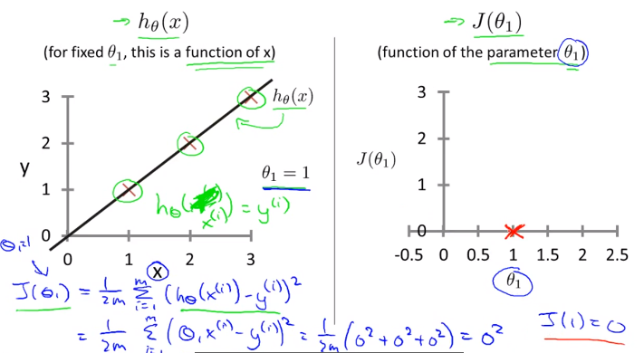    
> 그래프 설명: 왼쪽의 plot `X`는 "실제 값"(Training data)이다. 거기에 "예측 값"인 $h_\theta(x)$ 을 그렸다.     
> 우측: $\theta_1 = 1$ 일때 $ J(\theta_1) $ 값은 0이 된다.  $ J(1) = 0 $ 이다.     
그리고 $h_\theta(x) = x$ 가 된다. 실제 데이터도 $y=x$ 를 따라 위치해있으므로 두 데이터가 정확히 일치한다.     
> 가령 집 크기가 2일때 예측한 짒값은 2인데 실제 집값도 2이다. 라는 의미    
  
실제 데이터가 $y=x$ 를 따라 무한히 주어지지는 않을 테지만, 비용함수 계산 결과 0으로 나오므로 여기서 우리가 선택한 직선인 $h_\theta(x)$ 는 실세계를 정확히 거의 예측할 수 있는 것이다. 결국 Linear Regression은 실제 이미 알고있는 유한한 데이터를 기반으로 모르는 값을 예측/추측 할때 사용한다.     
  
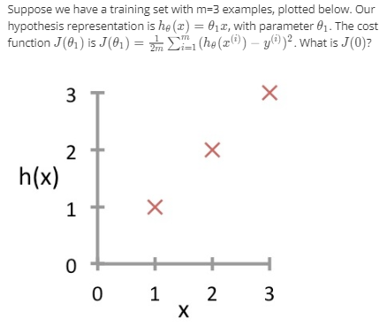    
> 질문: $(h_\theta(x^{(i)}) - y^{(i)})^2$ 에서 $h_\theta(x^{(i)})$ 의 결과는 예측값이고 $y^{(i)}$는 실제 값이다. 그런데 아래 $h_\theta(x^{(i)})$ 그래프에서 y축은 예측값이지 실제 값이 아니지 않은가?     
>  
> 그래프에서 y 축은 실제값을 나타내는게 맞다. $h_\theta(x^{(i)})$가 찍는 그래프는 y에 대한 예측값을 찍는것이다. 반면 `X`로 표기된 값이 실제 값이다.  여기서 설명하는 linear regression은 supervised learning이기 때문에 주어진 training set(data set)의 y값 즉 정답을 이미 다 알고있다는 가정하에 한다. 따라서 (예측값-실제값)이 맞다.     
> $\theta_1$가 1일때는 예측 모델(?) 예측값이 실제값과 동일해진다는것을 설명한 것이다.     
> 따라서 실제 training set과 h 그래프는 위와 같이 표현되는게 더 정확하다.     
> 위 연습문제를 계산해보면 결과는 아래와 같음    
>  
> $$  
> \begin{matrix}    
> J(0) &=& {1 \over 2 \times 3} \times ((0 - 1)^2 + (0 - 2)^2 +(0 - 3)^2) \\    
>    &=& {14 \over 6}     
> \end{matrix}    
> $$  
>  
  
  
##### b. $\theta_1 = 0.5$ 일때    
  
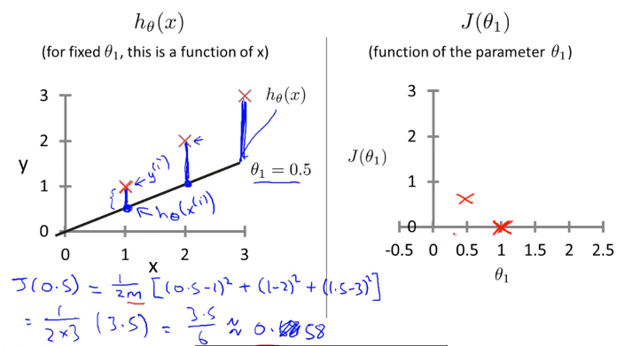    
> 가령 집 크기(x)가 2일때 예측한 짒값(y)은 1이었는데, 실제 집값은 2었다는 의미    
  
  
##### c. $\theta_1 = 0$ 그리고  $\theta_1 = n$일때    
  
    
  
  
### 1.2.6. Cost function of Linear Regression    
  
이제 $\theta_0$ 를 사용한 실제 Cost function 을 살펴보자    
$\theta_0$ 과 $\theta_1$ 이 모두 존재하기 때문에 Cost function $ J(\theta_0, \theta_1) $ 는 그림과 같이 3차원 그래프가 될 것이다.     
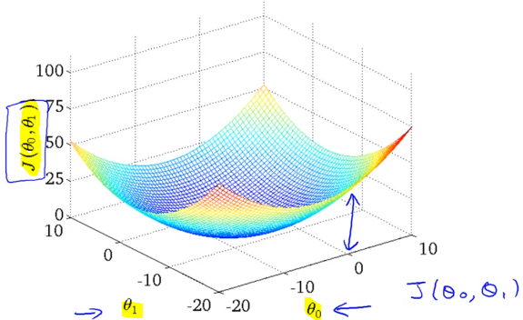    
  
3차원 그래프는 아래 우측과 같이 보기편하게 Countour plot(등고선 그래프)으로 변경해서 사용할것이다. 위에서 내려다 본 모습과 일치하고 같은 등고선은 같은 높이의 $ J(\theta_0, \theta_1) $를 의미한다.     
    
  
우측 그래프의 빨간점 `x` 는 $\theta_0$ = 800  $\theta_1 = -1.5$ 인데 이값으로 $h_\theta(x) = 800 -1.5x$ 을 그려보면 좌측과 같다. 실제 데이터(training data) `X` plot을 전혀 따라가고 있지 못하다.     
$ J(\theta_0, \theta_1) $ 의 값또한 최소값(중심부) 에서 멀리 떨어져있기 때문에 꽤 높은 비용을 쓰고 있다.     
  
  
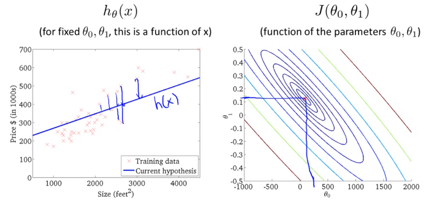    
따라서 더 좋은 Hypothesis function h는 Cost function J의 최소값과 비슷할 수록 더 좋다.     
  
  
참고로 앞으로는 더 많은 parameter $\theta$를 사용할것이다. 그렇게 되면 더이상 그래프로는 표현할 수 없다.  더 많은 parameter $\theta$를 사용한다는 의미는 $h_\theta(x)$ 함수 형태가 더 복잡해진다는 의미이다. 이것은 더 실세계를 정확히 반영할 것이다.     
  
결국 우리가 해야할 것은 S/W를 사용해서  $\theta_0$ 과 $\theta_1$ 그리고 함수 J의 최소값을 찾는것이다.     
다음 챕터에서는 J가 최소화 되도록 $\theta_0$ 과 $\theta_1$을 자동으로  찾는 알고리즘에 대해 알아볼 것이다.     
  
  
### 1.2.7. Parameter Learning (Gradient Descent)    
---  
  
지금까지 hypothesis function, h 에 대해 알아보았고 cost function을 통해 h의 parameter($\theta$)값에 따라 실제 세계의 데이터(training data)를 얼마나 잘 반영하는지 측정하는 방법에 대해 알아보았다.     
이전 장에서 $\theta$ 값에 따라 h의 정확도가 어떻게 향상되는지는 알아봤지만, 어떻게 $\theta$ 값을 찾는지는 아직 모른다.     
이번에는 가장 적합한 hypothesis function의 공식을 구성하는 parameter($\theta$)들을 어떻게 추정(estimate) 하는지 알아본다. -> gradient descent     
  
    
  
  
### 1.2.8. Gradient Descent 알고리즘 수학적 정의    
  
Gradient Descent알고리즘은 Cost function, J() 의 최소값을 찾기 위해 사용할 수 있다.  Gradient Descent 알고리즘은 Linear Regression 에만 쓸 수 있는건 아니고, 범용적인 알고리즘이다.     
  
- 기본 아이디어     
  * 어떤 값으로 $\theta_0$ 과 $\theta_1$ 를 초기화하여 시작한다 (보통 0)    
  * $J(\theta_0, \theta_1)$를 최소화 하는 방향으로 $\theta_0$ 과 $\theta_1$를 변화시킨다. (J가 최소값이 될때 까지)    
  
    
> 초기 지점부터 최소 지점으로 내려가야 한다. 어떻게 내려가는지 여러가지 알고리즘이 존재한다.     
> 어느 지점에서 시작을 하느냐에 따라 어떤 지점으로 도착할지가 다를 수 있다.     
> `참고` 이 그래프와는 다르게 Linear regression에서는 cost function J의 최소점이 무조건 1개이다.    
  
    
  
공식    
  
$$  
\theta_j := \theta_j - \alpha{\partial \over \partial\theta_j}J(\theta_0, \theta_1) \\    
$$  
  
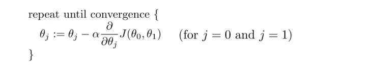    
  
  
공식 해설    
  
- $:=$    
수학에서 기호 := 할당한다(assignment)의 의미이다.     
`a := b`, `a := a + 1` 은 컴퓨터 프로그래밍에서 변수에 값을 할당하는것과 동일하다.     
반면 `a = b` 는 주장(assertion)이다. a와 b가 같다고 주장하는 것이다. (컴퓨터 프로그램과 반대) 따라서 `a = a + 1` 는 틀린 공식이 된다. 왜냐하면 a와 a + 1은 절대 같은 값이 될 수 없기 때문이다.     
    
- $\alpha$    
Learning Rate (훈련 비율) 수치 이다. 기본적으로 언덕을 내려갈 때 얼만큼 큰 걸음을 내 딛어야하는지를 상징한다. 가령 $ \alpha$가 크다면 매우 aggresive한 기울기 하강이 될것    
    
- ${\partial \over \partial\theta_j}J(\theta_0, \theta_1)$    
  생긴것 그대로 $\theta$에 대한 함수 J의 미분 계수 이다. $\partial$ 편미분    
  하강 방향은 J의 편미분값에 의해 결정된다.     
  
- (for j = 0 and j = 1)    
여기서는 j가 0일 때와 1일때를 다룬다.     
    
이 공식을 update하기 위해서 아래의 과정을 통해 $\theta_0$ 과 $\theta_1$ 이 지속적으로 업데이트 되야한다.     
  
$ temp0 := \theta_0 - \alpha{\partial \over \partial\theta_0}J(\theta_0, \theta_1) $    
$ temp1 := \theta_1 - \alpha{\partial \over \partial\theta_1}J(\theta_0, \theta_1) $    
$\theta_0 := temp0$    
$\theta_1 := temp1$    
  
> temp0 temp1을 먼저 계산한뒤 $\theta$ 에 할당하는 이유는 temp1 에서 미분계수를 계산할때 바뀐 $\theta_0$ 를 사용하지 않기 위함임을 주의해야한다.     
  
  
### 1.2.9. Learning rate와 미분계수    
  
이번에도 더 쉬운 이해를 위해 $\theta_0$ 을 사용하지않고 parameter 하나만 사용, $J(\theta_1)$ 으로 단순화 시켜보자.    
  
- 미분계수 ${\partial \over \partial\theta_j}J(\theta_0, \theta_1)$    
  
      
  > 그래프의 빨간점 지점의 $J(\theta_1)$의 미분계수는 어떠한 양수값이다.     
  > 따라서 $\theta_1 := \theta_1 - \alpha (양수값)$ 을 계산하면 $\theta_1$은 점차 최저 J 값으로 이동하게 된다.     
  
  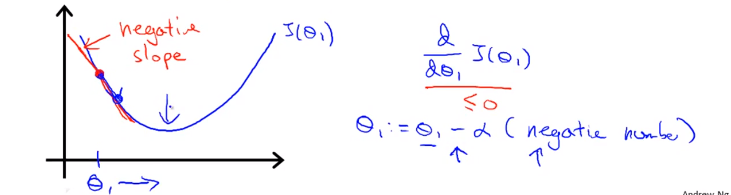    
  
  > 미분계수가 음수인경우도 마찬가지로 $\theta_1$이 점차 최저 J 값으로 이동하게 된다.     
  
- Learning Rate $\alpha$    
  
  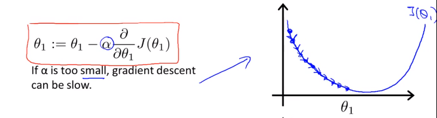    
  > $\alpha$ 가 작다면 매우 작은 스텝으로 하강할것이고 많은 이동이 필요하다. 하강 속도가 느릴것이다.     
  
  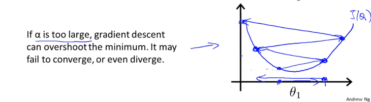    
  > 만약 $\alpha$ 이 큰데 시작점이 최소값 지점과 가까이 있다면 최소값을 넘어서 반대방향으로 이동할 것이고 또다시 반대편으로 이동하게 될것이다. minimum 을 __Overshoot__하게 되는것이다. 방향 전환 조차도 실패한다.    
  > 결국 수렴(converge) 에서 멀어지게 된다.     
  
- 문제: 만약 parameter $\theta_1$ 이 이미 최소값이라면 어떤 각도로 하강해야할까?     
    
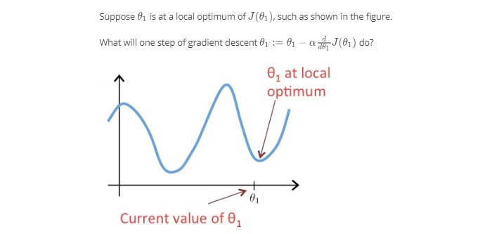    
> 미분계수가 0 이기 때문에 그대로 $\theta_1 := \theta_1 - 0 $ 이 되어 변동이 없다.     
  
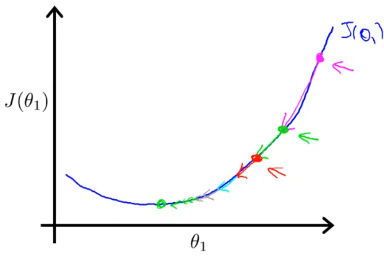    
하강할 수록 점점 더 작은 거리를 이동하게 된다. 왜냐하면 최소값에 도달할수록 기울기가 작아지며 미분계수값이 작아지기 때문이다. 따라서 굳이 $\alpha$값이 작아질 필요가 없다.     
  
  
### 1.2.10. Gradient Descent for Linear Regression    
  
이제 Gradient Descent를 Linear Regression에 적용해보자.     
  
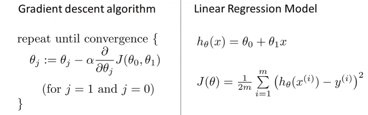    
  
이제 우리가 하려는 것은 Gradient Descent 알고리즘을 사용해서 $J(\theta_0, \theta_1)$를 최소화 하려는 것이다.     
  
Cost function J()를 알고리즘 공식에 대입하기만 하면 된다.     
  
- 먼저 아래와 같이 알고리즘에서 미분계수 항 ${\partial \over \partial\theta_j}J(\theta_0, \theta_1)$ 에 대입하여 (a)로 풀어쓴뒤,  j=0, j=1일때 각각 편미분하면 $\theta_0$  $\theta_1$에 대한 미분계수 (b), (c)를 구할 수 있다.     
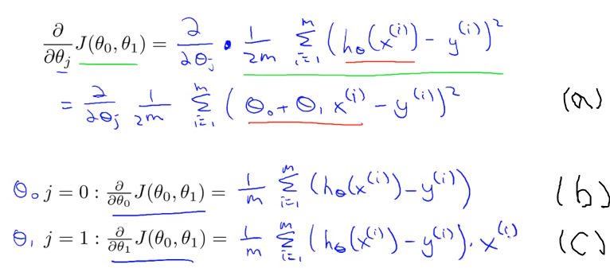    
    
- 이것을 Gradient Descent 알고리즘에 다시 대입하면 아래와 같다. 이제 $\theta_0$  $\theta_1$ 값을 계산할 수 있는 알고리즘이 공식화 되었다.     
$$  
\begin{align*} \text{repeat until convergence: } \lbrace & \newline \theta_0 := & \theta_0 - \alpha \frac{1}{m} \sum\limits_{i=1}^{m}(h_\theta(x_{i}) - y_{i}) \newline \theta_1 := & \theta_1 - \alpha \frac{1}{m} \sum\limits_{i=1}^{m}\left((h_\theta(x_{i}) - y_{i}) x_{i}\right) \newline \rbrace& \end{align*}    
$$  
  
초기에 주어진 $\theta_0$, $\theta_1$ 을 가지고 모든 training set의 $h(x^i) = \theta_0 + \theta_1x^i$ 와 $y$차의 합을 구한다. 공식에 따라 먼저 $\theta_0$, $\theta_1$에 해당하는 값을 구한뒤 그다음에 $\theta_0$, $\theta_1$ 에 각각 대입한다. 그렇게 두번째 $\theta_0$, $\theta_1$ 값을 구할 수 있는것이다. 이것을 __반복__하다보면 아래 그림과 같이 cost function $J(\theta_0, \theta_1)$가 최소값이 되는 $\theta_0$, $\theta_1$ 지점에 점차 수렴하게 된다(목적 달성). 당연히 $\theta_0$, $\theta_1$가 바뀔때마다 hypotheis function $h(x)도 달라진다.    
  
(주의할 사항은 이 두값이 동시에(simultaneously) update 되어야한다는 점이다 $\theta_0$, $\theta_1$이 바뀔때 마다 가설 함수도 바뀌기 때문이다.  $h(x) = \theta_0 + \theta_1x$)    
  
    
  
이 알고리즘을 다른말로 __Batch Gradient Descent__ 라고 부른다.    
지금 배운것은 cost function J의 최소값을 구하기 위해 반복적 알고리즘을 사용했다. 참고로 나중에는 반복이 없이도 J의 최소값을 구할 수 있는 방법에 대해 알아볼 것이다.     
  
이로써 Gradient Descent 알고리즘이라는 첫번째 기계학습 알고리즘을 배웠다.      
  
`참고1`: (a) -> (c) 편미분 풀이과정    
    
`참고2`: Linear regression에서는 cost function J의 최소점이 무조건 1개이다. 그래프의 모양은 bowl-shape이다. 이를  convex quadratic function 이라고 부름.    
  
    
  
## 1.3. Linear Algebra Review    
---  
  
### 1.3.1 Vector    
  
A vector is a matrix with one column and many rows:    
  
$$  
\begin{bmatrix}    
w \\    
x \\    
y \\    
z    
\end{bmatrix}    
$$  
  
So vectors are a subset of matrices. The above vector is a 4 x 1 matrix.    
  
#### notations    
  
4 demensional Vector 이다.    
  
- $A_{ij}$    
refers to the element in the ith row and jth column of matrix A.    
- A vector with 'n' rows is referred to as an 'n'-dimensional vector.    
- $v_i$     
refers to the element in the ith row of the vector.    
- In general, all our vectors and matrices will be 1-indexed. Note that for some programming languages, the arrays are 0-indexed.    
- Matrices are usually denoted by uppercase names while vectors are lowercase.    
- "Scalar" means that an object is a single value, not a vector or matrix.    
- $\mathbb{R}$    
refers to the set of scalar real numbers.    
- $\mathbb{R^n}$    
refers to the set of n-dimensional vectors of real numbers.    
  
#### Octave/Matlab commands    
  
```matlab    
% The ; denotes we are going back to a new row.    
A = [1, 2, 3; 4, 5, 6; 7, 8, 9; 10, 11, 12]    
% Initialize a vector     
v = [1;2;3]     
    
% Get the dimension of the matrix A where m = rows and n = columns    
[m,n] = size(A)    
% You could also store it this way    
dim_A = size(A)    
% Get the dimension of the vector v     
dim_v = size(v)    
% Now lets index into the 2nd row 3rd column of matrix A    
A_23 = A(2,3)    
```  
  
### 1.3.2 Matrix addition and substriction and 스칼라곱    
  
In scalar multiplication, we simply multiply every element by the scalar value:    
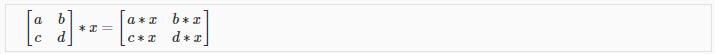    
  
In scalar division, we simply divide every element by the scalar value:    
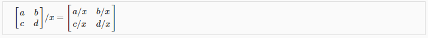    
  
#### Octave/Matlab commands    
  
```matlab    
% Initialize matrix A and B     
A = [1, 2, 4; 5, 3, 2]    
B = [1, 3, 4; 1, 1, 1]    
% Initialize constant s     
s = 2    
    
% See how element-wise addition works    
add_AB = A + B     
% See how element-wise subtraction works    
sub_AB = A - B    
% See how scalar multiplication works    
mult_As = A * s    
% Divide A by s    
div_As = A / s    
% What happens if we have a Matrix + scalar?    
add_As = A + s    
    
```  
  
  
### 1.3.3. Matrix * Vector Multiplication    
  
    
  
`m x n matrix` X `n x 1 vector` =>  `m x 1` vector    
  
- 사례     
행렬곱을 사용하면 모든 집값을 편하게 예측할수 있다.  각 x변수에 해당하는 y값을 한번에 계산할 수 있다.     
    
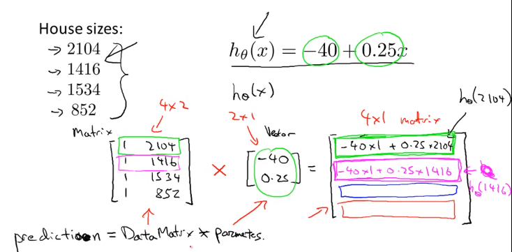    
  
Hypothesis function $h_\theta(x) = -40 + 0.25x$ 가 있다고 가정하고 내가 가진 집크기가 왼쪽의 4개의 값을 가지고 있을때 가격을 예측해보자. 행렬곱을 이용해서 한번에 계산할 수 있다.     
  
우리는 이런 연산을 다른 모델에서 regression 을 개발하기 위한 연산자로 잘 활용할 수 있다.     
  
  
#### Octave/Matlab commands    
  
```matlab    
% Initialize matrix A     
A = [1, 2, 3; 4, 5, 6;7, 8, 9]     
% Initialize vector v     
v = [1; 1; 1]     
    
% Multiply A * v    
Av = A * v    
```  
  
  
### 1.3.4. Matrix * Matrix Multiplication    
  
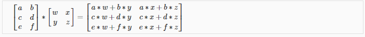    
An `m x n matrix` multiplied by an `n x o matrix` results in an `m x o matrix`    
  
행렬곱은 여러개의 계산식을 하나의 행렬곱셈으로 표현하게 해준다.     
  
- 사례    
    
이번엔 여러개의 집크기에 대한 가격 예측을 할때, 여러개의 가설함수를 있다고 하자. matrix곱을 사용하면 한번에 계산 할 수 있다.     
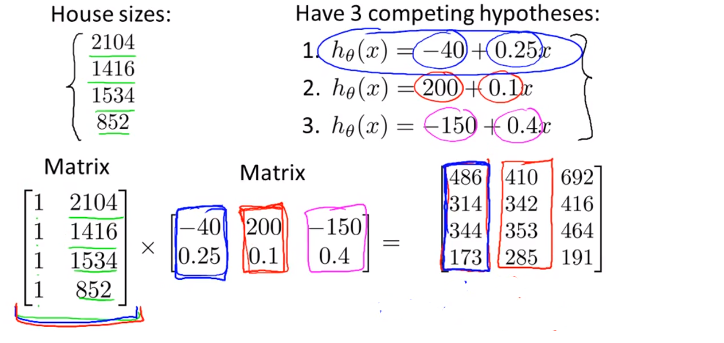    
> 결과 matrix의 열이 각 집크기에 상응하는 예측 가격이다.     
  
  
#### Octave/Matlab commands    
  
```matlab    
% Initialize a 3 by 2 matrix     
A = [1, 2; 3, 4;5, 6]    
% Initialize a 2 by 1 matrix     
B = [1; 2]     
    
% We expect a resulting matrix of (3 by 2)*(2 by 1) = (3 by 1)     
mult_AB = A*B    
```  
  
### 1.3.5. Matrix Multiplication Properties    
  
- 교환법칙 X    
Matrices are not commutative: A∗B≠B∗A    
- 결합법칙 O    
Matrices are associative: (A∗B)∗C=A∗(B∗C)    
    
- Identity Matrix (항등원)    
    
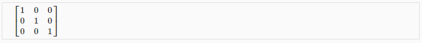    
  
교환법칙, 결합법칙 모두 성립    
  
#### Octave/Matlab commands    
  
```matlab    
% Initialize random matrices A and B     
A = [1,2;4,5]    
B = [1,1;0,2]    
    
% Initialize a 2 by 2 identity matrix    
I = eye(2)    
% The above notation is the same as I = [1,0;0,1]    
% What happens when we multiply I*A ?    
IA = I*A     
% How about A*I ?    
AI = A*I     
% Compute A*B     
AB = A*B     
% Is it equal to B*A?     
BA = B*A     
% Note that IA = AI but AB != BA    
```  
  
### 1.3.6. Inverse and Transpose    
  
- Inverse matrix 역행렬    
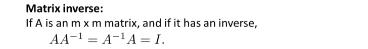    
The inverse of a matrix A is denoted $A^{-1}$. Multiplying by the inverse results in the identity matrix.    
    
- Transpose matrix 전치행렬    
90도 회전된 행렬 The transposition of a matrix is like rotating the matrix 90° in clockwise direction and then reversing it.     
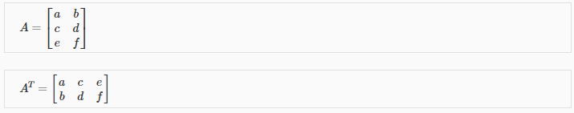    
    
#### Octave/Matlab commands    
  
```matlab    
% Initialize matrix A     
A = [1,2,0;0,5,6;7,0,9]    
    
% Transpose A     
A_trans = A'   //'    
% Take the inverse of A     
A_inv = inv(A)    
% What is A^(-1)*A?     
A_invA = inv(A)*A    
    
```  
  
다음 시간부터 linear algebra 를 다룰수 있는 툴에 대해 살펴본다.     
  
    
  
    
  
# 2. Linear Regression with Multiple Variables    
---  
  
    
  
## 2.1. Multivariate Linear Regression    
---  
이번 챕터에서는 하나 이상의 variable 또는 하나 이상의 feature를 사용하는 보다 강력한 Linear regression에 대해 알아볼 것이다.     
  
### 2.1.1. Multiple Features    
  
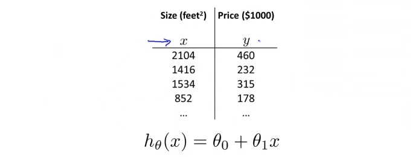    
지금까지는 $x$ (집 크기) 라는 하나의 feature만 사용했다. 이것을 집의 가격을 결정(예측)하는 요소로 사용했다.     
  
그런데 집값을 결정짓는 요소는 집 크기하나 말고도 더 많을 수 있다. 이럴때 Linear regrresion을 어떻게 할수 있을까? 다음의 예시처럼 집의 크기와 방의 갯수, 층수, 연식 등등으로 고려해서 집값을 예측(결정) 할 수 있을 것이다.     
  
  
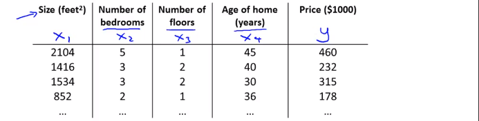    
  
4개의 feature를 이용해 집값을 예측해 보자.     
  
먼저 새로운 notation은 다음과 같이 정의한다.     
  
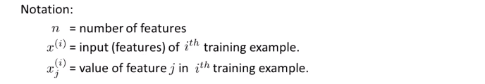    
> 이 예시에서 4개의 feature가 있으므로 n = 4이다. (m은 테이블의 행의 갯수(training data의 갯수)임에 유의)    
  
> 여기서 $x^{(2)}$는 두번째 training set(두번째 행)의 데이터를 가진 4차원 vector다.     
$x^{(2)} = \begin{bmatrix} 1416 \\ 3 \\ 2 \\ 40 \end{bmatrix}$    
> 다시말해 두번째 집의 가격을 결정짓는 요소들이다.     
> 추가로 아래첨자는 feature 번호다. 가령 $x^{(2)}_3$는 테이블에서 2를 가리킨다.     
  
feature가 늘어났으므로 Hypothesis function의 형태도 달라져야한다.     
  
$$  
previously:\\    
 h_\theta(x) = \theta_0 + \theta_1x \\    
$$  
$$  
new :\\    
 h_\theta(x) = \theta_0 + \theta_1x_1 + \theta_2x_2 + \theta_3x_3 + \theta_4x_4    
$$  
  
가령 이 예제에서 hypothesis function은 다음과 같을 수 있다.     
($\theta_4$ 가 $-2$인 이유는 집이 오래될 수록 집값은 떨어지기 때문이다. )    
결국 $h_\theta(x)$ 에서 $\theta_j$는 feature $x_j$에대한 가중치라고 볼수 있다.   
  
$$  
 h_\theta(x) = 80 + 0.1x_1 + 0.01x_2 + 3x_3 - 2x_4    
$$  
  
결국 n개의 feature가 있다면 가설함수는 아래와 같다.     
  
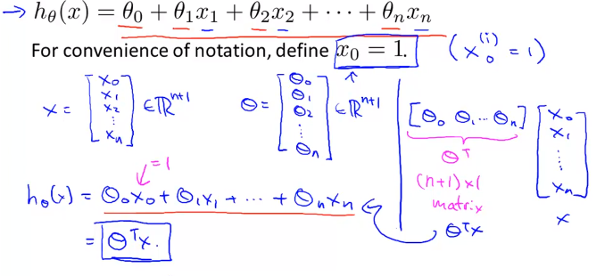    
  
Feature 벡터 X와 parameter 벡터 $\theta$가 있다.  결국 X는 n차원 벡터고 $\theta$ 도 만찬가지로 n차원 벡터다.    
이 두 벡터를 곱하면 $h_\theta(x)$ 가 된다!    
곱셈의 편의를 위해서 $\theta$ 벡터는 transpose 한다. (nx1, nx1 끼리는 곱셈불가하기 때문에  1xn * nx1 의 형태로 변경해야함)    
따라서 hypothesis function은 $ h_\theta(x) = \theta^TX $ 같이 간략히 표현된다!    
  
  
$$  
\begin{align*}h_\theta(x) =\begin{bmatrix}\theta_0 \hspace{2em} \theta_1 \hspace{2em} ... \hspace{2em} \theta_n\end{bmatrix}\begin{bmatrix}x_0 \newline x_1 \newline \vdots \newline x_n\end{bmatrix}= \theta^T x\end{align*}    
$$  
  
이것을 __Multivariate Linear regression__ 이라고 부른다    
  
> 추측하기로는 결국 다변수 선형회귀도 궁극적으로 해결하려는 것은  training set의 데이터를 가지고 $\theta_n$ 들을 구하는것일 것이다. 그 $\theta$ 로 이루어진 $h_\theta()$는  training set을 가장 유사하게 모사하는함수다.  여기서도 cost function J()를 새롭게 정의하게 될듯     
  
  
### 2.1.2. Gradient Descent for Multiple Variables    
  
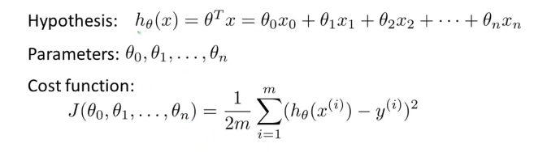    
    
> cost function 자체는 동일하다.     
> 여기서 여러개의 parameter $\theta_0 ... \theta_n$ 는 모두 간단하게 벡터 $\theta$ 로 바꿔서 표기할 수있다.      
  
feature가 1개 이상일때 Gradient Descent 알고리즘을 아래와같고 결국 각 $\theta$ 는 그 아래와같이 계산 될 수 있다. 개념상 이해하는데는 feature 가 1개일때랑 크게 차이가 없다.      
  
  
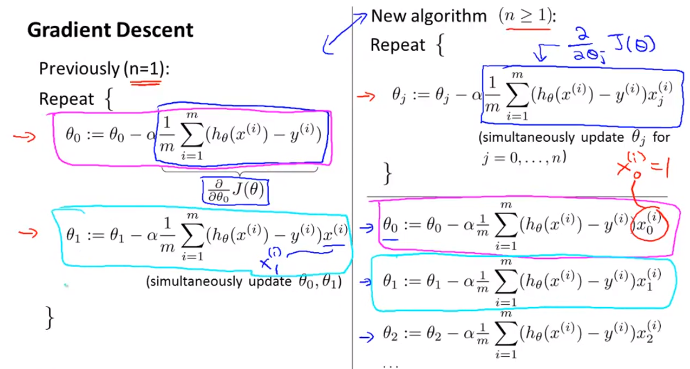    
  
우리가 최종 계산할 parameter $\theta_0 ... \theta_n$ 계산 공식!    
  
$$  
\begin{align*} & \text{repeat until convergence:} \; \lbrace \newline \; & \theta_0 := \theta_0 - \alpha \frac{1}{m} \sum\limits_{i=1}^{m} (h_\theta(x^{(i)}) - y^{(i)}) \cdot x_0^{(i)}\newline \; & \theta_1 := \theta_1 - \alpha \frac{1}{m} \sum\limits_{i=1}^{m} (h_\theta(x^{(i)}) - y^{(i)}) \cdot x_1^{(i)} \newline \; & \theta_2 := \theta_2 - \alpha \frac{1}{m} \sum\limits_{i=1}^{m} (h_\theta(x^{(i)}) - y^{(i)}) \cdot x_2^{(i)} \newline & \cdots \newline \rbrace \end{align*}    
$$  
  
  
### 2.1.3. Gradient Descent in Practice I - Feature Scaling    
  
Feature Scaling 이란?     
  
만약 여러개의 feature가 비슷한 크기의 범위를 갖는 값이라면 Gradient Descent가 더 빠르게 수렴할 수 있다.  더 적은 수의 반복으로 목적지에 수렴이 가능하다.     
  
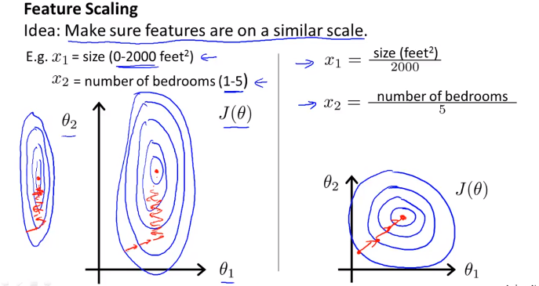    
가령 x_1 값이 0 ~ 2000 의 범위를 갖고 x_2는 1 ~ 5 의 범위를 갖는다고 가정하면 그 두개의 feature의 범위 차이가 매우 크기 때문에 왼쪽 처럼 등고선이 매우 길쭉하게 나타난다. 그러면 기울기 하강은 더 난해하고 복잡한 경로로 오랫동안 일어나게 된다. 만약 우측처럼 범위를 동일하게 맞춰주면 등고선의 모양은 거의 원형이라 더 빠르게 하강할 수 있다.     
  
따라서 이렇게 각 feature의 scale을 비슷하게 조정할 필요가 있다. (정확하게 똑같이 맞출필요는없다. 대충 비슷하게만 맞으면 된다.)  이것이 이번장에서 다룰 __Feature Scaling__이다.     
  
  
    
> Feature Scaling 기법중 하나는 Mean normalization이다. 이것은 x를 대략 -0.5 ~ 0.5 범위로 scale 시킨다. 방법은     
  
$$  
x_n := {x_n - \mu_n \over s_n}    
$$  
> $\mu_1$ 은 x_1의 평균이다.     
> $s_1$ 은 보통 최대값-최소값으로 하면된다.     
  
    
  
### 2.1.4. Gradient Descent in Practice II - Learning Rate    
  
이번 챕터에서는 learning rate $\alpha$를 어떻게 정하는지 알아본다.     
  
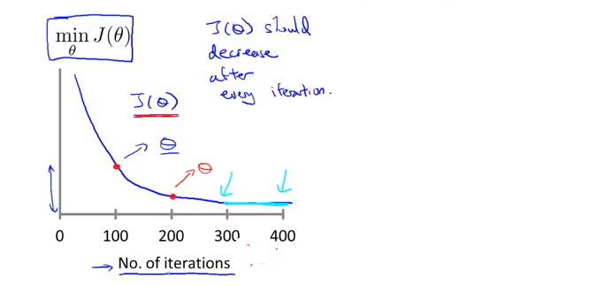    
Gradient Descent가 잘동작한다면 j()는 매 iteration마다 감소해야한다.     
  
300 회 반복 부터는 cost function 이 거의 줄어들지 않고 수렴한다.     
Gradient Descent 가 수렴하는 iteration 횟수는? 경우에 따라 다양하기 때문에 사전에 알기 어렵다.     
  
__Automatic Convergence Test__라는 Gradient Descent 가 수렴하는지 안하는지 알려주는 test가 존재 하기도 한다.    
  
  
만약 J 가 감소하지 않고 증가한다면 명백한 문제가 있는것이고, 더 작은 learning rate $\alpha$ 사용해야한다는 뜻이다.     
  
적절한 learning rate $\alpha$ 알아서 찾아서 좋은 Gradient Descent를 구현해야한다. 특별히 정답은 없는듯.    
  
To summarize:    
  
- If $\alphaα$ is too small: slow convergence.    
- If $\alphaα$ is too large: may not decrease on every iteration and thus may not converge.    
  
### 2.1.5. Features and Polynomial Regression    
  
이번챕터 에서는 어떻게 Feature를 선택할지, 적절한 Feature의 선택으로 강력한 학습 알고리즘을 만드는 방법에대해 알아본다. Polynomial Regression(다항 회귀?)에 대해서도 알아본다.  Polynomial Regression은 linear regression 을이용해서 복잡한 비선형 함수에도 적용하는 것이다.     
  
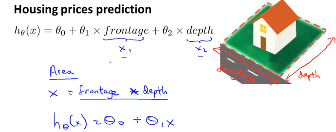    
  
이런경우는 굳이 $x_2$ 까지 항을 늘려서 모델(가설함수)을 만들 필요가 없다.     
$x_1$을 넓이로 바로 사용해도 된다.     
  
    
  
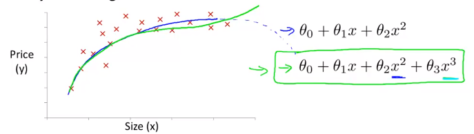    
이런 형태의 training data가 존재한다고 하자.    
  
hypothesis function이 $h_\theta (x) = \theta_0 + \theta_1 x_1$  일 때, x1 에 연관된 feature를 추가하여 2차 함수꼴로 만들 수 있다.    
$$  
h_\theta (x) = \theta_0 + \theta_1 x_1 + \theta_2 x_1^2    
$$  
여기서 $\theta_2 x_1^2$ 가 $x_2^2$ 가 아니라 $x_1^2$ 임을 유의하자. 결국 feature는 하나인것이다.     
하나의 feature를 가지고 제곱이나 제곱근등등으로 형태를 변경하여 함수모양을 바꿀수 있다. 이것은 결국 feature가 하나 더 늘어나는것과 같은 의미이다. 결국    
$x_1 = x_1$    
$x_2 = (x_1)^2$    
와 같다.     
  
이차함수형태의 모델을 사용하면 나중에 감소하는 구간이 생기기에 적합하지 않다.     
이럴땐 3차 함수 형태를 사용하는게 더 적합하다.     
$$  
h_\theta (x) = \theta_0 + \theta_1 x_1 + \theta_2 x_1^3 + \theta_3 x_1^3    
$$  
이렇게 3차 함수꼴로 나타냈을때     
그리고 아래와 같이 제곱근 형태의 함수를 사용하는게 더 적합할 수도 있다.     
$$  
h_\theta (x) = \theta_0 + \theta_1 x_1 + \theta_2 \sqrt{x_1}    
$$  
  
이러한 함수형태를 자동으로 찾아주는 알고리즘이 존재한다. 앞으로는 그것을 사용할것이다.     
  
중요한것은 이렇게 feature 하나를 가지고 새로운 feature를 만들면 feature scaling이 중요해진다.     
$x_1$이 1~1000 범위를 갖는다면, 그로부터 만든 새 feature인 $(x_1)^2$는 1 ~ 1000000 의 범위를 갖게 될것이기 때문이다. 이 둘의 차이가 너무 크면 gradient descent 가 엄청 느려진다.     
  
- Polynomial feature  생성하는 방법:  
만약 training data의 feature가  $x_1$  $x_2$ 이렇게 주어진다면, 그 두개의 feature 벡터를 가지고 다음의 polynomial feature 값을 모두 연산하여 새로운 matrix를 생성한다. 그리고 각 polynomial feature에 해당하는 가중치  $\theta$ 를 적절하게 선택(Gredient descent등 사용)하여, Polynomial한 $h_\theta(x)$ 함수를 생성할 수 있는것이다.    
$$  
x_1 , x_2 , x_1^2, x_2^2, x_1x_2, x_1^3, x_1^2x_2, x_1x_2^2 , x_2^3, ....  
$$  
Training set을 가지고 그 데이터를 잘 모사하는 $h_\theta(x)$를 만들때, 함수형태를 먼저 찾는것이 아니다. 모든 형태를 만든다음에  $x$ 의 parameter (혹은 weight)  $\theta$를 0으로 만들던지 하여 불필요한 항을 제거하는 방식으로 함수 형태를 찾는것이다.    
  
- Polynomial feature  생성 알고리즘(in Octave):  
연습문제 ex2_reg.m 의 mapFeature.m 참고  
	```matlab  
	X = mapFeature(X(:,1), X(:,2));  
	```  
	> $x_1$, $x_2a$ feature가 X벡터에 있을때  
  
	```matlab  
	function out = mapFeature(X1, X2)  
  
	degree = 6;		% 몇차 polynomial feature까지 생성할 것인지  
	out = ones(size(X1(:,1)));  
	for i = 1:degree  
	    for j = 0:i  
		out(:, end+1) = (X1.^(i-j)).*(X2.^j);  
	    end  
	end  
	end  
	```  
	>   
  
## 2.2. Computing Parameters Analytically    
---  
  
    
  
### 2.2.1. Normal Equation    
  
Normal Equation은 최적의 $\theta$ 를 구할 수 있는 또다른 방법이다.  gradient descent 와는 다른 방식으로 각각 장/단점이 있다.     
  
Normal Equation은 $\theta$ 를 반복계산 없이 공식하나로 한번에 구할 수 있다.     
다음의 training set을 보자.     
  
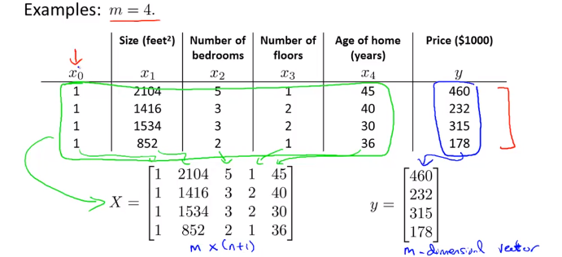    
> 4개의 feature가 있고 결과가 있다. 이것을 각각 X matrix와 y 벡터로 복사한다. 계산의 편의를 위해  1을 갖는 $x_0$ 열이 추가되었음에 유의. 이것을가지도 아래 Normal Equation 공식에 대입해 계산하면 바로 $\theta$를 구할 수 있다!    
  
$$  
\theta = (X^TX)^{-1}X^Ty    
$$  
  
이렇게 계산된 $\theta$ 는 cost function J를 최소화하는 값이다.     
  
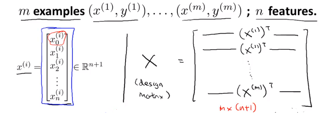    
  
만약 $i$번째 하나의 training data가 위의 $x^{(i)}$ 처럼 n + 1 크기의 벡터로 주어진다면, 이것으로 우측과 같이 Design Matrix X를 만든다. (결국 이전 예시처럼 테이블을 그대로 matrix에 복사한것과 동일한 구성임)    
  
더 간단한 예를들면 아래와 같다.    
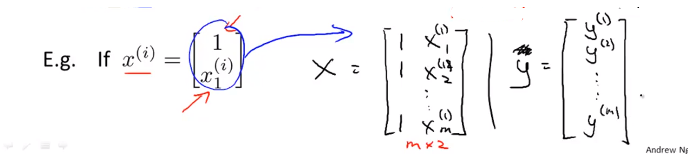    
  
$\theta$ 를 구하는 Octave 명령어    
  
```matlab    
pinv(X'*X)*X'*y    
```  
  
반복 계산도 필요없고 적절한 $\alpha$를 찾아야하는 수고가 없다. 또한 Feature scaling도 필요없다. ~~이렇게 좋은 방법이 있다니?~~    
그러나 결론적으로Normal Equation에 매우 치명적인 단점이 있다. n(feature갯수)가 엄청 커지면 Normal Equation은 못쓴다. 복잡도가 $O(n^3)$ 으로 연산속도가 엄청나게 느려지기 때문이다.     
  
Gradient descent 와 Normal equation을 비교하면 아래와 같다.     
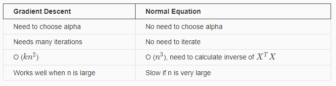    
  
보통 n=10000 정도까지는 Normal equations을 사용해도 괜찮다고 한다. 현대 컴퓨팅 파워로 이정도계산 까지는 실용적인 속도를 얻을 수 있다.     
  
  
### 2.2.2. Normal Equation Noninvertibility    
  
역행렬이 없는 Normal Equation은 어떻게 구해야할까?    
$$  
\theta = (X^TX)^{-1}X^Ty    
$$  
$X^TX$ 가 역행렬이 없는 경우가 있기 때문이다.     
  
다음의 두가지 경우에 $X^TX$ 에 역행렬이 없다.     
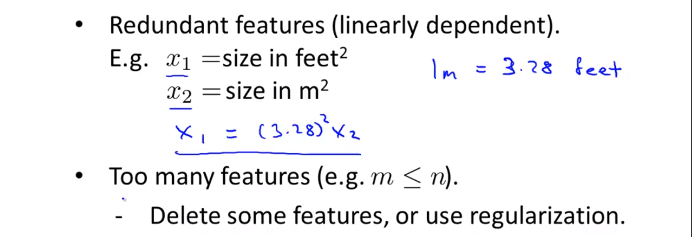    
> 1번은 각 feature가 $x_1 = (3.28)^2x_2$ 처럼 선형적으로 종속적인 관계일때이다. 이럴땐 둘 중 한feature를 제거해도 된다.    
> 두번째는 피쳐갯수(n)이 training set갯수(m)보다 많을때이다. 이럴땐 어떤 feature들을 지우거나, regularization기법을 사용한다.      
  
    
  
  
  
  
  
  
  
  
# 3. Logistic Regression, Regularization  
---  
  
Logistic regression is a method for classifying data into discrete outcomes. For example, we might use logistic regression to classify an email as spam or not spam.  
  
  
## 3.1. Classfication  
---  
  
이번 챕터에서는 어떻게 Classfication 분류 알고리즘을 어떻게 개발할수 있는지 알아본다.   
우선 linear regression을 classification에 적용하는것은 가능해보이기는 하나. 데이터가 동떨어진 곳에 하나만 추가되어도 가설함수가 바뀌기 때문에 옳지 못한 결과를 만들어낼 수 있다.  
  
따라서 y가 0또는 1인 binary classification problem 에 집중할것이다.   
  
## 3.2. Logistic Regression  
---  
(용어는 Regression 이지만 Classfication 문제임)  
  
Logistic Regression 에서 아래와 같은 범위를 갖는 가설함수를 만들것이다.   
$$  
0 \leq h_\theta(x) \leq 1  
$$  
  
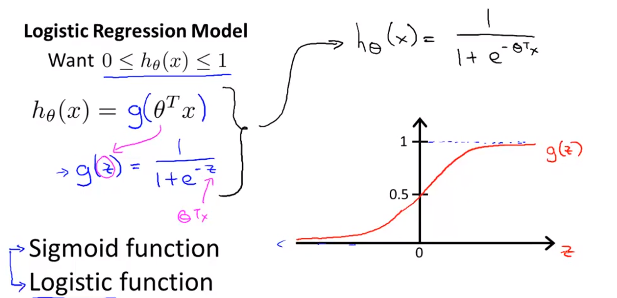  
$$  
\begin{align*}& h_\theta (x) = g ( \theta^T x ) \newline \newline& z = \theta^T x \newline& g(z) = \dfrac{1}{1 + e^{-z}}\end{align*}  
$$  
그렇게 하기 위해서는 가설함수 $h_\theta(x)$를 $g(z)$ 형태로 변화시켜야한다. 그 이유는 $0 \leq h_\theta(x) \leq 1$를 만족시키도록 만들기 위해서이다. 그래프로 그리면 시그모이드 함수의 형태로 나타나고 범위가 1이하 0이상을 만족한다. 이제 우리가할일은 $\theta$ 파라미터를 우리의 데이터에 맞게 맞추는것이다. 파라미터를 찾는 알고리즘은 후에 다시 살펴본다.   
  
  
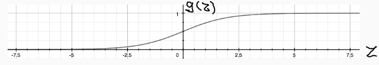  
$g(z)$의 결과는 항상 0 이상 1이하를 만족한다.  
  
  
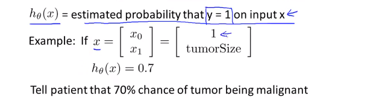  
h(x)는 입력값 x에대해서 y가 1일 확률을 추청하는 함수이다.   
가령 위그림과 같이 x의 feature가 두개 즉 feature 벡터 x가 있을때. (하나는 1, 하나는 종양크기) 만약 가설함수가 0.7로 나왔다면, 결과를 이렇게 해석할 수 있다. y=1일 확률 즉 악성종양일 확률이 70%이라고.   
  
이것을 수학적으로 더 엄밀하게 표현하면 아래와 같다.   
  
$$  
\begin{align*}& h_\theta(x) = P(y=1 | x ; \theta) = 1 - P(y=0 | x ; \theta) \newline&  
P(y = 0 | x;\theta) + P(y = 1 | x ; \theta) = 1\end{align*}  
$$  
> $h_\theta(x) = P(y=1 | x ; \theta)$  해석:  
>  Probability that y=1, given x, parameterized by $\theta$  
> y가 1일 가능성, 주어진 x, 즉 환자가 특징 x로 나타내지는 특정 종양의 크기를 가질때, 이것이 $\theta$에 매개된 가능성이다.   
  
  
  
## 3.3. Decision Boundary  
---  
  
$h(x)$가 계산하는것이 정확히 무엇이냐? 가설함수가 예측하는 값이 언제 y=1이고 0인지 이해해보자.   
  
  
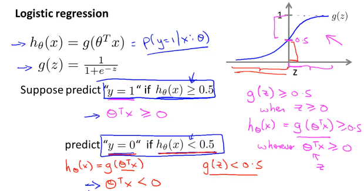  
  
가령 $h_\theta(x) \geq 0.5$ 일때 y = 1이라고 가정한다면, $h_\theta(x) = g(\theta^T x) \geq 0.5 $ 와 같다. 그래프를 보면 $z \geq 0$일때 $g(z) \geq 0.5$이므로 $z = \theta^Tx \geq 0$ 일때 와 같다.   
  
__즉 $\theta^Tx \geq 0$ 이면, $y = 1$ 로 예측할 수 있다. __  
  
$$  
\begin{align*}& h_\theta(x) \geq 0.5 \rightarrow y = 1 \newline& h_\theta(x) < 0.5 \rightarrow y = 0 \newline\end{align*}  
$$  
  
  
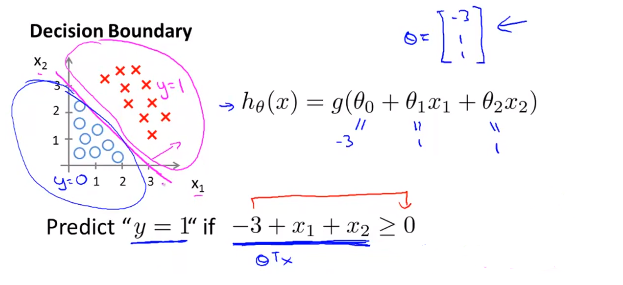  
  
가령 $h(x)$ 가 위처럼 $g(\theta^Tx)$ 형태일때, $\theta$ 벡터가  $\theta = \begin{bmatrix} -3 \\ 1 \\ 1 \end{bmatrix}$ 라고 가정하면, $\theta^Tx $ 가 0보다 큰 경우, 즉 y=1일 경우는 그래프가 나타태는 영역과 같다. $x_1$ $x_2$는 training set이다.  $x_1 + x_2 \geq 0$ 이 나타내는 영역이 y=1인것이다.  이때 $h(x) = g(\theta^Tx) \geq 0.5$를 만족한다.   
이 경계를 나타내는 함수를 __Decision Boundary__ 라고 부른다!  
  
The decision boundary is the line that separates the area where y = 0 and where y = 1. It is created by our hypothesis function.  
  
실제로($x_1, x_2$)이 (1,1)과 (3,3)일때 $h_\theta(x)$를 계산해보면 다음과 같다.   
  
- (3,3)일때 -> $\theta^Tx = 3$  
	```matlab  
	octave:6> 1 / (1 + e^-(3))  
	ans =  0.95257  
	```  
	> 0.5보다 큼 -> y=1 일확률 95%  
  
- (1,1)일때 -> $\theta^Tx = -1$  
	```matlab  
	octave:7> 1 / (1 + e^-(-1))  
	ans =  0.26894  
	```  
	> 0.5보다 작음 -> y=1 일 확률 27%  
  
## 3.4. Non-linear Decision Boundary  
---  
  
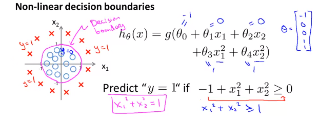  
  
일반적인 경우 logistic regression은 linear한 decision boundary 밖에 찾을 수 없다. (since logistic regression will only be able to find a linear decision boundary)  
따라서 Decision Boundary가 non-linear한 경우의 예는 위와 같다. ($\theta^Tx$) 는 feature 두개를($x_1$ $x_2$) 가지고Polynomial 한 변수를 사용했음에 유의 ($x_1^2$ $x_2^2$)  
$\theta$가 Decision Boundary 모양을 결정한다 training data가 하는게 아님.  
  
  
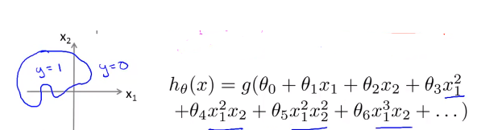  
Polynomial 한 feature를 더 복합적으로 사용하면 더 복잡한 모양의 Decision Boundary를 얻을 수 있다.   
  
---  
추측하기로 결국 이 3 장에서 할일은. training set x가 있을때 적절한 Decision Boundary함수 그래프 모형(?)을 선택하고 $\theta$ 를 구한다. 최적의 $\theta$는 당연히도 cost function $J(\theta)$를 최소화하는 값으로 구할것이다. 그렇게 해서 구해진 가설함수 $h_\theta(x)$는 주어진 x가 y=1영역인지 아닌지를 판단해준다. 확률값으로.  
  
  
  
## 3.5. Cost function  
---  
  
이번 챕터에서는 어떻게 적절한 parameter $\theta$를 구할수 있는지 알아본다.   
  
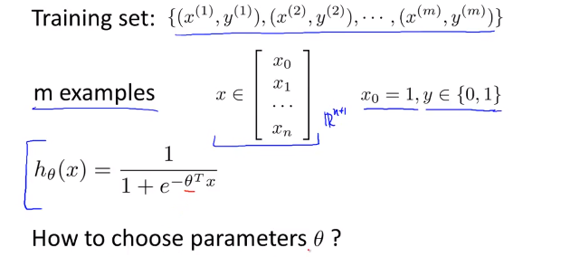  
> m개의 Training set이 위와같고,  feature 벡터 $x$ 가 위와 같을때.  $\theta$를 어떻게 선택할 수 있을까?  
  
Logistic regression의 cost function 은 다음과 같다.   
  
$$  
\begin{align*}& J(\theta) = \dfrac{1}{m} \sum_{i=1}^m \mathrm{Cost}(h_\theta(x^{(i)}),y^{(i)}) \newline & \mathrm{Cost}(h_\theta(x),y) = -\log(h_\theta(x)) \; & \text{if y = 1} \newline & \mathrm{Cost}(h_\theta(x),y) = -\log(1-h_\theta(x)) \; & \text{if y = 0}\end{align*}  
$$  
> y=1일때, y=0일때 다르다.   
  
$J(\theta)$는 training examples의 모든 $i$에 대한 합이고 하나의 $i$에 해당하는 Cost($h_\theta(x)$, y)는 예시는 아래와 같다.    
참고로 Linear regression에서 cost function은 "실제값과 예측값의 차이"였다. Logistic regression 에서는 log함수 형태를 선택했다. 예측값(y= 0또는 1)이 실제값(y= 0또는 1)과 가까우면 0이고 틀리면 무한대가 된다. 결국 개념상 예측값($h_\theta(x)$, y=1일 확률값) 과 실제값(y)의 차이인것은 동일하다.  Logistic regression은 실제값 y가 0또는 1밖에 없기 때문에 cost func를 두개로 나눌수 있는것.   
  
참고: m개의 training data가 필요한 시점은 언제부터 인가? 다시 말해 m개의 데이터를 통해 학습하는 단계는 언제부터인가?   
-> Cost function J($\theta$)를 계산하는 시점이다. J($\theta$)는 각 training set으로 부터 계산된 값을 모두 더해야하기 때문이다. 이 지점을 Learning 한다고 표현하는것 같다.   
  
만약 y=1일때 cost function $J(\theta)$는 아래와 같이 그릴 수 있다. x축인 $h_\theta(x)$ 의 범위는 0 에서 1사이이다.   
  
  
반대로 y=0일때는 다음과 같다.   
  
  
만약 y=1로 예측을 하는 cost 함수에서 $h_\theta(x) = 0$ 이 나오면 대단한 오류이기 때문에 cost즉 $J(\theta)$가 무한대이다.   
  
  
$$  
\begin{align*}& \mathrm{Cost}(h_\theta(x),y) = 0 \text{ if } h_\theta(x) = y \newline & \mathrm{Cost}(h_\theta(x),y) \rightarrow \infty \text{ if } y = 0 \; \mathrm{and} \; h_\theta(x) \rightarrow 1 \newline & \mathrm{Cost}(h_\theta(x),y) \rightarrow \infty \text{ if } y = 1 \; \mathrm{and} \; h_\theta(x) \rightarrow 0 \newline \end{align*}  
$$  
  
  
## 3.6. Simplified Cost Function and Gradient Descent  
---  
  
- Cost Function  
  
y=1일때와 0일때 경우로 나뉜 cost function은 아래와같이 하나의 식으로 합칠수 있다. y=1과 y=0을 대입해보면 동일하다.   
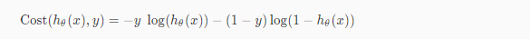  
  
그리고 $J(\theta)$는 아래와 같은 공식으로 나타낼 수 있다.   
  
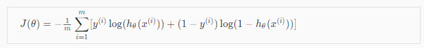  
  
이것을 Vectorized 하면 아래와 같다. 실제 Octave로 계산할때는 아래의 식을 사용한다.   
  
$$  
\begin{align*} & h = g(X\theta)\newline & J(\theta) = \frac{1}{m} \cdot \left(-y^{T}\log(h)-(1-y)^{T}\log(1-h)\right) \end{align*}  
$$  
  
  
- Gredient Descent 알고리즘.   
  
$\theta_j$ 를 구하는 알고리즘도 아래와 같다.   
  
$$  
\begin{align*}& Repeat \; \lbrace \newline & \; \theta_j := \theta_j - \alpha \dfrac{\partial}{\partial \theta_j}J(\theta) \newline & \rbrace\end{align*}  
$$  
  
편미분해서 도함수(Derivative)를 대입하면   
  
$$  
\begin{align*} & Repeat \; \lbrace \newline & \; \theta_j := \theta_j - \frac{\alpha}{m} \sum_{i=1}^m (h_\theta(x^{(i)}) - y^{(i)}) x_j^{(i)} \newline & \rbrace \end{align*}  
$$  
  
결국 Gredient Descent 알고리즘이 Linear regression과 완벽히 동일 하다!!    
(각 $\theta$ 값은 동시에(simultaniously) 계산되어야하는 것도 마찬가지)  
  
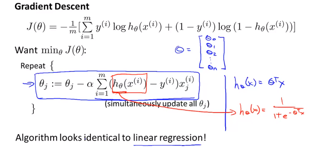  
> Linear regression 과 딱하나 __차이가 있다면 $h_\theta(x)$ 의 형태이다. __  
> - Linear regression  
>  $h_\theta(x) = \theta^Tx$    
> - Logistic regression  
>  $h_\theta(x) = {1 \over (1 + e^{-\theta^Tx})}$  
  
결국 Vectorized 하면  $\theta$는 아래와 같이 구할 수 있다.    
  
  
  
  
## 3.7. Advanced Optimization  
---  
  
For logistic regression, sometimes gradient descent will converge to a local minimum (and fail to find the global minimum). This is the reason we prefer more advanced optimization algorithms such as fminunc (conjugate gradient/BFGS/L-BFGS/etc).  
  
Octave 라이브러리 fminunc() 사용, theta vector를 Gradient descent보다 빨리 찾을 수 있음.  
https://www.coursera.org/learn/machine-learning/supplement/cmjIc/advanced-optimization  
  
## 3.8. Multi-Class Classification  
---  
  
아래 예와 같이, 이메일을 여러 태그로 분류하는 경우등, 두개 이상으로 분류하는 경우는 어떻게 하는지 알아보자.   
  
  
  
아래와 같이, 3가지로 분류해야 한다면, One vs All 형태의 가설함수를 3개를 만들면 된다. 그뒤에 예측할때는 x에대해서 세개의 가설함수 전부를 돌려보고 결과인 y=1일 확률이 가장 높은 class로 선택하면 된다.   
  
  
  
이것을 수식으로 표현하면  
  
$$  
\begin{align*}& y \in \lbrace0, 1 ... n\rbrace \newline& h_\theta^{(0)}(x) = P(y = 0 | x ; \theta) \newline& h_\theta^{(1)}(x) = P(y = 1 | x ; \theta) \newline& \cdots \newline& h_\theta^{(n)}(x) = P(y = n | x ; \theta) \newline& \mathrm{prediction} = \max_i( h_\theta ^{(i)}(x) )\newline\end{align*}  
$$  
  
>$h_\theta^{(0)}(x)$ 부터  $h_\theta^{(n)}(x)$ 까지 다 돌려보고 그중에 가장 큰값을 갖는 i를 선택하면 된다.    
  
  
  
## 3.9. Overfitting problem  
---  
  
### 3.9.1. Overfitting 이란?  
  
  
Feature를 많이 둘 수록 Training data을 더 정확히 모사할 수 있다.  하지만 가설함수가 너무 Training data에만 적합해서 Training data는 거의 정확하게 예측하지만 새로 들어온 데이터에 대해서는 예측을 못하는 문제가 발생할수 있다.  해당 가설함수로 문제를 일반화(generalize)하는것을 실패함.  
그림맨 왼쪽은 Underfit (high bias, preconception 이라고도 표현할수 있음), 오른쪽이 Overfit, 가운데가 적합함.  
  
강의 뒷편에서 학습알고리즘이 Overfitting인지 아닌지 분석하는 툴에대해 살펴볼 것이다.   
  
Feature가 너무 많을때 Overfitting이 발생할 수 있다. 해결책은 크게 두가지이다.   
  
- 1) Reduce the number of features:  
	- Manually select which features to keep.  
	- Use a model selection algorithm (studied later in the course).  
  
- 2) __Regularization__  
	- Keep all the features, but reduce the magnitude of parameters $\theta_jθ$   
	- Regularization works well when we have a lot of slightly useful features.  
	이번 장에서 다룰 내용  
  
### 3.9.2. Cost function  
  
  
  
  
  
Regularization 은 이렇게 cost function 에 특정$\theta_j$에 큰 가중치를 부여(패널티 부여)해서 최종적으로 $\theta_j$ 의 크기를 0에 가깝게 만드는것이다. 이렇게하면 4차 함수를 쓰더라도 2차함수 모델에 근접하게 만들 수 있다.   
  
  
  
  
그렇다면 어떤 $\theta_i$를 선택해서 Regularization할 것인가? 우리는 어떤게 맞는지 알수없다. 그래서  다음의 공식으로 모든 parameter  $\theta_i$에 대해서 값을 줄여(shrink)서 cost function값을 확인해 보는 것이다.  $J(\theta)$ 의 공식에 $\color{royalblue}{+ \lambda \sum_{i= 1}^{100} \theta_j^2}$ 부분이 추가된다.   
  
In regularized linear regression, we choose $\theta$ to minimize:   
  
$$  
J(\theta) = \frac{1}{2m} \sum_{i=1}^{m} \left( h_\theta( x^{(i)}) - y^{(i)} \right)^2 \color{royalblue}{+ \lambda \sum_{i= \color{red}{1}}^{100} \theta_j^2}  
$$  
  
The $\lambda$ is the regularization parameter. It determines how much the costs of our theta parameters are inflated.  
  
어떤 $\lambda$를 적용 했을때, 모든 $\theta$에대해서 가장 cost function이 작아지는지 확인?  
  
어떤 feature에 대한 parameter $\theta_j$ 가 있을때 그 파라미터에대해서  $J(\theta)$를 구해보면, 왼쪽항은 줄어들지만, 람다항 $+ \lambda \sum_{i= 1}^{100} \theta_j^2$은 커진다. 이 둘의 조합을 통해 결국 가장 작은 값을 갖는 $\theta_j$ 를 찾으면 overfitting을 방지한 $\theta$값을 찾을 수 있을 것이다.   
  
$\lambda$ 가 또 너무 커도 Underfitting이 발생할 수도 있음에 주의해야 한다.  
  
### 3.9.3. Regularized Linear Regression  
  
Overfitting 을 피하기 위해서 Linear Regression 에서 Regularized하는 방법에 대해 알아보자.   
  
Regularized 를 Gradient descent 알고리즘에 적용하면 다음과 같다. $\theta_0$인 경우는 seperated 되었다는점에 주의 (어차피 1이기 때문이다.)  
  
  
> 분홍색 부분은 $J(\theta)$를 편미분한 도함수이다. 증명은 생략한다.   
  
$\theta_j$ 항을 모아서 쓰면 다음과 같다.   
  
  
$1 - \alpha {\lambda \over m}$ 항(term)은 흥미로운 영향을 준다.  $1 - \alpha {\lambda \over m} < 1 $ 이다. 그리고  $\theta_j$ 자체를 약간 줄인다. 그 우측 항은 기존 gradient descent 와 동일하다.   
  
Normal Equation 은 어떻게 적용할 수있는지 살펴보자.   
간단하다 공식은 아래와 같다. L matrix 크기는  (n+1) x (n+1) 이다. (n:feature갯수)  
$$  
\begin{align*}& \theta = \left( X^TX + \lambda \cdot L \right)^{-1} X^Ty \newline& \text{where}\ \ L = \begin{bmatrix} 0 & & & & \newline & 1 & & & \newline & & 1 & & \newline & & & \ddots & \newline & & & & 1 \newline\end{bmatrix}\end{align*}  
$$  
  
  
### 3.9.4. Regularized Logistic Regression  
  
Overfitting 을 피하기 위해서 Logistic Regression 에서  Regularized하는 방법에 대해 알아보자.   
  
  
  
$h_\theta(x)$가 위와 같을때 Decision boundary는 매우 복잡할 것이고 trainig set에는 매우 적합하지만 새로운 데이터에는 과적합(Overfit) 하다.    
따라서 Regularized 된 cost function $J(\theta)$는 위와 같다. 기존의 $J(\theta)$에서 람다 항이 추가되었다.   
이것을 가지고 Gradient descent 알고리즘에 적용하면 다음과 같다.   
  
  
  
> $h_\theta(x)$ 함수의 형태가 linear regression과 다름에 유의.  
  
    
  
  
## ex2-1: Logistic Regression  
---  
  
### 0. ex2.m  
  
약식  
  
```matlab  
%% ============ Part 2: Compute Cost and Gradient ============  
% Add intercept term to x and X_test  
X = [ones(m, 1) X];  
  
% Initialize fitting parameters  
initial_theta = zeros(n + 1, 1);  
  
% Compute and display initial cost and gradient  
[cost, grad] = costFunction(initial_theta, X, y);  
  
%% ============= Part 3: Optimizing using fminunc  =============  
%  Set options for fminunc  
options = optimset('GradObj', 'on', 'MaxIter', 400);  
  
%  Run fminunc to obtain the optimal theta  
%  This function will return theta and the cost   
[theta, cost] = ...  
	fminunc(@(t)(costFunction(t, X, y)), initial_theta, options);  
% Plot Boundary  
plotDecisionBoundary(theta, X, y);  
  
%% ============== Part 4: Predict and Accuracies ==============  
prob = sigmoid([1 45 85] * theta);  
fprintf(['for a student with scores 45 and 85, we predict an admission ' ...  
         'probability of %f\n'], prob);  
% Compute accuracy on our training set  
p = predict(theta, X);  
fprintf('Train Accuracy: %f\n', mean(double(p == y)) * 100);  
```  
  
  
  
### 1. plotData.m  
  
```matlab  
function plotData(X, y)  
  
% Create New Figure  
figure; hold on;  
  
% ====================== YOUR CODE HERE ======================  
  
% find indeces of positive and negative examples  
pos = find (y == 1); neg = find(y == 0);  
  
%plot Examples  
plot(X(pos,1), X(pos, 2), 'k+', 'LineWidth', 2, 'MarkerSize', 7);  
plot(X(neg,1), X(neg, 2), 'ko', 'MarkerFaceColor', 'y', 'MarkerSize', 7);  
  
% =========================================================================  
hold off;  
  
end  
```  
  
### 2. sigmoid.m  
  
```matlab  
function g = sigmoid(z)  
%SIGMOID Compute sigmoid function  
%   g = SIGMOID(z) computes the sigmoid of z.  
  
% You need to return the following variables correctly   
g = zeros(size(z));  
  
% ====================== YOUR CODE HERE ======================  
% Instructions: Compute the sigmoid of each value of z (z can be a matrix,  
%               vector or scalar).  
  
g = 1 ./ (1 + e .^ -z);  
  
% =============================================================  
  
end  
```  
  
### 3. costFuncion.m  
  
```matlab  
function [J, grad] = costFunction(theta, X, y)  
  
% Initialize some useful values  
m = length(y); % number of training examples  
  
% You need to return the following variables correctly   
J = 0;  
grad = zeros(size(theta));  
  
% ====================== YOUR CODE HERE ======================  
  
nr_itter = 1000; 	% 100해도 결과같음  
alpha = 1; 		% 때려맞춤  
max_n = size(X,2);  
  
hx = X * theta;  
gx = sigmoid(hx);  
  
% Cost function J  
pos = -y .* log(gx);  
neg = (1 - y) .* log(1 - gx);  
J = (1 / m) * sum(pos - neg);  
  
% Gradient descent  
for i=1:nr_itter  
  
	for n=1:max_n  
		grad(n,1) = (alpha / m) * sum((gx - y) .* X(:,n));  
	end  
  
end  
  
% =============================================================  
  
end  
```  
> 이건 틀린답이다. fminunc() 를 사용한다면 itteration과 alpha 계산이 전혀 필요없다. 따라서 vectorized된 J()와 J()의 미분계수만 구하면 된다. 답은 아래와 같다.   
  
다음 두개의 vectorized 공식을 사용해야 한다.   
$$  
\begin{align*} & h = g(X\theta)\newline & J(\theta) = \frac{1}{m} \cdot \left(-y^{T}\log(h)-(1-y)^{T}\log(1-h)\right) \end{align*}  
$$  
  
  
  
-> sum() 사용하지 말고 traspose 해서 곱하면 된다. 둘다 결과물의 크기는 1X1이 됨.   
  
```matlab  
% Cost function J  
pos = -y' * log(gx);  
neg = (1 - y)' * log(1 - gx);  
J = (1 / m) * (pos - neg);  
  
% Gradient descent  
grad = (1/m) * X' * (gx - y);  
```  
  
### 4. predict.m  
  
```matlab  
  
function p = predict(theta, X)  
%   p = PREDICT(theta, X) computes the predictions for X using a   
%   threshold at 0.5 (i.e., if sigmoid(theta`*x) >= 0.5, predict 1)  
  
m = size(X, 1); % Number of training examples  
  
% You need to return the following variables correctly  
p = zeros(m, 1);  
  
% ====================== YOUR CODE HERE ======================  
gx = sigmoid(X * theta);  
  
for i=1:m  
	if gx(i,1) >= 0.5  
		p(i,1) = 1;  
	else  
		p(i,1) = 0;  
end  
  
% =========================================================================  
  
end  
```  
  
  
## ex2-2: Regularized Logistic Regression  
---  
  
Training data set이 Non-linear한 decision boundary를 가지고 있을때.  
  
### 1. mapFeature.m  
`중요` 기존 데이터 X를 가지고 polynomial feature를 생성한다. 이후에 X는 열은 28개가 된다. $m \times 28$   
training set을 더 잘 표현할수 있게 되었지만 Overfitting 위험성이 생겼다. 따라서 Regularized해야한다.   
  
```matlab  
  
function out = mapFeature(X1, X2)  
% MAPFEATURE Feature mapping function to polynomial features  
%  
%   MAPFEATURE(X1, X2) maps the two input features  
%   to quadratic features used in the regularization exercise.  
%  
%   Returns a new feature array with more features, comprising of   
%   X1, X2, X1.^2, X2.^2, X1*X2, X1*X2.^2, etc..  
%  
%   Inputs X1, X2 must be the same size  
%  
  
degree = 6;  
out = ones(size(X1(:,1)));  
for i = 1:degree  
    for j = 0:i  
        out(:, end+1) = (X1.^(i-j)).*(X2.^j);  
    end  
end  
  
end  
```  
  
### 1. costFunctionReg.m  
  
gradient descent를 할때 for 문을 사용해 반복 계산할 필요가 없다. 나중에 fminunc를 사용할때 알아서한다. 여기서는 한번의공식만 구하면된다.   
~~Regularziation logistic regression 의 gradient descent 공식이 내가 알던거랑 다른것 같음, 알아보기.~~확인 및 수정완료.  
  
```matlab  
  
function [J, grad] = costFunctionReg(theta, X, y, lambda)  
m = length(y); % number of training examples  
  
J = 0;  
grad = zeros(size(theta));  
  
% ====================== YOUR CODE HERE ======================  
  
hx = X * theta;  
gx = sigmoid(hx);  
  
% Cost function J  
pos = -y' * log(gx);  
neg = (1 - y)' * log(1 - gx);  
regular = lambda / (2 * m) * sum(theta(2:end) .^ 2);  
  
J = (1 / m) * (pos - neg) + regular;  
  
% Gradient descent  
  
grad = (1/m) * X' * (gx - y) + (lambda/m) .* theta;  
grad(1) = (1/m) * X(:,1)' * (gx - y);  
  
% =============================================================  
  
end  
```  
  
  
  
# 4. Neural Networks  
---  
  
## 4.1. 배경  
---  
  
이미 linear regression, logistic regression이 기계학습에 사용되고 있는데, 신경망 알고리즘은 왜 필요할까?  
  
  
  
feature가 늘어날수록 Polynomial 항들은 기하급수적으로 늘어난다. 연산속도나 복잡도등이 매우 높아진다. feature가 늘어날때, 비선형적 요소를 계속 추가하는것은 좋지 않다.   
  
logistic regression을 이용해서 자동차인지 아닌지 분류하는 non-linear boundary classification 예를 살펴보자.  
  
  
  
위,그림과 같이 컴퓨터 비전 문제는 결국 픽셀의 밝기등의 정보에 대한 matrix를 다루는 것이다. 그리고이 이미지에서 우리가 해결할것은 결국 이 matrix를 보고 이 숫자들이 자동차의 손잡이를 나타낸다고 말해줘야한다.   
  
  
다시 자동차로 돌아와서, 두개의 픽셀 위치를 선정해서 색깔을 값을 plotting한다고 해보자. 즉 feature가 2개다. 그렇게 여러종류의 사진을 plot해보면 아래와 같은 형태가 될 것이다.   
  
  
만약 50x50 픽셀 이미지가 있고 모든 픽셀을 feature로 선택한다면 feature갯수가 무려 2500개다. 만에하나 Quadratic feature($x_i \times x_j$)라도 사용한다면 300만개가 넘을 것이다. feature갯수가 증가하면 연산량뿐만 아니라 overfitting의 가능성도 높아진다.   
  
결국 n이 엄청 클때 복잡한 비선형 가설을 학습하는데 단순히 logistic regression을 사용하는것은 적합하지 않다. 복잡한 가설과 복잡한 비선형 가설에서도, n이 클때도 Neural Networks알고리즘을 통하면 이문제를 좀더 쉽게 해결할 수있다.   
  
결론: complex non-linear hypothesis를 구하기 위해서!  
  
  
## 4.2. 지난 내용 remind  
---  
  
- Logistic regression에서 $\theta^Tx$ 의 의미는 무엇인가?  
모든 input feature  $x_0$, $x_1$, ..., $x_n$ 에 각각 가중치  $\theta$ (parameter 또는 weight) 를 고려한 수치. 그렇게 만들어진 $\theta^Tx$ 는 결국 __Decision boundary 경계선__을 의미한다.   
  
## 4.3. Neuron model: Logistic Unit  
---  
  
  
  
뉴런 세포는 input(수상돌기, dendrites)과 output(축삭돌기, axon)이 있으며 이것을 위와 같이 수학적 모델로 나타낼 수 있다.  $x_1$,$x_2$,$x_3$는 input wire로 연결되어있고 가운데 원은 세포라고 볼수 있다. 그리고  $h_\theta(x)$ 로 향하는것이 output wire이다.  $h_\theta(x)$ 는 Logistic regression의 가설함수와 마찬가지로, Sigmoid 함수 $g(x)$의 형태를 띈다. 그리고 feature  $x$와  $\theta$ 벡터가 있다.  $\theta$는 Weight(가중치)라고 표현한다. 우리가 지금까지 Parameter라고 불렀던것과 동일하다.  $x_0$는 bias unit이라고 표현하며 항상 1의 값을 가지므로 굳이 나타내지 않아도 된다.  
이것이 하나의 뉴런을 나타낸 다이어그램이다.   
  
- NN 에서 $a_i^j$ 의 의미는 무엇인가?   
동일한 feature에 i마다 서로다른 가중치를 곱해 만들어진 Decision boundary 기준으로 어떤 side에 위치해 있는지 0, 1로 (혹은 확률값)으로 결과를 주는 함수 $g(z)$. 위 그림에서 $a_1^{(2)}$ 는 하나의 기준 ($\theta_1^{(1)}$)을 가지고 정한 하나의 "분류"   $a_2^{(2)}$ 도 마찬가지로 또다른 기준을 적용한 분류이다. 모두 동일한 feature에 서로다른 기준(가중치)를 반영해 만들어진것이다.   
하나의 logistic regression은 하나의 decision boundary를 가지고 있다. 하나의 logistic regression 의 hypothesis인 $a_i^j$ 는 고유의 decision boundary를 가지고 있는것이고, 결국 NN에서는 층(layer)별로 가지고 있는 desicion boundary들을 기준으로 추상화 시켜서 또다른 desicion boundary 를 생성시키는 것이다. 한마디로 층별로 새로운 desicion boundary 를 생성하는 것과 같다. 그리고 최종 desicion boundary는 최종 class 갯수만큼 나올것.   
  
  
## 4.4. Neural Network  
---  
  
그렇다면 여러개의 뉴런은 어떻게 표현할까?  
  
  
  
  
Layer 1은 input layer, Layer3은 output layer라고 부른다. input과 output이 아닌 layer는 Hidden Layer라고 부른다. 위 예제에서는 히든 레이어는 1개이나 두개가 될 수도 있다.    
  
이것을 수학적 정의로 나타내보자.   
  
  
  
Hidden Layer의 node를 $a_i^{(j)}$ 라고 표현하고 Activation unit이라고 부른다. __윗첨자 $(j)$는 layer 번호__이고, 아래첨자 __i는 feature번호__라고 볼수있다. $a_i^{(2)}$ 은 두번째 layer의 activation node이고, $a_i^{(3)}$ 은 세번째 layer의 activation node이다. 각 $a_i^{(j)}$ node가 갖는 $\Theta_{ab}^{(j)}$(weight)는 feature 별로(행 별로) 다를 수 있다. 참고로 각 activation node의 값은 sigmoid함수로 계산되기 때문에 0에서 1의 range를 갖는다.    
$\Theta_{ab}^{(j)}$ 에서 아래첨자 a,b는 $\Theta^{(j)}$ matrix의 행과 열을 의미한다. 크기가 $a \times b$ 인 matrix. 그리고 j번째 layer의 b번째 유닛에서 j+1번째 layer의 a번째 유닛으로 향하는 가중치를 의미한다.  (참고로 윗첨자 아래첨자 기준은 표기 하는 사람 마다 기준이 다른것같다.)  
  
$\Theta^{(j)}$는 각 feature에 따른 weight가 기록된 matrix이다. 크기를 구하는방법은 아래에서 다시 설명한다. 수학으로 표현하면 $\Theta^{(i)} \in \mathbb{R^{3\times4}}$  
참고: $\mathbb{R^n}$ : refers to the set of n-dimensional vectors of real numbers.    
  
Layer1의 $x$ 와  $\Theta^{(1)}$를 가지고 layer2의 $a_i^{(2)}$를 생성하고     
Layer2의 $a_i^{(2)}$ 와  $\Theta^{(2)}$를 가지고 layer3의 $a_i^{(3)}$를 생성한다.  
...  
  
결국 최종적으로  $h_\Theta(x)$ 는 $a_1^{(3)}$이 되고 $ g(\Theta_{10}^{(2)}a_0^{(2)} + \Theta_{11}^{(2)}a_1^{(2)} + \Theta_{12}^{(2)}a_2^{(2)} + \Theta_{13}^{(2)}a_3^{(2)}) $ 으로 계산된다.  $h_\Theta(x)$ 의 $\Theta$는 대문자임에 유의 regression에서의 가설함수와 다르다.  
  
이 과정을 간략하게 벡터로 표기하면  
$$  
\begin{bmatrix}x_0 \newline x_1 \newline x_2 \newline x_3\end{bmatrix}\rightarrow\begin{bmatrix}a_1^{(2)} \newline a_2^{(2)} \newline a_3^{(2)} \newline \end{bmatrix}\rightarrow h_\theta(x)  
$$  
  
아래에서  $\theta$ matrix의 크기는 몇$\times$몇 일까?   
  
만약 하나의 네트워크에서 layer$j$ 의 유닛 갯수가 $s_j$ , layer$j+1$의 유닛 갯수가 $s_{j+1}$개라면 matrix $\Theta^{(j)}$의 크기는 다음과 같이 구할 수 있다.   
$$  
s_{j+1} \times (s_j + 1)  
$$  
따라서, 위의 도식에서 $\Theta^{(1)}$ 의 크기는 4 $\times$ 3 이다.  
  
## 4.5. Forward propagation: Vectored Implementation  
---  
  
이것을 Forward propagation 이라고 한다.   
  
$$  
\begin{align*} a_1^{(2)} = g(\Theta_{10}^{(1)}x_0 + \Theta_{11}^{(1)}x_1 + \Theta_{12}^{(1)}x_2 + \Theta_{13}^{(1)}x_3) \newline a_2^{(2)} = g(\Theta_{20}^{(1)}x_0 + \Theta_{21}^{(1)}x_1 + \Theta_{22}^{(1)}x_2 + \Theta_{23}^{(1)}x_3) \newline a_3^{(2)} = g(\Theta_{30}^{(1)}x_0 + \Theta_{31}^{(1)}x_1 + \Theta_{32}^{(1)}x_2 + \Theta_{33}^{(1)}x_3) \newline h_\Theta(x) = a_1^{(3)} = g(\Theta_{10}^{(2)}a_0^{(2)} + \Theta_{11}^{(2)}a_1^{(2)} + \Theta_{12}^{(2)}a_2^{(2)} + \Theta_{13}^{(2)}a_3^{(2)}) \newline \end{align*}  
$$  
  
이것을 수학적으로 더 간단히 표현해보자.   
g()가 계산하는 항을 간단히 $z_i^{(j)}$라고 표현해보자.   
  
$$  
\begin{align*}a_1^{(2)} = g(z_1^{(2)}) \newline a_2^{(2)} = g(z_2^{(2)}) \newline a_3^{(2)} = g(z_3^{(2)}) \newline \end{align*}  
$$  
  
즉 z를 일반화하면 다음과 같다.   
  
$$  
z_k^{\color{red}(2)} =   
\Theta_{k,0}^{\color{red}(1)}x_0 +  
\Theta_{k,1}^{\color{red}(1)}x_1 + ... +  
\Theta_{k,n}^{\color{red}(1)}x_n   
$$  
  
그리고 이것은 많이 보았던 형태로, 다음 벡터의 곱으로 표현될 수 있다!  
$$  
\begin{align*}x = \begin{bmatrix}x_0 \newline x_1 \newline\cdots \newline x_n\end{bmatrix} &z^{(j)} = \begin{bmatrix}z_1^{(j)} \newline z_2^{(j)} \newline\cdots \newline z_n^{(j)}\end{bmatrix}\end{align*}  
$$  
  
## 4.6. Neural Network Learning its Own Features  
---  
  
  
  
  
> 만약 Layer1을 가린다면 계산은 Logistic regression과 동일하다.   
  
그리고 흥미로운 점은 node a1, a2, a3은 그들 스스로 input node들로부터 학습한 결과라는 점이다.  (And the cool thing about this, is that the features a1, a2, a3, they themselves are learned as functions of the input. )  
  
반면 NN이 Logistic regression보다 뛰어난점은 Logistic regression에서 처럼 Layer 1의 $x_1, x_2, x_3$ feature에 제약조건을 걸지 않더라도, 새로운 그것만의 feature $a_1, a_2, a_3$를 만들(학습시킬)수 있다. $x_1x_2$ 같은 polynomial feature를 생성하지 않고도 말이다. 그래서 결국 더 나은 hypothesis 를 사용할 수 있게 된다.   
  
Logistic regression에서는 각 feature $x_i$에 해당하는 가중치  $\theta$를 어떻게 정하느냐에 따라서, 그리고 training data들을 더 잘 모사하는 가설함수를 만들기 위해 어떤 polynomial feature를 추가하느냐에 따라서, 예측결과의 정확도가 높아지는데, 그것은 어렵고 연산량만 많아진다.   
Neural network는 이런 까다로운 작업 필요없이 각 layer단계에서 적절한  $\Theta$ matrix(가중치)를 선택하여 layer 단계별로 더 유용하게 추상화하여 결국 최종 예측을 더 정확하게 한다는 의미인듯하다.   
  
## 4.7. Examples  
---  
  
### OR function  
  
Sigmoid 함수의 결과는 0과 1이 될 수 있다.  NN을 통해 0과 1을 다루는 디지털 논리게이트를 모델링 할 수 있다.   
  
  
> $z = 4.6$ 이상이면 1에 가깝고,   
> $z = -4.6$ 이하면 0에 가깝다.   
  
  
> 가중치(weight)는 화살표에 나타내면 좀 더 직관적이다.   
  
이것을 수학적으로 표현하면  
$$  
\begin{align*}\begin{bmatrix}x_0 \newline x_1 \newline x_2\end{bmatrix} \rightarrow\begin{bmatrix}g(z^{(2)})\end{bmatrix} \rightarrow h_\Theta(x)\end{align*}  
$$  
  
그리고 아래와 같은 결과가 도출되어 OR에 해당하는 진리표와 결과가 같다.   
$$  
\begin{align*}& h_\Theta(x) = g(-30 + 20x_1 + 20x_2) \newline \newline & x_1 = 0 \ \ and \ \ x_2 = 0 \ \ then \ \ g(-30) \approx 0 \newline & x_1 = 0 \ \ and \ \ x_2 = 1 \ \ then \ \ g(-10) \approx 0 \newline & x_1 = 1 \ \ and \ \ x_2 = 0 \ \ then \ \ g(-10) \approx 0 \newline & x_1 = 1 \ \ and \ \ x_2 = 1 \ \ then \ \ g(10) \approx 1\end{align*}  
$$  
  
### The others  
  
아래와 같은 parameter로 OR 뿐만아니라, AND, NOR도 가능.  
  
$$  
\begin{align*}AND:\newline\Theta^{(1)} &=\begin{bmatrix}-30 & 20 & 20\end{bmatrix} \newline NOR:\newline\Theta^{(1)} &= \begin{bmatrix}10 & -20 & -20\end{bmatrix} \newline OR:\newline\Theta^{(1)} &= \begin{bmatrix}-10 & 20 & 20\end{bmatrix} \newline\end{align*}  
$$  
  
아래의 모델로 $(NOT x_1) AND (NOT x_2)$의 형태도 구현이 가능하다.   
  
  
- XNOR  
  
두개의 Layer를 두면 더 복잡한 논리게이트 연산도 가능하다.   
  
$$  
\begin{align*}\begin{bmatrix}x_0 \newline x_1 \newline x_2\end{bmatrix} \rightarrow\begin{bmatrix}a_1^{(2)} \newline a_2^{(2)} \end{bmatrix} \rightarrow\begin{bmatrix}a^{(3)}\end{bmatrix} \rightarrow h_\Theta(x)\end{align*}  
$$  
  
$\Theta^{(1)}$ matrix에서(즉, layer1에서) AND와 OR를 사용하고   
  
$$  
\Theta^{(1)} =\begin{bmatrix}-30 & 20 & 20 \newline 10 & -20 & -20\end{bmatrix}  
$$  
  
$\Theta^{(2)}$ matrix에서(layer2에서)OR를 사용하면   
  
$$  
\Theta^{(2)} =\begin{bmatrix}10 & -20 & -20\end{bmatrix}  
$$  
  
아래와 같은 진리표를 얻을 수 있다!  
  
  
  
  
### Multiclass Classification  
  
NN을 통해 하나 이상의 Category로 구분할 수도 있다.    
  
다음은 NN을 이용해 수기로 쓴 번호를 인식한 것이다. 이것도 0부터 9까지 10개의 기호를 분류하는 Multiclass Classification 이다.    
  
  
> by Yann LeCun  
  
가운데 보이는 9는 input layer이다. 왼쪽에 보이는 것이 보다 추상화 시킨 Hidden layer 1 그리고 그 다음단계 Hidden layer2, 그 다음단계 Hidden layer3 이된다. 그리고 최종 output은 answer: 9 이다. (이것은 마치 대상에서 점차 의미를 제거하는것과 동일하다. 단계별 추상화의 최종 결과물에는 모든 의미가 사라지고 기호만이 남는다. 이것이 뇌의 근본 동작원리라면, 인간의 결국 뇌는 의미 제거장치인 것이다. 참고: 인포메이션, 제임스 글릭)  
  
  
  
만약 4개의 사진을 분류한다고 하면, 여러 layer를 거쳐 나온 최종 결과물은 4개의 $4 \times 1$ 벡터 이다.   
  
  
  
최종 결과는 y 벡터로 표현가능하다.   
  
  
  
  
  
  
## ex3-1 Multi-class classification  
---  
  
### lrCostFunction.m  
  
```matlab  
function [J, grad] = lrCostFunction(theta, X, y, lambda)  
...(중략)  
  
hx = X * theta;  
gx = sigmoid(hx);  
  
% Cost function J  
pos = -y' * log(gx);  
neg = (1 - y)' * log(1 - gx);  
regular = lambda / (2 * m) * sum(theta(2:end) .^ 2);  
  
J = (1 / m) * (pos - neg) + regular;  
  
% Gradient descent  
  
grad = (1/m) * X' * (gx - y) + (lambda/m) .* theta;  
grad(1) = (1/m) * X(:,1)' * (gx - y);  
```  
  
### oneVsAll.m  
  
```matlab  
  
function [all_theta] = oneVsAll(X, y, num_labels, lambda)  
...(중략)  
  
for c = 1:num_labels  
	initial_theta = zeros(n + 1, 1);  
  
	% Set options for fminunc  
	options = optimset('GradObj', 'on', 'MaxIter', 50);  
  
	% Run fmincg to obtain the optimal theta  
	% This function will return theta and the cost   
	[theta] = ...  
		fmincg (@(t)(lrCostFunction(t, X, (y == c), lambda)), ...  
			initial_theta, options);  
  
	all_theta(c,:) = theta';  
end  
```  
> ' 위에서 만든 lrCostFunction 을 가지고 num_labels 갯수만큼 반복한다. fmincg는 최적의 parameter $\Theta$를 찾아줄것이고 1x401 크기의 결과($\Theta$)를 줄 것이다. feature가 401개 였기 때문에 그에 상응하는 parameter(weight)의 갯수도 401개. 결과는 단지 all_theta에 반복 횟수만큼 row가 추가되는것. 이 결과 all_theta를 가지고 predict 할것이다.    
  
### predictOneVsAll.m  
  
  
```matlab  
function p = predictOneVsAll(all_theta, X)  
...(중략)  
  
gx = sigmoid(X * all_theta');  
[max_pobability_one_example, class_in_one_example] = max(gx, [], 2);  
p = class_in_one_example;  
```  
X : 5000 X 401  
all_theta : 10 X 401  
gx : 5000 X 10  
matrix gx의 각 row의 의미: 한 training set의 가설함수 $h_\theta(x)$ 의 결과가 0~9 순서로 10개 저장되어있다. 해당 training set이  0~9 숫자일확률이 각각 들어있다.   
max(gx, [], 2); 를 하면 첫번째 결과물은 해당 row의 max 값이고 두번째는 그 max값의 index를 리턴한다. 그게 최종 우리의 예측 값.   
  
  
## ex3-2 Neural Networks  
---  
  
### predict.m  
  
```matlab  
  
% Add ones to the X data matrix  
X = [ones(m, 1) X];  
a2 = sigmoid(X * Theta1');  
  
% Add ones to the a2 data matrix  
a2 = [ones(m, 1) a2];  
a3 = sigmoid(a2 * Theta2');  
  
[max_pobability_one_example, class_in_one_example] = max(a3, [], 2);  
p = class_in_one_example;  
```  
Layer가 3개인 NN은 Logistic regression을 단계별로 두번 하는것과 동일하다.     
그렇게 해서 구해진 a3 벡터는  $h_\Theta(x)$ 벡터이다.     
X : 5000 x (400+1) (1 열 추가함)    
Theta1 : 25 x 401    
a2 : 5000 x (25+1) (1 열 추가함)    
Theta2 : 10 x 26    
a3 : 5000 x 10     
즉 predictOneVsAll.m 경우처럼 한 row의 크기가 10이고 각각에는 0~9 에 해당하는 확률값이 들어있다.     
  
  
  
# 5. Neural Networks: Learning  
---  
  
  
## 5.1 Cost function  
---  
  
  
  
두종류의 classification 에대해서 알아볼것이다. 하나는 이진 분류, 나머지하나는 멀티 분류이다. 최종 분류되는 종류 Class갯수는 $K$로 나타낸다. 따라서 $h_\theta(x)$ 는 $K$ 차원 벡터다.   
  
중요한점: 예측 값 y 벡터는 class갯수 K의 크기를 갖는 벡터다.  $K \times 1$ 의 크기를 갖는다. 한 벡터는 위 그림처럼 최종 분류된 하나의 class만 1이고 나머지는 0으로 구성된다.   
  
용어 정리.  
  
$L$ = total number of layers in the network  
$s_l$ = number of units (not counting bias unit) in layer l  
$K$ = number of output units/classes  
  
Logistic regression의 경우, cost function은 다음과 같이 정의 했었다.    
  
  
$$  
J(\theta)   
= -\frac{1}{m}   
\sum_{i=1}^{m} \left[   
y^{(i)} \log h_\theta ( x^{(i)} )   
+ \left( 1-y^{(i)}  \right)  \log \left(  1-h_\theta ( x^{(i)}) \right)  
\right]   
+ \frac{\lambda}{2m} \sum_{j=1}^{n} \theta_{j}^{2}  
$$  
  
Neural Network에서는 다음과같이 정의한다.   
  
$$  
h_\theta(x) \in \mathbb{R}^k, \quad   
\left( h_\theta (x) \right)_i = i^{\mathrm{th}} \text{ output}  
$$  
  
윗첨자 $i$는 $i$ 번째 output을 의미한다($i \leq m$). $(h_\theta(x))_i$의 $i$는 $h_\theta(x)$ 의 $i$번째 element 를 의미 ($i \leq m$)  
$h_\theta(x)$ 는 $K$ 차원 벡터  
  
$$  
J(\theta)   
= -\frac{1}{m} \left[   
\sum_{i=1}^{m} {\color{royalblue}{\sum_{k=1}^{K}}}  y_{\color{royalblue}{k}}^{(i)}   
\log { {\left( h_\theta ( x^{(i)} ) \right)}_{\color{royalblue}{k}} }  
+ \left( 1-y_{\color{royalblue}{k}}^{(i)}  \right)   
\log \left(  1-h_\theta ( x^{(i)}) \right)_{\color{royalblue}{k}}  
\right]   
+ \frac{\lambda}{2m}   
{\color{royalblue}{\sum_{l=1}^{L-1} \sum_{i=1}^{s_L}}} \sum_{j=1}^{s_{L+1}} \color{royalblue}{(\Theta_{ji}^{(l)})^2}  
$$  
  
${\color{royalblue}{\sum_{k=1}^{K}}}$ : 는 class가 K 개 이므로 K개의 output을 모두 더함을 의미한다. 그래서 각 항에 아랫첨자 $k$가 존재한다. $y_k$ 는 각 가설함수에 상응하는 k번째 실제값이다.   
  
${\color{royalblue}{\sum_{l=1}^{L} \sum_{i}^{}}} \sum_{j=1}^{n} \color{royalblue}{(\Theta_{ji}^{(l)})^2}$ : 항은 Regularization 용이며, 모든  $\Theta$ 요소를 다 더한다는 의미이다.  $\Theta$가 각 레이어 마다 $s_{L+1} \times (s_L + 1)$ 크기 만큼 있기 때문이다.   
참고로 여기서 $j$ 는 계산될 layer 유닛 번호, $i$는 현재 layer 유닛 번호이다.   
  
- Initial parameter $\Theta$  
우리는 시작할때 완전히 랜덤값의 weight $\Theta$를 가지고 시작할것이다. gradient descent 가 반복될때마다. 올바른 $Theta$ 값이 선택될(학습될)것이다. 그런데 먼저 gradient를 계산해야한다. 그때 필요한것이 Backpropagation Algorithm 알고리즘이다.   
  
## 5.2. Backpropagation Algorithm  
---  
  
머신러닝은  cost function J()에 대한 미분을 계산해야한다. Backpropagation는 이 미분을 효율적으로 계산하는 방법이다.  늘 그랫듯이, parameter $\theta$를 학습하기 위해, cost function J()를 최소화해야 하는데 Backpropagation 이 그것을 위한 방법이다.   
  
Input layer에서 출발해서 output을 구하는 forward propagation과는 반대로, BP는 output layer에서 시작한다. 즉, 마지막 결과의 'error'를 먼저 구하고, 해당 error 값을 이용해 각각의 node에서의 error 를 계산한다.(https://wikidocs.net/4262)  
  
  
  
  
결국 계산해야할 값은 cost function J()와 J()의 미분도함수(gradient)이다.   
  
이전에 보았듯이 Forword propagation은 아래와 같이 계산된다.   
  
  
  
BP의 에러값 $\delta$는 다음의 그림을 보면 직관적이다. 최종 결과물의 오차는 단순하다. (output - expected) 이다. 이 오차는 누적된것일 것이고, 그 오차들을 이전레이어부터 추적하는것이다. 그렇게 오차를 최소화 하는 방향으로 $\Theta$ 를 구할 수 있을것.    
  
> (출처 : http://andrew.gibiansky.com/blog/machine-learning/machine-learning-neural-networks/)  
  
만약 $w(6,2)$이 매우 크다면, 매우 큰 output2 가 만들어질 것이고 이것은 매우 큰 Error2를 만든다. 이것은 BP를 할때 큰 비중이 할당될 것이다.   
  
  
어쨋든 BP를 마치면 모든 유닛에 $\delta$를 구했다면 cost fuction J()의 Gradient(미분도함수)가 나온다.    
  
Back propagation은 다음과 같이 계산한다.  __$\delta$ 는 l 레이어에 있는 node j 에 오류가 있는지를 의미한다. __  
Layer가 4개인 경우, $\delta^{(4)}$ 는 단순하게 a(4) 에서 label y 를 뺀값이나, 다음 $\delta^{(3)}$ 부터는 가중치($\Theta$)를 고려해서 계산된다. $\delta^{(l)} = ((\Theta^{(l)})^{T} \delta^{(l+1)}) .* g'(z^{(l)})$  
 $g'(z^{(3)})$ 은 미분도함수로  $g'(z^{(l)}) = a^{(l)}.*(1 - a^{(l)})$ 과 같이 계산된다.   $\delta^{(1)}$ 는 계산하지 않는다.'   
  
  
  
최종적으로 위의 계산을 마치면, 만약 $\lambda = 0$ 일때, 아래와 같은 결과가 나옴을 증명할 수 있다~~(고 한다)~~.   
  
$$  
\dfrac{\partial }{\partial \Theta_{i,j}^{(l)}}J(\Theta) = a_j^{(l)}\delta_i^{(l+1)}  
$$  
  
  
이것을 계산하는 BP 알고리즘은 아래와 같다. 이것은결국 cost function J()의 미분도함수를 계산 하는 과정이다.    
  
  
  
$\Delta$ 는 $a_j^{(l)}\delta_i^{(l+1)}$ 를 누적해서 더한것을 의미한다. (그래서 0으로 초기화해서 시작)  
순서대로 살펴보면 먼저 Forward propagation 을 하여  $a^{(l)}$ 계산을 마친다.   
그 뒤에 back propagation으로  각 $\delta$ 를 구한다.   
그리고 그 두항을 곱해서 $\Delta$에 누적해서 더한다. (j = 0) 이 아닐때는 regularization \lambda 항이 추가됨에 유의 j = 0일때는 bias 항이기 때문에 필요없음.   
그렇게 해서 나온 결과를 $D_{ij}^{(l)}$ 라고 표현할 것이다.   
$D_{ij}^{(l)}$ 가 결국 cost function J() 의 미분도함수가 되는것이다.    
  
$$  
D_{i,j}^{(l)} = \dfrac{\partial J(\Theta)}{\partial \Theta_{i,j}^{(l)}}  
$$  
  
BP 이해 추천 사이트:  
https://www.youtube.com/watch?v=Ilg3gGewQ5U    
http://neuralnetworksanddeeplearning.com/    
http://neuralnetworksanddeeplearning.com/chap2.html  
  
## 5.3. Backpropagation Intuition  
---  
  
Backpropagation 의 의미를 좀 더 이해해보자.   
먼저 FP의 경우 $z_1^{(3)}$은 아래와 같이 가중치를 곱한 형태로 계산됨을 이미 살펴보았다. BP또한 방향만 반대 일뿐 매우 유사하다. $\delta$ 를 방향만 반대로 계산 하는것이다.    
  
  
  
BP는 아래와 같이 반대로 계산된다. $\delta_2^{(2)}$는 layer 3을 향하는 가중치($\Theta$)를 곱해서 계산된다. $\delta_2^{(3)}$ 도 마찬가지다.  bias unit은 계산되지 않음에 유의  
  
  
  
  
## 5.4. Backpropagation in Practice  
---  
  
Octave에서 실제로 어떻게 사용하는지 알아보자.   
  
### 5.4.1. A. Implementation Note: Unrolling Parameters  
  
결국 NN 에서는 아래의 matrix를 이용하게 된다.  $\theta$는 weitght, $D$ 는 cost function J()의 미분 도계수를 의미한다.   
$$  
\begin{align*} \Theta^{(1)}, \Theta^{(2)}, \Theta^{(3)}, \dots \newline D^{(1)}, D^{(2)}, D^{(3)}, \dots \end{align*}  
$$  
  
  
  
fminunc() 등을 사용해 optimizing 하기 위해서 아래와 같이 각 matrix를 하나의 벡터로 합친다(unroll)  
  
```matlab  
thetaVector = [ Theta1(:); Theta2(:); Theta3(:); ]  
deltaVector = [ D1(:); D2(:); D3(:) ]  
```  
  
각 matrix는 아래와 같은 명령으로 다시 분리할 수 있다.   
  
```matlab  
Theta1 = reshape(thetaVector(1:110),10,11)  
Theta2 = reshape(thetaVector(111:220),10,11)  
Theta3 = reshape(thetaVector(221:231),1,11)  
```  
  
  
예를들어 3개의 레이어가 있고 각 unit의 갯수가 다음과 같다고 할때 아래와 같이 나타낼 수 있다.   
  
  
  
결국 이전 챕터에서 살펴 보았던 BP알고리즘을 더욱 간단히 도식화 하면 다음과 같다.   
fminunc() 의 parameter인 @costFunction이 cost J($\Theta$)와 그의 미분계수 $D$를 구하는 함수다.   
  
  
  
  
### 5.4.2. Gradient Checking  
  
BP에 문제가 없는지 확인할 수있는 방법이다. 항상 사용됨.   
  
  
  
$\Theta$가 하나일때 2$\epsilon$ 만큼 떨어진 두 지점의 기울기를 이용하면 J() 의 미분계수를 추정할 수 있을것이다. 그리고 Octave에서 다음과 같이 implement 된다.   
  
```matlab  
gradAppros = (J(theta + EPSILON) - J(theta - EPSILON)) / (2*EPSILON)  
```  
  
멀티 parameter인 경우로 보다 일반화하면 다음과 같다.   
  
  
  
그리고 Octave에서 다음과 같이 implement 된다.   
  
```matlab  
epsilon = 1e-4;  
for i = 1:n,  
  thetaPlus = theta;  
  thetaPlus(i) += epsilon;  
  thetaMinus = theta;  
  thetaMinus(i) -= epsilon;  
  gradApprox(i) = (J(thetaPlus) - J(thetaMinus))/(2*epsilon)  
end;  
```  
  
그리고 Gradient Checking으로 계산된 gradApprox(i)과 BP로 계산된 미분계수 $D$벡터가 같은지 확인하면 되는것이다.   
  
gradApprox(i) = DVec   
  
따라서 Gradient Checking을 사용하는 방법을 정리하면 다음과 같다.   
  
  
  
다시 Training하기 전에 Gradient Checking을 끄지 않으면 엄청 느려질 수 있음에 주의해야한다.   
Once you have verified once that your backpropagation algorithm is correct, you don`t need to compute gradApprox again. The code to compute gradApprox can be very slow.  
  
  
### 5.4.3. Random Initialization  
  
기존처럼 $\Theta$ 의 초기값을 0으로 정하는것은 NN에서 동작하지 않는다. 그이유는 잘 이해하지 못했음.  따라서 다음과 같이 $\Theta$의 초기값을 구한다. 결과적으로 $\Theta$ 의 범위는 $-\epsilon$ ~ $\epsilon$ 이 될 것이다.   
  
  
  
Octave로 implement 하면:  
  
```matlab  
If the dimensions of Theta1 is 10x11, Theta2 is 10x11 and Theta3 is 1x11.  
  
Theta1 = rand(10,11) * (2 * INIT_EPSILON) - INIT_EPSILON;  
Theta2 = rand(10,11) * (2 * INIT_EPSILON) - INIT_EPSILON;  
Theta3 = rand(1,11) * (2 * INIT_EPSILON) - INIT_EPSILON;  
```  
> rand(x,y) is just a function in octave that will initialize a matrix of random real numbers between 0 and 1.  
  
  
### 5.4.4. Putting it Together  
  
지금까지 NN에서 다룬 내용을 모두 종합해보자.   
  
첫번째로 적절한 Network architecture를 선택한다. 그것은 다음을 선택하는것이다.    
- Input Unit 갯수  
- Output Unit 갯수  
- layer 당 hidden unit 갯수 (많을수록 성능 향상, 연산 cost 증가)  
  
  
Training a Neural Network  
  
1. __Randomly initialize__ the weights  
2. Implement __forward propagation__ to get $h_\Theta(x^{(i)})$  
3. Implement the __cost function__  
4. Implement __backpropagation__ to compute partial derivatives  
4번까지 정리하면 이런 모양  
  
  
5. Use __gradient checking__ to confirm that your backpropagation works. Then disable gradient checking.  
6. Use __gradient descent__ or a __built-in optimization function__ to minimize the cost function with the weights in theta.  
  
  
  
최고점은 $h_\theta(x)^{(i)}$ 가 실제 값 $y^{(i)}$ 와 가장 차이가 큰 것이고, 최저점은  $h_\theta(x)^{(i)}$ 가 실제 값 $y^{(i)}$ 에 가장 가깝다는 뜻이다.    
gradient descent는 기울기를 하강하는 것이고, BP는 기울기를 하강할때 방향을 설정하는것과 같다.   
  
  
## ex4-1 : neural networks  
---  
  
### 1. feedforward and cost function (without regularization)  
> nnCostFunction.m  
  
```matlab  
  
function [J grad] = nnCostFunction(nn_params, ...  
                                   input_layer_size, ...  
                                   hidden_layer_size, ...  
                                   num_labels, ...  
                                   X, y, lambda)  
  
Theta1 = reshape(nn_params(1:hidden_layer_size * (input_layer_size + 1)), ...  
                 hidden_layer_size, (input_layer_size + 1));  
  
Theta2 = reshape(nn_params((1 + (hidden_layer_size * (input_layer_size + 1))):end), ...  
                 num_labels, (hidden_layer_size + 1));  
  
% ====================== YOUR CODE HERE ======================  
% Instructions: You should complete the code by working through the  
%               following parts.  
%  
% Part 1: Feedforward the neural network and return the cost in the  
%         variable J. After implementing Part 1, you can verify that your  
%         cost function computation is correct by verifying the cost  
%         computed in ex4.m  
%  
  
% Calculate h(x) through the forward propagation   
X = [ones(m, 1) X];		% X: 5000x(400+1)  
a2 = sigmoid(X * Theta1');	% theta1: 25x401  
  
a2 = [ones(m, 1) a2];		% a2: 5000x(25+1)  
a3 = sigmoid(a2 * Theta2');	% theta2: 10x26  
				% a3: 5000x10  
				% h(x) == a3   
				% a3의 하나의 row에서 1열 ~ 10(K)열은 각각이 class를 나타냄. 1 ~ 10까지  
				% 따라서 Y(5000x10) 의 각 열은 1부터 10으로 채워져야함 -> 아님.  
% Generate Y: 오답  
%Y = zeros(m, num_labels);  
%for i=1:m  
%	for j=1:num_labels  
%		Y(:,j) = j;  
%	end  
%end  
  
% Generate Y: 정답  
% 하나의 row는 하나의 y 벡터여야함. 결과값 y(10x1) 벡터는 하나만 1이고 나머지는 0임.  
% Y는 y'한것을 m(row갯수) 만큼 이어붙임 '  
I = eye(num_labels);  
Y = zeros(m, num_labels);  
for i=1:m  
	Y(i, :)= I(y(i), :);  
end  
  
% Cost function J1  
  
pos = -Y .* log(a3);		% Y: 5000x10, a3: 5000x10  
				% Y .* a3: 5000x10  
neg = (1 - Y) .* log(1 - a3);  
  
J = (1/m) * sum(sum(pos - neg,2),1);  
```  
  
### 2. regularized cost function  
  
```matlab  
  
% Cost function J + regularization  
% theta1: 25x401  
% theta2: 10x26  
  
Theta1Reg = Theta1(:,2:size(Theta1,2));  
Theta2Reg = Theta2(:,2:size(Theta2,2));  
  
Reg = sum(sum((Theta1Reg).^2, 2)) + sum(sum((Theta2Reg).^2, 2));  
J = J + (lambda/(2*m))*Reg;  
```  
  
## ex4-2 Backpropagation  
---  
  
### 1. sigmoid gradient  
  
```matlab  
gz = sigmoid(z);  
g = gz .* (1 - gz);  
```  
  
### 2. Random initialization  
  
```matlab  
epsilon_init = 0.12;  
W = rand(L_out, 1 + L_in) * 2 * epsilon_init - epsilon_init;  
```  
  
### 3. Backpropagation  
  
```matlab  
  
% -------------------------------------------------------------  
% Part 2: Implement the backpropagation algorithm to compute the gradients  
%         Theta1_grad and Theta2_grad. You should return the partial derivatives of  
%         the cost function with respect to Theta1 and Theta2 in Theta1_grad and  
%         Theta2_grad, respectively. After implementing Part 2, you can check  
%         that your implementation is correct by running checkNNGradients  
%  
%         Note: The vector y passed into the function is a vector of labels  
%               containing values from 1..K. You need to map this vector into a   
%               binary vector of 1's and 0's to be used with the neural network  
%               cost function.  
%  
%         Hint: We recommend implementing backpropagation using a for-loop  
%               over the training examples if you are implementing it for the   
%               first time.  
  
for t=1:m  
	% 1. feedforward   
	a_1 = X(t,:)';		% t-th training set x^t  
				% a_1: (401)x1  
	z_2 = (Theta1 * a_1);	% theta1: 25x401  
	a_2 = sigmoid(z_2);	% z_2: 25x1   
  
	a_2 = [1 ; a_2];	% a_2: (25+1)x1  
	z_3 = (Theta2 * a_2);	% theta2: 10x26   
	a_3 = sigmoid(z_3);	% a_3: 10x1  
  
	% 2. delta of output unit  
	d_3 = a_3 - Y(t,:)';	% d_3: 10x1  
	% 3. delta of hidden layer l=2  
	z_2 = [1 ; z_2];				% z_2: (25+1)x1  
	d_2 = (Theta2' * d_3) .* sigmoidGradient(z_2);	% d_2: 26x1  
	% 4. accumulate gradient   
	d_2 = d_2(2:end);				% d_2: (26-1)x1  
	Theta2_grad = Theta2_grad + d_3 * a_2';		% 10x1 * 1x26  
	Theta1_grad = Theta1_grad + d_2 * a_1';		% 25x1 * 1x401  
end  
  
% 5. obtain final gredient  
Theta2_grad = Theta2_grad ./ m;  
Theta1_grad = Theta1_grad ./ m;  
  
```  
  
### 4. Regularizaed Neural networks  
  
```matlab  
  
% -------------------------------------------------------------  
% Part 3: Implement regularization with the cost function and gradients.  
%  
%         Hint: You can implement this around the code for  
%               backpropagation. That is, you can compute the gradients for  
%               the regularization separately and then add them to Theta1_grad  
%               and Theta2_grad from Part 2.  
%  
  
Theta2_grad(:,2:end) = Theta2_grad(:,2:end) + (lambda/m)*Theta2(:,2:end);  
Theta1_grad(:,2:end) = Theta1_grad(:,2:end) + (lambda/m)*Theta1(:,2:end);  
  
Theta2_grad(:,1) = Theta2_grad(:,1);  
Theta1_grad(:,1) = Theta1_grad(:,1);  
  
```  
  
## ex4.m  
---  
  
위에서 구현한 costFunction 을 가지고 fmincg 돌리면 $\Theta$ 구해짐.   
  
```matlab  
[nn_params, cost] = fmincg(costFunction, initial_nn_params, options);  
```  
  
  
  
  
  
# 6. Advice for Applying Machine Learning  
  
  
  
만약 housing price 문제를 ML로 해결한다고 할때, 성능 개선을 위해서 위와같은 전략들을 시도해볼 수 있을것이다.   
그러나 이 방법들을 무작정 시도하기보다는 체계적으로 사용하는것이 효율적일 것이다. 6장에서는 다음 두가지로 어떻게 체계적으로 사용할수 있는지 알아본다.   
  
1. how to evaluate learning algorithm  
2. ML diagnostic  
  
## 6.1. Evaluating a Hypothesis  
---  
  
이번챕터에서는 Hypothesis 에대해서 평가하는 방법과, underfitting, overfitting을 피할 수 있는 방법에 대해서 알아본다.   
  
  
  
70%를 training example, 30% 를 test example로 나눠서 cost function을 계산해본다.   
overfitting 인경우는 training error(cost) $J(\Theta)$ 는 매우 낮고, test error $J_{test}(\Theta)$ 는 클 것이다.  
  
순서는 다음과 같다.   
- Training/ testing procedure for linear regression  
	1. Learn parameter θ from training data (min. training error $J(\Theta)$)  
	2. Compute test set error $J_{test}(\Theta)$   
  
The test set error:  
  
  
  
## 6.2. Model Selection and Train/Validation/Test Sets  
---  
  
  
  
  
training example에서 적합한 모델 d=5 를 골랐지만 이게 정말  generalize (다른문제도 정확히 예측)할 수 있는것인지 어떻게 알수 있을까?  
따라서 주어진 데이터를 단순히 training/test로만 나눌것이 아니라, d를 fit하기 위한 set역시 만들어야한다.   
  
  
이렇게 3개로 나눈다. 계산은 다음과같이 한다.   
  
  
  
방법은,   
1. 10 차원 polinormial 모델들에서 각 min $J(\theta)$를 통해  $\Theta$ 를 구한다.   
2. 해당 $\Theta$ 를 가지고 먼저  $J_{CV}(\Theta)$ 를 구해보는것이다.   
만약 그렇게 계산했더니 4차원 poli모델이 가장 낮은값이 나왔을때, $J_{CV}(\Theta^{(4)})$  
3. 해당 모델을 가지고 $J_{test}(\Theta^{(4)})$를 구해본다. 다시 말해 다른 traning set에 계산을 해보는것이다.    
  
## 6.3.Diagnosing Bias vs. Variance  
---  
> polinormial 차원수 d에 따라서  
  
learning알고리즘을 돌릴때, 원하는대로 동작하지 않는다면 거의 대부분 high Bias문제 또는 high Variance 문제이다. 다시말해 underfitting 문제, 또는 overfitting 문제라는 말이다.   
이 것을 어떻게 구분할 수 있는지 알아보자.   
  
  
  
> d 는 polinormial degree(차원)을 의미한다.   
  
  
  
training examples 내 에서 구한 train error $J_{train}(\Theta)$ 는 d 가 많아질수록 에러율이 낮아진다. 반면 그럴수록 다른 data set example로 구분해놓은 Cross validation Set (CV) 에서는 해당 모델로는 더욱 맞지 않게 된다. 해당 모델은 training example에서만 정확히 모사되기 때문이다(Overfit). 그래프로 표현하면 위와 같다. 따라서,  
  
Underfit(High Bias)일 경우는 Cost(or error) $J_{train}(\Theta)$가 값이 크고 $J_{CV}(\Theta)$ 또한 값이 크다. 그리고 그 둘값이 비슷하다.   
Overfit(High Variance) 인경우는 $J_{train}(\Theta)$이 매우 낮고,  $J_{CV}(\Theta)$ 값이 상대적으로 크다.   
  
  
- __High bias (underfitting)__: both $J_{train}(\Theta)J$ and $J_{CV}(\Theta)J$  will be high. Also, $J_{CV}(\Theta) \approx J_{train}(\Theta)$   
  
- __High variance (overfitting)__: $J_{train}(\Theta)$  will be low and $J_{CV}(\Theta)$ will be much greater than $J_{train}(\Theta)$  
  
  
  
  
## 6.4. Regularization and Bias/Variance  
---  
> $\lambda$ 크기에 따라서   
  
Linear regression 의  regularization 하는 경우에 대해서도 알아보자.   
  
  
> $\lambda$ 크기에 따라서 bias 가 될 수 있고, variance가 될 수 있다.   
  
그렇다면 어떻게 적절한 $\lambda$를 선택할 수 있을까?  
  
  
  
  
먼저 $\lambda$ 는 0부터 0.01 을 제곱해서 늘려가며 12번 try한다.   
그렇게  각 min $J(\theta)$를 통해  $\Theta$ 를 구한다.   
2. 해당 $\Theta$ 를 가지고 먼저  $J_{CV}(\Theta)$ 를 구해본다.   
만약 그렇게 계산했더니 5번째 $\lambda$ 를 사용한 regularized model이 가장 낮은값이 나왔을때, $J_{CV}(\Theta^{(5)})$  
3. 해당 모델을 가지고 $J_{test}(\Theta^{(5)})$를 구해본다.   
  
(위의 방법과 매우 유사)  
  
  
  
$\lambda$ 가 작으면  $J(\theta)$도 작아짐에 유의  
  
  
## 6.5. Learning Curves  
---  
> Training Example 수 m 에 따라서  
  
  
일반적으로 m이 적을때는 $J_{train}(\Theta)$ 는 training examples를 정확히 모사한다. 극단적으로 m=1,2,3일때 타원의 곡선은 3점을 지나기 때문에 cost가 0이다. 반면 이 모델로 cross validate set 데이터에 적용해봤을때는 오차가 발생한다.   
  
  
- High bias (underfit)  
  
  
우측상단 공식처럼 high bias인 hypothesis (직선,linear) 가 있을때, m이 작으면 cv set을 더 정확히 표현할 수 없다. (파란색 그래프) 그리고 m 이 더 늘어난다고 하더라도, 절대적 $J_{CV}(\Theta)$ 크기는 크게 떨어지지 않는다. 금방 flattened 되어버린다.  
  
$J_{train}(\Theta)$ 은 m이 적을때 무척 낮다가 사이즈가 커질수록 높아지는데 금방 Cross validation error 값에 수렴한다. 이유는 적은 수의 파라미터로  많은 양의 데이터를 표현하기에는 한계가 크기 때문이다.  
  
또한 흥미로운점은, 러닝 알고리즘이 high bias(underfit) 인 경우에는 더 많은 training data를 모아봤자, 별 도움이 안된다는 것이다. 왜냐하면 그래프에서 볼 수 있듯이, m 이늘어나도 $J_{CV}(\Theta)$는 크게 작아지지 않기 때문이다. (it`s basically fattened up)  
  
만약 __적은수의 feature갯수를 가지고 모델을 만들고 예측할 예정이라면 굳이 많은 양의 training data를 수집할 필요가 없다는 뜻이다.__ 어차피 오차율이 높기 때문에 모델이 정밀하게 예측하기 힘들기 때문에 .   
  
  
- High variance (overfit)  
  
  
Training example에서 많은 수의 feature가 있을때(높은 degree의 polinormial 피쳐등) m의 크기가 커질수록 데이터를 정확히 나타내기는 힘들지만 그래도 크게 틀리지는 않는다. (적어도 training data내에서는) 그래서 $J_{train}(\Theta)$는 크게 가파르지 않게 증가한다.  
  
반면, $J_{CV}(\Theta)$는 high bias와 마찬가지로 m이 커질수록 낮아진다. overfit인데 m이 커질수록 error값이 더 커지지 않는 이유는 cross validate set 크기도 어느정도 크기 때문에 training set과 크게 차이가 없을 것이기 때문이다.   
  
따러서, m이 작다면 이 둘이 수렴하는 값(gap)의 차이가 큰편이고 m이 커질수록 둘의 차이가 줄어든다.  따라서 __High variance인 경우, 다시말해 feature가 많아서 overfitting의 위험이 있는 모델인 경우, training example을 더 많이 모을 수록 저 정확히 예측할수 있다.__  
  
질문: feature 를 늘릴때, polinormial feature밖에 추가를 못하는지? 가령 로그함수나, 제곱근함수 등은 사용할 필요가 없나? -> 수치해석에 따르면 모든 미분가능한 함수는 다항식의 합으로 근사할 수 있다(Taylor Series)    
  
  
## 6.6. Deciding What to Do Next Revisited  
---  
  
지금까지를 정리하면 다음과 같다.   
  
  
  
그리고 마지막으로 NN에 대해서도 알아보자.   
  
  
  
적은수의 parameter와 layer수는 underfitting 이고 많은 수는 그반대.  
  
hidden unit layer갯수에 따라 어떻게 달라질까?  
  
  
Model Complexity Effects:  
- Lower-order polynomials (low model complexity) have high bias and low variance. In this case, the model fits poorly consistently.  
- Higher-order polynomials (high model complexity) fit the training data extremely well and the test data extremely poorly. These have low bias on the training data, but very high variance.  
  
- In reality, we would want to choose a model somewhere in between, that can generalize well but also fits the data reasonably well.  
  
## ex5  
---  
  
### Part 2: Regularized Linear Regression Cost   
  
```matlab  
function [J, grad] = linearRegCostFunction(X, y, theta, lambda)  
  
H = X * theta; 		% X(12x2), theta(2x1)  
Reg = (lambda / (2*m)) * sum(theta(2:end, 1) .^ 2);	% theta(2:end, 1) -> theta(1) 은 더하면 안됨.  
  
J = (1/(2*m)) * sum((H - y).^2) + Reg;  
  
end  
```  
  
### Part 3: Regularized Linear Regression Gradient  
  
Gradient 계산 하기   
  
```matlab  
function [J, grad] = linearRegCostFunction(X, y, theta, lambda)  
  
H = X * theta; 				% X(12x2), theta(2x1)  
theta_0 = [0; theta(2:end, :)];		% H계산 이후에 theta는 2부터 필요함.  
  
Reg = (lambda / (2*m)) * (theta_0' * theta_0); 		% theta(2:end, 1) -> theta(1) 은 더하면 안됨.  
                                        		% sum(theta_0 .^ 2) 을 theta_0' * theta_0 으로 표현할 수 있음!  
J = (1/(2*m)) * sum((H - y).^2) + Reg;  
  
grad    = (1/m) * (X' * (H - y)) + ((lambda / m) * theta_0);  
  
end  
```  
  
  
### Part 4: Train Linear Regression   
  
Caller   
  
```matlab  
[theta] = trainLinearReg([ones(m, 1) X], y, lambda);  
```  
  
```matlab  
function [theta] = trainLinearReg(X, y, lambda)   
  
   
% Initialize Theta   
initial_theta = zeros(size(X, 2), 1);    
   
% Create "short hand" for the cost function to be minimized   
costFunction = @(t) linearRegCostFunction(X, y, t, lambda);   
   
% Now, costFunction is a function that takes in only one argument   
options = optimset('MaxIter', 200, 'GradObj', 'on');   
  
% Minimize using fmincg  
theta = fmincg(costFunction, initial_theta, options);  
```  
  
  
### Part 5: Learning Curve for Linear Regression  
  
Learning algorithm을 디버깅(검증) 하기 위해서 Learning Curve 를 그린다.  Learning Curve 는 training set 갯수에 따라서 training example과 cross validation set의 cost를 각각 구해서 그려봄 으로써, high bias vs variaence 인지 확인하는 방법론이다.   
기존의 training example에서 크기m을 1부터 늘려가며 $\theta$를 학습하여 모델을 만든다 -> 그뒤 training example과  C.V 에서 각각 cost를 구해본다.   
  
```matlab  
function [error_train, error_val] = ...  
    learningCurve(X, y, Xval, yval, lambda)  
  
for i = 1:m   
        % 먼저 1 ~ i 까지 Training set 에서 theta를 학습  
        theta = trainLinearReg(X(1:i, :), y(1:i), lambda);  
  
        % 구해진 theta로 1 ~ i 까지 Training set 에서 cost 계산  
        error_train(i) = linearRegCostFunction(X(1:i, :), y(1:i), theta, 0);   
  
        % 위의 Training example에서 학습한 theta로 CV에서 cost 계산  
        error_val(i) = linearRegCostFunction(Xval, yval, theta, 0);   
end  
```  
  
- Caller  
  
```matlab  
[error_train, error_val] = ...  
    learningCurve([ones(m, 1) X], y, ...  
                  [ones(size(Xval, 1), 1) Xval], yval, ...  
                  lambda);  
```  
  
- 그 뒤 그래프를 그려본다.   
  
```  
plot(1:m, error_train, 1:m, error_val);  
  
```  
  
### Part 6: Feature Mapping for Polynomial Regression  
  
결과 matrix X_poly는 (m x p) 크기다. 각 열은 x, x^2, x^3, .. x^p 가 계산된 값이 들어있어야 한다.    
  
```matlab  
function [X_poly] = polyFeatures(X, p)  
  
X_poly = zeros(numel(X), p);  
  
for j = 1:p  
        X_poly(:,j) = X .^ j;  
end  
```  
  
### Part 7: Learning Curve for Polynomial Regression   
  
### Part 8: Validation for Selecting Lambda   
  
Caller  
  
```matlab  
[lambda_vec, error_train, error_val] = ...  
    validationCurve(X_poly, y, X_poly_val, yval);  
```  
  
```matlab  
function [lambda_vec, error_train, error_val] = ...  
    validationCurve(X, y, Xval, yval)  
  
for i = 1:length(lambda_vec)  
    lambda = lambda_vec(i);  
    theta = trainLinearReg(X,y,lambda);  
    error_train(i) = linearRegCostFunction(X   , y   , theta, 0);  
    error_val(i)   = linearRegCostFunction(Xval, yval, theta, 0);  
end  
```  
  
  
  
  
# 7. Machine Learning System Design  
  
## 7.1 Building a Spam Classifier  
---  
  
다음과 같은 이메일에서 spam 인지 아닌지 classify 하는 러닝 시스템을 만들어보자.   
  
  
  
training example을 디자인 해보자.   
feature는 스팸일 가능성이 높은 단어라고 할수 있다. 그리고 결과  y는 실제 mail이 스팸인지 아닌지 이다. 100개의 단어를 feature x로 두었을때 아래와 같이 나타내보자.   
그랬을때 실제 메일에는 deal, buy, now 가 있으니 feature 벡터 x는 아래와 같이 나타낼 수 있다. 크기는 100x1 이다.   
  
Insight: 결국 각 feature $x_j$ 에 가중치($\theta_j$)가 부여될 것이고, 학습을 하는것은 그  $\theta$를 구하는것과 같다. 그렇게 구해진 hypothesis 로 이메일을 예측하는것이다.   
  
  
> 실제로는 10000~50000 여개의 단어를 feature로 사용한다. (100개를 수동으로 선택하는것이 아님)  
  
에러를 줄이기 위해서는 다음과 같은 작업들을 추가로 할 수 있다.   
- 데이터 추가 수집  
- 좀 더 복잡한 feature 개발 (email header에서 추출)  
- 좀 더 복잡한 feature 개발2 (message body)  
- 스펠링 체크 알고리즘 적용  
  
  
- 추천하는 방법  
> 출처: https://wikidocs.net/4661  
  
1. 빠르게 구현할 수 있는 간단한 알고리즘으로 시작하자. 구현한 후 cross-validation data로 테스트 한다.  
2. Learning curve를 그려서 데이터를 늘리거나, feature를 늘리거나, 혹은 다른 어떤 방법이 도움이 될지 결정한다.  
3. Error analysis: 에러를 일으키는 데이터(in cross-validation set)를 수동으로 분석한다. 어떤 종류의 데이터가 일정한 경향의 에러를 발생시키는지 관찰한다.  
  
예를 들어, 500개 cross-validation data 중 100개 email이 잘못 분류되었다고 하자. 이 100가지 에러를 확인하여 다음과 같은 기준에 의해 분류한다.  
  
(i) What type of email it is (ii) What cues (features) you think would helped the algorithm classify them correctly  
  
(i) 의 경우,  
  
약팔이: 12개  
짝퉁: 4개  
피싱: 53개  
기타: 31개  
였다면, '피싱'으로 분류된 메일에 대한 성능을 높이는 방법을 찾도록 하는 것이 가장 효과적일 것이다.  
  
(ii) 의 경우,  
  
의도적인 철자법 오류: 5건  
unusual email routing: 16건  
unusual punctuation: 32건  
이었다면 unusual punctuation 을 검출하는 방법을 찾는 것이 효과적일 것이다.  
  
  
## 7.2. Handling Skewed Data  
---  
  
## 7.3. Using Large Data Sets  
---  
  
  
  
  
# 8. Support Vector Machines  
---  
  
지금까지 여러가지 supervised learning 에대해 살펴보았다. 마지막으로 또다른 supervised learning 인 SVM에 대해서 알아본다.   
  
Logistic regression와 NN 과 비교했을때, SVM은 복잡한 비선형 함수에 대해서  때때로 더욱 명료하고 강력한 방법이 될 수 있다.   
  
decision boundary 에 큰 gap 을 만듦으로써 더 명확히 classify  할 수 있는것 처럼 보임.  
Support vector는 desicion boundary 를 support 하는 또 다른 경계를 의미한다. 양 극단의 데이터 포인트를 나타낸 선이다.   
  
  
  
## 8.1. Optimization Objective  
---  
  
또 다른 관점의 Logistic regression  
  
  
  
  
즉, y=1 일 때 $\theta^Tx$를 0보다 엄청 크게 만들어주고, y=0일 때 $\theta^Tx$를 0보다 엄청 작게 만들어주는 θ를 찾고 싶은 것이다.  
  
  
  
  
SVM 의 cost function은 log를 사용하지 않고 piecewise-linear를 사용한다.   
$cost_1(z)$ 은 z가 커지면 cost 는 낮아진다. z 가 1 이하가 되면 cost가 커진다.   
$cost_2(z)$ 은 그 반대.  
  
  
  
cost function은  
SVM 에서는 $A + \lambda B$ 의 형태가 아니라, $CA + B$ 의 형태를 갖는다.   
새롭게 정의한 $cost_1(z)$ $cost_2(z)$ 를 대입하면 다음과 같다.   
  
  
  
  
특징은, $1 \over m$ 을 사용하지 않는다. $\lambda$ 대신 $C = {1 \over \lambda}$ 를 사용한다.   
Regularization 이 뒷항이 아니라 앞 항에 있음 주의  
  
Hypothesis 는 다음과 같다. logistic regression 처럼 0~1 사이의 확률값이 아니라, 0 아니면 1의 값을 갖는다.  
  
  
  
  
  
  
## 8.2. Large margin classification  
---  
  
  
  
  
z가 1보다 클 때만 $cost_1(z)$가 0이 된다. (LR에서는 0이 기준이었음)  
z가 -1보다 작을 때만 $cost_2(z)$가 0이 된다.  
  
만약 C를 매우 큰 값을 둔다면 어떻게 될까?  
min cost를 찾을때 첫번째 항이 거의 0이 될 것이다.   
이렇게 하면 margin이 최대가 되는 decision boundary를 찾을 수 있다.   
  
  
위처럼 보라색, 초록색 으로 경계를 나눌수도 있다. 하지만 검은 선이 최적의 경계선이 될 것이다. suport vector와 decision boundary의 차이인 margin이 최대가 되는 decision boundary가 최적의 경계가 되는것이다.   
  
  
  
만약 `X`하나가 좌측 하단에 있을때,   
C가 엄청 크면 보라색의 boundary를 갖게 될 것이고, C가 크기 않으면 검은색의 boundary를 갖게 될 것이다.   
  
  
  
그리고 데이터들이 linear하게 구분할수 없는경우도 마찬가지다. C가 크지 않으면 자잘한 데이터들은 무시된다.   
C가 크면 C가 충분히 크기 때문에 조금 다른 위치에있는 데이터에 대해서도 경계조건을 최대화하는 svm의 원리에 따라 민감하게 반응하여 최대가 되는 위치로 decision boundary가 구해진다.   
따라서 C의 크기에 따라서 trade-off 관계가 발생한다.   
  
## 8.3. Mathematics Behind Large Margin Classification  
---  
  
위의 내용이 수학적으로 어떻게 이루어지는지 살펴보자.   
  
- Vector inner product (내적)  
  
  
  
p 는 벡터 v를 벡터 u에 투영한 길이이다. $||u||$ 는 벡터 u의 길이이다.   
아래 두 곱은 서로 동일한 결과를 갖는다. 그리고 결과도 모두 real number이다.   
아래와 같은경우는 p가 음수가 될 수도 있다.   
  
  
  
$$  
\begin{matrix}  
u^Tv &=& p \cdot ||u|| \\  
     &=& u_1v_1 + u_2v_2   
\end{matrix}  
$$  
  
  
min cost function의 두번째 항은 다음과 같이 나타낼 수 있다. $\theta$의 norm의 제곱, 즉 벡터 길이의 제곱이다. $||\theta||^2$ ($\theta_0$ 은 0이라고 가정한다. )  
  
  
  
그렇다면 $\theta^Tx^{(i)}$ 는 어떻게 나타낼까? 다음과 같다. 즉 $p^{(i)} \cdot ||\theta||$ 가 1보다 커야 y=1이다.   
  
  
  
C 가 크면 결국 min cost는 아래와 같다.   
  
$$  
\underset{\theta} {min} {1 \over 2} \sum_{j=1}^n \theta_j^2 = {1 \over 2} ||\theta||^2  
$$  
  
좌측의 예를 보자.  
  
Decision boundary가 초록색이라고 할때 $\theta$ vector는 파란색 수직으로 나타난다.  
또한 $\theta_0$ 가 0인것의 의미는  $\theta$벡터의 origin이 (0,0)이라는 뜻이다. 0이 아니면 원점을 지나지 않고 다른 위치를 지나게 된다.   
  
  
  
그렇다면 다음을 보자.   
$x^{(1)}$ 과  $x^{(2)}$ 이 각각 아래의 데이터를 나타낸다.   
decision boundary가 초록색일때 $\theta$벡터에 투영(projection)시킨 $p^{(1)}$과 $p^{(2)}$(음수값)를 구하면 매우 작다. $p^{(1)} \cdot ||\theta|| \geq 1$ 를 만족하려면 $||\theta||$가 매우 커야한다. 반대도 마찬가지.  
  
  
  
반면, 다음의 우측의 예를 보면 p가 더 크다. 따라서 $||\theta||$가 더 작다.   
모든 data의 p를 계산했을때 가장 큰값을 선택하면, SVM hypothesis의  margin이 더 커지는 것이다!  
  
  
  
  
질문: $\theta$ 벡터가 왜 decision boundary에 직교(orthogonal) 하는가?  
그래서  $\theta$ 는 어떻게 계산된다는것?  
  
  
## 8.4. Kernel  
---  
  
이번엔 non-linear한 decision boundary의 SVM 에 대해 알아보자.   
  
  
각 polinormial feature들을 $f_i$ 라고 표기한다.   
이 $f_i$ 를 어떻게구하면, non-linear한 decision boundary 를 구할 수 있을까?  
  
  
  
만약 임의의 landmark 세개를 선택했을때 ($l^{(1)}, l^{(2)}, l^{(3)}$ ) x로 주어진 데이터를 예측한다고하면,  f는 위와 같이 계산할 수 있다. __feature f는 원래 feature가 각 landmark에 얼마나 가까운가를 나타내는것으로 정의한다.__   similarity function이 바로 Kernel이다. 구체적으로 여기서는 가우시안 커널을 사용했다(Gaussian kernels)  
  
이게 무슨 의미인지 살펴보자.   
  
  
  
만약 x가 landmark $l^{(1)}$ 과 거의 가까울때, $f_1$ 을 계산하면 1에 가깝다.   
반면 x가 landmark $l^{(1)}$ 과 매우 멀때, $f_1$ 을 계산하면 0에 가깝다.   
  
그리고 임의의 landmark $l^{(1)}, l^{(2)}, l^{(3)}$ 세개는 새로운 new feature x가 될 수 있다.   
  
$l^{(1)}$ 이 (3,5) 이고 $\sigma^2 = 1$ 일때, 이것을 그래프로 그려보면 다음과 같다.   
x가 (3,5) 일때 는 $f_1$ 이 1이고 멀리떨어질수록 $f_1$은 0에 가깝다.    
  
  
  
$\sigma^2$ 는 가우시안 kernel의 parameter이다. 이 값에 따라 f가 어떻게 변화하는지 보자.  
$\sigma^2$가 작을수록 더 빠르게 0에 가까워질수있다.   
  
  
  
다음의 예를 한번보자. 만약 training example의 x 하나(보라색)를 선택했을때 $\theta$ 는 다음과 같이 주어지고 f를 계산햇을때 다음과 같다면, 해당 hypothesis를 계산하면 0.5 이므로 0보다 크다. 따라서 예측하고자 하는 위치 x는 $y=1$ 로 예측할 수 있다.   
  
  
  
그리고 하늘색 x를 선택해 계산해보면 y=0으로 예측할 수 있다.   
  
  
  
결국 decision boundary는 $l^{(1)}$ $l^{(2)}$ 에 가까울때 $y=1$ 로 예측가능하고 위의 빨간 선과같다.  
  
## 8.5. Choosing the Landmarks  
---  
  
그렇다면 무슨 기준으로 어떻게 landmark를 선택할수 있을까?   
한가지 방법은 모든 training set들을 landmark로 선택해보는것이다. (m개)  
  
  
  
  
데이터 x가 주어졌을때(여기서 x는 trainig set 또는 CV 또는 test set이 될수 있다)  trainig set과 완벽히 동일하게 선택한 landmark l을 이용해 모든 f 를 계산해본다. 그렇게 f 벡터를 구하면 이것을 x벡터대신 새로운 feature벡터로 사용한다.   
  
  
  
즉 주어진 $x$에 대해  $\theta^T f$를 계산 했을때,  $\geq 0$ 이면, $y =1$ 로 예측할 수 있는것이다.   
  
  
그렇다면  $\theta$는 어떻게 구하나?  
다음의 cost function gradient를 이용해 구한다. 기존의 x대신 f 를 사용했음에 유의한다.    
  
  
  
  
Overfitting vs underffiting  
  
  
  
C를 늘리면($\lambda$줄이면) underfit 해결  
$\sigma^2$를 늘리면, overfit 해결  
  
  
## 8.6. SVMs in Practice  
---  
  
$\theta$를 구하기 위해서, 직접 구현 하지말고 잘 구현되어있는 S/W package를 사용해라. 다음의 유명한 라이브러리가 있음.  
  
- __liblinear__  
- __libsvm__  
  
이들을 사용하기 위해서는 먼저 parameter C를 선택해야하고, 어떤 Kernel(simularity function)을 사용할것인지 선택해야한다.   
No kernel은 linear kernel을 의미한다. predict $y=1$, if  $\theta^Tx \geq 0 $.  
가령, 만약 feature 갯수 n 이 크고, training examples 갯수 m이 작다면 linear kernel을 사용하는게 낫다.   
  
만약 Gaussian Kernel을 선택했다면, bias-variance trade-off 관계를 잘 고려해서, $\sigma^2$ 도 선택해야한다.   
  
Octave/matlab 에는 다음과같은 라이브러리를 사용하면 된다.   
x1에 $x^{(i)}$ , x2에 landmark $l^{(i)}$ 을 전달하면 된다. 때때로 kernel function을 선택해야할 필요도 있음. 그러면 내부적으로 f feature를 계산 해준다.   
그리고 사전에 feature scailing 도 필요하다.   
  
  
  
Linear kernel, Gaussian Kernel 말고도 여러가지 Kernel이 있다.   
  
  
  
이번에는 SVM으로 Multi-class classification을 해보자. 마찬가지로 라이브러리가 잘 나와있다.    
이전에 배웠던 one vs all 방법처럼 y = i 부터 K번째 까지 반복하며 SVM을 진행하여 여러가지 데이터를 구분할 수 있다.  
  
  
  
  
`중요` 그렇다면 언제 Logistic regression을 사용하고, 언제 SVM 을 사용하면 될까??  
  
- feature가 많고, training example이 적다면 (n = 10000, m = 10 ~ 1000)  
-> logistic regression또는 kernel없는 SVM을 사용하는게 유리하다.   
  
- feature가 적고, training example이 중간정도라면 (n = 1~1000, m = 10 ~ 10000)  
-> SVM with Gaussian kernel을 사용하는게 좋다.   
  
- feature가 적고, training example이 많다면 (n = 1~1000, m = 50000+)  
-> 먼저 feature를 더 만들고,    
-> logistic regression또는 kernel없는 SVM을 사용하는게 유리하다.   
  
- NN은 위의 모든 경우에 잘 동작할것이다. 그러나 train이 더 느릴 수 있다.   
  
  
  
## ex6-1. support vector machines  
---  
  
### 1. Try different value of C  
---  
  
```matlab  
% You should try to change the C value below and see how the decision  
% boundary varies (e.g., try C = 1000)  
C = 1;  
model = svmTrain(X, y, C, @linearKernel, 1e-3, 20);  
visualizeBoundaryLinear(X, y, model);  
```  
> model = svmTrain(X, y, C, @linearKernel, 1e-3, 20);    
> SVM 라이브러리 사용으로 코드 구현할 필요없음.    
  
### 2. Gaussian Kernel  
---  
  
```matlab  
x1 = [1 2 1]; x2 = [0 4 -1]; sigma = 2;  
sim = gaussianKernel(x1, x2, sigma);  
```  
> caller  
  
```matlab  
function sim = gaussianKernel(x1, x2, sigma)  
% ====================== YOUR CODE HERE ======================  
sim = exp(-( (sum((x1 - x2) .^ 2)) / (2*(sigma^2)) ));  
```  
> 공식에 맞게 계산만함.  
  
### 3. Gaussian Kernel for non-linear  
---  
  
gaussianKernel()을 구현해서 다음 library 함수를 사용하면 decision boundary가 나옴.  
  
```matlab  
model= svmTrain(X, y, C, @(x1, x2) gaussianKernel(x1, x2, sigma));   
visualizeBoundary(X, y, model);  
```  
  
### 4. Find best C and Sigma  
---  
  
```matlab  
  
% Try different SVM Parameters here  
[C, sigma] = dataset3Params(X, y, Xval, yval);  
  
% Train the SVM  
model= svmTrain(X, y, C, @(x1, x2) gaussianKernel(x1, x2, sigma));  
visualizeBoundary(X, y, model);  
```  
> caller  
  
  
```matlab  
function [C, sigma] = dataset3Params(X, y, Xval, yval)  
  
% ====================== YOUR CODE HERE ======================  
% Instructions: Fill in this function to return the optimal C and sigma  
%               learning parameters found using the cross validation set.  
%               You can use svmPredict to predict the labels on the cross  
%               validation set. For example,   
%                   predictions = svmPredict(model, Xval);  
%               will return the predictions on the cross validation set.  
%  
%  Note: You can compute the prediction error using   
%        mean(double(predictions ~= yval))  
%  
  
x1 = [1 2 1]; x2 = [0 4 -1];   
max_min = 99999999;  
  
for tmp_c =[0.01, 0.03, 0.1, 0.3, 1, 3, 10, 30]  
	for tmp_sigma =	[0.01, 0.03, 0.1, 0.3, 1, 3, 10, 30]  
		model= svmTrain(X, y, tmp_c, @(x1, x2) gaussianKernel(x1, x2, tmp_sigma));   
		predictions = svmPredict(model, Xval);  
		minimun = mean(double(predictions ~= yval));  
		%fprintf('C = %f, sigma = %f minimun=%f\n', tmp_c, tmp_sigma, minimun);  
		if (minimun < max_min)  
			max_min = minimun;  
			res_c = tmp_c;  
			res_sigma = tmp_sigma;  
		end  
	end  
end  
  
C = res_c;  
sigma = res_sigma;  
  
```  
  
  
## ex6-2 Spam classification  
---  
  
  
### Part 1: Email Preprocessing   
---  
  
1. normialize : 각 단어들을 집계하기 쉽게 변경, 불필요 charactor제거  
2. 각 단어 mapping: email을 vocabList 에 있는 index로 변경하기 -> email이 번호가 나열된 벡터가됨.    
  
결과적으로 이메일이 mapping된 숫자가 들어있는 벡터 word_indices로 변경됨.  
  
caller  
  
```matlab  
% Extract Features  
file_contents = readFile('emailSample1.txt');  
word_indices  = processEmail(file_contents);  
```  
  
구현내용: 2(mapping)  
  
```matlab  
function word_indices = processEmail(email_contents)  
...(중략)  
while ~isempty(email_contents)  
	...(중략)  
	for i=1:size(vocabList,1)  
		if strcmp(vocabList(i), str)  
			word_indices = [word_indices ; i];  
		end  
	end  
end  
```  
  
### Part 2: Feature Extraction  
---  
  
mapping된 email에서 feature vector x를 추출해야한다. 결과적으로 하나의 email에서 다음과 같은 형태의 x벡터가 추출될 것이다. (vocabList 갯수가 1899개)    
  
$$  
x =   
\begin{bmatrix}  
0 \\  
\vdots \\  
1 \\  
0 \\  
\vdots \\  
0 \\  
1 \\  
\end{bmatrix}  
\in \mathbb{R}^{1899}  
$$  
  
Caller    
  
```matlab  
% Extract Features  
file_contents = readFile('emailSample1.txt');  
word_indices  = processEmail(file_contents);  
features      = emailFeatures(word_indices);  
```  
  
```matlab  
function x = emailFeatures(word_indices)  
...(중략)  
for i=1:size(word_indices,1)  
	x(word_indices) = 1;  
end  
```  
  
  
### Part 3: Train Linear SVM for Spam Classification   
---  
  
spamTrain.mat은 우리가 학습할 trainig examples 이다.   
spamTrain.mat 에는 위처럼 email을 feature vector x로 mapping한 1899크기의 x벡터가 4000개 포함되어있다.    
  
```matlab  
% Load the Spam Email dataset  
% You will have X, y in your environment  
load('spamTrain.mat');  
```  
  
load 하면 feature 벡터 X와 그에 상응하는 결과값 y가 load 된다. y는 4000개의 각 email이 spam인지 아닌지 0 or 1로 되어있다.    
만약 유사한 프로젝트를 하려면 이런 training data를 사전에 수집해야한다.    
  
```  
        X               4000x1899                60768000  double    
        features        1899x1                      15192  double    
        y               4000x1                      32000  double    
```  
  
그 뒤 해당 데이터를 SVM으로 train시킨다. (C=0.1)  
  
```matlab  
C = 0.1;  
model = svmTrain(X, y, C, @linearKernel);  
```  
> 이렇게 생성한 model을 가지고 앞으로 모두 예측할 것이다.    
  
gaussianKernel 커널을 사용한다면 아래와 같이 변경  
```matlab  
x1 = [1 2 1]; x2 = [0 4 -1]; sigma = 2;  
model= svmTrain(X, y, C, @(x1, x2) gaussianKernel(x1, x2, sigma));   
```  
  
(참고) model에 저장되어있는 값은 무엇일까?    
who   
> model              1x1                   11801400  struct  
model.  
> model.X               model.b               model.w                 
> model.alphas          model.kernelFunction  model.y    
model은 이렇게 6개의 matrix로 이루어져 있음.    
  
  
그 뒤, predict한다.   
training sets  X에 대한 결과를 예측한 결과가 실제 y와 얼마나 가까운지 확인하는 과정이다.    
  
```matlab  
p = svmPredict(model, X);  
fprintf('Training Accuracy: %f\n', mean(double(p == y)) * 100);  
```  
  
svmPredict() 은 각 모델에 맞게 예측한결과 p를 return 한다.   
  
```matlab  
function pred = svmPredict(model, X)  
%SVMPREDICT returns a vector of predictions using a trained SVM model  
%(svmTrain).   
%   pred = SVMPREDICT(model, X) returns a vector of predictions using a   
%   trained SVM model (svmTrain). X is a mxn matrix where there each   
%   example is a row. model is a svm model returned from svmTrain.  
%   predictions pred is a m x 1 column of predictions of {0, 1} values.  
%  
  
% Dataset   
m = size(X, 1);  
p = zeros(m, 1);  
pred = zeros(m, 1);  
  
if strcmp(func2str(model.kernelFunction), 'linearKernel')  
    % We can use the weights and bias directly if working with the   
    % linear kernel  
    p = X * model.w + model.b;  
elseif strfind(func2str(model.kernelFunction), 'gaussianKernel')  
    % Vectorized RBF Kernel  
    % This is equivalent to computing the kernel on every pair of examples  
    X1 = sum(X.^2, 2);  
    X2 = sum(model.X.^2, 2)';  
    K = bsxfun(@plus, X1, bsxfun(@plus, X2, - 2 * X * model.X'));  
    K = model.kernelFunction(1, 0) .^ K;  
    K = bsxfun(@times, model.y', K);  
    K = bsxfun(@times, model.alphas', K);  
    p = sum(K, 2);  
else  
    % Other Non-linear kernel  
    for i = 1:m  
        prediction = 0;  
        for j = 1:size(model.X, 1)  
            prediction = prediction + ...  
                model.alphas(j) * model.y(j) * ...  
                model.kernelFunction(X(i,:)', model.X(j,:)');  
        end  
        p(i) = prediction + model.b;  
    end  
end  
  
% Convert predictions into 0 / 1  
pred(p >= 0) =  1;  
pred(p <  0) =  0;  
  
end  
```  
  
  
### Part 4: Test Spam Classification   
---  
  
training example에서 학습한 모델을 가지고 test set에서도 적중하는지 맞춰본다.   
  
```matlab  
p = svmPredict(model, Xtest);  
fprintf('Test Accuracy: %f\n', mean(double(p == ytest)) * 100);  
```  
  
  
### Part 5: Top Predictors of Spam   
---  
  
Spam으로 분류되는데 가장 많은 weight를 갖는 단어 10개를 순서대로 보여준다.   
  
```matlab  
% Sort the weights and obtin the vocabulary list  
[weight, idx] = sort(model.w, 'descend');  
vocabList = getVocabList();  
  
fprintf('\nTop predictors of spam: \n');  
for i = 1:15  
    fprintf(' %-15s (%f) \n', vocabList{idx(i)}, weight(i));  
end  
```  
  
  
### Part 6: Try Your Own Emails   
---  
  
기존에 train한 model을 가지고, 신규 메일 emailSample4.txt 이 spam 인지 아닌지 예측하기!  
  
```matlab  
filename = 'emailSample4.txt';  
  
% Read and predict  
file_contents = readFile(filename);  
word_indices  = processEmail(file_contents);  
x             = emailFeatures(word_indices);  
p = svmPredict(model, x);  
  
fprintf('\nProcessed %s\n\nSpam Classification: %d\n', filename, p);  
```  
  
  
  
# 9. Unsupervised Learning, Dimensionality Reduction  
---  
  
이번 챕터에서는  Unsupervised Learning 에 대해 알아본다. Unsupervised Learning 은 무엇인가? 다음을 보자.  
  
먼저 Supervised Learning은 다음과 같이 training sets에 input과 그에 상응하는 label y 이 존재한다.이 label은 정답을 의미한다. 따라서 plot할때 이미 명확히 구분이 된다.   
  
  
  
반면 Unsupervised Learning 은 training sets 에 label y가 없다. 따라서 주어진 input x들에서 label y 를 발견하는것이 Unsupervised Learning 의 목적이다. 그렇게 label을 발견하는것을 clustering algorithm 이라고 한다.   
  
  
  
## 9.1 K-Means Algorithm  
---  
  
그러면 이렇게 clustering 하는 algorithm 중 하나인 K-Means Algorithm 에 대해 알아보자.   
  
동작 원리는 다음과 같다.   
먼저 다음과 같이 주어진 training data가 있다.   
  
  
  
거기에 random하게 두 점을 찍는다. 그것을 Cluster Centroid 라고 부르며, 우리는 이것을 Iteration을 통해 최종적으로 각 그룹 점들의 중간에 위치시킬 것이다.   
  
  
  
먼저 모든 training set은 두개의 Cluster Centroid 중 어디에 더 가까운지 나타낼 수 있다. 그렇게 초기 label을 정할 수 있다. 이 예제에서는 색으로 표기함.  
  
  
  
그 뒤 각 cluster에 해당하는 모든 점들의 평균(Mean)을 구해본다. 그러면 다음과 같이 위치가 약간 바뀌게 될 것이다.   
  
  
  
그리고 다시 각 training set들이 새롭게 바뀐  Cluster Centroid 중 어디에 더 가까운지 label을 정하면 다음과 같이 바뀔것이다.   
  
  
  
이제 위의 과정을 다시 반복하면 Cluster Centroid 는 다음과 같이 또 바뀔것이고  
  
  
  
결국 Cluster Centroid 가 바뀌지 않는 위치로 수렴하게 된다. 이렇게 clustering이 완료된다. 모든 training sets들이 각각 label 을 갖게 되었다.   
  
  
  
K-Mean 알고리즘의 Input형태는 다음과 같다.   
$K$와 training set $x^{(i)}$ 이다.   
K 를 우리가 직접 선정해야한다.(~~이것이 K-mean 알고리즘의 최대 단점이기도 하다~~)  
  
  
  
  
위에서 살펴본 K-Mean 알고리즘은 다음과 같다.   
  
  
  
0. K가 두개라고 가정했을때, 먼저 초기 cluster centroid $\mu_1$ $\mu_1$ 를 정하고 이것을 반복해서 업데이트 할것이다.   
1. 첫번째 반복문(m회)은 __Cluster Assignment Step__ 이다.   
모든 training set마다 $c^{(i)}$ 라는 인덱스를 갖는데 일종의 label이다.  각 $i$번째 training set $x^{(i)}$ 가 어떤 cluster centroid 에 가까운지 표기하는 것이다.  가령 K가 두개일때는 $c^{(i)}$가 1 또는 2(3또는5 whatever)가 된다.  이것을 대략적으로 다음과같이 계산한다. $c^{(i)} = k , min_k||x^{(i)} - \mu_k||^2$ 거리가 가장 작은 값의 인덱스이다.   
  
2. 두번째 반복문(K회)은 __Move Centroid Step__이다.   
$\mu_k$ 를 새롭게 계산하는것이다. 만약 $x^{(1)}, x^{(5)}, x^{(6)} ,x^{(10)} $의 $c^{(i)}$가 모두 2로 cluster되었다고 할때 $\mu_2$ 를 업데이트하려면 다음과 같이 하면 된다.   
$$  
\mu_2 = {1 \over 4} [x^{(1)} + x^{(5)} + x^{(6)} + x^{(10)}] , \in \mathbb{R}^{n}  
$$  
  
  
  
  
K-mean 알고리즘은 명확히 분류하기 어려운 training data도 분류해줄 수 있다. 오른쪽의 경우가 그러한 예인데 옷 사이즈에 대한 분류이다.   
  
## 9.2. Optimization Objective  
---  
  
다른알고리즘과 마찬가지로 K-mean 알고리즘도 최적화 할 수 있다.   
  
  
  
대문자 K는 분류하는 갯수 전체이고 소문자k는 각 class를 의미한다.   
$\mu_{c^{(i)}}$는 Interation step별로 $c^{(i)}$로 할당된 $x^{(i)}$ 들의 cluster centroid를 의미한다.   
결국 K-mean 알고리즘의 목적도 Cost를 최소화하는 $c^{(i)}$, $\mu_i$를 찾는것이다.   
위의 cost function은 _Distortion function_ 이라고도 불린다.   
  
  
  
  
알고리즘에서 첫번째 반복문인 Cluster assignment step에서는 하는일의 수학적 의미는 무엇인가?     
Centoid $\mu^k$ 가 고정된 상태에서 변수 ($c^1, c^2 .., c^m$) 를 이용해 cost $J()$ 를 최소화 하는것과 같다.    
마찬가지로 두번째 Move centroid step 에서는 Centoid $c^i$ 가 고정된 상태에서 변수 ($\mu_1, \mu_2 .., \mu^k$) 를 이용해 cost $J()$ 를 최소화 하는것과 같다.    
  
## 9.3. Random Initialization  
---  
  
초기 Cluster centroid를 더 잘 선택할 수 있는 방법을 알아보자.   
  
  
다음 그림처럼 K=2일때 trainig example에서 random하게 두개를 선택한다면,  
초기에 어떤 Cluster centroid 를 선택하느냐에 따라서 최종 solution이 다를 수 있다.   
  
  
> (질문) 그런데 두 데이터셋 모두 결국 잘 clustering 될것같이 보임.  
  
다음 그림처럼 맨위와같이 clustering되면 좋겟지만, 때에따라서 아래 두가지 모양처럼 clustering될 수도 있다. (local optima에 빠짐)  
  
  
  
해결 방법은 여러 가짓수의 Cluster centroid 모두 선택해서 확인해보는것이다! 그렇게 distortion function J()를 모두 계산해본뒤에 가장 작은 cost를 갖는 Cluster centroid 를 선택하면 된다!  
그것을 Random initialization 방법이라고 부르고 그 알고리즘은 다음과 같다.     
  
  
  
참고로 이방법은 K가 적을때 (2~10) 더 효과가 크다.   
  
  
## 9.4. Choosing the Number of Clusters  
---  
  
위에서도 언급했지만 cluster 갯수 K를 수동으로 정해야한다는 문제가 있다. 그래서 주어진 데이터 집합에서 구하고자 하는 클러스터의 숫자를 설정할 때 여러가지 방법론들이 존재한다.   
  
- Rule of thumb  
가장 간단한 방법은 다음과 같이 정할 수 있다. (데이터 수 m)  
출처: [wikipedia: K-평균_알고리즘](https://ko.wikipedia.org/wiki/K-%ED%8F%89%EA%B7%A0_%EC%95%8C%EA%B3%A0%EB%A6%AC%EC%A6%98)  
  
$$  
{\displaystyle k\approx {\sqrt {m/2}}}  
$$  
  
  
- Elbow Method  
클러스터의 수를 순차적으로 늘려가면서 결과를 모니터링 한다. 만약 하나의 클러스터를 추가했을 때 이전보다 훨씬 더 나은 결과를 나타내지 않는다면, 이전의 클러스터의 수를 구하고자 하는 클러스터의 수로 설정한다.  
  
  
  
  
> K갯수에 따라 cost J()를 계산해봤을때 왼쪽 그래프 처럼 꺾이는 부분이 있다면 올바른 K 갯수가 될 수있다. (마치 사람 팔의 elbow 모양) 그러나 만약 우측과 같다면 K를 선택하기 모호하다.   
  
- K-means for a Later Purpose  
분류하는 목적에따라 인간의 직관으로 선택하는것이다.   
  
  
  
  
# 10. Dimensionality Reduction  
  
Dimensionality Reduction은 Unsupervised Learning의 두번째 type 이다. 말그대로 차원을 줄이는방법.   
이것으로 Data를 절약할 수 있고, 쉽게 visualizing하여 데이터를 좀 더 직관적으로 이해할 수 있게 해준다. (4 차원이상의 feature는 visulizing 하기 어렵다.)  
  
  
  
  
엄청 많은feature가 있다고 했을때, 연관성이 무척 높은 feature 두개를 하나로 reduce 할 수 있다. 위 예에서는 하나는 cm단위의 길이이고 하나는 inch 단위의 길이이다. 둘다 길이에 대한 feature이기 때문에 연관성이 무척 높다.   
  
이것을 feature 2개인 2demension 에서 1차원으로 차원을 줄여서 합칠 수 있는것이다.    
  
  
  
$x_1, x_2$ 가 아니라 new feature $z_1$ 을 만든다.   
  
2차원에서 1차원으로 줄이는것 뿐만아니라 더 고차원에서도 가능하다. 3차원에서 2차원으로 줄이는 것은 다음과 같다.   
  
  
  
feature 3개의 공간 상에 있는 점들을 new feature $z_1, z_2$ 평면 상으로 projection시킨다.   
  
다음과 같이 많은 feature가 있다고 하자. 어떻게 visualizing 할 수 있나?   
  
  
  
위처럼 50 차원의 feature 벡터 $x^i$ 를 사용하는것이 아니라, 다음과 같이 2차원의 $z^i$ 벡터를 새로 만든다. 50D -> 2D  
  
50가지의 feature를 두가지로 줄이면 다음과 같은 feature를 생각해볼수 있다.   
  
$z_1$ 은 나라의 지표에대한 전체적인 크기를 나타낸다.   
$z_2$ 는 인구 하나당 크기를 나타낸다.   
  
이를 그려보면,  
  
  
  
  
  
## 10.1. PCA (Principal Component Analysis)  
---  
  
PCA는 Dimensionality Reduction 을 하는 가장 알려진 알고리즘 중의 하나이다.   
  
  
  
위의 예는 2차원 x를 1차원으로 줄이는 것인데, 이때 각 점과 선의 차이인 파란색 선(projection error)의 길이가 최소화 하게 직선을 그리면 된다. (빨간색 라인)  
반면 분홍색 라인을 그리면 파란색선의 길이가 커지기 때문에 적절하지 않은것이다.   
  
  
  
  
위의 그림처럼 2차원에서 1차원으로 줄일때, 최적의 벡터 $u^1$ 을 찾으면 된다. 마찬가지로 만약 3차원 데이터에서 2차원으로 줄인다고 하면 최적의 벡터 $u^1$ $u^2$ 2개를 찾으면 된다. 이 두 벡터가 평면을 나타낸다.   
  
가만보면 PCA는 Linear regression과 매우 유사해 보인다. 하지만 다르다. 그 이유는 다음과 같다.   
  
  
> 왼쪽이 Linear regression, 우측이 PCA인데, PCA는 수직의 projection error 라인을 사용한다. 이것으로 인해 데이터 셋에따라서 전혀 다른 결과를 갖는다. 또한 PCA는 각 feature x 에 해당하는 label y가 없다.   
  
## 10.2. PCA, Data pre-processing  
---  
  
PCA를 하기 전에 data preprocessing 을 반드시 해야한다. 다음은 그 방법이다.   
첫번째는 mean normalization, 두번째는 feature scaling  
  
  
  
## 10.3. PCA algorithm  
---  
  
  
  
벡터 $u^{(i)}$ 와 새로운 feature $z^{(i)}$ 을 어떻게 구할수 있을까?  
  
먼저 n차원에서 k차원으로 줄인다고 해보자. 다음을 계산하면 벡터 U matrix를 구할 수 있다.  
처음에는 covariance matrix를 계산해야 한다. nxn matrix가 나온다. ($\sum$(Sigma) 는 summation이 아니라 matrix임에 주의)  
그뒤 Octave 에서 `[U,S,V] = svf(Sigma);` 를 계산하면 벡터 U matrix 를 구할 수 있다. (svd말고 eig 라이브러리도 있음)  
  
  
  
  
그래서 우리가 구할수 있는것은 U matrix이다. U의 k 열까지가 우리가 필요한 matrix이다.$(n \times k)$  
  
  
  
그 뒤, feature x n차원 벡터를 z를  k차원 벡터로 로 변환시켜야한다. 다음과 같이 계산할 수 있다. 그러면 z는 $\in \mathbb{R}^{k}$ 를 만족하는 $k \times 1$ 크기의 벡터가 나온다. 즉 feature의 크기를 n차원에서 k차원으로 줄인것이다.    
$$  
 z = {U_{reduce}}^T x  
$$  
  
  
$$  
z = \begin{bmatrix}\vert & \vert & & \vert \\ u^{(1)} & u^{(2)} & \dots & u^{(k)}\\ \vert & \vert & & \vert \end{bmatrix}^T x=\begin{bmatrix} \text{---} & (u^{(1)})^T & \mbox{---}\\\text{---} & (u^{(2)})^T & \mbox{---}\\ & \vdots & \\ \text{---} & (u^{(k)})^T & \mbox{---}\end{bmatrix}x  
$$  
  
이것을 Vectorized implementation하면 다음과 같이 계산하면 된다.   
  
`Sigma = (1/m) * X' * X;`'  
여기서 __X__는 ($m \times n$) matrix이고, __x__ 는 ($n \times 1$) 벡터이다.    
  
  
  
그리고 $U_{reduce}$ 와 z는 다음과 같이 계산할 수 있다.    
  
  
  
Mini 문제: $z$ 벡터의 $j$번째 $z_j$는 어떻게 계산할까?   
답 ->  $ z_j = (u^{(j)})^Tx $  
  
## 10.4. Reconstruction from Compressed Representation  
---  
  
N 차원 feature x에서 k차원 feature z로 줄이는것을 배웠다. 그렇다면 다시 z에서 N차원 feature x로는 어떻게 돌아갈까? 간단히 다음을 계산하면 된다!. 완벽하게 original로는 돌아갈수 없고, 원래 데이터의 근사값임에 주의해야한다.  우측 처럼 직선에 투영된 x좌표는 얻을 수 있다.   
  
$$  
X_{approx} = U_{reduce} z  
$$  
  
  
만약 ${X_{approx}}^{(1)}$ 를 구하고 싶으면 ${X_{approx}}^{(1)} = U_{reduce} z^{(1)}$을 계산하면 되고 해당 좌표는 위와같이 투영된 직선 위에 있다.      
  
  
## 10.5. Choosing the Number of Principal Components  
---  
  
그러면 Number of Principal Components 즉, 우리가 reducing 목표로 하는 차원 k 는 어떻게 정할 수 있을까?  
  
다음의 부등식을 만족하는 k를 구하면 된다.   
  
  
  
이것은 다음과 같이 implement 할수 있다.  
k를 늘려가면서 반복하면서 0.01 이하가 되는 k를 선택하면된다.   
`[U,S,V] = svf(Sigma);` 의 S matrix를 통해서도 구할 수 있다.   
S는 아래와 같은형태의 matrix이다.   
좌측의 계산 공식은 우측의 S matrix를 이용해서 계산할 수 있다.   
우측도 마찬가지로 k를 늘려가면서 해당 부등식을 만족하는 k를 찾으면 된다.   
  
  
  
  
정리하면 다음과 같다.   
n차원 feature에서 k를 늘려가며 아래를 확인했을때 부등식을 만족하는 k를 찾았다면 feature를 n차원에서 k차원으로 줄여도 무방하다는 의미다.   
  
  
  
  
  
  
## 10.6. Supervised Learning Speedup  
---  
  
지금까지는 Unsupervised Learning에대한 이야기였다. 이번에는 Supervised Learning 에서도 featuer demention 을 줄여서 연산속도를 빠르게 하는방법을 알아보자.    
  
마찬가지로 x에대해서 z로 reduce 한다. 이때 동일하게 U를 이용한다. 주의할점은 training set 내에서만 해야한다는 것이다. CV, TEST set아님.  
  
  
  
  
PCA는 overfitting을 방지하기 위한 방법이 아니다! -> Regularization 을 사용해라  
  
  
  
많은 사람들이 다음과 같은 절차를 따라 ML system 을 design한다.   
  
  
  
그런데 먼저 PCA 없이 original feature로 먼저 동작시켜볼 필요가 있다. 그래서 원하는 결과가 나오지 않을때만 PCA를 사용할것을 고려하는것이 더 좋은 방법이다.   
  
  
  
  
## ex7: K-means clustering and PCA  
---  
  
### Part 1: Find Closest Centroids   
---  
각 X(i) 를 순회하면서   
주어진 초기 centroids 에 가까운 index k 를 idx(i) 에 저장  
  
Caller    
  
```matlab  
idx = findClosestCentroids(X, initial_centroids);  
```  
  
```matlab  
function idx = findClosestCentroids(X, centroids)  
% Set K  
K = size(centroids, 1);  
  
% You need to return the following variables correctly.  
idx = zeros(size(X,1), 1);  
  
for i = 1:size(X,1)  
  
        max_dis = 9999999;  
        for k = 1:K  
		dis = sum((centroids(k,:) - X(i,:)).^2);  
                if (dis < max_dis)  
                        idx(i,1) = k;  
                        max_dis = dis;  
                end  
        end  
end  
  
```  
  
  
### Part 2: Compute Means   
---  
  
각 data의 평균 좌표 구하기  
  
```matlab  
%  Compute means based on the closest centroids found in the previous part.  
centroids = computeCentroids(X, idx, K);  
```  
  
```matlab  
function centroids = computeCentroids(X, idx, K)  
  
% Useful variables  
[m n] = size(X);  
  
% You need to return the following variables correctly.  
centroids = zeros(K, n);  
  
cnt = zeros(3,1);  
  
for i=1:m  
        for j=1:n  
                centroids(idx(i), j) = centroids(idx(i), j) + X(i,j);  
        end  
        cnt(idx(i),1)++;  
end  
  
centroids = centroids ./ cnt;  
```  
  
  
  
  
  
  
  
geAnomaly Detection  
  
  
  
# 11. Anormaly Detection  
---  
  
Anormaly Detection 은 Unsupervised learning  의 한 방법이다.  그러나 supervised learning 의 측면도 동시에 가지고 있다.   
  
`(Insight)`:    
한마디로 Anormaly Detection은 feature $x$의 각 data set 값이 평균에서 많이 떨어질수록 비정상으로 예측한다는 방법론이다. 평균에 가까울수록 정상이다. 일반적인 통계 방법과 다른점이라고 한다면, feature $x$가 여러개가 될 수있다는 점?이다. 정상인지 비정상인지 기준은 모델을 최종 계산한 결과값을 $\epsilon$ 이라는 threshhold 기준으로 판단한다. 이 값은 수동으로? 선정한다.    
Anormaly Detection은 언제 사용하는가? 뒤에도 나오겠지만, 수집한 training data가 정상데이터는 많은데 비정상데이터가 그에 비해 월등히 적을때, 이 모델을 이용하면 좋다.    
  
다음과 같이 비행기 엔진을 제작할때, 과열과 진동크기 두개의 feature를 가지고 시장에 출하할수 없는 부적격한 제품 인지 판단을 내려보자.   
  
  
  
확률 p(x)를 구했을때, 높으면 그래프에서 센터에 위치할것이고 합격이다. 반대는 부적합.   
  
  
​	    
  
만약 data center에서 다음과 같은 feature로 각 컴퓨터를 모니터링 할때, 어느 하나의 컴퓨터가 모델 $P(x) < \epsilon$ 에 해당한다면 그 컴퓨터는 비정상 동작을 한다고 판단할 수 있을것이다.   
  
  
  
  
## 11.1. Gaussian Distribution  
---  
  
가우시안 분포는 정규분포(Normal Distribution)라고도 불린다. Anormaly detection 알고리즘을 개발하기 위해서 먼저 기본적인 정규분포에 대해 알아보자.   
  
$ X ~ N(\mu, \sigma^2)$ 는 x는 $\mu, \sigma^2$ 에 해당하는 정규분포를 따른다는 의미다.    
그리고 $p(x;,\mu, \sigma^2)$ 는 다음과 같은 공식으로 계산할 수 있다. 그리고 그 그래프는 다음과같이 정규분포 곡선 모양이 된다.   
$\sigma^2$ 은 standard variance 분산 이라고 부르고, $\sigma$는 standard deviation 표준 편차 라고 부른다.    
  
  
  
$\mu 와 \sigma$ 에 따른 그래프의 모양은 다음과같다. 곡선의 면적은 1이다.   
  
  
  
그리고 $\mu 와 \sigma$ 는 다음과 같이 계산할 수 있다.   
  
  
  
  
  
## 11.2. Anormaly detection algorithm  
---  
  
모델 p(x)는 다음과같이 각 feature별 확률 p() 의 곱으로 구한다.   
  
  
알고리즘은 다음과 같다. 다음의 순서대로 계산한뒤 p(x)가 $\epsilon$ 보다 큰지 작은지 확인하면 된다.   
  
  
j 는 feature 번호다.   
  
구한 모델을 가지고 $x_{test}^{(1)}$ $x_{test}^{(2)}$ 의 p(x)를 구해보면 다음과 같고  $x_{test}^{(2)}$ 가 $\epsilon$ 보다 작기 때문에 문제가 있는 test set이라는것을 알 수 있다.   
  
  
  
## 11.3. Developing and Evaluating an Anomaly Detection System  
---  
  
  
  
training set과 test/ cross validation set은 다음과 같이 구분한다.   
  
  
  
평가 알고리즘은 다음과 같다.   
  
  
  
training set으로부터 모델 p(x) 를 구한 뒤에 그 모델을 가지고 test set에서도 정상적은 예측을 하는지 확인해본다.   
정상은 label을 1로 하고 비정상은 label을 0으로 해서 평가하는 것이 마치 supervised learning 과 유사하다.   
  
  
  
  
  
  
## 11.4. Anomaly Detection vs. Supervised Learning  
---  
  
지금까지 확인한 문제는 기존의 logistic regression, NN등의 supervised learning 방법으로 해결할 수 있는것으로 보인다.    
그렇다면 언제 Anomaly Detection 을 사용하고 어떤 경우에 Supervised Learning를 사용하면 좋을까?   
  
positive example (y=1) 은 비정상(anomal)을 의미함에 주의한다.   
  
Anormaly Detection은 언제 사용하는가? 뒤에도 나오겠지만, 수집한 training data가 정상데이터는 많은데 비정상데이터가 그에 비해 월등히 적을때, 이 모델을 이용하면 좋다.    
  
Logistic Reg나 NN같은 supervised learning은 비정상 데이터도 정형화 할 수 있다. 하지만 비정상 값을 전혀 예측할 수 없을때는 anomaly detection을 사용하는게 좋다. 가령 비행기 엔진을 생산할때, 당장 내일 생산된 엔진이 어떤 문제점을 갖게될지 전혀 알수없다면, 그럴때는 평균에서 많이 벗어난 데이터를 비정상(anomal)으로 예측하는 이 모델을 사용하는 것이다.  만약 비행기 엔진이 비정상인경우가 쉽게 예측이 된다면 그때는 supervised learnining을 사용하면 된다.    
  
  
  
Spam 메일 예측의 경우 수많은 positive example(스팸 메일 데이터들)을 이미 가지고 있기 때문에, Supervised learning을 사용하는 것이다.    
  
  
  
  
비정상인 positive example보다 정상 negative example이 월등히 많을때. -> Anomaly Detection 사용.  
  
## 11.5. Choosing What Features to Use  
---  
  
feature를 어떻게 선정하면 좋을지 알아보자.   
  
만약 feature x를 plot 해 봤을때, 위의 그림과 같이 나오면 좋겟지만 아래와 같은 그림이 나오면 어떻게 해야할까? 아래 공식들을 적절히 선택해서 적용해본다. 그렇게 gaussian 형태로 변환하면 된다-.   
  
  
  
Octave에서는 다음과 같이 확인할 수 있다.   
  
다음과 같은 명령을 했을때 결과가 정규분포를 따르지 않는다면  
```matlab  
hist(x)  
```  
  
  
다음과같이 x를 변형시킨 값을 확인해서 정규분포를 따르게 만들면 된다.    
  
```matlab  
hist(x)  
hist(x.^0.5)  
hist(x.^0.1)  
hist(x.^0.05)  
hist(log(x))  
```  
  
  
feature x_1에서는 정상으로 판별되는데 new feature x_2를 추가했을때, 정상범위가 아니라면 좋은 예측을 할 수 있을 것이다.   
  
  
  
data center에서 feature는 다음과 같은 방법으로 선택할 수 있을것이다.  
  
  
  
  
## 11.6. Multivariate Gaussian Distribution  
---  
  
parameter $\mu, \sum$ 을 두어서 입맛에 맞게 정규분포 곡선을 변형시킬 수 있다. 이것은 정상인데도 모델p(x)의 결과가 비정상으로 나올때, 시도해볼수 있는 방법이다.   
  
  
  
  
다음의 순서대로 하면된다.   
  
  
  
  
  
  
original model과 multivariate 의 장단점은 다음과 같다.   
  
  
  
  
# 12. Recommander Systems  
---  
  
실리콘밸리에서, 어떤 분야에 ML을 적용하고 있는지(싶은지) 물었을때, 많은 수의 회사가 추천 시스템이라고 답했다고 한다.   
  
추가로 현업에서 사용하는 추천 알고리즘(Recommander Systems)은 12장에서 배울 Content-based recommander system 과, 13장에서 배울 Collaborative filtering 을 사용한다. 이것보다 더 좋은 방법론이 아직 개발되지 않았다고 한다. 참고로 다음은 카카오에서 사용하는 음악추천 알고리즘인데 슬라이드를 넘기다보면 우리와 같이 CBF, CF 를 사용함을 알 수 있다.    
  
[눈으로 듣는 음악 추천 시스템, 최규민, Kakao, 2018](https://www.slideshare.net/ifkakao/ss-113740836)  
  
  
  
## 12.1. Predicting Movie Ratings: Problem define  
---  
  
추천 시스템의 예를 살펴보자.  다음과 같이 영화 평가 데이터가 있다.    
  
    
  
다음과 같은 4개의 parameter를 만들어 사용한다.   
  
> $n_u = 4$ 유져의 수     
$n_m = 5$ 영화 갯수    
$r(i,j)$ 는 사용자 j가 영화 i에 평가를 했는지 여부다. 1또는 0의 값을 갖게 된다.     
$y^{(i,j)}$ 는 사용자 j가 영화 i에 평가를 매긴 점수이다. 0 ~ 5까지의 값을 가진다. 이 값은 $r(i,j) = 1$ 일때만 정의될 수 있다.      
  
그리고 초록색 박스는 로맨틱 영화이고 빨간색 박스는 액션 영화라고 했을때, Alice와 Bob은 로맨틱영화에 더 많은 점수를 줬고, 반면 액션영화에는 더 낮은 점수를 매겼다.  Carol, Dave는 그 반대이다.    
  
이런경우 위 데이터에서 `?`를 예측해 보자는 것이다. 다시말해서 특정 사용자 j 가 특정 영화 i를 어떤 값으로 평가할지 예측하는것이다.    
  
직관적으로 생각했을때, Alice와 Bob 은 로맨틱 영화에 더 높은 점수를 매길 가능성이 크고 Carol, Dave는 그 반대일것이다.  Recommander Systems을 이용하면 그 값을 계산(예측)할 수 있다.  이것이 왓챠나 넷플릭스를 사용할때 볼수 있는 평가하지 않은 영화에 대한 내 예상점수인 것이다.   
  
이 점수를 예측하기 위해서는 각 사용자가 평가한 데이터에서 어떤 요소를 추출해야할지 생각해보면 다음이 있을 수 있다.    
> 어떤 장르에 더 많은 평가를 했는지 /높은 점수를 매겼는지, 평가한 영화의 특징(태그), 영화 클릭 횟수, 감독 선호도, 국가 선호도,   
  
이것이 우리가 정의할 feature $x$ 인 것이다!    
  
  
## 12.2. Predicting Movie Ratings: Practice  
---  
  
여기서 사용할 방법론은 Content-based recommander system 이다.  이것은 Linear regression을 사용한다.   
  
다음의 데이터 셋을 다시 보자.    
  
  
  
여기서 우리는 feature를 다음과 같이 정의할 수 있다. 영화별로 로맨틱 영화의 정도(degree)를 측정할 수 있을 것이고 그것을 $x_1$로 기록하였다. 액션영화도 마찬가지로 그 정도를 $x_2$ 로 나타내었다.  하나의 기준(feature $x$)으로 각 영화의 degree를 나타낸것이다. 이런 feature들이 더 많아질 수 있다. 여기선 두개를 사용했다.    
  
그리고 영화 $x^{(1)}$ 에 해당하는 feature vector를 나타내면 다음과 같다. $x^{(5)}$ 도 [1, 0, 0.9] 으로 나타낼수 있을것이다.  여기서 맨처음 값 1은 bias이다.   
  
$$  
x^{(1)} =   
\begin{bmatrix}  
1 \\  
0.9 \\  
0 \\  
\end{bmatrix}  
$$  
  
그렇다면 이제 어떻게 `?` 값을 계산할 수 있나? 간단하게 다음과 같이 계산할 수 있다.     
  
$$  
(\theta^{(j)})^T x^{(i)}  
$$  
> Where,    
j: 사용자 번호    
i: 영화 번호    
$ \theta^{(j)} \in \mathbb{R}^{n+1}$    
n: feature 갯수     
  
더 구체적인 예를 보자. j가 1인 Alice는 영화 "Cute puppies of love"를 몇점으로 평가할 수 있을까?   
  
먼저 feature vector $x^{(3)}$ 는 다음과 같다.    
  
$$  
x^{(3)} =   
\begin{bmatrix}  
1 \\  
0.99 \\  
0 \\  
\end{bmatrix}  
$$  
  
만약 어떤 특정 알고리즘을통해 Alice에 대한  $\theta^{(1)}$ 벡터가 다음과 같이 구해졌다고 가정해 보자. (이 $\theta$ 를 구하는것이 학습을 통해 구하는것이며, ML을 통해 구할 목표다. 추가로 여기서 사용한것은 Linear regression이다.)   
  
$$  
\theta^{(1)} =   
\begin{bmatrix}  
0 \\  
5 \\  
0 \\  
\end{bmatrix}  
$$  
  
따라서, $ (\theta^{(j)})^T x^{(i)} $ 을 계산하면 $(0 \times 1) + (5 \times 0.99) + (0 \times 0) $ 이므로 4.95 이다.   
  
따라서 Alice는 영화 "Cute puppies of love"를 4.95점으로 평가할 것으로 예측할 수 있는 것이다.   
  
---  
`MINI Quize`:    
 다음과 같은 trainig example과 feature x 가 있을때, $ \theta^{(3)} $ 는 어떤 값으로 학습이 될 가능성이 높은가?   
  
  
  
j=3 인 Carol은 액션영화만 극단적으로 5점으로 평가 했으므로 다음과 같을 것이다.    
  
$$  
\theta^{(3)} =   
\begin{bmatrix}  
0 \\  
0 \\  
5 \\  
\end{bmatrix}  
$$  
  
---  
  
정리해보면 다음과 같다.    
  
  
  
그리고 $\theta^{(j)}$ 를 학습하기 위해서 다음을 계산하면 된다.    
$m^{(j)}$ 은 유져 j가 평가한 영화갯수이다.   
아래 $\sum$의 $i:r(i,j)=1$ User j 가 평가한 모든 영화를 더한다는 의미이다.   
  
  
  
쉽게 말해서 j에 해당하는 $\theta$를 가지고 영화 i를 예측한 값과 실제 j가 평가한 y값과의 차이가 최소가 되는 $\theta$ 를 계산하면 되는것이다.  + Regularization.  
  
다시 정리하면 다음과같다. 유져 j하나를 계산하기 위해서는 다음을 계산한다.   
  
  
  
위는 유져 하나에 대한 값이지만, 결국 우리는 모든 유져의 $\theta$ 를 구할것이다. 그것은 다음과 같이 계산할 수 있다.    
  
  
  
  
  
$\theta$를 계산하기 위해서 Gradient descent는 다음과 같이 계산하면 된다. $\alpha$는 learning rate 이다.    
  
  
  
  
  
## 12.3. Collaborative Filtering  
---  
  
실제 영화는 더 복합적인 feature를 가지고 있다. 이번에는 content-based recommander system이 아닌 다른방법에 대해 알아보자.    
  
Collaborative Filtering 은 어떤 feature가 필요한지 스스로 학습하는 Feature learning 이다.   
  
다시말해 영화가 로맨틱한 정도와 액션인 정도의 값을 어떻게 구할 수 있는지이다. 이 값을 학습한다.    
  
다음의 training data를 다시한번 보자. 해당 영화가 얼마나 로맨틱한지 얼마나 액션스러운지 일반적으로 정하는것이 쉽지 않다. 그래서 이것을 학습시켜보는 것이다.   
  
  
  
먼저 위의 4개의 $\theta$ 와 같이 각 사용자가 얼마나 로맨틱영화를 좋아하는지, 얼마나 액션영화를 좋아하는지 우리에게 알려주었다고 가정해보자.   
다시말해서 각 사용자 j 스스로가 본인의 $\theta^{(j)}$를 정하는것이다.  우리가 이 정보만 얻을 수 있다면, 우리는 역으로 feature $x_1$ $x_2$ 를 추론할 수 있게 된다.    
  
첫번째 영화에 대한 $x^{(1)}$ feature 벡터는 어떻게 계산할 수 있나? 먼저 Alice의 $\theta^{(1)}$ 을 이용해 계산해보자. 그러면 다음과 같은 관계를 얻을 수 있을 것이다.   
  
$(\theta^{(1)})^T x^{(1)} = 5$ 즉 Alice는 영화 $x^{(1)}$ 을 5점을 줄것이라는 것이다. 이런식으로 첫번째 영화$x^{(1)}$ 에 대해서 우리가 얻은 각 사용자의 $\theta^{(j)}$ 를 모두 계산해보면 다음과 같게 된다.   
  
$$  
(\theta^{(1)})^T x^{(1)} \approx 5 \\  
(\theta^{(2)})^T x^{(1)} \approx 5 \\  
(\theta^{(3)})^T x^{(1)} \approx 0 \\  
(\theta^{(4)})^T x^{(1)} \approx 0 \\  
$$  
  
---  
`MINI Quize`:  
다음을 계산해보자. 답은 0.5가 된다. $\theta$ * `?` 는 User가 매긴 점수가 되어야 하기 때문이다.    
  
  
---  
  
종합해보면, feature x 의 값을 다음과 같이 구할 수 있다.    
공식은 기존의 cost function과 동일하고 지난번에는 x를 알고 $\theta$ 를 구하는 것이었다면, 이번에는 $\theta$ 가 주어졌을때, x를 얻는 cost function인 것이다.   
  
  
  
그리고 실제로는 직전에 $\theta$ 를 구할때 처럼 주어진 모든 User의 $\theta$를 통해 모든 feature $x^{(i)}$ ($1 ~ n_m$개) 를 계산해야하기 때문에 최종 공식은 다음과 같게 된다.    
  
  
  
그리고 최종 $x$ 는 gradient descent 알고리즘을 이용해 구한다.   
  
이전 계산과 비교해보면 이렇다. 결국 $x$가 주어졌을때 $\theta$ 구할거냐 $\theta$가 주어졌을때 $x$ 구할거냐의 문제다.   
  
  
  
이 둘을 조합해서 사용하면 더 정밀한 결과를 얻을 수 있을것이다. 그것이 __Collaborative Filtering__ 알고리즘이다.    
  
어떤 방식으로 조합할 수 있을까?  
  
Initial random $\theta$ -> $x$ -> $\theta$ -> $x$ -> $\theta$ -> $x$ ...  
  
먼저 random 하게 $\theta$ 를 구해본 뒤 이것을 가지고 $x$ 를 구한다. 그뒤 그 $x$ 를 가지고 다시 조금 더 정확한 $\theta$ 를 구한다. 또다시 그 $\theta$ 를 가지고 보다 더 정확한 $x$ 를 구해본다. 이것을 반복하다보면 결국 매우 훌륭한 $x$ 와 $\theta$ 를 얻을 수 있다.  
  
  
  
## 12.4. In practice of Collaborative Filtering  
---  
  
  
  
실제로는 Random $\theta$ -> $x$ -> $\theta$ -> $x$ -> $\theta$ -> $x$ ... 처럼 순서대로 구할 필요는 없다. 이 둘을 동시에 진행하는것이 가능하다. 다음과 같이 새로운 cost function $J()$을 정의함으로써 구현이 가능하다.   
  
위의 두 공식을 더한것과 동일하다. $\sum$ 의 $(i,j):r(i,j)=1$ 은 위의 두공식의 각각의 것을 더한것과 동일한 의미를 갖는다.   
  
  
  
결국 $J()$ 를 최소화 하는 parameter $x$ $\theta$ 를 구하면 되는것이다.   
  
  
  
  
알고리즘은 다음과 같다.    
  
  
  
Gradient descent 는 cost function $J(x, .., \theta, ..)$ 에 대해서 $x^{(i)}$ 와 $\theta^{(j)}$에 대해서 각각 편미분한 것을 이용한다.    
  
  
## 12.5. Low Rank Matrix Factorization  
---  
  
  
벡터화 된 Collaborative Filtering 알고리즘에 대해 알아본다.    
  
먼저 유져의 영화 평가 정보는 다음과 같이 Y matrix로 표현 가능하다.    
  
  
  
그리고 Y의 예측값인 Predicted ratings는 우측과 같이 계산될 수 있다.    
  
  
  
그리고 matrix X 와 \Theta 를 다음과 같이 정의해보자.   
  
  
  
그렇다면 Predicted ratings, Y 의 예측값은 다음과 같이 계산 될 수 있다.   
  
$$  
X\Theta^T  
$$  
  
이렇게 벡터화한것을    
이것을 __Low Rank Matrix Factorization__ 라고 부른다.    
  
## 12.6. Finding related movies  
---  
  
그렇다면, movies i와 유사한 영화들 j 는 어떻게 구할 수 있을까?    
  
영화 i의 feature $x^{(i)}$ 가 영화 j 의 feature $x^{(j)}$ 가 유사하다면, 즉 차이가 작다면, 관련도가 매우 높은 영화라고 할 수 있지 않겠는가?  이를 수학적으로 표현하면  
  
$$  
small || x^{(i)} - x^{(j)} ||   
$$  
  
따라서 만약 영화 i 와 유사도가 높은 5개의 영화를 찾고자 한다면 $||x^{(i)} - x^{(j)}||$ 가 가장 작은 영화 $j$ 를 5개 선정하면 되는것이다.     
  
  
  
  
## 12.7. Implementational Detail: Mean Normalization  
---  
  
Mean Normalization 을 사용하면 종종 더 잘 동작할 수 있다. 만약 어떠한 영화도 평가하지 않은 사용자가 있다고 해보자.    
  
  
  
이 사용자에 대해서 Collaborative Filtering 을 이용하면 어떤 값을 예측해주는지 살펴보자.    
  
  
$\theta^{(5)}$에대해서 영향이 있는 유일한 항은 마지막항이다. 따라서 cost function J() 를 최소화 할때, 사용자 5 번에 대해서는 ${\lambda \over 2} [(\theta^{(5)}_1)^2 + (\theta^{(5)}_2)^2]$ 을 계산하면된다.   
결국 $\theta^{(5)}$ 는 [0; 0] 이 된다. 따라서 $\theta^{(5)}$ 에 대해서 모든 $x^{(i)}$를 계산하면 다음과 같이 0이 될것이다.  
  
$$  
(\theta^{(5)})^T x^{(i)} = 0  
$$   
  
따라서 사용자5 Eve는 모든영화에 대해서 0으로 예상점수를 줄 수 있을것이다.    
  
이 방법은 매우 Useless 해보인다. 다른방법을 살펴보자.    
바로 다른 사용자가 평가한 값을 평균내는것이다. 이것이 __Mean Normalization__ 방법이다.    
  
다음과 같이 평균은 $\mu$ 벡터로 표현해보자. 그리고 Y에서  $\mu$ 를 뺀다. 이것은 평균을 0으로 normalize한것이다. 이렇게하면 평균이 0이 된다.   
  
   
  
  
이렇게 변경한 Y matrix를 가지고 parameter $\theta^{(5)}$ 와 $ x^{(i)}$ 를 학습할 것이다.   
  
따라서 영화 i에 대해서 사용자 j의 예측값은 다음과 같이 될 것이다. $\mu$ 를 다시 더해서 original 로 돌아간다.   
  
  
  
사용자 5에 대해서 이것을 계산해보면 $\mu_i$ 만 남는다. 즉 아무것도 평가하지 않은 사용자에 대해서 영화 $ x^{(i)}$ 를 평균값으로 예측해준다는 의미다.    
  
  
  
## ex8: Recommander System  
---  
  
- ex8_cofi.m  
  
```matlab  
function [J, grad] = cofiCostFunc(params, Y, R, num_users, num_movies, ...  
                                  num_features, lambda)  
  
% 1. Cost fuction J()  
% from test: num_users = 4; num_movies = 5; num_features = 3;  
% X: 5x3, Theta:4x3, R:Y: 5x4  
M = (X * Theta') .* R;  % 5x4  
T = (M - Y) .^ 2; % 5x4  
J = (1/2) * sum(sum(T)); % scalar  
  
% 2. Gradient   
X_grad = (M - Y) * Theta; % (5x4) * (4x3) = (5x3)  
Theta_grad = (M - Y)' * X; % (5x4)' * (5x3) = (4x3)  
  
% 3. Cost fuction J() with Regularization  
Reg_J = (lambda/2) * sum(sum(Theta .^ 2)) + (lambda/2) * sum(sum(X .^ 2));  
J = J + Reg_J;  
  
% 4. Gradient with Regularization  
Reg_x_grad = lambda * X;  
Reg_Theta_grad = lambda * Theta;  
  
X_grad = X_grad + Reg_x_grad;  
Theta_grad = Theta_grad + Reg_Theta_grad;  
```  
  
  
# 13. Large scale machine learning  
---  
  
Gredient descent with large datasets.    
  
Welcome to week 10! This week, we will be covering large scale machine learning. Machine learning works best when there is an abundance of data to leverage for training. With the amount data that many websites/companies are gathering today, knowing how to handle ‘big data’ is one of the most sought after skills in Silicon Valley.  
  
  
  
## 13.1 Learning With Large Datasets  
---  
  
왜 Large Datasets 이 중요할까? 가장 좋은 성능을 내는 알고리즘은 low-bais 즉 많은 수의 training data가 있어서 underfit하지 않는것이다.    
  
그러나 Large Datasets 을통해 학습하는것은 그만의 문제를 가지고 있다.  computational problem 을 가진다.   
  
Gradient descent 는 다음과 같이 구한다. 만약 training example 갯수 m이 100,000,000개라고 하자. 단하나의 기울기를 구하는데 100,000,000번의 덧셈을 계산해야한다.    
  
  
  
이번 장에서는 이러한 문제를 해결하는 또 다른 방법에 대해서 알아볼것이다.   
  
  
만약 m 을 1000개만 선택한다면 어떨까?   
위의 learning curve를 보자. 우측은 high bias이다. . learning curve를 그렸을때, 우측과 같다면, 좌측의 형태로 변경하면 된다.    
m을 적게 선택해도 좌측과 같은 curve가 나오면 괜찮다?    
  
"우선은 이렇게 많은 데이터가 과연 꼭 필요한지를 확인하는 것이 좋다. 가령, 임의로 뽑은 m=1,000 subset만으로 충분히 학습이 가능하다면 굳이 그 모든 데이터를 사용하지 않아도 된다. 이는 learning curve 를 그려봄으로써 확인할 수 있다. 데이터를 더 넣어주어도 더이상 성능 개선이 없는 high bias 형태라면 적당량 이상의 데이터를 넣어줄 필요가 없다." (text 출처: https://wikidocs.net/7178)  
  
## 13.2. Stochastic Gradient Descent  
---  
  
large training set에서의 gradient descent의 문제는 computational cost가 엄청나게 크다는 것이다.    
이것을 해결하기 위한 Stochastic Gradient Descent에 대해서 알아보자.    
  
우리는 Linear regression에서 다음을 살펴보았다. 여기서 박스부분이 연산 비용이 상당히 크다는것을 알수있다. 고작 한 step 만 하상하는데도 말이다.    
  
  
  
  
Stochastic Gradient Descent의 cost function은 다음과 같다. 전체 training example m을 모두 더하는것이 아니라 $i$ 번째 example이 얼마나 맞는지만 확인하는 것이다.  즉 $i$ 에 대한 $h_\theta{(x^{(i)})}$_ $y^{(i)}$ 의 차이를 구해보는것이다.    
  
_  
  
  
다시말하면, 300,000,000 개를 전부 오랫동안 계산해서 하나의 single step을 구하지말고, 그 중간에 작은(더 부정확할수 있는) step을 하나 계산해보자는 것이다.   
  
알고리즘은 다음과 같다.   
  
  
  
먼저 dataset을 섞는다.    
그 뒤에 하나의 example에 대한 한 step $\theta$ 를  계산한다. 이것을 반복하면서 $\theta$ 를 개선한다.    
그러니까 기존방법처럼 하나의 step을 계산하기 위해서 모든 m을 다 계산 해보는것이 아니라, single example만 계산한뒤 m번 반복해보는것이다.   
   
  
  
보통 global minimum을 향해 가지만 항상 그곳에 수렴하는것은 아니다. Batch gradient descent처럼 한곳에 수렴하지 않는다.    
global minumum 주의를 돌것이다. 따라서 global minumum 에서 가까운곳을 돌고있다면 꽤 좋은 hypothesis 를 얻었다고 볼 수 있다.    
  
Repeat {} 은 몇회정도 반복하는게 좋을까 1~10회정도 반복한다.    
  
따라서 더 빠르다!  
  
  
Batch gredient descent는 하나의 step을 하강하는데 m 을 모두 계산하는 반면,  Stochastic Gradient Descent는 정확도는 떨어질 지라도 빠르게 하강할 수 있다.    
  
  
## 13.3. Mini-Batch Gradient Descent  
---  
  
Mini-Batch Gradient Descent 는 종종 Stochastic Gradient Descent 보다 더 빠를 수 있다.   
Mini-Batch Gradient Descent 는 Batch Gradient Descent 와 Stochastic 의 중간즘이라고 보면 된다.    
  
이 세가지를 비교해보면 다음과 같다.   
  
  
> b 는 mini-batch size로 1 과 m 의 사잇값이다.  보통 2~100 사이이다.    
  
알고리즘은 다음과 같다.   
  
  
> b=10이면 gradient는 10개의 example을 누적하여 더해서 계산한다. (stochastic 은 1개, batch는 1000개)    
300,000,000 번을 더하여 하나의 step을 얻는것보다는 훨씬 빠른것이다.   
  
적절한 b값과 좋은 vectorized implementation 을 하면 좋은 성능을 낼 수 있다.   
  
  
## 13.4. Stochastic Gradient Descent Convergence  
---  
  
다음 두가지를 알아보자.   
  
- 어떻게 gradient descent가 수렴하는지 확신할수 있는가?   
- 어떻게 learning rate $\alpha$ 를 구할 수 있나?  
  
Stochastic Gradient Descent를 하는 중간에 $\theta$ 를 update 하기 전에 hypothesis가 잘 동작하고 있는건지 cost를 계산해서 확인해보면 어떨까?   
   
  
  
1000 번의 반복마다, cost(i) 함수를 plot해보는것이다.  m 전체를 계산하는 J()와는 다르다.    
  
다음과 같이 plot 해 보았을때,  
  
  
  
- 너무 noisy 하게 plot되면 example 수를 늘려라  
- cost가 증가하면 $\alpha$ 를 줄여야한다.   
  
  
## 13.5. Advanced Topics: Online Learning  
---  
지금까지는 이미 수집한 training example을 기반으로 ML을 했다. 학습을 했다. 만약, training example이 계속해서 수집된다면?  수많은 training data가 막대하게 들어올때는 어떻게 하면 좋을까?  
  
With a continuous stream of users to a website, we can run an endless loop that gets (x,y), where we collect some user actions for the features in x to predict some behavior y.  
  
You can update θ for each individual (x,y) pair as you collect them. This way, you can adapt to new pools of users, since you are continuously updating theta.  
  
  
  
예를 들어, 한 택배 회사 웹사이트에서 출발지와 배송지를 입력하면 배송비 견적을 제시해준다고 하자. 사용자들은 해당 택배 서비스를 이용하기로 결정할 수도 있고 (y=1) 아닐 수도 있다 (y=2).  
  
Feature x는 사용자 정보, 출발지, 배송지, 그리고 견적가 등이 될 수 있다.  
  
  
  
logistic regression을 사용해 online learning을 하면 다음과같이 구할수 있다.   
  
  
  
일반적인 logistic regression과 다른 점이라면 하나의 example마다 θ를 업데이트하고 한 번 사용한 example은 버린다는 점이다.  
  
이 방법을 사용하면 변화하는 사용자 성향에 맞춰 최적화할 수 있다.  
  
In the approach to online learning discussed in the lecture video, we repeatedly get a single training example, take one step of stochastic gradient descent using that example, and then move on to the next example.  
  
  
다른 예를 보자.   
만약 유져가 다음과 같이 검색을 했을때, "Android phone 1080p camera" 그에 해당하는 10개의 결과물을 return 해야한다면 어떻게 해야할까?   
  
  
  
  
   
  
  
  
## 13.6. Advanced Topics: Map Reduce and Data Parallelism  
---  
  
지금까지는 하나의 컴퓨터에서 하나의 ML알고리즘을 사용했다. 이번에는 여러개의 ML알고리즘을 동시에 사용하는 방법에 대해서 알아볼 것이다.   
  
training examples 을 4개로 나눠서 4개의 PC 에서 1개의 알고리즘으로 학습시킨다.  4배 빠른속도로 학습할 수 있다.    
  
  
  
  
일반적으로는 다음과 같다.   
  
  
  
하나의 컴퓨터에서 멀티코어를 가지고 나눌수도 있다.    
   
  
  
  
  
# 14. Application Example: Photo OCR  
---  
   
Photo OCR 은 사진에서 문자를 추출하는것이다.    
  
다음과 같은 절차를 밟는다.   
  
  
  
  
## 14.1. Sliding Windows  
---  
  
  
  
step size 단위로 window를 옮겨서 보행자를 찾는다.    
window크기도 변경해서 탐색한다.   
  
  
  
  
  
## 14.2. Summary  
---  
  
  
  
# 15. Vectorized implementations (in Octave)  
---  
  
최대한 loop사용을 줄이고, array요소의 개별적 연산을 줄이는 행렬연산에 익숙해질(훈련할) 필요가 있다.    
The goal in vectorization is to write code that avoids loops and uses whole-array operations.  
  
## 15.1. Vector A가 있을때, $sum(A.^2)$ ?  
---  
  
$$  
A * A^T  
$$  
  
  
## 15.2. loop 제거방법  
---  
> 출처: https://octave.org/doc/v4.0.1/Basic-Vectorization.html#Basic-Vectorization  
  
Loop 사용   
```matlab  
for i = 1:n  
  for j = 1:m  
    c(i,j) = a(i,j) + b(i,j);  
  endfor  
endfor  
```  
  
Vectorization  
```matlab  
c = a + b;  
```  
  
  
Loop 사용   
```matlab  
for i = 1:n-1  
  a(i) = b(i+1) - b(i);  
endfor  
```  
  
Vectorization  
```matlab  
a = b(2:n) - b(1:n-1);  
```  
  
Loop 사용   
```matlab  
for i = 1:n  
  if (a(i) > 5)  
    a(i) -= 20  
  endif  
endfor  
```  
  
Vectorization  
```matlab  
a(a>5) -= 20;  
```  
  
## 15.3. Built-in Function: vectorize (fun)  
---  
  
Create a vectorized version of the inline function fun by replacing all occurrences of *, /, etc., with .*, ./, etc.  
  
This may be useful, for example, when using inline functions with numerical integration or optimization where a vector-valued function is expected.  
  
```matlab  
fcn = vectorize (inline ("x^2 - 1"))  
   ⇒ fcn = f(x) = x.^2 - 1  
quadv (fcn, 0, 3)  
   ⇒ 6  
```  
  
## 15.4. Vectorization built-in 함수 목록 in Octave  
  
- Index manipulation  
	- find  
	- sub2ind  
	- ind2sub  
	- sort  
	- unique  
	- lookup  
	- ifelse / merge  
- Repetition  
	- repmat  
	- repelems  
- Vectorized arithmetic  
	- sum  
	- prod  
	- cumsum  
	- cumprod  
	- sumsq  
	- diff  
	- dot  
	- cummax  
	- cummin  
- Shape of higher dimensional arrays  
	- reshape  
	- resize  
	- permute  
	- squeeze  
	- deal  
