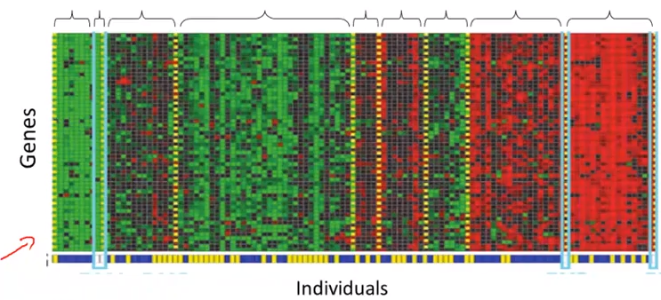

## 1.1. Introduction    
---  
  
  
### 1.1.1. 응용분야    
  
- 빅 데이터 분석    
- 사람이 일일이 프로그래밍할수 없는 분야    
무인vehicle, 자연어처리, 손글시인식, 영상처리    
- Self-customizing programs    
- understanding human learning    
    
### 1.1.2. ML 두가지 정의    
  
- 컴퓨터에게 특정한 프로그래밍 없이도 스스로 학습할 수 있게 만들어주는 연구    
"Machine learning as the field of study that gives computers the ability to learn without being explicitly learned."     
    
- 작업 T가있고, P로 성능이 측정될때, 그 P가 경험E를 통해 학습하며 향상되는 프로그램.    
om Mitchell provides a more modern definition: "A computer program is said to learn from experience E with respect to some class of tasks T and performance measure P, if its performance at tasks in T, as measured by P, improves with experience E."    
    
Example: playing checkers.    
  
E = the __experience of playing many games__ of checkers    
T = the __task__ of playing checkers.    
P = the probability that the program will __win__ the next game.    
  
### 1.1.3. ML 알고리즘 종류    
  
- Supervided learning: 컴퓨터에게 무엇을 어떻게 하는지 알려줌    
- Unsupervided learning: 그 반대    
- Others    
	Reinforcement Learning    
	Recommender systems    
    
이 강좌는  Supervided learning, Unsupervided learning 두가지에대해 중점적으로 배운다.     
  
  
### 1.1.4. Supervised Learning (지도 학습)    
  
data set이 이미 있고 우리는 그 데이터에 대한 __답을 이미 알고있을때__, 그런 상태에서 컴퓨터를 학습시키는 방법    
우리가 알고리즘에게 정확한 답을 알고있는 data set을 준다.    
data set의 형태는 [data, label] 이다. 즉 [데이터, 그에 상응하는 답]    
따라서 예측하는 대상은 label이 아직 정해지지 않은 data set인 것이다.      
  
사례: 손글씨 숫자(http://solarisailab.com/archives/1785)    
  
이때 예측하는 결과값이 연속인지/이산적인지에 따라 다음 처럼 두가지로 분류된다.      
  
- __Regression problem__: 연속적인 결과값을 예측    
	다음 3달동안 얼마나 많은 제품이 팔릴지 예측하는것    
- __Classification problem__: 이산적인 결과값을 예측    
	각 계정이 해킹을 당했는지/아닌지 판단하기    
    
예시1) 부동산 팔 집값 예측    
  
-  Classification 문제    
  
이산적인 결과값을 예측하는 문제    
예시2) 종양 크기에 따라서 양성/음성 예측.    
  
먼저 단순히 종양의 크기에 따라 분류할 수 있다.     
두번째로 아래 그래프 처럼 크기에 나이라는 속성(feature)도 같이 고려하여 분류할 수 있다.    
그것 뿐만아니라 더많은 속성을 고려할 수 있다. Clump 두께, 종양 세포크기의 균일함, 모양의 균일함 등등..    
Learning 알고리즘은 이런 속성이 두 세개를 넘어서 무한이 많아질 수 있다.     
  
> 질문: 그렇게 되면 그래프의 축이 무한히 많아지는것이다. 그 무한히 많은 축(차원)에서 아래 linear한 직선같이 구분지을 수 있는 함수를 찾는것이 중요한것 같다. 그것이 예측 모델을 찾는것?    
  
    
  
  
### 1.1.5. Unsupervised Learning (비지도 학습)    
  
반면 비지도학습은 데이터에 대한 label(정답)이 주어지지 않은 상태에서 컴퓨터를 학습시키는 방법이다.     
즉 [data] 의 형태로 학습을 진행한다. 따라서 주로 데이터에 숨겨진 특징이나 구조를 발견하는데 사용된다.     
  
- Clustering 알고리즘: 주어진 data들을 clustering함    
- Non-Clustering 알고리즘: 칵테일 파티장 녹음데이터에서 특정음성만 분리해냄.    
    
사례:    
수많은 뉴스를 자동으로 clustering해서 분류하는 알고리즘    
특정 유전자로 개체별 특성 분류    
천문학     
소셜 네트워크    
  
    
> 각 o가 어떤걸 의미하는지는 모르나, 두개의 그룹으로 분류되는것처럼 보임    
  
    
> 비슷한 종류의 유전자끼리 분류가 됨    
  
  
### 1.1.6. 참고: Reinforcement Learning    
  
강화학습은 에이전트가 주어진 환경(state)에 대해 어떤 행동(action)을 취하고 이로부터 어떤 보상(reward)을 얻으면서 학습을 진행한다. 이때, 에이전트는 보상(reward)을 최대화(maximize)하도록 학습이 진행된다    
