## 1.2. Linear Regression with One Variable    
---  
  
### 1.2.1. Model and Cost Function    
---  
  
이번장에서는 Linear regression 알고리즘에 대해 알아보고 Model에 대해서 그리고 지도학습의 전체 과정에 대해서 알아볼 것이다.     
Linear regression predicts a real-valued output based on an input value. We discuss the application of linear regression to housing price prediction, present the notion of a cost function, and introduce the gradient descent method for learning.    
  
### 1.2.2 Linear Regression     
  
그림과 같은 데이터가 있을때, 1250 사이즈의 집이 있다고 치면, 얼마의 값으로 팔면 좋을지 예측하는 문제가 있다고 하자. 가장 먼저 해볼 수 있는것은 Model을 만드는 것이다. 가장 간단한 모델은 그림의 분홍색 그래프처럼 linear 한 선을 그어보는 것이다.     
이것이 Supervised learning의 한 예시이다. 그이유는 이 문제에서 나의 문제(팔 가격 예측)에 적합한 답을 주기 때문이다.     
  
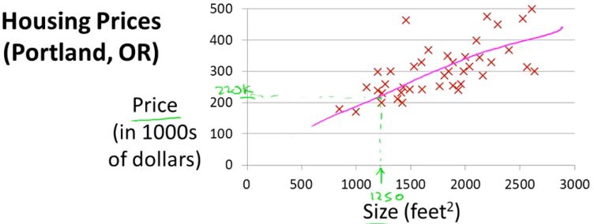    
  
이것은 traning set이라고 하는 data set이다. 우리가 할 수 있는 일은 이 데이터로부터 어떻게 주택 가격을 예측할지 학습시키는 것이다.     
  
  
    
  
다음의 notation을 사용한다.     
  
`m`: 학습 데이터 갯수    
`x`: input값, feature    
`y`: output, target    
  
위의 그림에서 $$x_1 = 2104,  x_2 = 1416, y_1 = 406$$ 이다.    
  
### 1.2.3. Model Representation    
  
Hypothesis Function (가설 함수)    
  
    
> training set 데이터를 학습 알고리즘을 거치면 함수가 나오는데 그것을 `h`라고 표기한다. Hypothesis Function 이라고 부른다.    
  
Hypothesis Function은 다음과 같이 수식으로 나타낼 수 있다.     
  
$$  
h_\theta(x) = \theta_0 + \theta_1x    
$$  
  
  
### 1.2.4. Cost Function (비용함수)    
  
Cost Function으로 Hypothesis Function의 정확도를 평가할 수 있다.     
h(x) 함수는 아래와같이 표현된다.     
$$\theta_0$$ $$\theta_1$$ 을 어떻게 선택하느냐에 따라 $$h(x)$$는 아래 그림과 같다.    
결국 목적은 주어진 training set을 가지고, a function h : X → Y so that h(x) is a “good” predictor for the corresponding value of y 하도록 학습하는 것이다.     
  
  
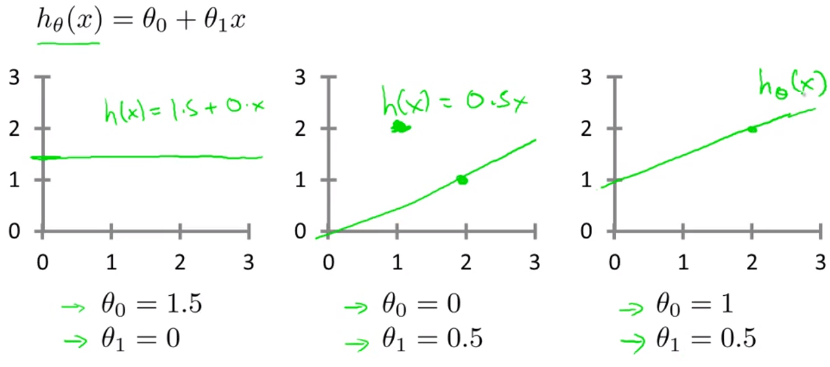    
  
결국 세타0 세타1 을 적절하게 선택하여 h(x) - y (예측값 - 실제값)의 차이가 최소화가 되도록하면 된다.     
그것을 찾는 방법을 공식화하면 다음과 같다. 이것이 Cost Function이다.     
J()로 표현되는 이 Cost Function은 오차함수의 제곱이라도고 불린다. 이 제곱함수는 회귀분석에서 가장 많이 사용된다. (제곱을 하는 이유는 음수, 또는 미분을 해야하기 때문으로 생각됨)     
  
  
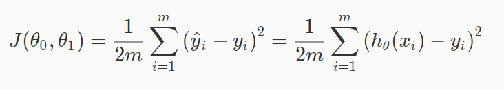    
> training set에서 각 (예측값i - 실제값i)을 제곱하고 합을구한뒤 평균을 낸다.      
  
    
  
결국 목적은 Cost Function을 최소화 하는것이다. Cost Function이 작아질 수록 Hypothesis Function의 정확도는 향상된다.    
  
$$  
h_\theta(x) 정확도 \propto {1 \over J(\theta_0, \theta_1)}    
$$  
  
  
### 1.2.5. Simplified Cost function of Linear Regression    
  
  
가설/비용함수 개념을 더 잘 이해하기 위해서 우리는 \theta_0 를 0으로 만든 단순화 버전을 사용할 것이다.  단순화 시킨 $$h_\theta(x)$$ 의 그래프는 원점을 지난다.     
정리하면 다음과 같다.     
  
| | basic |simplified|  
|----|--------------------------|---------------------|  
|__Hypothesis__:   | $$ h_\theta(x) = \theta_0 + \theta_1x $$ | $$ h_\theta(x) = \theta_1 $$ |  
|__Parametears__:  | $$ \theta_0 , \theta_1 $$ | $$ \theta_1 $$|  
|__Cost Function__:| $$ J(\theta_0 , \theta_1) = \frac{1}{2m}\sum\limits_{i = 1}^{m}(h_\theta(x^{(i)}) - y^{(i)})^2 $$ | $$ J(\theta_1) = \frac{1}{2m}\sum\limits_{i = 1}^{m}(h_\theta(x^{(i)}) - y^{(i)})^2 $$|  
|__Goal__:         | $$ \underset{\theta_0 , \theta_1}{minimize} \ J(\theta_0 , \theta_1) $$ | $$ \underset{\theta_1}{minimize} \ J(\theta_1) $$|  
  
    
  
| 가설함수 $$ h_\theta(x) = \theta_1 $$    | 비용함수  $$ J(\theta_1) $$  |  
|------------------------------|-------------------|  
| input값 $$x$$ 에 대한 함수 | parameter $$\theta$$ 에 대한 함수 (직선의 기울기를 좌우함) |  
  
다음과 같은 Training Data가 주어졌다고 하자.     
  
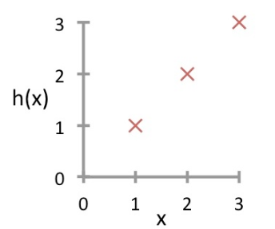    
> 먼저 실제 데이터(Training data) `X`가 x-y평면에 흩뿌려져 있다.(그림과 다르게 더 불규칙할 수 있음) 우리 목적은 최대한 그 데이터를 잘 모사 할 수 있는 직선$$h_\theta(x)$$을 찾는것이다.     
  
이제 $$\theta_1$$의 값에 따른 가설함수와 cost 함수의 관계가 어떻게 변화하는지 살펴보자.     
  
##### a. $$\theta_1 = 1$$ 일때    
  
결론적으로 $$h_\theta(x^{(i)})$$ 은 실제 데이터(Training data)와 정확히 일치하게 되고, 이 예시 데이터에서 $$ J(1) $$은  0으로 우리의 목적인 최소값이 된다.     
(예측값 - 실제값)이 0이 된다.     
  
  
    
> 그래프 설명: 왼쪽의 plot `X`는 "실제 값"(Training data)이다. 거기에 "예측 값"인 $$h_\theta(x)$$ 을 그렸다.     
> 우측: $$\theta_1 = 1$$ 일때 $$ J(\theta_1) $$ 값은 0이 된다.  $$ J(1) = 0 $$ 이다.     
그리고 $$h_\theta(x) = x$$ 가 된다. 실제 데이터도 $$y=x$$ 를 따라 위치해있으므로 두 데이터가 정확히 일치한다.     
> 가령 집 크기가 2일때 예측한 짒값은 2인데 실제 집값도 2이다. 라는 의미    
  
실제 데이터가 $$y=x$$ 를 따라 무한히 주어지지는 않을 테지만, 비용함수 계산 결과 0으로 나오므로 여기서 우리가 선택한 직선인 $$h_\theta(x)$$ 는 실세계를 정확히 거의 예측할 수 있는 것이다. 결국 Linear Regression은 실제 이미 알고있는 유한한 데이터를 기반으로 모르는 값을 예측/추측 할때 사용한다.     
  
    
> 질문: $$(h_\theta(x^{(i)}) - y^{(i)})^2$$ 에서 $$h_\theta(x^{(i)})$$ 의 결과는 예측값이고 $$y^{(i)}$$는 실제 값이다. 그런데 아래 $$h_\theta(x^{(i)})$$ 그래프에서 y축은 예측값이지 실제 값이 아니지 않은가?     
>  
> 그래프에서 y 축은 실제값을 나타내는게 맞다. $$h_\theta(x^{(i)})$$가 찍는 그래프는 y에 대한 예측값을 찍는것이다. 반면 `X`로 표기된 값이 실제 값이다.  여기서 설명하는 linear regression은 supervised learning이기 때문에 주어진 training set(data set)의 y값 즉 정답을 이미 다 알고있다는 가정하에 한다. 따라서 (예측값-실제값)이 맞다.     
> $$\theta_1$$가 1일때는 예측 모델(?) 예측값이 실제값과 동일해진다는것을 설명한 것이다.     
> 따라서 실제 training set과 h 그래프는 위와 같이 표현되는게 더 정확하다.     
> 위 연습문제를 계산해보면 결과는 아래와 같음    
>  
> $$  
> \begin{matrix}    
> J(0) &=& {1 \over 2 \times 3} \times ((0 - 1)^2 + (0 - 2)^2 +(0 - 3)^2) \\    
>    &=& {14 \over 6}     
> \end{matrix}    
> $$  
>  
  
  
##### b. $$\theta_1 = 0.5$$ 일때    
  
    
> 가령 집 크기(x)가 2일때 예측한 짒값(y)은 1이었는데, 실제 집값은 2었다는 의미    
  
  
##### c. $$\theta_1 = 0$$ 그리고  $$\theta_1 = n$$일때    
  
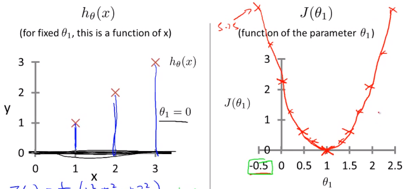    
  
  
### 1.2.6. Cost function of Linear Regression    
  
이제 $$\theta_0$$ 를 사용한 실제 Cost function 을 살펴보자    
$$\theta_0$$ 과 $$\theta_1$$ 이 모두 존재하기 때문에 Cost function $$ J(\theta_0, \theta_1) $$ 는 그림과 같이 3차원 그래프가 될 것이다.     
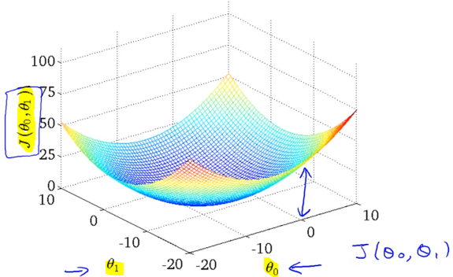    
  
3차원 그래프는 아래 우측과 같이 보기편하게 Countour plot(등고선 그래프)으로 변경해서 사용할것이다. 위에서 내려다 본 모습과 일치하고 같은 등고선은 같은 높이의 $$ J(\theta_0, \theta_1) $$를 의미한다.     
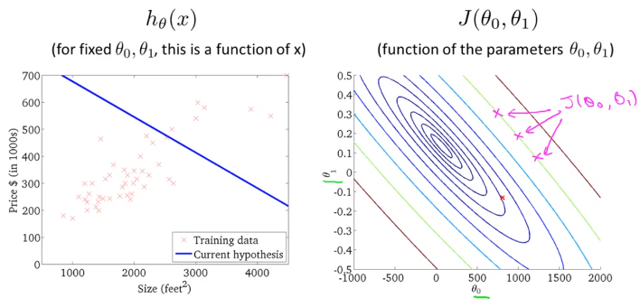    
  
우측 그래프의 빨간점 `x` 는 $$\theta_0$$ = 800  $$\theta_1 = -1.5$$ 인데 이값으로 $$h_\theta(x) = 800 -1.5x$$ 을 그려보면 좌측과 같다. 실제 데이터(training data) `X` plot을 전혀 따라가고 있지 못하다.     
$$ J(\theta_0, \theta_1) $$ 의 값또한 최소값(중심부) 에서 멀리 떨어져있기 때문에 꽤 높은 비용을 쓰고 있다.     
  
  
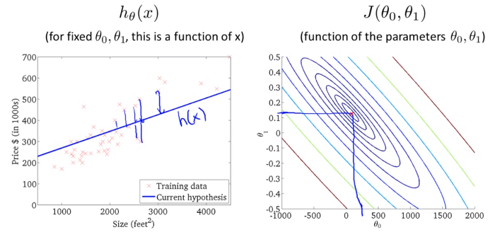    
따라서 더 좋은 Hypothesis function h는 Cost function J의 최소값과 비슷할 수록 더 좋다.     
  
  
참고로 앞으로는 더 많은 parameter $$\theta$$를 사용할것이다. 그렇게 되면 더이상 그래프로는 표현할 수 없다.  더 많은 parameter $$\theta$$를 사용한다는 의미는 $$h_\theta(x)$$ 함수 형태가 더 복잡해진다는 의미이다. 이것은 더 실세계를 정확히 반영할 것이다.     
  
결국 우리가 해야할 것은 S/W를 사용해서  $$\theta_0$$ 과 $$\theta_1$$ 그리고 함수 J의 최소값을 찾는것이다.     
다음 챕터에서는 J가 최소화 되도록 $$\theta_0$$ 과 $$\theta_1$$을 자동으로  찾는 알고리즘에 대해 알아볼 것이다.     
  
  
### 1.2.7. Parameter Learning (Gradient Descent)    
---  
  
지금까지 hypothesis function, h 에 대해 알아보았고 cost function을 통해 h의 parameter($$\theta$$)값에 따라 실제 세계의 데이터(training data)를 얼마나 잘 반영하는지 측정하는 방법에 대해 알아보았다.     
이전 장에서 $$\theta$$ 값에 따라 h의 정확도가 어떻게 향상되는지는 알아봤지만, 어떻게 $$\theta$$ 값을 찾는지는 아직 모른다.     
이번에는 가장 적합한 hypothesis function의 공식을 구성하는 parameter($$\theta$$)들을 어떻게 추정(estimate) 하는지 알아본다. -> gradient descent     
  
    
  
  
### 1.2.8. Gradient Descent 알고리즘 수학적 정의    
  
Gradient Descent알고리즘은 Cost function, J() 의 최소값을 찾기 위해 사용할 수 있다.  Gradient Descent 알고리즘은 Linear Regression 에만 쓸 수 있는건 아니고, 범용적인 알고리즘이다.     
  
- 기본 아이디어     
  * 어떤 값으로 $$\theta_0$$ 과 $$\theta_1$$ 를 초기화하여 시작한다 (보통 0)    
  * $$J(\theta_0, \theta_1)$$를 최소화 하는 방향으로 $$\theta_0$$ 과 $$\theta_1$$를 변화시킨다. (J가 최소값이 될때 까지)    
  
    
> 초기 지점부터 최소 지점으로 내려가야 한다. 어떻게 내려가는지 여러가지 알고리즘이 존재한다.     
> 어느 지점에서 시작을 하느냐에 따라 어떤 지점으로 도착할지가 다를 수 있다.     
> `참고` 이 그래프와는 다르게 Linear regression에서는 cost function J의 최소점이 무조건 1개이다.    
  
    
  
공식    
  
$$  
\theta_j := \theta_j - \alpha{\partial \over \partial\theta_j}J(\theta_0, \theta_1) \\    
$$  
  
    
  
  
공식 해설    
  
- $$:=$$    
수학에서 기호 := 할당한다(assignment)의 의미이다.     
`a := b`, `a := a + 1` 은 컴퓨터 프로그래밍에서 변수에 값을 할당하는것과 동일하다.     
반면 `a = b` 는 주장(assertion)이다. a와 b가 같다고 주장하는 것이다. (컴퓨터 프로그램과 반대) 따라서 `a = a + 1` 는 틀린 공식이 된다. 왜냐하면 a와 a + 1은 절대 같은 값이 될 수 없기 때문이다.     
    
- $$\alpha$$    
Learning Rate (훈련 비율) 수치 이다. 기본적으로 언덕을 내려갈 때 얼만큼 큰 걸음을 내 딛어야하는지를 상징한다. 가령 $$ \alpha$$가 크다면 매우 aggresive한 기울기 하강이 될것    
    
- $${\partial \over \partial\theta_j}J(\theta_0, \theta_1)$$    
  생긴것 그대로 $$\theta$$에 대한 함수 J의 미분 계수 이다. $$\partial$$ 편미분    
  하강 방향은 J의 편미분값에 의해 결정된다.     
  
- (for j = 0 and j = 1)    
여기서는 j가 0일 때와 1일때를 다룬다.     
    
이 공식을 update하기 위해서 아래의 과정을 통해 $$\theta_0$$ 과 $$\theta_1$$ 이 지속적으로 업데이트 되야한다.     
  
$$ temp0 := \theta_0 - \alpha{\partial \over \partial\theta_0}J(\theta_0, \theta_1) $$    
$$ temp1 := \theta_1 - \alpha{\partial \over \partial\theta_1}J(\theta_0, \theta_1) $$    
$$\theta_0 := temp0$$    
$$\theta_1 := temp1$$    
  
> temp0 temp1을 먼저 계산한뒤 $$\theta$$ 에 할당하는 이유는 temp1 에서 미분계수를 계산할때 바뀐 $$\theta_0$$ 를 사용하지 않기 위함임을 주의해야한다.     
  
  
### 1.2.9. Learning rate와 미분계수    
  
이번에도 더 쉬운 이해를 위해 $$\theta_0$$ 을 사용하지않고 parameter 하나만 사용, $$J(\theta_1)$$ 으로 단순화 시켜보자.    
  
- 미분계수 $${\partial \over \partial\theta_j}J(\theta_0, \theta_1)$$    
  
  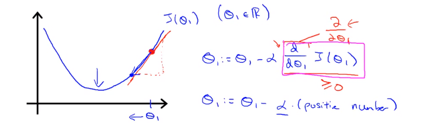    
  > 그래프의 빨간점 지점의 $$J(\theta_1)$$의 미분계수는 어떠한 양수값이다.     
  > 따라서 $$\theta_1 := \theta_1 - \alpha (양수값)$$ 을 계산하면 $$\theta_1$$은 점차 최저 J 값으로 이동하게 된다.     
  
      
  
  > 미분계수가 음수인경우도 마찬가지로 $$\theta_1$$이 점차 최저 J 값으로 이동하게 된다.     
  
- Learning Rate $$\alpha$$    
  
      
  > $$\alpha$$ 가 작다면 매우 작은 스텝으로 하강할것이고 많은 이동이 필요하다. 하강 속도가 느릴것이다.     
  
  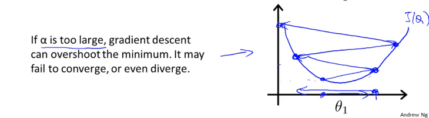    
  > 만약 $$\alpha$$ 이 큰데 시작점이 최소값 지점과 가까이 있다면 최소값을 넘어서 반대방향으로 이동할 것이고 또다시 반대편으로 이동하게 될것이다. minimum 을 __Overshoot__하게 되는것이다. 방향 전환 조차도 실패한다.    
  > 결국 수렴(converge) 에서 멀어지게 된다.     
  
- 문제: 만약 parameter $$\theta_1$$ 이 이미 최소값이라면 어떤 각도로 하강해야할까?     
    
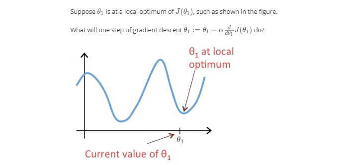    
> 미분계수가 0 이기 때문에 그대로 $$\theta_1 := \theta_1 - 0 $$ 이 되어 변동이 없다.     
  
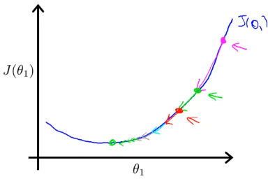    
하강할 수록 점점 더 작은 거리를 이동하게 된다. 왜냐하면 최소값에 도달할수록 기울기가 작아지며 미분계수값이 작아지기 때문이다. 따라서 굳이 $$\alpha$$값이 작아질 필요가 없다.     
  
  
### 1.2.10. Gradient Descent for Linear Regression    
  
이제 Gradient Descent를 Linear Regression에 적용해보자.     
  
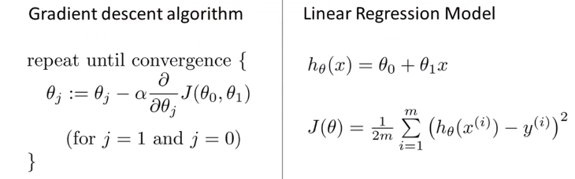    
  
이제 우리가 하려는 것은 Gradient Descent 알고리즘을 사용해서 $$J(\theta_0, \theta_1)$$를 최소화 하려는 것이다.     
  
Cost function J()를 알고리즘 공식에 대입하기만 하면 된다.     
  
- 먼저 아래와 같이 알고리즘에서 미분계수 항 $${\partial \over \partial\theta_j}J(\theta_0, \theta_1)$$ 에 대입하여 (a)로 풀어쓴뒤,  j=0, j=1일때 각각 편미분하면 $$\theta_0$$  $$\theta_1$$에 대한 미분계수 (b), (c)를 구할 수 있다.     
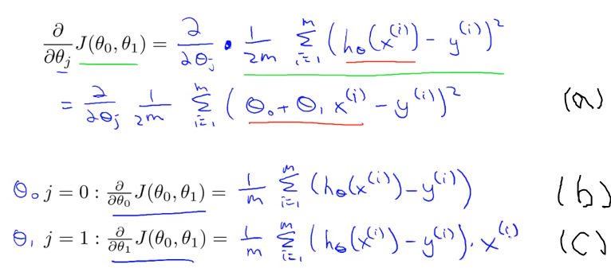    
    
- 이것을 Gradient Descent 알고리즘에 다시 대입하면 아래와 같다. 이제 $$\theta_0$$  $$\theta_1$$ 값을 계산할 수 있는 알고리즘이 공식화 되었다.     
$$  
\begin{align*} \text{repeat until convergence: } \lbrace & \newline \theta_0 := & \theta_0 - \alpha \frac{1}{m} \sum\limits_{i=1}^{m}(h_\theta(x_{i}) - y_{i}) \newline \theta_1 := & \theta_1 - \alpha \frac{1}{m} \sum\limits_{i=1}^{m}\left((h_\theta(x_{i}) - y_{i}) x_{i}\right) \newline \rbrace& \end{align*}    
$$  
  
초기에 주어진 $$\theta_0$$, $$\theta_1$$ 을 가지고 모든 training set의 $$h(x^i) = \theta_0 + \theta_1x^i$$ 와 $$y$$차의 합을 구한다. 공식에 따라 먼저 $$\theta_0$$, $$\theta_1$$에 해당하는 값을 구한뒤 그다음에 $$\theta_0$$, $$\theta_1$$ 에 각각 대입한다. 그렇게 두번째 $$\theta_0$$, $$\theta_1$$ 값을 구할 수 있는것이다. 이것을 __반복__하다보면 아래 그림과 같이 cost function $$J(\theta_0, \theta_1)$$가 최소값이 되는 $$\theta_0$$, $$\theta_1$$ 지점에 점차 수렴하게 된다(목적 달성). 당연히 $$\theta_0$$, $$\theta_1$$가 바뀔때마다 hypotheis function $$h(x)도 달라진다.    
  
(주의할 사항은 이 두값이 동시에(simultaneously) update 되어야한다는 점이다 $$\theta_0$$, $$\theta_1$$이 바뀔때 마다 가설 함수도 바뀌기 때문이다.  $$h(x) = \theta_0 + \theta_1x$$)    
  
    
  
이 알고리즘을 다른말로 __Batch Gradient Descent__ 라고 부른다.    
지금 배운것은 cost function J의 최소값을 구하기 위해 반복적 알고리즘을 사용했다. 참고로 나중에는 반복이 없이도 J의 최소값을 구할 수 있는 방법에 대해 알아볼 것이다.     
  
이로써 Gradient Descent 알고리즘이라는 첫번째 기계학습 알고리즘을 배웠다.      
  
`참고1`: (a) -> (c) 편미분 풀이과정    
    
`참고2`: Linear regression에서는 cost function J의 최소점이 무조건 1개이다. 그래프의 모양은 bowl-shape이다. 이를  convex quadratic function 이라고 부름.    
  
